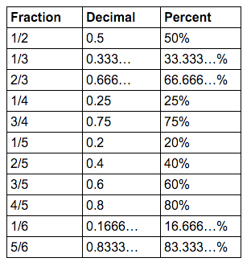
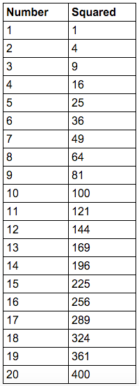
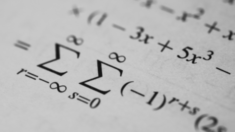

10 Tips to Improve Your Mental Math Ability

Illustration: Elena Scotti/Gizmodo, Shutterstock

Calculators are awesome, but they’re not always handy. More to the point, no one wants to be seen reaching for the calculator on their mobile phone when it’s time to figure out a 15 percent gratuity. Here are ten tips to help you crunch numbers in your head.

Mental math isn’t as difficult as it might sound, and you may be surprised at how easy it is to make seemingly impossible calculations using nothing but your beautiful brain. You just need to remember a few simple rules.

### **Add and Subtract From Left to Right**

Remember how you were taught in school to add and subtract numbers from right to left (don’t forget to carry the one!)? That’s all fine and well when doing math with pencil and paper, but when performing mental math [it’s better to do it moving from left to right](https://medium.com/i-math/left-to-right-mental-addition-strategy-c325e566cea#.4iieq5u2j). Switching the order so that you start with the largest values makes it a bit more intuitive and easier to figure out. So when adding 58 to 26, start with the first column and calculate 50+20=70, then 8+6=14, which added together is 84. Easy, peasy.

### **Make It Easy on Yourself**

When confronted with a difficult calculation, try to find a way of simplifying the problem by temporarily shifting the values around. When calculating 593+680, for example, add 7 to 593 to get 600 (more manageable). Calculate 600+680, which is 1280, and then take away that additional 7 to get the correct answer, 1273.



You can do a similar thing with multiplication. For 89x6, calculate 90x6 instead, and then subtract that additional 6, so 540-6=534.

### Memorize Building Blocks

Examples of “buildings blocks.” See more [here.](http://www.factmonster.com/ipka/A0876706.html)

Memorizing multiplication tables is an important aspect of mental math, and it shouldn’t be discounted.

Spencer Greenberg, a mathematician and founder of [ClearerThinking.org](http://www.clearerthinking.org/), says that by memorizing these basic “building blocks” of math, we can instantly get answers to simple problems that are embedded within more difficult ones. So if you’ve forgotten these tables, it would do you well to quickly brush up. While you’re at it, memorize your 1/n tables so you can quickly recall that 1/6 is 0.166, 1/3 is 0.333, and 3/4 is 0.75.

### **Remember Cool Multiplication Tricks**

To help you do simple multiplication, it’s important to remember some nifty tricks. One of the most obvious rules is that any number that’s multiplied by 10 just needs to have a zero placed at the end When multiplying by 5, your answer will always end in either a 0 or 5.

Sponsored

Also, when multiplying a number by 12, it’s always 10 times plus two times that number. For example, when calculating 12x4, do 4x10=40, and 4x2=8, and then 40+8=48. One of my favorites is multiplying by 15: just multiply your number by 10, and then add half to the answer (e.g. 4x15 = 4x10=40, plus half that answer, 20, giving you 60).

There’s also a neat trick for multiplying by 16. First, multiply the number in question by 10, and then multiply half the number by 10. Then add those two results together with the number itself to get your final answer. So to calculate 16 x 24, first calculate 10 x 24 = 240, then figure out half of 24, which is 12, and multiply by 10, giving you 120. Simple math finishes it up: 240+120+24=384.

Similar tricks exist for other numbers, which you can read about [here](http://mathforum.org/k12/mathtips/multiplication.tips.html).

### Squares Are Your Friends

These simple tricks are all fine and well, but large numbers present a different challenge. For that, a physicist from [askamathematician.com](http://www.askamathematician.com/) says it’s a good idea is use the difference of squares (a square being a number multiplied by itself).

“Take the two numbers you’re multiplying and think of them as their average, x, plus and minus the difference between each and their average, ±y,” he says. “These two numbers are squared, so rather than memorizing entire multiplication tables you only memorize squares.”

It may seem like a daunting task, but memorizing all the squares from 1 to 20 isn’t as bad as it sounds. It’s just 20 numbers, after all. Armed with this prior knowledge, you can perform some pretty incredible calculations.

Here’s how it works, starting with a simple example. Let’s assume for a moment that we don’t know the answer to 10x4. The first step is to figure out the average number between these two numbers, which is 7 (i.e. 10-3=7, and 4+3=7). Next, determine the square of 7, which is 49. We now have a number that’s close, but not close enough. To get the correct answer, we have to square the difference between the average (in this case 3) providing us with 9. The last step is to do some simple subtraction, 49-9=40, and wouldn’t you know it you have the correct answer.

That might seem like a roundabout way to calculate 10x4 (it is), but this same technique works for bigger numbers. Take 15x11 for example. Once again, we have to find the average number between these two, which is 13. The square of 13 is 169. The square of the difference in the average (2) is 4. Finally, 169-4=165, the correct answer.

### It’s Okay to Approximate

When doing mental math, particularly for large numbers, it’s often a good idea to make an informed estimate, and not worry about getting a perfect answer. Back during the Manhattan Project, for example, physicist Enrico Fermi wanted a rough estimate of the atomic blast’s power before the diagnostic data came in. To that end, he dropped pieces of paper when the blast wave hit him (from a safe distance, of course). By measuring the distance the paper traveled, he estimated the blast strength to be about 10 kilotons of TNT. This estimate was fairly accurate, as the true answer was 20 kilotons of TNT.

This technique, now known as a “Fermi Estimate,” works by estimating numbers in powers of ten (see TED-Ed video above for more). So when trying to come up with a seemingly impossible solution, it helps to chunk items in this way and then break them down. For example, when trying to estimate the number of piano tuners in your city, first estimate the population of your city (e.g. 1,000,000), then estimate the number pianos (10,000), and then the number of piano tuners (e.g. 100). You won’t get the actual answer, but you’ll get an answer quickly, and one that’s often close enough.

### When in Doubt, Rearrange

It’s a good idea to use the rules of math to rearrange complex problems into a simpler form. For instance, computing the problem 5x(14+43) is a daunting task on it’s own, but it can be broken down into three fairly manageable calculations. Remembering your [order of operations](http://www.mathgoodies.com/Lessons/vol7/order_operations.html), this problem can be rephrased as (5x14) + (5x40) + (5x3) = 285.

### Turn a Big Problem Into a Bunch of Small Ones

When in doubt, decompose. “For many problems, the way to do them fast is to break them into subproblems and solve those,” says Greenberg. “When you get a problem that sounds hard, it’s often fruitful to look for ways that it can be broken apart into easier problems that you already know how to solve.”

For instance, you can multiply by 8 by doubling three times. So instead of trying to figure out 12x8, just double 12 three times: 24, 48, 96. Or when multiplying by 5, I start by multiply by 10 since it’s easy, then divide by 2 since that’s also usually pretty easy. For example, for 5x18, calculate 10x18 instead, and divide by 2, where 180/2=90.

### Use Scientific Notation For Unreasonably Large Numbers

When calculating large numbers in your head, remember that you can convert them into scientific notation first. What’s 44 billion divided by 400,000? A simple way to deal with this is to convert 4 billion to 109, and 400,000 to 105. We can now express this as 44/4 and 109/105. As Greenberg points out, the rule for dividing exponents requires us to subtract them (easy!), so we get 11 x 10(9-5)= 11 x 104 = 110,000.

### The Simplest Way to Calculate the Tip

Finally, some advice on how to calculate a tip in your head. If you can calculate a 10 percent tip in your head (easy), then you can calculate both a 20 percent tip and a 15 percent tip.

When calculating a 10 percent tip for a meal that cost $112.23, just move the decimal point one space to the left, giving you $11.22. When calculating a 20 percent tip, do the same thing, but simply double the answer (a 20 percent tip is twice as much as a 10 percent tip), which in this case is $22.44.

For a 15 percent tip, once again calculate the 10 percent tip, and then add half (the additional 5 percent is just half of the 10 percent amount). So $11.22+(11.22/2). Don’t worry if you can’t get the exact answer. If we don’t fuss too much with the decimal points, we can quickly calculate that a 15 percent tip of $112.23 is $11 + 5.50, which is $16.50. Close enough. Add a quarter or two if you’re worried about lowballing the server.

*Please share other cool tips and tricks in comments!*

#### More Math

[  ##### ​How to Comprehend Incomprehensibly Large Numbers](http://io9.gizmodo.com/how-to-comprehend-incomprehensibly-large-numbers-1531604757)

[  ##### Mathematicians Discovered Something Super Freaky About Prime Numbers](http://gizmodo.com/mathematicians-discovered-something-super-freaky-about-1764839266)

[  ##### Why We Should Switch To A Base-12 Counting System](http://io9.com/5977095/why-we-should-switch-to-a-base-12-counting-system)