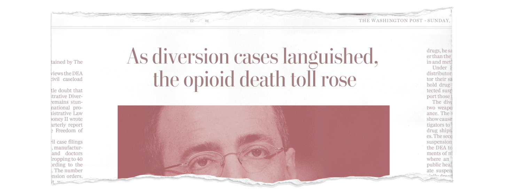
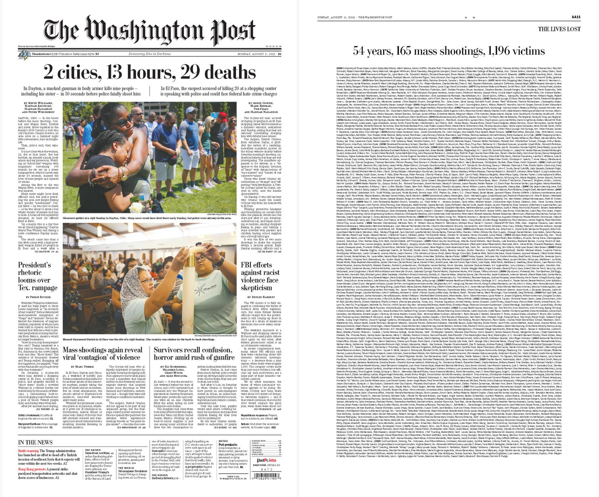

2020 Pulitzer Prize winners and finalists from The Washington Post - The Washington Post

Media

# Read The Washington Post stories that won the 2020 Pulitzer Prize

2°C: Beyond the Limit was awarded the Pulitzer for explanatory reporting; The Post also had finalists for public service, breaking news and commentary

 [QYOAVUKGW5DALGX5HUUKZNPL6Q.webp](../_resources/d68ea2baab089f2ea99867de38444c81.webp)

By Washington Post Staff

May 4, 2020

 [**]()  [**]()  [**](https://www.washingtonpost.com/pr/2020/05/04/read-the-washington-post-stories-that-won-2020-pulitzer-prize/?arc404=true&utm_campaign=wp_pw_ret_Pulitzer_050420&utm_medium=email&utm_source=retention&wpisrc=pw_ret_Pulitzer_05042020#opioidsmailto:?subject=Read%20The%20Washington%20Post%20stories%20that%20won%20the%202020%20Pulitzer%20Prize%20from%20the%20Washington%20Post&body=https://www.washingtonpost.com/pr/2020/05/04/read-the-washington-post-stories-that-won-2020-pulitzer-prize/)

 *Add to list*

The staff of The Washington Post won the 2020 Pulitzer Prize in explanatory reporting for its series on climate change, 2°C: Beyond the Limit, which fundamentally reshaped the climate debate by showing that extreme warming is not a worry for the future — 10 percent of the planet has already warmed by 2 degrees Celsius.

To convey the devastating reality of present-day climate change, The Post reported from a dozen global hot spots and marshaled vast datasets to help readers visualize our rapidly warming planet.

The Post’s staff was also a finalist in two other categories: public service, for an investigation of the opioid epidemic; and breaking news, for dual coverage of the Dayton and El Paso shootings. Post sports columnist Sally Jenkins was a finalist for commentary as well.

 *[[Washington Post wins Pulitzer Prize for series that detailed environmental devastation in global hot spots](https://www.washingtonpost.com/lifestyle/media/washington-post-wins-pulitzer-prize-for-series-that-detailed-environmental-devastation-in-global-hot-spots/2020/05/04/89b8c7d8-8da8-11ea-a0bc-4e9ad4866d21_story.html)]*

Links that were submitted as entries to the Pulitzer board from the climate change series and each of The Post’s finalists are included below:

   [66E6LTJJ3ZEFVJD2ZKGYGVHOJI.webp](../_resources/ad158958e259e84ef333292ae3e506b3.webp)

#### **Winner: 2020 Pulitzer Prize for Explanatory Reporting**

### The Staff of The Washington Post

*For a groundbreaking series that showed with scientific clarity the dire effects of extreme temperatures on the planet.*

For its “2C: Beyond the Limit” series, The Washington Post analyzed global datasets tracking nearly 170 years of temperature records to map every place that has already warmed by 2 degrees Celsius (3.6 degrees Fahrenheit) — the threshold international negotiators hope the planet as a whole will never reach. This massive, pioneering use of temperature data demonstrated that extreme climate change is already a life-altering reality across 10 percent of the Earth’s surface. Writers and photographers were dispatched to produce deeply reported missives from a warmer, more erratic future.

The series simultaneously relied on and demystified the science of climate change — for instance, allowing readers to interact with a spinning globe that highlighted the areas of greatest warming. The work was scientifically advanced, but the results were simple to understand.

The effort was prompted by a pair of alarming studies that found that insects and birds were disappearing in Puerto Rico and the Mojave Desert. The Post noticed a key detail: These locations were heating up much faster than the global average. Working with data from Berkeley Earth, a nonprofit climate research group, and that of other researchers, we mapped temperature change across a century.

The multimedia series included 12 stories that took readers to places as varied and far-flung as the troubled waters in the Sea of Okhotsk, the outdoor air-conditioning in some of Qatar’s stadiums and markets, and a popular New Jersey resort whose lake once supplied the ice boxes of New York City. Now the water no longer freezes thick enough to sustain ice fishing.

The research added to our understanding of the erosion of winter and rapidly changing ocean currents — many of the latter not previously reported. And it allowed The Post to create the graphics and animations that let readers see how severe climate change has affected their own counties and countries.

- [Extreme climate change has arrived in America](https://wapo.st/2KxlPFN)

- [Dangerous new hot zones are spreading around the world](https://wapo.st/2lKemsU)

- [The climate chain reaction that threatens the heart of the Pacific](https://wapo.st/2QxJ6KS)

- [On land, Australia’s rising heat is](https://wapo.st/2rwrIMA)[(L)](https://wapo.st/2rwrIMA)[‘apocalyptic.’](https://wapo.st/2rwrIMA)[In the ocean, it’s worse.](https://wapo.st/2rwrIMA)

- [Facing unbearable heat, Qatar has begun to air-condition the outdoors](https://wapo.st/361B5lz)

- [Radical warming in Siberia leaves millions on unstable ground](https://wapo.st/2pGm8G8)

- [Fires, floods and free parking: California’s unending fight against climate change](https://wapo.st/2qyEMR6)

- [‘The ice used to protect them. Now their island is crumbling into the sea.’](https://wapo.st/2qgyGVd)

- [Facing catastrophic climate change, they still can’t quit Big Oil](https://wapo.st/35lKx3N)

- [‘How we know global warming is real’](https://wapo.st/39pjarR)

   [EUEAQ6S4TVF2ZO73TLM4FHICXY.webp](../_resources/bb10860ce36c42e73a7fc109adb33f02.webp)  The Opioids Files

#### **Finalist: 2020 Pulitzer Prize for Public Service**

### The Washington Post

*For groundbreaking, data-driven journalism that used previously hidden government records and confidential company documents to provide unprecedented insight into America’s deadly opioid epidemic.*

It is one of the biggest stories of our time and it was hiding in plain sight: How did the opioid epidemic overtake America? The prevailing narrative offered a too-easy scapegoat. Purdue Pharma in the 1990s unleashed an ostensible wonder drug, OxyContin, and addicted millions. But the epidemic took off after Purdue was brought to heel and fined $600 million. If not Purdue, who drove the epidemic? And why didn’t anyone stop them?

The Washington Post definitively answered these questions in 2019, establishing an accurate narrative that brought accountability to the companies involved and the government officials who failed to act.

The Post learned that a secret DEA database contained a hidden road map to the epidemic, tracking every opioid pill from maker to pharmacy. The Post and the owner of the Charleston ([W.Va](http://w.va/).) Gazette-Mail sued to get the data. After a year-long legal fight, a federal appeals court ruled in favor of The Post and Gazette-Mail. The database contained 380 million records and was by far the largest we have ever worked with. Under enormous deadline pressure, The Post produced exclusive stories and interactive databases spotlighting the biggest distributors: McKesson Corp., Cardinal Health, Walgreens, Walmart. The biggest manufacturer was a company few people had ever heard of: SpecGx, a subsidiary of Mallinckrodt.

The Post published the entire data set, allowing readers to see how many pills came into their neighborhood pharmacies and who sent them. Reporters at 129 media outlets used the data to write their own stories and 44,000 individuals downloaded the entire set.

   

- [76 billion opioid pills: Newly released federal data unmasks the epidemic](https://wapo.st/2JCwnTB)

- [Drilling into the DEA’s pain pill database](https://wapo.st/2ynxfVI)

- [Opioid death rates soared in communities where pain pills flowed](https://wapo.st/2LZqMYU)

- [A remote Virginia valley has been flooded by prescription opioids](https://wapo.st/2JBPnBs)

- [Internal drug company emails show indifference to opioid epidemic](https://wapo.st/2JGMfV1)

- [An onslaught of pills, hundreds of thousands of deaths: Who is accountable?](https://wapo.st/2Mc5yYb)

- [Video:](https://youtu.be/GALzbKHtUoU)[(L)](https://youtu.be/GALzbKHtUoU)[“We](https://youtu.be/GALzbKHtUoU)[were addicted to their pill, but they were addicted to the money”](https://youtu.be/GALzbKHtUoU)

- [Newly unsealed exhibits in opioid case reveal inner workings of the drug industry](https://wapo.st/2SzOvjH)

- [Little-known makers of generic drugs played central role in opioid crisis, records show](https://wapo.st/2ZeRsc5)

- [As overdoses soared, nearly 35 billion opioids — half of distributed pills — handled by 15 percent of pharmacies](https://wapo.st/2ORdCjS)

- [Graphic: How many pain pills went to your pharmacy?](https://wapo.st/31CIJ4m)

- [Inside the drug industry's plan to defeat the DEA](https://wapo.st/2I3tkmg)

- [Flooded with opioids, Appalachia is still trying to recover](https://wapo.st/2GotYJV)

- [The fentanyl failure](https://wapo.st/2Tc3yyF)

- [How a back injury turned a doting father into a fentanyl kingpin](https://youtu.be/1b-MeK5-NaQ)

- [The flow of fentanyl: In the mail, over the border](https://wapo.st/2Zm74Oe)

- [At height of crisis, Walgreens handled nearly one in five of the most addictive opioids](https://wapo.st/2pglFuB)

- [Inside the industry's marketing machine](https://wapo.st/2PqCCLO)

- [Could the DEA have stopped the opioid epidemic by cutting off the supply?](https://wapo.st/2tbuasn)

- [A new look at how the opioid epidemic evolved](https://wapo.st/2EMgh6u)

 *[[Related: The Opioid Files](https://www.washingtonpost.com/national/2019/07/20/opioid-files/)]*

   

#### **Finalist: 2020 Pulitzer Prize for Breaking News**

### The Staff of The Washington Post

*For incisive coverage of back-to-back mass shootings in El Paso, Texas and Dayton, Ohio that contextualized these events for a national audience. *

The dual tragedies in El Paso and Dayton challenged our staff to break through the formulas of mass shooting coverage. Instead of two news events, we approached them as a single national moment, exemplified by our five-column front-page headline coming out of that deadly weekend: “2 cities, 13 hours, 29 deaths” (the death toll later rose to 31).

By Monday, The Post had staffers in El Paso, Dallas, Dayton and Mexico City. In the days that followed, our stories covered every aspect of the fallout, including the political and social ramifications as well as the emotional, international, medical and national security impacts. Our coverage drove home the enormity of the moment and the ever-present challenge our nation faces in confronting gun violence.

The Post was the first news organization to report that most of the hospitalized victims in El Paso did not want to meet with President Trump; we were the first to interview the Dayton shooter’s girlfriend, who told us “this was expected”; and we were the first to identify his Twitter account, moments before it was shut down. Our staff worked quickly to archive and screenshot the tweets, which showed a penchant for violence and leftist politics.

We also put the victims at the center of our coverage, producing a 12-page special section that presented the nation’s mass shooting epidemic in stark graphics and photos, including the names of all 1,196 mass shooting victims since the University of Texas clock tower massacre in 1966. The display emphasized the growing frequency and death toll of American mass shootings and, with a collage of the victims’ faces, drove home the human cost, showing an array of ethnicities and ages.

   [4AM3TJGAX5EK5JL25YBEM73VII.webp](../_resources/66b502909159652e4dcb793fb2f8a3f1.webp)

- [At least 20 dead in El Paso shopping center shooting as authorities investigate Texas man and manifesto](https://wapo.st/2LZ83Oe)

- [In Dayton, authorities search for a motive in shooting that left 9 dead](https://wapo.st/2OAeOrx)

- [A weekend of mass murder reflects how American violence goes viral](https://wapo.st/2OEppSm)

- [8chan vowed to fight on, saying its](https://wapo.st/31ELF0j)[(L)](https://wapo.st/31ELF0j)[‘heartbeat](https://wapo.st/31ELF0j)[is strong.’ Then a tech firm knocked it offline.](https://wapo.st/31ELF0j)

- [Ex-girlfriend says Dayton shooter heard voices, talked about](https://wapo.st/2EbmCrV)[(L)](https://wapo.st/2EbmCrV)[‘dark,](https://wapo.st/2EbmCrV)[evil things’](https://wapo.st/2EbmCrV)

- [Trump attacks local leaders as he visits two cities grieving from mass shootings](https://wapo.st/2OLb3Qr)

- [As his environment changed, suspect in El Paso shooting learned to hate](https://wapo.st/2OLkxuJ)

- [When will the hatred stop? Family deals with loss after Dayton shooting](https://wapo.st/2tby0lm)

- [‘What do you girls want to do?’ After witnessing El Paso massacre, devastated soccer players weigh returning to the field.](https://wapo.st/2z2K4oR)

Related: [El Paso lives lost](https://www.washingtonpost.com/nation/2019/08/04/el-paso-shooting-victims/) | [Dayton lives lost](https://www.washingtonpost.com/nation/2019/08/04/dayton-shooting-victims-who-they-were/) | [Mass shootings database](https://www.washingtonpost.com/graphics/2018/national/mass-shootings-in-america/)

   [6RUXAADXVZD65DZDAJVST2H3QQ.webp](../_resources/d6f0f9be0d2b0cdeefc7a35974ff2189.webp)

#### **Finalist: 2020 Pulitzer Prize Finalist for Commentary**

### Sally Jenkins

*For columns that marshal a broad knowledge of history and culture to remind the sports world of its responsibility to uphold basic values of equity, fairness and tolerance.*

There is no other columnist today who writes with the breadth and vigor of Sally Jenkins, and does it with such exquisite intellect and command of language, history and culture. When the U.S. women’s national soccer team won the World Cup, Jenkins broadened the lens on its achievement to explain it in the context of the historic battle for women’s rights. “Every time a women’s team wins another gold medal, it helps other women enter a new space, move up to a higher suite. And when they enter that new space, they change it forever — and not just by improving the language and table manners,” she wrote “… To borrow a phrase from Condoleezza Rice, they make ‘the impossible seem inevitable in retrospect.’ In another World Cup piece, she issued a ringing endorsement of the team’s fight for equal pay in characteristic, bare-knuckled prose: “Sweet kicking Jesus, what titans these players are.”

Jenkins is bold, whether she’s taking on a professional sports league or nailing a global superstar or sailing against a popular narrative.

- [Patriots’ success is no accident. It’s the exact opposite.](https://wapo.st/2NUGZOh)

- [NCAA’s gesture is only that and won’t benefit athletes](https://wapo.st/2NoO4r7)

- [What Brown did is unknown, but his hateful language is damning](https://wapo.st/2XySKyu)

- [U.S. women’s true power: Demanding the moment](https://wapo.st/2pAdyZQ)

- [This team already has conquered the world](https://wapo.st/334DJpf)

- [James, NBA are playing right into China’s hands](https://wapo.st/2OxWlsx)

- [Figure skating’s beauty is not always matched by the outfits](https://wapo.st/2Tjr00J)

- [Optics-driven WADA banning country’s flag](https://wapo.st/36TJZTy)

- [As he took on the next generation, New England’s timeless QB gave all he had](https://wapo.st/2Oxi43R)

- [NFL deserves cynicism, but Hunt deserves second chance](https://wapo.st/37sCBiA)

 *[[Read more columns from Sally Jenkins](https://www.washingtonpost.com/people/sally-jenkins/)]*

**Related**

[Complete list of the 2020 Pulitzer Prize winners](https://www.pulitzer.org/prize-winners-by-year/2020)

[2019: The Post wins Pulitzer Prizes for criticism, photography; affiliated cartoonist also honored](https://www.washingtonpost.com/lifestyle/style/the-washington-post-wins-3-pulitzer-prizes-sun-sentinel-wins-public-service-medal-for-parkland-shooting-coverage/2019/04/15/1478f18e-5fa3-11e9-9ff2-abc984dc9eec_story.html)

[2018: The Post wins 2 Pulitzer Prizes for reporting on Russian interference and Alabama Senate race](https://www.washingtonpost.com/lifestyle/style/the-washington-post-wins-2-pulitzer-prizes-for-reporting-on-russian-interference-and-alabama-senate-race/2018/04/16/0915c310-4197-11e8-8569-26fda6b404c7_story.html)

[2017: Washington Post’s David Fahrenthold wins Pulitzer Prize for coverage of Trump’s charitable giving](https://www.washingtonpost.com/graphics/2017/david-fahrenthold-wins-pulitzer-prize-2017-winner-finalists/)

[2016: Washington Post wins Pulitzer Prize for police shootings coverage](https://www.washingtonpost.com/graphics/2016/pulitzer-prize-winner-and-finalist/)

Posting as marcacohen.

-
-

This conversation is moderated according to The Post's community rules. Please [read the rules](https://www.washingtonpost.com/discussions/2020/04/13/community-rules/) before joining the discussion. Send feedback about the comments section [here](https://helpcenter.washingtonpost.com/hc/en-us/requests/new?ticket_form_id=114094010092).

Share your thoughts here.

Share your thoughts here.

2000 characters remaining

-

1 hour ago

A Brit subscriber who relies on this team of writers to provide intelligence, rigour and integrity to understand US affairs.  Well done Post.  You deserve the accolades and please keep fighting for the truth.

3 hours ago

I'm pleased that Sally Jenkins was recognized for her work. Well done.

4 hours ago

Congrats to all journalists! So glad your always fabulous reportings are appreciated.

5 hours ago

Hilarious!  This is the same Pulitzer Prize that was awarded to this same publication for its diligent, breathless reporting on the phony Russia collusion.  I can take comfort that it's dire warnings about climate change are as much of a hoax as the Russia collusion and the Kavanaugh sexual assault allegations.

What an incestuous crowd.  The Pulitzer Prize has become like a participation trophy for leftist media.  It doesn't matter if the story is accurate.  If you are one of the privileged papers and you write with earnest emotion, then you should get a prize.  It's a shame that the readers keep running and cheering every time the Post cries wolf.

4 hours ago
 *(Edited)*

If my page is right, **Harvard 66**, Sally Jenkins is about sports, not Climate Change.

3 hours ago

Okay Vlad crawl back into your hole and stay off this site.

5 hours ago

Congratulations, WaPo! Next year, Philip Rucker for going toe--to-toe with Trump, keeping his cool, and each day giving him one better in the paper.

5 hours ago

BRAVO and well done to the journalists, the staff,  the editor, and owner of THE WASHINGTON POST!

5 hours ago

Congrats! It is well deserved! And it's a good thing you won the Pulitzer and not the "Noble" prize because Trump would take those that away.

5 hours ago

Congratulations to Washington Post!  As a scientist working in the climate change area since 1979, I often use your "2ºC" articles for teaching and to inform the public.   Your reporting is so good that even I learn many things I didn't know before!  Please keep up the good work, democracy AND the planet die in darkness.  Best, Charles R. Stack, DrPH

5 hours ago

Congrats WaPo!

T-rump wins the Ig Noble prize.

6 hours ago

Well done WaPo!!  Especially pleased to see climate change/global warming put front and center.