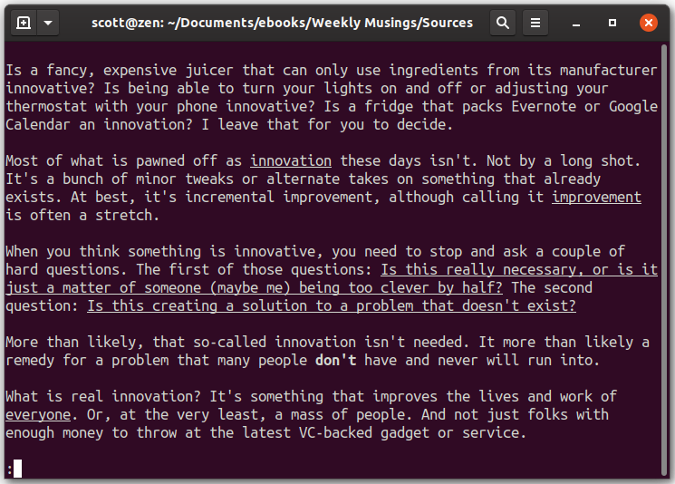
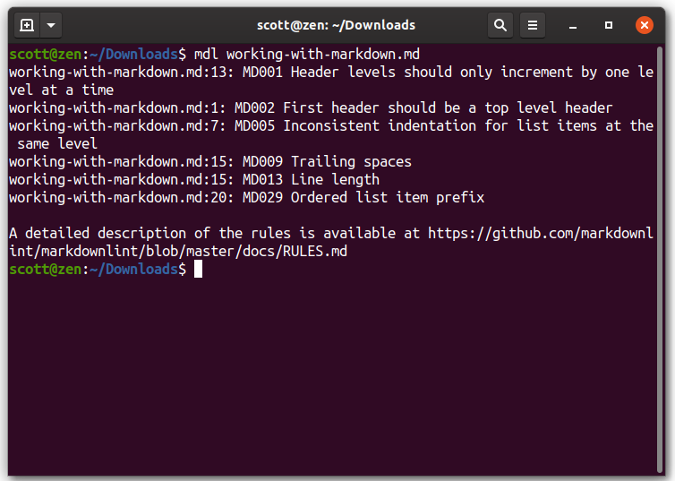
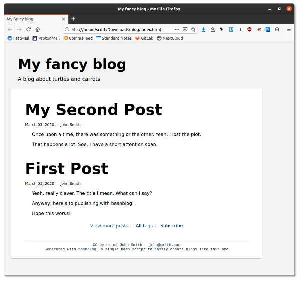

4 Markdown tools for the Linux command line | Opensource.com

# 4 Markdown tools for the Linux command line

## Command-line Markdown tools are fast, powerful, and flexible. Here are four utilities to try.

| 19 Mar 2020 | [Scott Nesbitt (Correspondent)](https://opensource.com/users/scottnesbitt) [Feed](https://opensource.com/user/14925/feed) |

22

[up](https://opensource.com/article/20/3/markdown-apps-linux-command-line?rate=du7Hu5FpzNZhYh4iMu2BLRm-px5QQcQGWkEui08UlEI)

| [1 comment](https://opensource.com/article/20/3/markdown-apps-linux-command-line#comments) |

Image by :
Opensource.com
.

When it comes to working with files formatted with [Markdown](https://opensource.com/article/19/9/introduction-markdown), command-line tools rule the roost. They're light, fast, powerful, and flexible, and most of them follow the Unix philosophy of doing one thing well.

Take a look at four utilities that can help you work more efficiently with Markdown files at the command line.

## mdless

If you've hung around the Linux command line for a while, you're probably familiar with a text-file viewer called [less](https://opensource.com/article/18/4/using-less-view-text-files-command-line). Sure, you can use less to view Markdown files—but the result is a tad dull. How can you view Markdown files with a bit of pizzazz in a terminal window? By using [mdless](https://github.com/ttscoff/mdless).

## [mdless.png](https://opensource.com/file/468736)

 

You can move around using the arrow keys on your keyboard, and mdless packs quite a good search function.

Not only does mdless display text, but it also renders formatting like headings, bold, and italics. It can also display tables and do syntax highlighting of code blocks. You can also [customize](https://github.com/ttscoff/mdless#customization) the look and feel of mdless by creating one or more theme files.

## Markdown lint tool

When you're typing quickly, you make mistakes. If you miss a bit of formatting when using Markdown (or any other markup language), it can cause problems when you convert your file to another format.

Coders often use tools called *linters* to check for correct syntax. You can do the same for Markdown using the [Markdown lint tool](https://github.com/markdownlint/markdownlint).

When you run this tool over a file that's formatted with Markdown, it checks the formatting against a [set of rules](https://github.com/markdownlint/markdownlint/blob/master/docs/RULES.md). Those rules govern the structure of a document, including the order of header levels, incorrect indentation and spacing, problems with code blocks, the existence of HTML in a file, and more.

## [mdl.png](https://opensource.com/file/468741)

 

The rules can be a bit strict. But running the Markdown lint tool over a file before converting it to another format can prevent the grief that comes from bad or inconsistent formatting.

## mdmerge

More Linux resources

- [Linux commands cheat sheet](https://developers.redhat.com/cheat-sheets/linux-commands-cheat-sheet/?intcmp=70160000000h1jYAAQ&utm_source=intcallout&utm_campaign=linuxcontent)
- [Advanced Linux commands cheat sheet](https://developers.redhat.com/cheat-sheets/advanced-linux-commands/?intcmp=70160000000h1jYAAQ&utm_source=intcallout&utm_campaign=linuxcontent)
- [Linux networking cheat sheet](https://opensource.com/downloads/cheat-sheet-networking?intcmp=70160000000h1jYAAQ&utm_source=intcallout&utm_campaign=linuxcontent)
- [SELinux cheat sheet](https://opensource.com/downloads/cheat-sheet-selinux?intcmp=70160000000h1jYAAQ&utm_source=intcallout&utm_campaign=linuxcontent)
- [Linux common commands cheat sheet](https://opensource.com/downloads/linux-common-commands-cheat-sheet?intcmp=70160000000h1jYAAQ&utm_source=intcallout&utm_campaign=linuxcontent)
- [What are Linux containers?](https://opensource.com/resources/what-are-linux-containers?intcmp=70160000000h1jYAAQ&utm_source=intcallout&utm_campaign=linuxcontent)
- [Red Hat Enterprise Linux Technical Overview](https://www.redhat.com/en/services/training/rh024-red-hat-linux-technical-overview?intcmp=70160000000h1jYAAQ&utm_source=intcallout&utm_campaign=linuxcontent)
- [Our latest Linux articles](https://opensource.com/tags/linux?intcmp=70160000000h1jYAAQ&utm_source=intcallout&utm_campaign=linuxcontent)

Combining files of any kind can be a pain. Take, for example, an eBook I'm pulling together. It's a collection of essays that were first published in my [weekly email letter](https://buttondown.email/weeklymusings). Those essays were in individual files, and being the masochist that I am, I combined them in a messy, manual way.

I wish I'd known about [mdmerge](https://github.com/JeNeSuisPasDave/MarkdownTools) before I started that project. It would have saved me a lot of time and energy.

mdmerge, as you've probably guessed from its name, combines two or more Markdown files into a single file. You don't need to type the names of the files at the command line. Instead, you can add them to a file called **book.txt** and use that as an input file for mdmerge.

That's not all mdmerge can do. You can add a reference to another document—either one formatted with Markdown or a piece of source code—and pull it into your main document. That enables you to create [master documents](https://help.libreoffice.org/6.2/en-US/text/swriter/guide/globaldoc.html) that you can tailor to specific audiences.

mdmerge isn't one of those utilities you'll use all the time. When you need it, you'll be glad it's on your hard drive.

## bashblog

[bashblog](https://github.com/cfenollosa/bashblog) isn't strictly a tool for working with Markdown. It takes files that are formatted using Markdown and uses them to build a simple blog or website. Think of bashblog as a [static site generator](https://en.wikipedia.org/wiki/Web_template_system#Static_site_generators), but one that doesn't have a bunch of fragile dependencies. Just about everything you need is in a shell script weighing just under 50KB.

To use bashblog, all you need is a Markdown processor installed on your computer. From there, you edit the shell script to add information about your blog—for example, its title, your name, your social media links, and the like. Then run the script. A new post opens in your default text editor. Start typing.

After you save a post, you can publish it or save it as a draft. If you choose to publish the post, bashblog generates your blog, posts and all, as a set of HTML files that you can upload to a web server.

Out of the box, your blog is bland but serviceable. You can edit the site's CSS file to give it a look and feel all your own.

## [bashblog.png](https://opensource.com/file/468746)

 

## What about Pandoc?

Sure, Pandoc is a very powerful tool for converting files formatted with Markdown to other markup languages. But there's more to working with Markdown at the command line than Pandoc.

If you need a Pandoc fix, check out these articles that we've published on Opensource.com:

- [Convert files at the command line with Pandoc](https://opensource.com/article/18/9/intro-pandoc)
- [Turn your book into a website and an ePub using Pandoc](https://opensource.com/article/18/10/book-to-website-epub-using-pandoc)
- [How to use Pandoc to produce a research paper](https://opensource.com/article/18/9/pandoc-research-paper)
- [Convert Markdown files to word processor docs using Pandoc](https://opensource.com/article/19/5/convert-markdown-to-word-pandoc)

##

 [Markdown beginner's cheat sheet](https://opensource.com/article/19/8/markdown-beginners-cheat-sheet)

Learn Markdown syntax to be ready to contribute to open source software.

[Matthew Broberg (Red Hat)](https://opensource.com/users/mbbroberg) |

.

##

 [4 open source Markdown editors](https://opensource.com/article/18/11/markdown-editors)

If you're looking for an easy way to format Markdown text, these editors may fit your needs.

[Scott Nesbitt (Correspondent)](https://opensource.com/users/scottnesbitt) |

.

##  Topics :

[Linux](https://opensource.com/tags/linux)
[Programming](https://opensource.com/tags/programming)
[Command line](https://opensource.com/tags/command-line)

## About the author

 Scott Nesbitt - I'm a long-time user of free/open source software, and write various things for both fun and profit. I don't take myself all that seriously and I do all of my own stunts. You can find me at these fine establishments on the web: [The Plain Text Project](https://plaintextproject.online/), [Open Source Musings](https://opensourcemusings.com/), [The...](https://mondaykickoff.com/)[(L)](https://mondaykickoff.com/)

[•](https://mondaykickoff.com/)[• More about me](https://opensource.com/users/scottnesbitt)

- [Learn how you can contribute](https://opensource.com/participate)

.

##  Recommended reading

 [ Share data between C and Python with this messaging library](https://opensource.com/article/20/3/zeromq-c-python?utm_campaign=intrel)

 [ How to use Ranger for navigating files from the command line](https://opensource.com/article/20/3/ranger-file-navigator?utm_campaign=intrel)

 [ How to install pip to manage PyPI packages easily](https://opensource.com/article/20/3/pip-linux-mac-windows?utm_campaign=intrel)

 [ Drop Bash for fish shell to get beautiful defaults](https://opensource.com/article/20/3/fish-shell?utm_campaign=intrel)

 [ 5 productivity apps for Linux](https://opensource.com/article/20/3/productivity-apps-linux-elementary?utm_campaign=intrel)

 [ Revive your RSS feed with Newsboat in the Linux terminal](https://opensource.com/article/20/2/newsboat?utm_campaign=intrel)

##  1 Comments

 

 [Greg Barrett](https://opensource.com/users/gbarrett) on 20 Mar 2020

I'd like to also suggest the excellent node tool, vmd. It can be used as a markdown file viewer (using the GitHub flavor), but it also updates automatically if the file changes, so it is very useful to it open on a file you are actively editing. I've used it for years.

https://github.com/yoshuawuyts/vmd/blob/master/README.md

- [reply](https://opensource.com/comment/reply/61451/196601)

Vote up!
 0

.

##  Comment now

 [Login or Register](https://opensource.com/user/login?destination=node/61451) to earn points for your comments.

 Your name *
 E-mail *
The content of this field is kept private and will not be shown publicly.

 Accept the [Terms of Use](https://opensource.com/legal) to continue. You are licensing your contribution(s) as CC-BY-SA. *

CAPTCHA

This question is for testing whether or not you are a human visitor and to prevent automated spam submissions.

 .