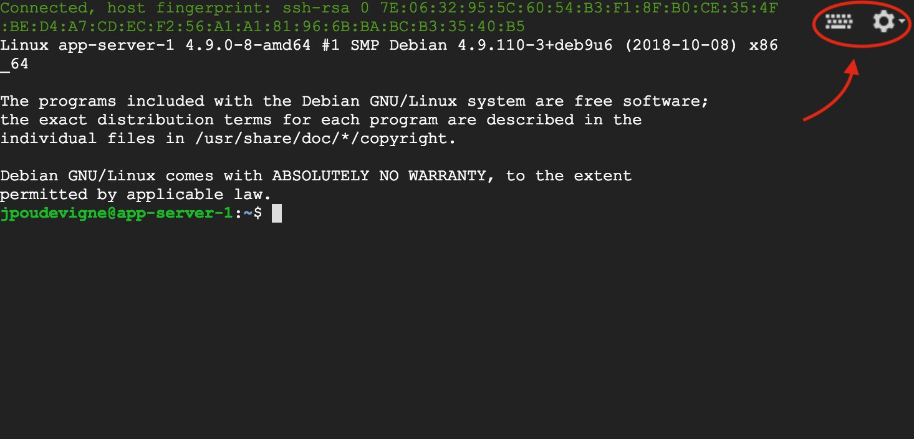

5 “Aha!” moments with the Google Cloud Platform – Google Developers – Medium

# *5 “Aha!” moments with the Google Cloud Platform*

[Google Developers](https://medium.com/@googledevs)
Mar 27·9 min read
*Posted by: Jerome Poudevigne, Startup Architect, Google Cloud*

Throughout the past couple of years, I have helped a good number of companies, big and small, migrate their systems to the[Google Cloud Platform](https://cloud.google.com/) (aka GCP). During the course of these migrations, there are always a few of those moments where people look at a specific Google Cloud feature and say, “now, *that’s* cool!”.

More often than not, it is because, coming from other platforms, they have gotten used to some features requiring multiple steps, or some operations being complicated, etc. And often they find out that in GCP you can do this specific operation in a couple of clicks, or by setting up a simple text-based configuration. Then you see that light bulb turning on in their head, and there you go… happy customer.

A few of these happen so often that I compiled them in a list to share with others who might also benefit from these “aha!” moments. You could say these are the five things I wish they told me when I started using Google Cloud.

### 1- Projects: naturally group resources together.

A project is a namespace where resources live. Every resource you instantiate in GCP, from load balancers to Kubernetes clusters to virtual machines, belongs to a single project, and has no access (by default) to resources in other projects. User roles and authorisations can be defined per-project and trickle down to everything in it. This has two immediate benefits: you can group things that belong together in neat logical units, and things that don’t belong together are isolated from each other (and isolation is a Good Thing)

This is powerful and quite simple, but it often takes new users off-guard. I’ve had many clients call me and ask me “How can I make sure my developers cannot access the production machines? What’s the best way to create access policies? ”

The answer to this is actually super-simple:

- •have a project for development where your developers have rights,
- •have a project for production where they don’t.
- •That’s it.

Every machine/other resource in the production project won’t be accessible to developers.

Of course there is a lot more to it, and you can refine roles and permissions to a much greater degree using[Organizations](https://cloud.google.com/resource-manager/docs/creating-managing-organization),[Folders](https://cloud.google.com/resource-manager/docs/creating-managing-folders), etc. Not to mention all the crazy things you can do with per-project billing. But at least you can say “hey, if it’s a machine in the staging environment then it can be found in the “*staging*” project”.

### 2- Global virtual networks that are *truly* global

Imagine you are using a Cloud provider and that you have servers in the US, and servers in Singapore, and that they need to communicate.

So you create a VPC (Virtual Private Cloud) network in the US data center, another one in the Singapore data center, and then you will connect them by setting up inter-region VPC peering or a VPN (Virtual Private Network) or a transit VPC or other routing magic.

Lots of work, right? And many moving parts, so lots of opportunities for things to break.

With GCP, however, what makes my clients go “aha!” is when they realize that in GCP **a single VPC network covers the entire planet.** Only subnets are attached to a geographic location, and virtual machines communicate between subnets on private IPs (good old RFC1918 addresses) — no extra routing needed.

So, to make your server communicate across continents on GCP, here are the steps:

- •create a VPC network
- •create a subnet in the US, put your US servers in it
- •create a subnet in Singapore, put your Singapore servers in it

That’s all there is to it. Your VPC network spanning 2 continents is ready to use. Below is a screenshot of how it looks on my account, for a VPC network called ‘my-global-network’ with 2 subnets. The first column (“us-central1” and “asia-southeast1”) contains the name of the GCP regions (read: data centers). The second column is the subnet name that I picked when I created them.

*A network spanning the US and Singapore*

A machine in the US (on the “us-central” subnet) with IP *10.0.0.5 *can communicate directly with a machine in Singapore (on the “singapore”) subnet with IP *10.10.0.8*.

Nothing else to set up.

And thanks to the way these networks work, the[Google Cloud Load Balancer](https://cloud.google.com/load-balancing/) can present a single IP to the world, and forward traffic to the instances that are the closest to you geographically without having to setup a tedious DNS-based load balancing. But that’s worth an entire blog. I’ll save it for another day.

### 3- Firewalls with tags and (almost) no IP addresses

There is no network security without a firewall so unsurprisingly GCP comes with one built-in.

Now, I don’t know about you, but nothing makes my brain hurt like a list of firewall rules displaying IP ranges and addresses and ‘Allow/Deny’ directives. It looks a bit like this:

*An IP-based set of firewall rules*

If you imagine a normal network with a few dozen (hundred?) servers, you can quickly see how this can get out of control. You’d better have a solid printout of your network layout to refer to when you start adding and changing rules. And good luck debugging things!

Wouldn’t it be nice if, instead, you could just tell the firewall: *“the HTTP traffic from outside can only reach the HTTP servers and the MySQL database is only reachable by the HTTP server(s) on the same network?”*

Turns out it’s pretty simple on GCP by using a little thing called[network tags.](https://cloud.google.com/vpc/docs/add-remove-network-tags) As the documentation says:

> “*> Network tags are text attributes you *> can*>  add to Compute Engine virtual machine (VM) instances. Tags allow you to make firewall rules and routes applicable to specific VM instances.*> ”

So let’s see how it works. Firewall rules in GCP are defined in terms of source and target (the traffic flows from the source to the target). You can define filtering rules that apply to the source or the target, and in both cases you can use tags.

This is simpler shown with an example. The rule below states that on the `default` network, the traffic to the VMs with the tag `mysql-server` can come from the VMs with the tag `http-appserver`. Any other traffic is “Deny”-ed by default.

All you have to do is to tag your machines properly, and they will automatically be covered by the rule. You don’t need to enter their IP range.

That’s neat if you ask me. It makes it a lot simpler to grasp what’s happening.

Of course, there’s a TON more to firewalls in GCP. Tags also apply to routes and you can mix and match IP-based rules with tag-based rules. Not to mention that thing called service accounts, but I’ll leave those for another day.

The bottom line is that you can create most rules by just expressing a business need and not having to remember complicated network layouts. I have no hard stats, but I’m pretty sure this has saved me hours of work.

### 4- Console access to virtual machines from the browser

Easily access virtual machines (VMs) from the Google Cloud console was one of my first “aha!” moments when I started using GCP.

This is a screen capture of my Google Cloud console, with a virtual machine and its internal IP.

The last column has a header that says “Connect” and when you click on the word “SSH” a separate windows pops up. You wait for a few seconds, and… this is what you get. Your personal shell access — in a browser popup no less.

You are connected through ssh to the virtual machine of your choice. You did not have to download ssh keys and put them in the `~/.ssh directory`, do the correct chmod command and run a long-winded `ssh -i ~/.ssh/somekey me@<it-took-me-forever-to-copy-paste-the-address-here>`

In addition, you have access to a few nifty features such as uploading and downloading files, changing the user etc. Just use the menu behind the cog icon at the top right.

In truth, you should not need to connect directly that often, but when you have to, this is a godsend.

### 5- Your personal jumphost from the Google Cloud console

The Google Cloud console has a cool trick: you can actually connect to a virtual environment that is managed by the Google Cloud console itself. It serves a bit as a jump host. You can access most resources from the projects from it, and you can activate it directly from the top menu with, no particular setup on your side. It’s called the Cloud Shell.

This is how it looks at the top right of the console:

When you activate the Cloud Shell, the session opens at the bottom of the console. You get a command line prompt and it’s fully configured with the `gcloud` command line tool (the jack-of-all-trades of Google Cloud scripting).

You can do a great many things from there, and this even includes uploading and downloading files, editing code or deploying it, a web preview for your AppEngine application,[and more](https://medium.com/google-cloud/no-localhost-no-problem-using-google-cloud-shell-as-my-full-time-development-environment-22d5a1942439).

So you can get access to a fully configured shell environment in your project from any laptop where you can connect with your credentials. On top of this, it persists between connections so you can fine-tune it to your needs and have these changes available the next time you re-connect.

This has saved me many times during my previous life as a traveling consultant!

### 6- Live migration

Did I say 5 “Aha!” moments ? Well, you’ve been patient reading all the way to here, so here’s one more for free.

Google Cloud has an amazing way to literally **“teleport”** a running virtual machine between physical hosts *without stopping it.* It’s called[Live Migration](https://cloud.google.com/compute/docs/instances/live-migration). It allows Google to move your virtual machine away from a defective host, or a host that needs a patch or an upgrade, or for any other infrastructure related reason.

It’s all done in the background, and is totally transparent, so you never really [see it happening](https://cloud.google.com/compute/docs/instances/live-migration#how_does_the_live_migration_process_work). Unless you look VERY closely. I once did a demo to a client, where a machine was live migrated while he was simulating a solid network load — and we did not lose a single packet, with no noticeable degradation in latency.

### And that’s a wrap!

So there you go. These are 5+1 things that made me go “Aha!” when I became more familiar with the Google Cloud Platform, and that still make my clients do the same.

There is a lot of depth to the platform, and my examples above only scratch the surface of our features. I encourage you to try it yourself. There is a generous free tier, and when you are ready to take the plunge and create that new company, please contact us at[Google Cloud for Startups](https://cloud.google.com/developers/startups/). We’ll get you up and running in no time.

*Jerome is a Startup Architect at Google Cloud. Based in Singapore, he helps startups make the most of the Google Cloud Platform.*