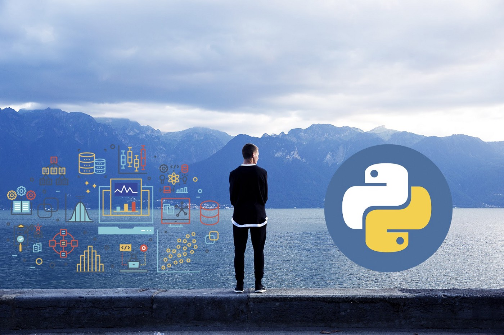
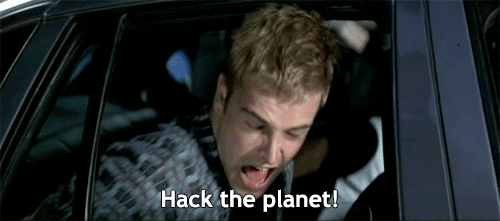
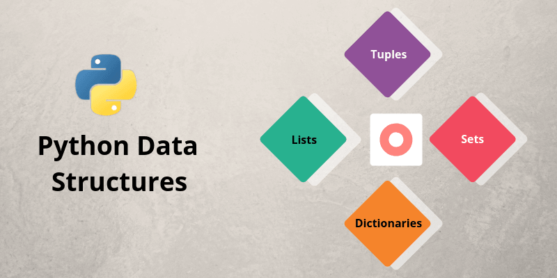
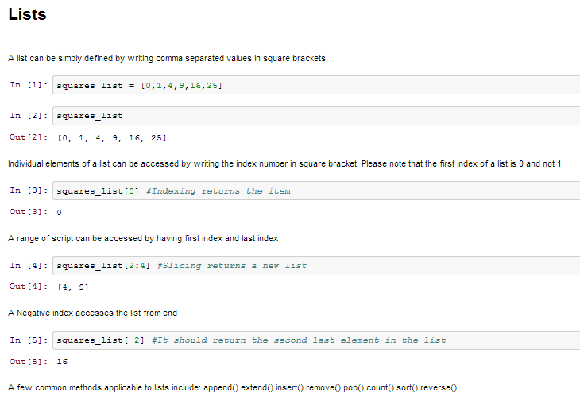
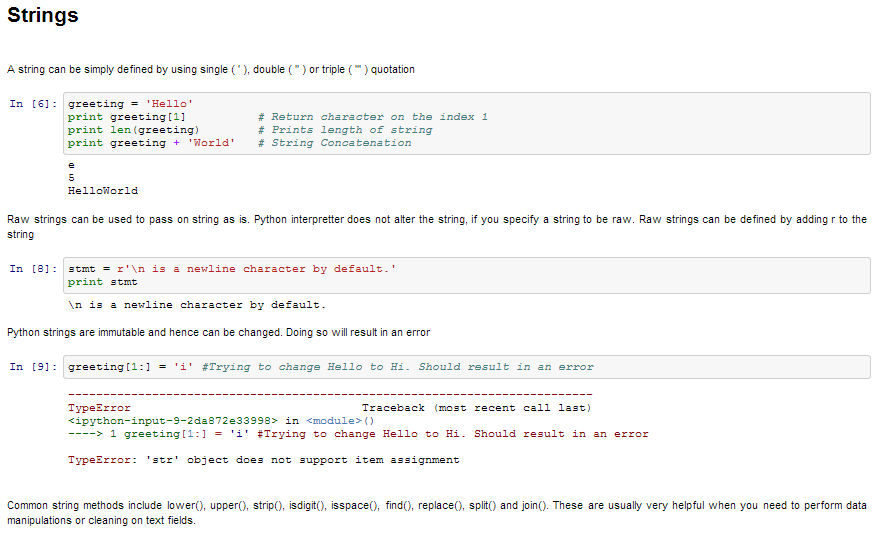
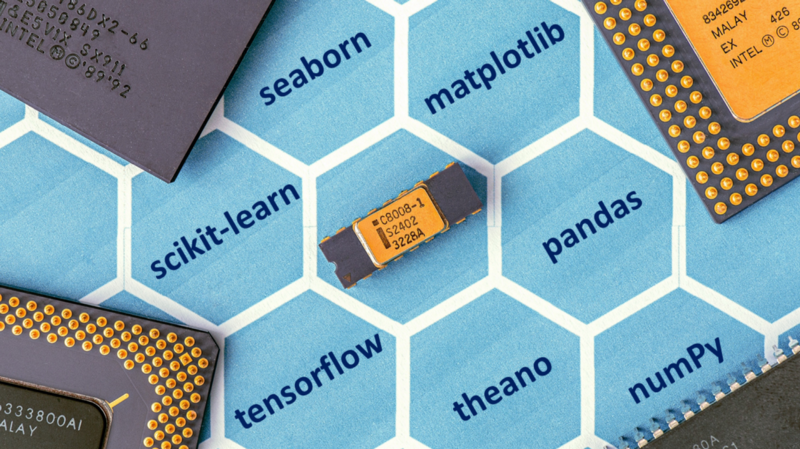

A Beginner’s Guide to Python for Data Science

# A Beginner’s Guide to Python for Data Science

## All you need is Python. Python is all you need.

[Oleksii Kharkovyna](https://towardsdatascience.com/@oleksii_kh?source=post_page-----60ef022b7b67----------------------)

[Jul 16](https://towardsdatascience.com/a-beginners-guide-to-python-for-data-science-60ef022b7b67?source=post_page-----60ef022b7b67----------------------) · 10 min read

Some programming languages live in the heart of data science. Python is one of those languages. It is an integral ingredient for Data Science and vice versa. And actually, it would take prominently long to explain why.

Let’s start with the fact that Python provides great functionality to deal with mathematics, statistics and scientific function. When it comes to data science application, it provides extensive libraries to deal with. Not to mention it is open-source, interpreted, high-level tool!

Most importantly, Python is widely used in the scientific and research communities because of its ease of use, it’s simple syntax makes it easy to adapt for people who even do not have an engineering background. Real data confirm this as well:

*In 2018, 66% of data scientists reported using Python daily, making it the number one tool for analytics professionals.*

I think this trend will certainly continue to evolve, so why to delay? If you have dreamed a lot about Data Science, it’s time to jump right in!

**Here is the most effective learning course, as I see it for myself:**

- Step 1: Python Basics: Hello, World!
- Step 2: Python Lists and Strings
- Step 3: Python Libraries for Data Science
- Step 4: Practice Your Coding and Data Science Skills

Are you ready?

# Step 1: Python Basics: Hello, World!

Python is a comparatively simple language and has an actually pretty handy syntax. It properly supports programmers to program without boilerplate (prepared) code and instantly recognize weak spots. You may ask what can be better? And I will answer, nothing ;)

So, the first thing you typically need to do is, of course, an installation.

## How to install Python?

My advice is to use [Anaconda distribution](https://www.anaconda.com/distribution/) for installation (available for Linux, Windows, and Mac OS X). The reason for this is it contains all necessary libraries for data analysis.

## **Hello, World!**

The simplest **directive** (a language construct that specifies how a compiler should process its input) in Python is the **“print”** directive — it simply prints out a line (and also includes a newline, unlike in C).

To print a string in Python, just write:
print(“This line will be printed.”)

So use the** “print”** command to print the line** “Hello, World!” **— the first inevitable program one usually writes when learning a new programming language:

print(“Hello, World!”)
Congrats, you almost a programmer now. *(joke)*

Well, it was only induction into a myriad of programming languages. Undoubtedly, there will be tougher times ahead but every expert was once a beginner, remember?

## **Python syntax — the keystone of your success**

Well, to be honest, there are lots of specific details concerning syntax you need to learn, and this article is no way enough to amply fulfill this task. But I will genuinely try to ease your pain in learning. Here are the basic concepts and valuable resources/books below:

- Python is a strongly typed language (a strongly-typed language is one in which each type of data is predefined as part of language and all constants or variables defined for a given program must be described with one of the data types), but at the same time it is dynamically typed (there is no declaration of a variable, just an assignment statement).
- Python is case-sensitive language (var and VAR are two different variables) and object-oriented language (everything in Python is an object: numbers, dictionaries, user-defined, and built-in classes).
- Python has no mandatory operator completion characters, block boundaries are defined by indents. The indent starts a new block, the lack of indent finishes it. Expressions that are waiting for a new indent end with a colon character (:). Single-line comments begin with a pound symbol (#); for multi-line comments, string literals are used, enclosed in triple apostrophes or triple quotes.
- Values are assigned (in fact, objects associated with the names of values) using an equal sign (“=”), and equality is checked using two equal signs (“==”). You can increase/decrease the values using the + = and — = operators, respectively, by the value specified to the right of the operator. This works for many data types, incl. and strings.
- **DATA TYPES.** In Python, there are the following data structures: lists, tuples, and dictionaries. Sets are also available but only in Python 2.5 and later versions. Lists are like one-dimensional arrays (but you can also create lists of other lists and get a multidimensional array), dictionaries are associative arrays (so-called hash tables, which can be any data type), and tuples are unchangeable one-dimensional arrays (in Python, “arrays” can be of any type, so you can mix, for example, integers, strings, etc. in lists / dictionaries / tuples). The index of the first element in arrays of all types is 0, and the last element can be obtained by index -1.
- You can work only with a part of the array elements using a colon (:). In this case, the index before the colon indicates the first element of the used part of the array, and the index after the colon indicates the element AFTER the last element of the used part of the array (it is not included in the subarray). If the first index is not specified, the first element of the array is used; if the second is not specified, the last element will be the last element of the array. calculate Negative values determine the position of the element from the end.

## Resources and must-learn things for absolute beginners:

[Automate the Boring Stuff with Python](https://automatetheboringstuff.com/) — this book proves the fact the main thing in programming is not the knowledge of syntax, but the understanding of how to make the machine execute your instructions. Programming is creativity and Automate the boring stuff with Python is your best way to master this language ever!

[How to Think Like a Computer Scientist](http://openbookproject.net/thinkcs/python/english3e/) — another one good open book project that instructs you to program like a pro. It is more like general info concerning programming. For example, you have no clue what is Strings or Tuples or something else, it’s the right place to receive a fundamental explanation.

## **For those who know another programming language:**

[Learn Python in One Video](https://www.youtube.com/watch?v=N4mEzFDjqtA&feature=) — great video that clarifies many issues related to Python and data analysis like what is the difference between data types such as integer, floating point and string; what is the structure of the function; how do import operators work and more.

## Next step is critical for both to the consolidation of what has been achieved thus far:

[PracticePython.org](https://www.practicepython.org/) — a great place offering the whole spectrum of Python programming tasks and most importantly, its solutions. Here you can compare your decision with the decisions of others and find the strengths and weaknesses of your approach.

# Step 2: Python Lists and Strings

A **list** is a data structure in Python that is a mutable, or changeable, ordered sequence of elements. Each element or value that is inside of a list is called an item. Just as strings are defined as characters between quotes, lists are defined by having values between square brackets [ ].

Here is a quick example to define a list and then access it:

**Strings** can simply be defined by the use of single ( ‘ ), double ( ” ) or triple ( ”’ ) inverted commas. Strings enclosed in tripe quotes ( ”’ ) can span over multiple lines and are used frequently in docstrings (Python’s way of documenting functions). \ is used as an escape character. Please note that Python strings are immutable, so you can not change part of strings.

# Step 3: Python Libraries for Data Science

What are libraries in programming? It is a collection of precompiled routines that a program can use. The routines, sometimes called modules, are stored in object format. Libraries are particularly useful for storing frequently used routines because you do not need to explicitly link them to every program that uses them. Libraries save time because you do not need to construct functions from scratch.

**What you need to learn:**

[Jupyter Notebook](https://jupyter.org/) — a set of tools for developing programs. If you downloaded Python with the Anaconda distribution, use Anaconda to create and save Jupyter Notebook. Here is the best way to do it: [How to create and save a jupyter notebook with anaconda navigator](https://www.youtube.com/watch?v=-MyjG00la2k).

**Learning path:**
1. Read general information (it takes approximately 30 minutes).
2. Open Jupyter Notebook and load the library.

3. See how the library works, using the instructions for working with the library.

4. Allocate 30 minutes for the study of reference information.

Using this learning path, you will master the library enough to start using it in your work.

**Python libraries for data science you need to learn:**

1. First, start learning **NumPy** as it is the fundamental package for scientific computing with Python. A good understanding of Numpy will help you use tools like Pandas more effectively.

**Things to learn: **basic concepts of Numpy, the most frequently performed operations in Numpy, such as working with N-dimensional array, Indexing and slicing of arrays, Indexing using integer arrays, transposing an array, universal functions, data processing using arrays, frequently used statistical methods.

**Resources to learn:**
[NumPy brief introduction](https://docs.scipy.org/doc/numpy/user/)
[NumPy tutorial](https://docs.scipy.org/doc/numpy/)

**2. Pandas** contain high-level data structures and manipulation tools to make data analysis fast and easy in Python. Work with this library is built on top of NumPy.

**Thins to learn: **series, data frames, dropping entries from an axis, working with missing values.

**Resources to learn:**
[pandas brief introduction](https://pandas.pydata.org/pandas-docs/stable/)

[pandas tutorial](https://pandas.pydata.org/pandas-docs/stable/getting_started/10min.html)

**3. Matplotlib** — for two-dimensional or three-dimensional data visualization. It is cumbersome yet powerful tool. With Matplotlib you can quickly generate line graphs, histograms, pie charts, and much more.

**Things to learn:**

Create different types of visualizations depending on the message you want to convey. Learn how to build complex and customized plots based on real data.

**Resources to learn:**
[Matplotlib brief introduction](https://matplotlib.org/contents.html)
[Matplotlib tutorial](https://matplotlib.org/users/pyplot_tutorial.html)
**Additional libraries:**

**1. Scipy** — a Python module for linear algebra, integration, optimization, statistics, and other frequently used tasks in data science. It’s highly user-friendly and provides for fast and convenient N-dimensional array manipulation.

**2. PyTorch **— based on Torch, is an open-source ML library that was primarily built for Facebook’s artificial intelligence research group. While it’s a great tool for natural language processing and deep learning, it can also be leveraged effectively for data science.

**3. scikit-learn **— a module focused on ML that’s built on top of SciPy. The library provides a common set of ML algorithms through its consistent interface and helps users quickly implement popular algorithms on data sets. It also has all the standard tools for common ML tasks like classification, clustering, and regression.

# Step 4: Practice Your Coding and Data Science Skills

Practice makes perfect and especially when it comes to data science.

Well, if you have already been able to do such a long way, my congratulations! Now the ball is in the court of practice and starts analytic work with Python! For me personally, the most effective solution at this stage is three ways: to participate in Kaggle contests, to invent and solve a problem yourself, to complete a practical course on data analysis in Python. But let’s try to speak one at a time:

1. **Take part in Kaggle competitions**

Kaggle often holds data analysis contests. I advise first to participate in contests without prizes because they are the easiest and more beginners-friendly. With time you can move to more complex tasks.

If this method of practice suits you, read the guide on how to participate in Kaggle contests — [The Beginner’s Guide to Kaggle](https://elitedatascience.com/beginner-kaggle).

**2. Create and solve the problem yourself**

Let’s imagine a marketer who is tired of staying up late at work due to the fact that he has to manually collect and process data and make visual reports based on them. To simplify his work and return home on time, he sets the task — to automate this process using Python, and solves it.

In a similar way, you should find something that makes it hard for you to work with. Then your task is to think about how to fix it. The only thing that can prevent you is ignorance of the sequence of actions. From this, you can skip the necessary steps and fail. Either get stuck in the middle, not knowing how to proceed.

If this happens, use the method below.
**3. Take a practical course on data analysis in Python**

By a practical course, I mean getting the necessary knowledge and completing a real task under the supervision of a professional who knows the things. Here are the best options:

- [DataCamp](https://www.datacamp.com/)

Pricing: Nine beginner courses free, then $25 per month
Length: Varies by course, typically 4 to 10 hours each

- [Introduction to Python: Absolute Beginner](https://www.edx.org/course/introduction-to-python-absolute-beginner-4?source=aw&awc=6798_1563266420_33130ca90cc30da54dd25aad01a5eab7)

Pricing: Free or $99 with certificate
Length: 5 weeks, 3 to 4 hours a week

# Final Advice and a Little Motivation

One of the easiest mistakes you can make when mastering Python is attempting to learn too many things especially libraries at once. When you try to learn like that, you spend too much time switching between different concepts, getting frustrated, and move on to something else.

So when you kickstart learning, focus stick on to this process and be patient in every step:

- Understand Python basics
- Learn Numpy
- Learn Pandas
- Learn Matplotlib
- Practice Your coding and data science skills

> Good luck!

Hope you liked this post. Feel free to ask your questions in comments below if something is unclear for you.

**Other related articles you may be interested in:**

- [*Beginner’s Guide to Machine Learning with Python*](https://towardsdatascience.com/beginners-guide-to-machine-learning-with-python-b9ff35bc9c51)
- [*A Beginner’s Guide To Data Science*](https://towardsdatascience.com/a-beginners-guide-to-data-science-55edd0288973)

**Inspired to learn more about AI, ML & Data Science? Check out my**[** Medium**](https://www.instagram.com/miallez/)** and**[** Instagram**](https://medium.com/@oleksii_kh)** blog.**