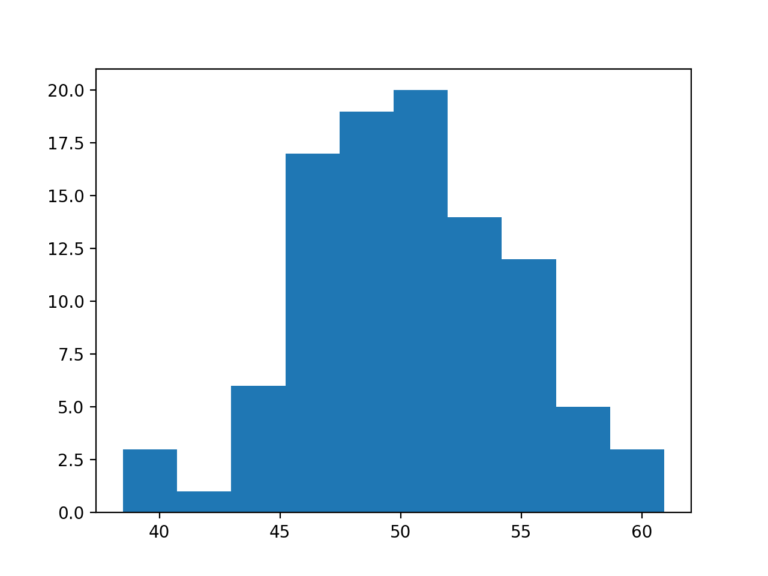
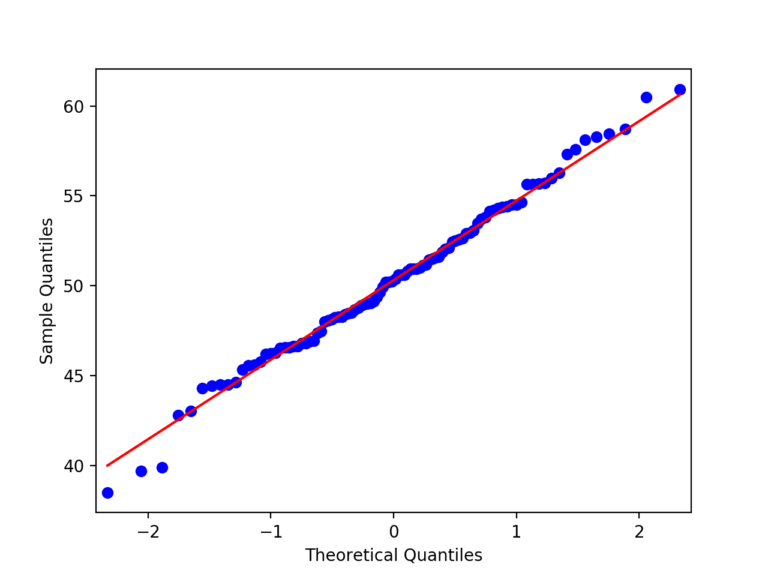
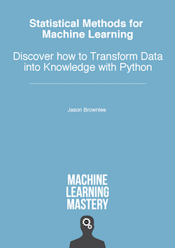

A Gentle Introduction to Normality Tests in Python

# A Gentle Introduction to Normality Tests in Python

By  [Jason Brownlee](https://machinelearningmastery.com/author/jasonb/)  on  May 11, 2018  in  [Statistical Methods](https://machinelearningmastery.com/category/statistical-methods/)

An important decision point when working with a sample of data is whether to use parametric or nonparametric statistical methods.

Parametric statistical methods assume that the data has a known and specific distribution, often a Gaussian distribution. If a data sample is not Gaussian, then the assumptions of parametric statistical tests are violated and nonparametric statistical methods must be used.

There are a range of techniques that you can use to check if your data sample deviates from a Gaussian distribution, called normality tests.

In this tutorial, you will discover the importance of checking whether a data sample deviates from the normal distribution and a suite of techniques that you can use to evaluate your data sample.

After completing this tutorial, you will know:

- How whether a sample is normal dictates the types of statistical methods to use with a data sample.
- Graphical methods for qualifying deviations from normal, such as histograms and the Q-Q plot.
- Statistical normality tests for quantifying deviations from normal.

Let’s get started.

- **Update May/2018**: Updated interpretation of results for Anderson-Darling test, thanks Elie.
- **Update May/2018**: Updated language about “reject” vs “failure to reject” H0.

A Gentle Introduction to Normality Tests in Python

Photo by [Ramoun Cabuhay](https://www.flickr.com/photos/kahboohigh/34984478670/), some rights reserved.

## Tutorial Overview

This tutorial is divided into 5 parts; they are:
1. Normality Assumption
2. Test Dataset
3. Visual Normality Checks
4. Statistical Normality Tests
5. What Test Should You Use?

### Need help with Statistics for Machine Learning?

Take my free 7-day email crash course now (with sample code).
Click to sign-up and also get a free PDF Ebook version of the course.

[Download Your FREE Mini-Course](https://machinelearningmastery.lpages.co/leadbox/142f75173f72a2%3A164f8be4f346dc/5750943224168448/)

## Normality Assumption

A large fraction of the field of statistics is concerned with data that assumes that it was drawn from a Gaussian distribution.

If methods are used that assume a Gaussian distribution, and your data was drawn from a different distribution, the findings may be misleading or plain wrong.

There are a number of techniques that you can check if your data sample is Gaussian or sufficiently Gaussian-like to use the standard techniques, or sufficiently non-Gaussian to instead use non-parametric statistical methods.

This is a key decision point when it comes to choosing statistical methods for your data sample. We can summarize this decision as follows:

|     |     |
| --- | --- |
| 1 2 3 4 | If Data Is Gaussian: Use Parametric Statistical Methods Else: Use Nonparametric Statistical Methods |

There is also some middle ground where we can assume that the data is Gaussian-enough to use parametric methods or that we can use data preparation techniques to transform the data to be sufficiently Gaussian to use the parametric methods.

There are three main areas where you may need to make this evaluation of a data sample in a machine learning project; they are:

- Input data to the model in the case of fitting models.
- Model evaluation results in the case of model selection.
- Residual errors from model predictions in the case of regression.

In this tutorial, we will look at two classes of techniques for checking whether a sample of data is Gaussian:

- **Graphical Methods**. These are methods for plotting the data and qualitatively evaluating whether the data looks Gaussian.
- **Statistical Tests**. These are methods that calculate statistics on the data and quantify how likely it is that the data was drawn from a Gaussian distribution.

Methods of this type are often called normality tests.

## Test Dataset

Before we start looking at normality tests, let’s first develop a test dataset that we can use throughout this tutorial.

We will generate a small sample of random numbers drawn from a Gaussian distribution.

The choice of Gaussian random numbers for the test dataset means that we do expect each test to correctly identify the distribution, nevertheless, the small-ish sample size may introduce some noise into the results.

We will use the [randn()](https://docs.scipy.org/doc/numpy/reference/generated/numpy.random.randn.html) NumPy function to generate random Gaussian numbers with a mean of 0 and a standard deviation of 1, so-called standard, normal variables. We will then shift them to have a mean of 50 and a standard deviation of 5.

The complete example is listed below.

|     |     |
| --- | --- |
| 1 2 3 4 5 6 7 8 9 10 11 | # generate gaussian data from numpy.random import seed from numpy.random import randn from numpy import mean from numpy import std # seed the random number generator seed(1) # generate univariate observations data  =  5  *  randn(100)  +  50 # summarize print('mean=%.3f stdv=%.3f'  %  (mean(data),  std(data))) |

Running the example generates the sample and prints the mean and standard deviation of the sample.

We can see that the mean and standard deviation are reasonable but rough estimations of the true underlying population mean and standard deviation, given the small-ish sample size.

|     |     |
| --- | --- |
| 1   | mean=50.303 stdv=4.426 |

## Visual Normality Checks

We can create plots of the data to check whether it is Gaussian.

These checks are qualitative, so less accurate than the statistical methods we will calculate in the next section. Nevertheless, they are fast and like the statistical tests, must still be interpreted before you can make a call about your data sample.

In this section, we will look at two common methods for visually inspecting a dataset to check if it was drawn from a Gaussian distribution.

### Histogram Plot

A simple and commonly used plot to quickly check the distribution of a sample of data is the histogram.

In the histogram, the data is divided into a pre-specified number of groups called bins. The data is then sorted into each bin and the count of the number of observations in each bin is retained.

The plot shows the bins across the x-axis maintaining their ordinal relationship, and the count in each bin on the y-axis.

A sample of data has a Gaussian distribution of the histogram plot, showing the familiar bell shape.

A histogram can be created using the [hist() matplotlib function](https://matplotlib.org/api/_as_gen/matplotlib.pyplot.hist.html). By default, the number of bins is automatically estimated from the data sample.

A complete example demonstrating the histogram plot on the test problem is listed below.

|     |     |
| --- | --- |
| 1 2 3 4 5 6 7 8 9 10 11 | # histogram plot from numpy.random import seed from numpy.random import randn from matplotlib import pyplot # seed the random number generator seed(1) # generate univariate observations data  =  5  *  randn(100)  +  50 # histogram plot pyplot.hist(data) pyplot.show() |

Running the example creates a histogram plot showing the number of observations in each bin.

We can see a Gaussian-like shape to the data, that although is not strongly the familiar bell-shape, is a rough approximation.

Histogram Plot Normality Check

### Quantile-Quantile Plot

Another popular plot for checking the distribution of a data sample is the quantile-quantile plot, Q-Q plot, or QQ plot for short.

This plot generates its own sample of the idealized distribution that we are comparing with, in this case the Gaussian distribution. The idealized samples are divided into groups (e.g. 5), called quantiles. Each data point in the sample is paired with a similar member from the idealized distribution at the same cumulative distribution.

The resulting points are plotted as a scatter plot with the idealized value on the x-axis and the data sample on the y-axis.

A perfect match for the distribution will be shown by a line of dots on a 45-degree angle from the bottom left of the plot to the top right. Often a line is drawn on the plot to help make this expectation clear. Deviations by the dots from the line shows a deviation from the expected distribution.

We can develop a QQ plot in Python using the [qqplot() statsmodels function](http://www.statsmodels.org/dev/generated/statsmodels.graphics.gofplots.qqplot.html). The function takes the data sample and by default assumes we are comparing it to a Gaussian distribution. We can draw the standardized line by setting the ‘*line*‘ argument to ‘*s*‘.

A complete example of plotting the test dataset as a QQ plot is provided below.

|     |     |
| --- | --- |
| 1 2 3 4 5 6 7 8 9 10 11 12 | # QQ Plot from numpy.random import seed from numpy.random import randn from statsmodels.graphics.gofplots import qqplot from matplotlib import pyplot # seed the random number generator seed(1) # generate univariate observations data  =  5  *  randn(100)  +  50 # q-q plot qqplot(data,  line='s') pyplot.show() |

Running the example creates the QQ plot showing the scatter plot of points in a diagonal line, closely fitting the expected diagonal pattern for a sample from a Gaussian distribution.

There are a few small deviations, especially at the bottom of the plot, which is to be expected given the small data sample.

QQ Plot Normality Check

## Statistical Normality Tests

There are many statistical tests that we can use to quantify whether a sample of data looks as though it was drawn from a Gaussian distribution.

Each test makes different assumptions and considers different aspects of the data.

We will look at 3 commonly used tests in this section that you can apply to your own data samples.

### Interpretation of a Test

Before you can apply the statistical tests, you must know how to interpret the results.

Each test will return at least two things:

- **Statistic**: A quantity calculated by the test that can be interpreted in the context of the test via comparing it to critical values from the distribution of the test statistic.
- **p-value**: Used to interpret the test, in this case whether the sample was drawn from a Gaussian distribution.

Each test calculates a test-specific statistic. This statistic can aid in the interpretation of the result, although it may require a deeper proficiency with statistics and a deeper knowledge of the specific statistical test. Instead, the p-value can be used to quickly and accurately interpret the statistic in practical applications.

The tests assume that that the sample was drawn from a Gaussian distribution. Technically this is called the null hypothesis, or H0. A threshold level is chosen called alpha, typically 5% (or 0.05), that is used to interpret the p-value.

In the SciPy implementation of these tests, you can interpret the p value as follows.

- **p <= alpha**: reject H0, not normal.
- **p > alpha**: fail to reject H0, normal.

This means that, in general, we are seeking results with a larger p-value to confirm that our sample was likely drawn from a Gaussian distribution.

A result above 5% does not mean that the null hypothesis is true. It means that it is very likely true given available evidence. The p-value is not the probability of the data fitting a Gaussian distribution; it can be thought of as a value that helps us interpret the statistical test.

### Shapiro-Wilk Test

The [Shapiro-Wilk test](https://en.wikipedia.org/wiki/Shapiro%E2%80%93Wilk_test) evaluates a data sample and quantifies how likely it is that the data was drawn from a Gaussian distribution, named for Samuel Shapiro and Martin Wilk.

In practice, the Shapiro-Wilk test is believed to be a reliable test of normality, although there is some suggestion that the test may be suitable for smaller samples of data, e.g. thousands of observations or fewer.

The [shapiro() SciPy](https://docs.scipy.org/doc/scipy/reference/generated/scipy.stats.shapiro.html) function will calculate the Shapiro-Wilk on a given dataset. The function returns both the W-statistic calculated by the test and the p-value.

The complete example of performing the Shapiro-Wilk test on the dataset is listed below.

|     |     |
| --- | --- |
| 1 2 3 4 5 6 7 8 9 10 11 12 13 14 15 16 17 | # Shapiro-Wilk Test from numpy.random import seed from numpy.random import randn from scipy.stats import shapiro # seed the random number generator seed(1) # generate univariate observations data  =  5  *  randn(100)  +  50 # normality test stat,  p  =  shapiro(data) print('Statistics=%.3f, p=%.3f'  %  (stat,  p)) # interpret alpha  =  0.05 if  p  >  alpha: print('Sample looks Gaussian (fail to reject H0)') else: print('Sample does not look Gaussian (reject H0)') |

Running the example first calculates the test on the data sample, then prints the statistic and calculated p-value.

The p-value is interested and finds that the data is likely drawn from a Gaussian distribution.

|     |     |
| --- | --- |
| 1 2 | Statistics=0.992, p=0.822 Sample looks Gaussian (fail to reject H0) |

### D’Agostino’s K^2 Test

The [D’Agostino’s K^2 test](https://en.wikipedia.org/wiki/D%27Agostino%27s_K-squared_test) calculates summary statistics from the data, namely kurtosis and skewness, to determine if the data distribution departs from the normal distribution, named for Ralph D’Agostino.

- **Skew** is a quantification of how much a distribution is pushed left or right, a measure of asymmetry in the distribution.
- **Kurtosis** quantifies how much of the distribution is in the tail. It is a simple and commonly used statistical test for normality.

The D’Agostino’s K^2 test is available via the [normaltest() SciPy function](https://docs.scipy.org/doc/scipy/reference/generated/scipy.stats.normaltest.html) and returns the test statistic and the p-value.

The complete example of the D’Agostino’s K^2 test on the dataset is listed below.

|     |     |
| --- | --- |
| 1 2 3 4 5 6 7 8 9 10 11 12 13 14 15 16 17 | # D'Agostino and Pearson's Test from numpy.random import seed from numpy.random import randn from scipy.stats import normaltest # seed the random number generator seed(1) # generate univariate observations data  =  5  *  randn(100)  +  50 # normality test stat,  p  =  normaltest(data) print('Statistics=%.3f, p=%.3f'  %  (stat,  p)) # interpret alpha  =  0.05 if  p  >  alpha: print('Sample looks Gaussian (fail to reject H0)') else: print('Sample does not look Gaussian (reject H0)') |

Running the example calculates the statistic and prints the statistic and p-value.

The p-value is interpreted against an alpha of 5% and finds that the test dataset does not significantly deviate from normal.

|     |     |
| --- | --- |
| 1 2 | Statistics=0.102, p=0.950 Sample looks Gaussian (fail to reject H0) |

### Anderson-Darling Test

[Anderson-Darling Test](https://en.wikipedia.org/wiki/Anderson%E2%80%93Darling_test) is a statistical test that can be used to evaluate whether a data sample comes from one of among many known data samples, named for Theodore Anderson and Donald Darling.

It can be used to check whether a data sample is normal. The test is a modified version of a more sophisticated nonparametric goodness-of-fit statistical test called the [Kolmogorov-Smirnov test](https://en.wikipedia.org/wiki/Kolmogorov%E2%80%93Smirnov_test).

A feature of the Anderson-Darling test is that it returns a list of critical values rather than a single p-value. This can provide the basis for a more thorough interpretation of the result.

The [anderson() SciPy function](https://docs.scipy.org/doc/scipy/reference/generated/scipy.stats.anderson.html) implements the Anderson-Darling test. It takes as parameters the data sample and the name of the distribution to test it against. By default, the test will check against the Gaussian distribution (*dist=’norm’*).

The complete example of calculating the Anderson-Darling test on the sample problem is listed below.

|     |     |
| --- | --- |
| 1 2 3 4 5 6 7 8 9 10 11 12 13 14 15 16 17 18 | # Anderson-Darling Test from numpy.random import seed from numpy.random import randn from scipy.stats import anderson # seed the random number generator seed(1) # generate univariate observations data  =  5  *  randn(100)  +  50 # normality test result  =  anderson(data) print('Statistic: %.3f'  %  result.statistic) p  =  0 for  i  in  range(len(result.critical_values)): sl,  cv  =  result.significance_level[i],  result.critical_values[i] if  result.statistic  <  result.critical_values[i]: print('%.3f: %.3f, data looks normal (fail to reject H0)'  %  (sl,  cv)) else: print('%.3f: %.3f, data does not look normal (reject H0)'  %  (sl,  cv)) |

Running the example calculates the statistic on the test data set and prints the critical values.

Critical values in a statistical test are a range of pre-defined significance boundaries at which the H0 can be failed to be rejected if the calculated statistic is less than the critical value. Rather than just a single p-value, the test returns a critical value for a range of different commonly used significance levels.

We can interpret the results by failing to reject the null hypothesis that the data is normal if the calculated test statistic is less than the critical value at a chosen significance level.

We can see that at each significance level, the test has found that the data follows a normal distribution

|     |     |
| --- | --- |
| 1 2 3 4 5 6 | Statistic: 0.220 15.000: 0.555, data looks normal (fail to reject H0) 10.000: 0.632, data looks normal (fail to reject H0) 5.000: 0.759, data looks normal (fail to reject H0) 2.500: 0.885, data looks normal (fail to reject H0) 1.000: 1.053, data looks normal (fail to reject H0) |

## What Test Should You Use?

We have covered a few normality tests, but this is not all of the tests that exist.

So which test do you use?
I recommend using them all on your data, where appropriate.

The question then becomes, how do you interpret the results? What if the tests disagree, which they often will?

I have two suggestions for you to help think about this question.

### Hard Fail

Your data may not be normal for lots of different reasons. Each test looks at the question of whether a sample was drawn from a Gaussian distribution from a slightly different perspective.

A failure of one normality test means that your data is not normal. As simple as that.

You can either investigate why your data is not normal and perhaps use data preparation techniques to make the data more normal.

Or you can start looking into the use of nonparametric statistical methods instead of the parametric methods.

### Soft Fail

If some of the methods suggest that the sample is Gaussian and some not, then perhaps take this as an indication that your data is Gaussian-like.

In many situations, you can treat your data as though it is Gaussian and proceed with your chosen parametric statistical methods.

## Extensions

This section lists some ideas for extending the tutorial that you may wish to explore.

- List two additional examples of when you think a normality test might be useful in a machine learning project.
- Develop your own contrived dataset and apply each normality test.
- Load a standard machine learning dataset and apply normality tests to each real-valued variable.

If you explore any of these extensions, I’d love to know.

## Further Reading

This section provides more resources on the topic if you are looking to go deeper.

### API

- [numpy.random.seed() API](https://docs.scipy.org/doc/numpy/reference/generated/numpy.random.seed.html)
- [numpy.random.randn() API](https://docs.scipy.org/doc/numpy/reference/generated/numpy.random.randn.html)
- [scipy.stats.normaltest() API](https://docs.scipy.org/doc/scipy/reference/generated/scipy.stats.normaltest.html)
- [scipy.stats.shapiro() API](https://docs.scipy.org/doc/scipy/reference/generated/scipy.stats.shapiro.html)
- [scipy.stats.anderson() API](https://docs.scipy.org/doc/scipy/reference/generated/scipy.stats.anderson.html)
- [statsmodels.graphics.gofplots.qqplot() API](http://www.statsmodels.org/dev/generated/statsmodels.graphics.gofplots.qqplot.html)
- [matplotlib.pyplot.hist() API](https://matplotlib.org/api/_as_gen/matplotlib.pyplot.hist.html)

### Articles

- [Normality test on Wikipedia](https://en.wikipedia.org/wiki/Normality_test)
- [Histogram on Wikipedia](https://en.wikipedia.org/wiki/Histogram)
- [Q–Q plot on Wikipedia](https://en.wikipedia.org/wiki/Q%E2%80%93Q_plot)
- [D’Agostino’s K-squared test on Wikipedia](https://en.wikipedia.org/wiki/D%27Agostino%27s_K-squared_test)
- [Anderson–Darling test on Wikipedia](https://en.wikipedia.org/wiki/Anderson%E2%80%93Darling_test)
- [Shapiro–Wilk test on Wikipedia](https://en.wikipedia.org/wiki/Shapiro%E2%80%93Wilk_test)

## Summary

In this tutorial, you discovered the importance of checking whether a data sample deviates from the normal distribution and a suite of techniques that you can use to evaluate your data sample.

Specifically, you learned:

- How whether a sample is normal dictates the types of statistical methods to use with a data sample.
- Graphical methods for qualifying deviations from normal such as histograms and the Q-Q plot.
- Statistical normality tests for quantifying deviations from normal.

Do you have any questions?
Ask your questions in the comments below and I will do my best to answer.

## Get a Handle on Statistics for Machine Learning!

#### Develop a working understanding of statistics

…by writing lines of code in python
Discover how in my new Ebook:

[Statistical Methods for Machine Learning](https://machinelearningmastery.com/statistics_for_machine_learning/)

It provides **self-study tutorials** on topics like:

*Hypothesis Tests, Correlation, Nonparametric Stats, Resampling*, and much more…

#### Discover how to Transform Data into Knowledge

Skip the Academics. Just Results.

[Click to learn more](https://machinelearningmastery.com/statistics_for_machine_learning/).

#### About Jason Brownlee

Jason Brownlee, PhD is a machine learning specialist who teaches developers how to get results with modern machine learning methods via hands-on tutorials.

[View all posts by Jason Brownlee →](https://machinelearningmastery.com/author/jasonb/)