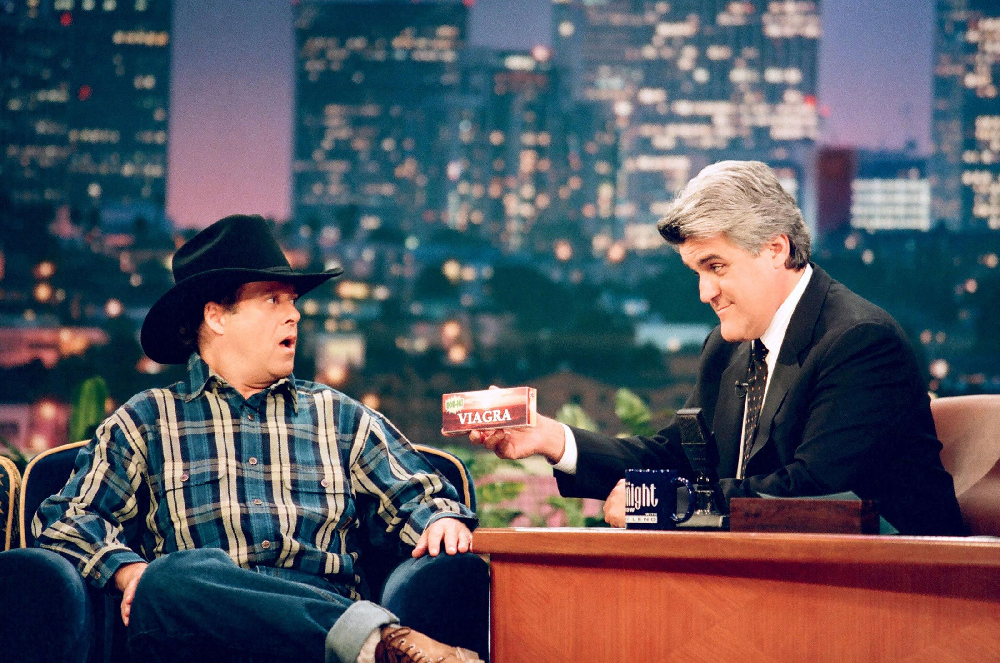
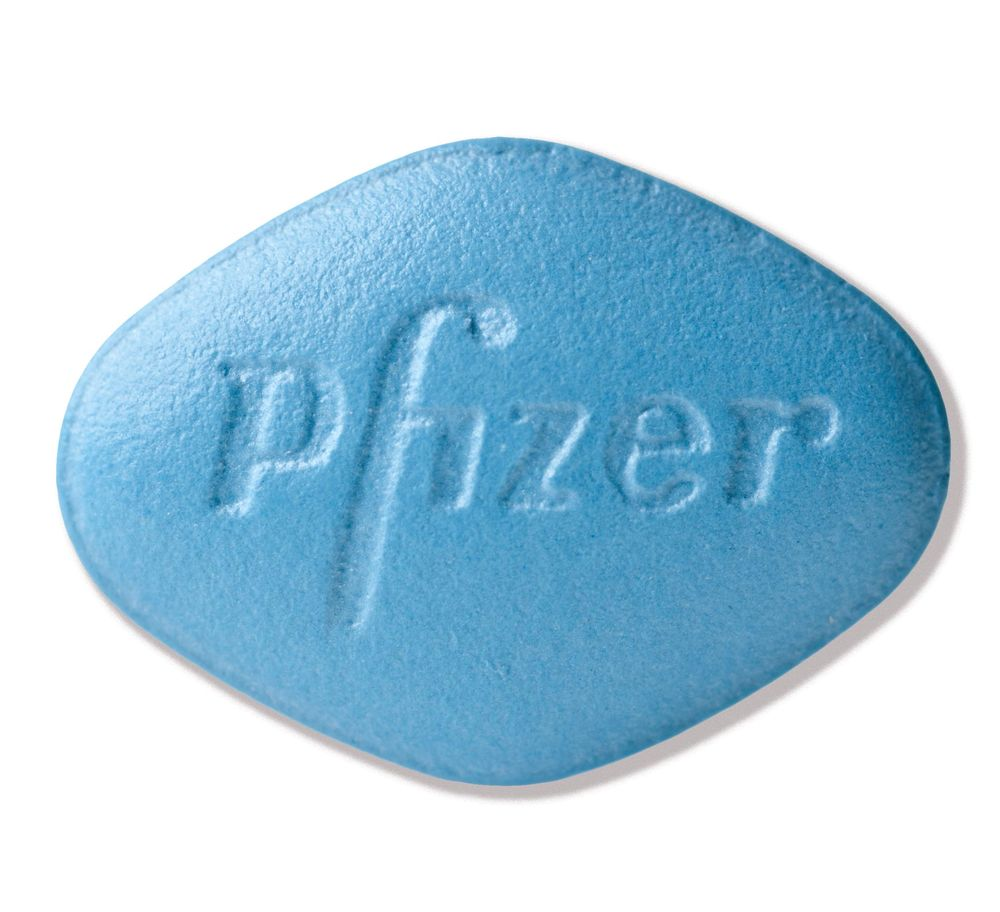
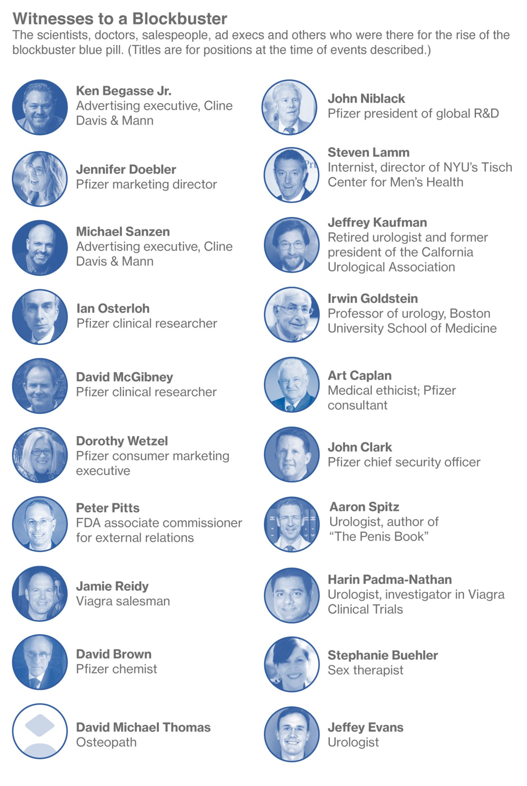
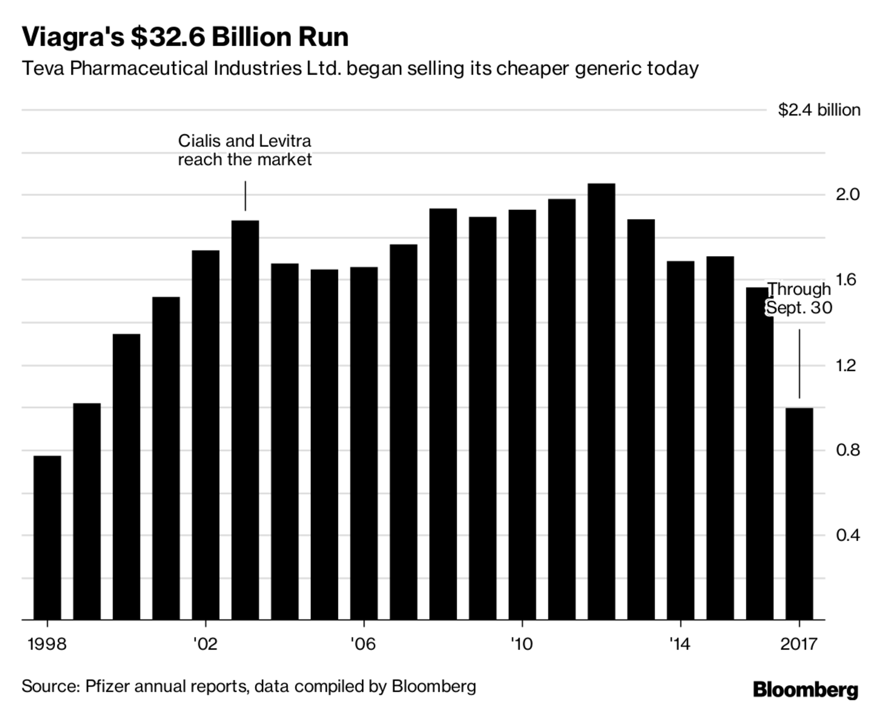

A History of Viagra

# The Little Blue Pill: An Oral History of Viagra

The story of the drug that changed sex and made billions.

 

Talk show host Jay Leno (right) does a Viagra gag with fitness personality Richard Simmons on July 16, 1998.

Photographer: Margaret Norton/NBC/NBCU Photo Bank via Getty Images)

By
John Tozzi
and
Jared S Hopkins
 December 11, 2017, 10:00 AM GMT

Viagra’s incredible run ended this morning with the release of a cheaper, generic version of the world’s first impotence-fighting pill.

And what a run it was. Approved 19 years ago, [Pfizer Inc.](https://www.bloomberg.com/quote/PFE:US)’s Viagra ushered in a pharmaceutical and cultural revolution, put the phrase “erectile dysfunction” in the medical mainstream, launched a thousand bad jokes and made friskiness a staple of prime-time television commercials. Bloomberg News spoke to people at the center of the phenomenon. Their comments have been edited for clarity.

*Pfizer chemists in South East England cooked up a compound in 1989 called sildenafil citrate that they thought might be a treatment for high blood pressure and chest pain. The low-priority project, classified as UK92480, had disappointing results in tests. Then, during a study of Welsh mine workers, researchers stumbled on the compound’s real magic: It inhibits the enzyme that breaks down a chemical that is key to erections.*

**David Brown (Pfizer chemist) : **It was so close to failure that people weren’t coming to the meetings. I mean, you know how people sort of smell failure and disappear? It was that close.

I think it was June 1993. I stood up in front of the clinical development committee—senior management—and, as in previous quarters, got crucified for wasting money. And I was given an ultimatum, basically: “Come back in September. If you’ve not got good data then, we’re closing it.

Literally days after that, we were doing a study in South Wales on miners. At the end, there’s always kind of an open question: Is there anything else you noticed you want to report? One of the men put up his hand and said, “Well, I seemed to have more erections during the night than normal,” and all the others kind of smiled and said, “So did we.” That was the breakthrough.

**Ian Osterloh (Pfizer research and development): **At the time, no one really thought, “This is fantastic, this is great news, we’re really onto something here. We must switch the direction of this program.”

**David McGibney (Pfizer R&D): **I remember being personally skeptical about this side effect.

**Brown: **It was literally the day after we got results from the miners in Wales. I said, “I need 150,000 pounds to do an impotence study,” and he [McGibney] said “no.” Basically I closed his door and said, “David, I’m not leaving your office until you give me the money.” If it had been anybody else, I could have been fired on the spot.

*Brown got the money, and new trials started in 1993, first in Bristol, U.K., and later in France, Norway, Sweden and other countries.*

**McGibney: **The study was designed to use basically soft pornography—or maybe even harder pornography, which wasn’t really allowed in the U.K. at that time. You know, before the internet, it was censored stuff. I think the unit had to have a Home Office license to use the images in that study.

**Brown: **They were fitted with what was called a Rigiscan—you can imagine what that does—and given the drug and shown blue movies. At the end of the week, we had to get the drugs back from them, anything that was unused. Some of them would not give the drug back.

Photographer: Getty Images

*Sales started almost immediately after the U.S. Food and Drug Administration approved the drug on March 27, 1998. In less than two months, Viagra was on the cover of Time magazine with this headline: “The Potency Pill.”*

**John Niblack (Pfizer R&D):** There never was an approved pharmaceutical product for this purpose before. It was hard to really wrap your head around what this was going to be worth for us. We were that uncertain about it, probably all the way through the launch. Who knew?

**Steven Lamm (doctor):** I think even Pfizer was overwhelmed by the media coverage. Normally, a pharmaceutical company would like to control the coverage. They’re very careful. They want to control the media. And they couldn’t. They had lost total control. The coverage was overwhelming.

**Brown: **I guess we should have realized that, sex being sex, it was going to be big news, but it got out of control.

**Lamm:** I was on the “Today” show and they said, “What are you gonna say, Dr. Lamm?” And I said, “I’m going to say ‘erection,’” and they said,”You can’t say the word erection.” I said, “It’s a physiologic term, what are you talking about?” They said, “Okay, if that’s the way you feel about it.” It resulted in the changing of how we speak and think about things.

*The first ads were sober, starring Bob Dole, then a 75-year-old former senator and ex-presidential candidate. The marketing started veering toward provocative in 2004, with the “Get Back to Mischief" campaign—the FDA asked Pfizer to pull some spots the agency deemed too suggestive. But at first, Pfizer moved cautiously.*

***Art Caplan (medical ethicist)*****: **I said, “Look, I don’t understand, what’s the disease? You’re saying you’ve got a drug but what are you treating?” And they said “impotence,” and I said, “Well, is that a medical condition?” And they said, “Hmm, not so sure,” so they began to talk to doctors and experts, and that’s where that whole idea of erectile dysfunction came up.

**Ken Begasse Jr. (advertising executive) : **Just calling it erectile dysfunction, as opposed to impotence, was one of the first major decisions that was made by Pfizer and the [ad] agency, to remove that social stigma. The initial ads—many of the ads—while they were seen as Viagra ads, were actually men’s health ads. They were really there to break down the stigma.

**Dorothy Wetzel (Pfizer marketing):** The first commercials were aimed at using this authority figure, saying, “He has a problem, he can go and address it, even though it’s kind of an embarrassing problem.”

**Jennifer Doebler (Pfizer marketing):** At the time, the television regulations were such that we would not be allowed to run the ad before 11 o’clock at night. I actually ended up going to talk to every single network and making my case for why they had to let us show this ad beforehand. Because 11 o’clock, that’s not when our audience—our proper audience—is going to be awake and watching.

**Caplan:** I said, “You ought to be worried that you’re selling a sex pill, and you could get religious or ethical critics. You need to be clear who this is for and why.” So out of that came ad campaigns that involved always showing somebody’s wedding ring when they were talking about this drug.

“Never before, and probably never again, will anybody get a standing ovation in the waiting room”

**Michael Sanzen (advertising executive): **That was a very deliberate set up: Let’s not make this a joke. And I think that was a big concern. How do we keep this from becoming a late-night talk-show host running gag?

**Wetzel: **We were very, very careful about it. One commercial—I even remember showing it to my minister to make sure that he thought it was okay.

**Sanzen: **Every round of creative thereafter, that was always the question: How do we dial this up? When’s the right time? Are people comfortable? You can see, obviously, where they ended up: sexy women lolling around on the bed. So we got there. But it was a very slow, step-by-step process, and every campaign that they did was a little edgier, a little more romantic—and then, ultimately, very sexy.

**Peter Pitts (FDA official): **It was discussed quite robustly inside the [FDA]. Certain people felt the ads were over the top and inappropriate. Negative is in the eyes of the beholder, but when you see a guy looking at a sexy woman and little horns come up out of his head, I think you can imply that that is a drug for enhanced sexual behavior.

*In just one week in May 1998, more than 300,000 prescriptions were filled. Pfizer dispatched armies of sales reps to coach physicians in how to bring up the then-delicate topic of impotence, and to dish out samples of a tablet that could treat a condition that had confounded men since the dawn of time, eluding an easy remedy.*

**Jeffrey Kaufman (doctor): **There was a lot of pent-up demand.

**Aaron Spitz (doctor):** The only treatments that did work at that time were pretty invasive and pretty scary. It was a situation where you could recommend injections in the penis, and a lot of guys don’t want to have an injection in their penis.

**Jamie  Reidy (Viagra salesman): **Pfizer had to conduct sexual harassment training and do several hours of workshops, especially for the female reps who are going to be talking about erections all day long.

**Lamm: **We had to get trained in how to even ask the question, so there wouldn’t be embarrassment. We had a whole new discussion as how to even approach these patients.

**Jeff Evans (doctor): **There were patient demos of how firm a penis should be. Just really bizarre stuff.

**Reidy: **It was really just madness. We had a shortage of samples at first. We had to prioritize which urologists were going to get samples first. It became kind of an arms race.

**David Michael Thomas (doctor): **Of the thousands of patients that I saw, a few would even come in literally wearing a trench coat and a hat and sunglasses and refuse to give their name. If they got off the elevator and there was someone walking in the hallway, they would walk down the stairs. They wouldn’t be seen entering my clinic.

**Irwin Goldstein (doctor): **We essentially had to open up weekend [office] visits, like every 10 minutes, so people could come in, have these conversations, walk away with the medication. It was so overwhelming.

**Kaufman: **We used to hand out Viagra like water. In my office, so patients weren’t embarrassed, we referred to it as Vitamin V because so many requested nurses to give them samples.

**Reidy: **We were rock stars. Never before, and probably never again, will anybody get a standing ovation in the waiting room. That was my highlight for sure. There was a waiting room filled with men, all of whom were avoiding eye contact with another—just kind of looking down, embarrassed to be there. The urologist had looked through the cutout window and saw me and walked out and, with a lot of panache said, “This is the Viagra Man!” And I got a standing ovation.

**John Clark (Pfizer security): **There were so many reports of counterfeits. The company decided that it needed to invest in a security group to help law enforcement.

**Spitz: **I had a guy, well into his 90s, who would come and see me for routine urological checkups. But he was fine, guy was absolutely fit as a fiddle. Had nothing wrong with him, but would insist he needed to see me every three months, or sooner if he could, and it was simply because he was getting Viagra samples at every visit. And he was using them.

Mark Martin drives his No. 6 Viagra Ford during practice for the Nascar Nextel Cup Dodge/Savemart 350, on June 24, 2005 at Infineon Raceway in Sonoma, California. “There were plenty of jokes, but it wasn’t as bad as it could have been.”

Photographer: Jonathan Ferrey/Getty Images

**Lamm: **It was just overwhelming—overwhelming—the publicity and the noise about this drug. It obviously touched a very tender chord. For men, it meant one thing. For couples, it had another implication.

**Reidy:** The urologists ended up becoming marriage counselors, in many cases.

*Women had a complicated reaction to Viagra. Some wanted a pill that would work for their own libidos; others were less than thrilled with partners’ renewed interest in sex. Christopher Walken starred in 2000 in a “Saturday Night Live” skit that captured the latter, showing an exasperated wife preparing to flush her husband’s little blue pills down the toilet.*

**Stephanie Buehler (sex therapist): **I remember the first time somebody came into my office who had tried Viagra, and he was very disappointed. He told the story that he came to his wife with the bottle of pills, and he shook them like a maraca and said, “Honey, we’re back in business.” And his wife looked and said, “Oh, I thought we were done with that.”

**Wetzel: **Some would write us: “I’m really upset that you brought out this drug. Now my husband is interested in sex all the time and this has disrupted everything.”

**Goldstein: **We got tons of phone calls. Okay, men have this Viagra. What am I supposed to do?

*For many doctors, Viagra’s legacy is that it opened the door for men to discuss what had been a shameful frustration and could be a sign of other serious health issues, including heart disease.*

**Lamm: **It exceeded everybody’s expectations level, with reference to its impact on men’s health. It really ushered in a generation of men who now started to realize there was a link between erections and overall health. This is a disorder in blood vessels, which is systematic.

**Harin Padma-Nathan (doctor): **Because it brought patients in, it gave you a chance to deal with other issues. So, if you incidentally discovered prostate cancer or bladder cancer, or something else—you had the guy.

**Lamm: **People could not get enough talking about this. It went on for months and years. The social—the cultural implication of this drug were overwhelming.

**Evans: **The most surprising thing was how public it became: commercials on TV and covering your kids’ eyes. It wasn’t taboo to talk about sex or sexual dysfunction after the drug came out.