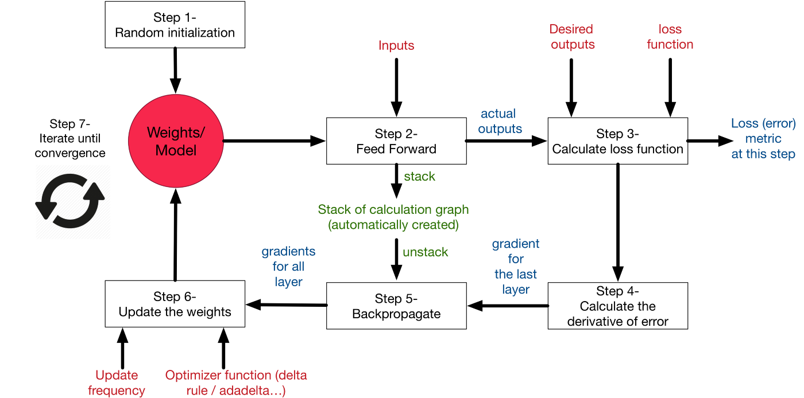

A Neural Network fully-coded in Numpy and Tensorflow

# A Neural Network fully-coded in Numpy and Tensorflow

## Super simple, can’t be any easier, code provided

[Assaad MOAWAD](https://medium.com/@assaad.moawad?source=post_page-----cc275c2b14dd----------------------)

[Dec 16, 2019](https://medium.com/datathings/a-neural-network-fully-coded-in-numpy-and-tensorflow-cc275c2b14dd?source=post_page-----cc275c2b14dd----------------------) · 2 min read

[In a previous post](https://medium.com/datathings/neural-networks-and-backpropagation-explained-in-a-simple-way-f540a3611f5e), we explained the mechanics behind Neural networks. In this post we will show a basic implementation in pure Numpy, and in TensorFlow.

As we previously explain, neural networks execution have 4 main steps:
1. Forward step (where we go from inputs to outputs)
2. Loss function (where we compare the calculated outputs with real outputs)

3. Backward step (where we calculate the first delta at the loss function and then back-propagate)

4. Optimization step (where we update the internal weights with deltas and learning rate)

Neural networks step-by-step

The easiest way to do a full working example, is to take only one operator (matrix multiplication), one loss function (RMSE), one optimizer(gradient descent) and execute a full running example.

**def** forwardMult(A,B):
 **return** np.matmul(A,B)

**def** backwardMult(dC,A,B,dA,dB):
dA += np.matmul(dC,np.matrix.transpose(B))
dB += np.matmul(np.matrix.transpose(A),dC)

*#Loss example in forward and backward (RMSE)*
**def** forwardloss(predictedOutput,realOutput):
 **if**(predictedOutput.shape == realOutput.shape):
loss = np.mean( 0.5*np.square(predictedOutput - realOutput))
 **else** :
print("Shape of arrays not the same")
 **return** loss

**def** backwardloss(predictedOutput,realOutput):
 **if**(predictedOutput.shape == realOutput.shape):
deltaOutput = (predictedOutput - realOutput)/predictedOutput.size
 **else** :
print("Shape of arrays not the same")
 **return** deltaOutput

*#Optimizer example (SGD)*
**def** updateweights(W,dW,learningRate):
W -= learningRate * dW

The full code can be found in [Numpy here](https://github.com/assaad/neuralnet_example/blob/master/NN_in_pure_numpy.ipynb), in [Tensorflow here](https://github.com/assaad/neuralnet_example/blob/master/NN_in_pure_TF.ipynb), and a [comparision between both here](https://github.com/assaad/neuralnet_example/blob/master/Compare_numpy_TF.ipynb).

The [repo](https://github.com/assaad/neuralnet_example) is made available on GitHub as a tutorial to understand how a neural network works.