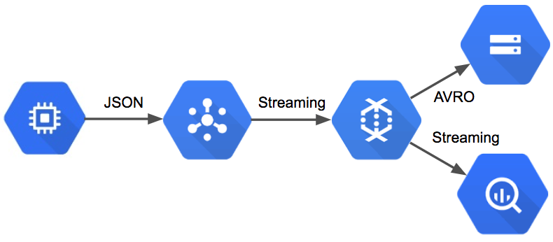
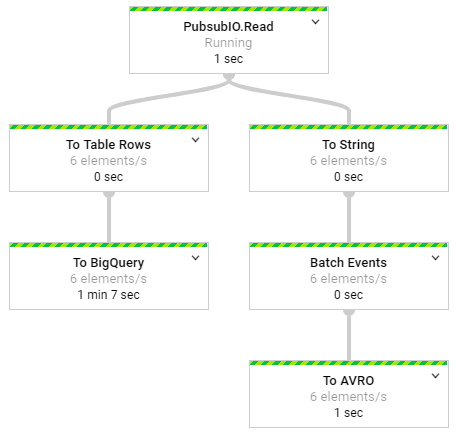
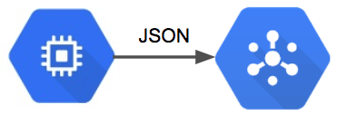
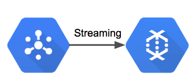

A Simple and Scalable Analytics Pipeline

# A Simple and Scalable Analytics Pipeline

[Ben Weber](https://towardsdatascience.com/@bgweber?source=post_page-----53720b1dbd35----------------------)

[Mar 30, 2018](https://towardsdatascience.com/a-simple-and-scalable-analytics-pipeline-53720b1dbd35?source=post_page-----53720b1dbd35----------------------) · 10 min read

Gathering data about application usage and user behavior such as player progress in games is invaluable for product teams. Typically, entire teams have been dedicated to building and maintaining data pipelines for collecting and storing tracking data for applications. However, with many new serverless tools available, the barriers to building an analytics pipeline for collecting data about application usage have been significantly reduced. Managed tools such as Google’s PubSub, DataFlow, and BigQuery have made it possible for a small team to set up analytics pipelines that can scale to a huge volume of events, while requiring minimal operational overhead. This post describes how to build a lightweight analytics pipeline on the Google Cloud platform (GCP) that is fully-managed (serverless) and auto scales to meet demand.

I was inspired by Google’s [reference architecture](https://cloud.google.com/solutions/mobile/mobile-gaming-analysis-telemetry) for mobile game analytics. The goal of this post is to show that it’s possible for a small team to build and maintain a [data pipeline](https://github.com/bgweber/GameAnalytics) that scales to large event volumes, provides a data lake for data science tasks, provides a query environment for analytics teams, and has extensibility for additional components such as an experiment framework for applications.

The core piece of technology I’m using to implement this data pipeline is Google’s DataFlow, which is now integrated with the [Apache Beam](https://cloud.google.com/blog/big-data/2016/08/cloud-dataflow-apache-beam-and-you) library. DataFlow tasks define a graph of operations to perform on a collection of events, which can be streaming data sources. This post presents a DataFlow task implemented in Java that streams tracking events from a PubSub topic to a data lake and to BigQuery. An introduction to DataFlow and it’s concepts is available in [Google’s documentation](https://cloud.google.com/dataflow/docs/concepts). While DataFlow tasks are portable, since they are now based on Apache Beam, this post focuses on how to use DataFlow in conjunction with additional managed services on GCP to build a simple, serverless, and scalable data pipeline.

My lightweight implementation of the GCP Reference Architecture for Analytics.

The data pipeline that performs all of this functionality is relatively simple. The pipeline reads messages from PubSub and then transforms the events for persistence: the BigQuery portion of the pipeline converts messages to TableRow objects and streams directly to BigQuery, while the AVRO portion of the pipeline batches events into discrete windows and then saves the events to Google Storage. The graph of operations is shown in the figure below.

The streaming pipeline deployed to Google Cloud

## **Setting up the Environment**

The first step in building a data pipeline is setting up the dependencies necessary to compile and deploy the project. I used the following maven dependencies to set up environments for the tracking API that sends events to the pipeline, and the data pipeline that processes events.

<!-- *Dependencies for the Tracking API *->
<dependency>
<groupId>com.google.cloud</groupId>
<artifactId>google-cloud-pubsub</artifactId>
<version>0.32.0-beta</version>
</dependency>
</dependencies><!-- *Dependencies for the data pipeline *->
<dependency>
<groupId>com.google.cloud.dataflow</groupId>
<artifactId>google-cloud-dataflow-java-sdk-all</artifactId>
<version>2.2.0</version>
</dependency>

I used Eclipse to author and compile the code for this tutorial, since it is open source. However, other IDEs such as [IntelliJ](https://www.jetbrains.com/idea/) provide additional features for deploying and monitoring DataFlow tasks. Before you can deploy jobs to Google Cloud, you’ll need to set up a service account for both PubSub and DataFlow. Setting up these credentials is outside the scope of this post, and more details are available in the [Google documentation](https://cloud.google.com/bigquery/docs/authentication/service-account-file).

An additional prerequisite for running this data pipeline is setting up a PubSub topic on GCP. I defined a *raw-events* topic that is used for publishing and consuming messages for the data pipeline. Additional details on creating a PubSub topic are available [here](https://cloud.google.com/pubsub/docs/quickstart-console).

To deploy this data pipeline, you’ll need to set up a java environment with the maven dependencies listed above, set up a Google Cloud project and enable billing, enable billing on the storage and BigQuery services, and create a PubSub topic for sending and receiving messages. All of these managed services do cost money, but there is a free tier that can be used for prototyping a data pipeline.

Sending events from a server to a PubSub topic

## Publishing Events

In order to build a usable data pipeline, it’s useful to build APIs that encapsulate the details of sending event data. The [Tracking API](https://github.com/bgweber/GameAnalytics/blob/master/events/tracking/TrackingAPI.java) class provides this functionality, and can be used to send generated event data to the data pipeline. The code below shows the method signature for sending events, and shows how to generate sample data.

/** Event Signature for the Tracking API

public void sendEvent(String eventType, String eventVersion, HashMap<String, String> attributes);

*/// send a batch of events
for (int i=0; i<10000; i++) { // generate event names
String eventType = Math.random() < 0.5 ?

"Session" : (Math.random() < 0.5 ? "Login" : "MatchStart"); // create attributes to send

HashMap<String, String> attributes = new HashMap<String,String>();
attributes.put("userID", "" + (int)(Math.random()*10000));
attributes.put("deviceType", Math.random() < 0.5 ?
"Android" : (Math.random() < 0.5 ? "iOS" : "Web")); // send the event
tracking.sendEvent(eventType, "V1", attributes);
}

The tracking API establishes a connection to a PubSub topic, passes events as a JSON format, and implements a callback for notification of delivery failures. The code used to send events is provided below, and is based on Google’s PubSub example provided [here](https://cloud.google.com/pubsub/docs/quickstart-client-libraries).

// Setup a PubSub connection
TopicName topicName = TopicName.of(projectID, topicID);

Publisher publisher = Publisher.newBuilder(topicName).build();// Specify an event to send

String event = {\"eventType\":\"session\",\"eventVersion\":\"1\"}";// Convert the event to bytes

ByteString data = ByteString.copyFromUtf8(event.toString());//schedule a message to be published

PubsubMessage pubsubMessage =

PubsubMessage.newBuilder().setData(data).build();// publish the message, and add this class as a callback listener

ApiFuture<String> future = publisher.publish(pubsubMessage); ApiFutures.addCallback(future, this);

The code above enables apps to send events to a PubSub topic. The next step is to process this events in a fully-managed environment that can scale as necessary to meet demand.

## Storing Events

One of the key functions of a data pipeline is to make instrumented events available to data science and analytics teams for analysis. The data sources used as endpoints should have low latency and be able to scale up to a massive volume of events. The data pipeline defined in this tutorial shows how to output events to both BigQuery and a data lake that can be used to support a large number of analytics business users.

Streaming event data from PubSub to DataFlow

The first step in this data pipeline is reading events from a PubSub topic and passing ingested messages to the DataFlow process. DataFlow provides a PubSub connector that enables streaming of PubSub messages to other DataFlow components. The code below shows how to instantiate the data pipeline, specify streaming mode, and to consume messages from a specific PubSub topic. The output of this process is a collection of PubSub messages that can be stored for later analysis.

// set up pipeline options
Options options = PipelineOptionsFactory.fromArgs(args)
.withValidation().as(Options.class);
options.setStreaming(true);
Pipeline pipeline = Pipeline.create(options);// read game events from PubSub
PCollection<PubsubMessage> events = pipeline
.apply(PubsubIO.readMessages().fromTopic(topic));

The first way we want to store events is in a columnar format that can be used to build a data lake. While this post doesn’t show how to utilize these files in downstream ETLs, having a data lake is a great way to maintain a copy of your data set in case you need to make changes to your database. The data lake provides a way to backload your data if necessary due to changes in schemas or data ingestion issues. The portion of the data pipeline allocated to this process is shown below.

Batching events to AVRO format and saving to Google Storage

For AVRO, we can’t use a direct streaming approach. We need to group events into batches before we can save to flat files. The way this can be accomplished in DataFlow is by applying a windowing function that groups events into fixed batches. The code below applies transformations that convert the PubSub messages into String objects, group the messages into 5 minute intervals, and output the resulting batches to AVRO files on Google Storage.

// AVRO output portion of the pipeline
events
.apply("To String", ParDo.of(new DoFn<PubsubMessage, String>() {
@ProcessElement
public void processElement(ProcessContext c) throws Exception {
String message = new String(c.element().getPayload());
c.output(message);
}
}))// Batch events into 5 minute windows
.apply("Batch Events", Window.<String>into(
FixedWindows.of(Duration.standardMinutes(5)))
.triggering(AfterWatermark.pastEndOfWindow())
.discardingFiredPanes()

.withAllowedLateness(Duration.standardMinutes(5))) // Save the events in ARVO format

.apply("To AVRO", AvroIO.write(String.class)
.to("gs://your_gs_bucket/avro/raw-events.avro")
.withWindowedWrites()
.withNumShards(8)
.withSuffix(".avro"));

To summarize, the above code batches events into 5 minute windows and then exports the events to AVRO files on Google Storage.

The result of this portion of the data pipeline is a collection of AVRO files on google storage that can be used to build a data lake. A new AVRO output is generated every 5 minutes, and downstream ETLs can parse the raw events into processed event-specific table schemas. The image below shows a sample output of AVRO files.

AVRO files saved to Google Storage

In addition to creating a data lake, we want the events to be immediately accessible in a query environment. DataFlow provides a BigQuery connector which serves this functionality, and data streamed to this endpoint is available for analysis after a short duration. This portion of the data pipeline is shown in the figure below.

Streaming events from DataFlow to BigQuery

The data pipeline converts the PubSub messages into TableRow objects, which can be directly inserted into BigQuery. The code below consists of two apply methods: a data transformation and a IO writer. The transform step reads the message payloads from PubSub, parses the message as a JSON object, extracts the *eventType* and *eventVersion* attributes, and creates a TableRow object with these attributes in addition to a timestamp and the message payload. The second apply method tells the pipeline to write the records to BigQuery and to append the events to an existing table.

// parse the PubSub events and create rows to insert into BigQuery events.apply("To Table Rows", new

PTransform<PCollection<PubsubMessage>, PCollection<TableRow>>() {
public PCollection<TableRow> expand(
PCollection<PubsubMessage> input) {

return input.apply("To Predictions", ParDo.of(new
DoFn<PubsubMessage, TableRow>() {

@ProcessElement
public void processElement(ProcessContext c) throws Exception {
String message = new String(c.element().getPayload());

// parse the json message for attributes
JsonObject jsonObject =
new JsonParser().parse(message).getAsJsonObject();
String eventType = jsonObject.get("eventType").getAsString();
String eventVersion = jsonObject.
get("eventVersion").getAsString();
String serverTime = dateFormat.format(new Date());

// create and output the table row
TableRow record = new TableRow();
record.set("eventType", eventType);
record.set("eventVersion", eventVersion);
record.set("serverTime", serverTime);
record.set("message", message);
c.output(record);
}}));
}})

//stream the events to Big Query
.apply("To BigQuery",BigQueryIO.writeTableRows()
.to(table)
.withSchema(schema)
.withCreateDisposition(CreateDisposition.CREATE_IF_NEEDED)
.withWriteDisposition(WriteDisposition.WRITE_APPEND));

To summarize the above code, each message that is consumed from PubSub is converted into a TableRow object with a timestamp and then streamed to BigQuery for storage.

The result of this portion of the data pipeline is that events will be streamed to BigQuery and will be available for analysis in the output table specified by the DataFlow task. In order to effectively use these events for queries, you’ll need to build additional ETLs for creating processed event tables with schematized records, but you now have a data collection mechanism in place for storing tracking events.

Game event records queried from the raw-events table in BigQuery

## **Deploying and Auto Scaling**

With DataFlow you can test the data pipeline locally or deploy to the cloud. If you run the code samples without specifying additional attributes, then the data pipeline will execute on your local machine. In order to deploy to the cloud and take advantage of the auto scaling capabilities of this data pipeline, you need to specify a new runner class as part of your runtime arguments. In order to run the data pipeline, I used the following runtime arguments:

--runner=org.apache.beam.runners.dataflow.DataflowRunner
--jobName=game-analytics
--project=your_project_id
--tempLocation=gs://temp-bucket

Once the job is deployed, you should see a message that the job has been submitted. You can then click on the [DataFlow console](https://console.cloud.google.com/dataflow) to see the task:

The steaming data pipeline running on Google Cloud

The runtime configuration specified above will not default to an auto scaling configuration. In order to deploy a job that scales up based on demand, you’ll need to specify additional attributes, such as:

--autoscalingAlgorithm=THROUGHPUT_BASED
--maxNumWorkers=30

Additional details on setting up a DataFlow task to scale to heavy workload conditions are available in [this Google article](https://cloud.google.com/blog/big-data/2016/03/comparing-cloud-dataflow-autoscaling-to-spark-and-hadoop) and [this post](https://labs.spotify.com/2016/03/10/spotifys-event-delivery-the-road-to-the-cloud-part-iii/) from Spotify. The image below shows how DataFlow can scale up to meet demand as necessary.

An example of Dataflow auto scaling. The pipeline will scale up and down as necessary to match demand.

## Conclusion

There is now a variety of tools available that make it possible to set up an analytics pipeline for a game or web application with minimal effort. Using managed resources enables small teams to take advantage of serverless and autoscaling infrastructure to scale up to massive event volumes with minimal infrastructure management. Rather than using a data vendor’s off-the-shelf solution for collecting data, you can record all relevant data for your app.

The goal of this post was to show how a data lake and query environment can be set up using the GCP stack. While the approach presented here isn’t directly portable to other clouds, the Apache Beam library used to implement the core functionality of this data pipeline is portable and similar tools can be leveraged to build scalable data pipelines on other cloud providers.

This architecture is a minimal implementation of an event collection system that is useful for analytics and data science teams. In order to meet the demands of most analytics teams, the raw events will need to be transformed into processed and cooked events in order to meet business needs. This discussion is outside the scope of this post, but the analytics foundation should now be in place for building out a highly effective data platform.

The full source code for this sample pipeline is available on Github:

[ ## bgweber/GameAnalytics  ###  GameAnalytics - A fully-managed pipeline for game analytics     ####  github.com](https://github.com/bgweber/GameAnalytics?source=post_page-----53720b1dbd35----------------------)

[Ben Weber](https://www.linkedin.com/in/ben-weber-3b87482/) is the lead data scientist at [Windfall Data](https://angel.co/windfall-data), where our mission is to build the most accurate and comprehensive model of net worth. The Windfall team is growing and is hiring [engineers](https://angel.co/windfall-data/jobs/191572-senior-data-engineer) and [data scientists](https://angel.co/windfall-data/jobs/335043-data-scientist).