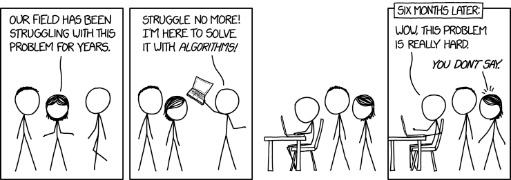
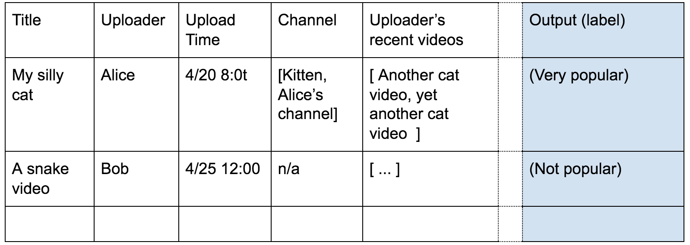
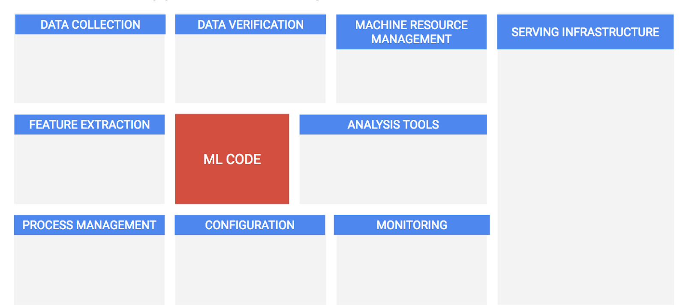

A Step-by-Step Guide to Machine Learning Problem Framing

# A Step-by-Step Guide to Machine Learning Problem Framing

## Diving into Machine Learning (ML) without knowing what you’re trying to achieve is a recipe for disaster. Let’s get you off to a good start with this step-by-step disaster prevention guide.

[Malika Cantor](https://medium.com/@malika.cantor)
Mar 15·15 min read

[Master of Disaster](https://www.cartoonstock.com/directory/m/master_of_disaster.asp)

In the last four years (at Google, and before that at [Comet Labs](https://cometlabs.io/team/)) I’ve had the opportunity to work with hundreds of startups and companies all over the world to help them define their ML strategy, from problem framing to end-to-end implementation of an ML model operating in production. We worked together on deploying models to boost operational efficiency (eg. internal tooling, DevOps, etc.), get rid of bottlenecks (eg. giving customer service teams “magical powers”), develop ML-powered product features, and build new products together.

In the process, we approached the deployment of ML from every angle: technological implementation, product development, org structure and culture, people management, go-to-market, pricing/monetization, UI/UX etc. In every case, we always started with focusing on framing the problem that we were seeking to solve with machine-learned models. This post focuses specifically on best practices for defining your ML model with success, scale, and fairness in mind.

After you go through this post and have your design reviewed, you should have a clear path forward to guide your initial ML implementation.

### Step 0: Perform a Preliminary Health Check

Regardless of the stage of your company, you ought to first carry out a critical review of current operational practices, bottlenecks, opportunities for growth, and the potential development of new features and products. There are many ways to [leverage ML as part of a solution](https://medium.com/thelaunchpad/no-machine-learning-in-your-product-start-here-2df776d10a5c). Keep in mind that in all likelihood many of the building blocks of your business will “talk to one another” and affect one another once you deploy data infrastructure.

#### **Make your business more efficient (and cheaper to operate)**

Ask yourself these questions: What processes are key to your business? Could any of them be (further) optimized? Scan through operations, BD, marketing, product development, etc. How much time/money would you save from optimizing one workflow over another? How long do you think it will take to incorporate an automatic workflow? How do you plan on training people to maintain them? Where in your process will you require humans in the loop?

Keep in mind that this process will probably be painful but it will also allow you to increasingly make data-driven decisions and to rally people behind data rather than arbitrary process decisions. Picking one workflow to optimize with ML, alongside building strong data infrastructure, will allow you to gradually optimize more processes and perhaps even lead to the development of a product feature.

One of the startups we recently worked with realized that one of their employee training programs was costing them $15m/year. They sought to figure out how to automate part of the grading for the training process in order to free up human grader time to double down on training promising employees. The implementation of their ML-based process enabled them to drive that cost down by ~30% after first implementation, as well as to start training an NLP model that they’ve since integrated into their product to deliver a better service to customers.

#### **Give your team and users superpowers**

Ask yourself these questions: Are there internal tools you could develop to make your employees, user, and/or another individual in your value chain more efficient? Could you free up time of your employees at scale eg. by building out collaboration tools, or standardized processes and templates to standardize service delivery? Can you leverage the expertise of your employees or other stakeholders in the “labeling” of your datasets, which will eventually result in a better product offering altogether.

For instance, another startup we worked with developed a “guiding” feature to their product which generated a heat map around anomalies in medical images that doctors should pay more attention to. This allowed for doctors to spend roughly 50% less time scanning images for high-level anomalies and to focus on statistically relevant parts of the images. The doctors would then add labels and notes on these images, which were then fed as features back into the model. Their resulting model is constantly becoming more precise.

Note that they didn’t start by saying “the ML model has to have 99% accuracy,” you start out by saying “the product as a whole has to have 98% accuracy, and to achieve that, we can use an ML model that has 99% accuracy on 90% of inputs, but makes no decision on 10%, and passes those off to a panel of 3 expert radiologists.”

#### **Bring an ML-powered feature or product to market**

Ask yourself these questions: What datasets are you collecting through your current product/ service? Data on user behavior, customer service, etc.? How could you leverage this data to develop a better or more customized offering? Could you actually build an entirely new product entirely based on this data? What if you consider the use case/ industry from first principles, can you develop an entirely new product based on a mixture of existing and new data sources?

For example, one team we worked with is entirely rethinking how to facilitate neuroplasticity (ie. the brain’s ability to reorganize itself by forming new neural connections) by collecting entirely novel datasets through an EEG capturing device, and comparing different EEG results to generate a data-driven EEG “treatment”. People are starting to move their limbs again — crazy! One note here is to be extremely thoughtful about how you go about generating new datasets and how you assess the relative value of existing datasets you pull into your model — we will briefly address bias and fairness later in this post.

In all cases, it is important to distinguish between a problem and a solution, as well as between product-level objectives and model-level objectives. “Machine Learning” is always part of the solution. The first step might be “We want to reliably identify X.” The second step is then “We decide to have a machine-learned model as part of our process.” Then there are outcomes, success metrics, and goals for the product as a whole, and those should always feed down to the ML model.

[Here to help](https://www.explainxkcd.com/wiki/index.php/1831:_Here_to_Help)

### Step 1: Describe your problem in plain English

Write what you’d like the machine-learned model to do. Actually write down: “We want the machine learned model to ____”. An example of this could be, “We want the machine-learned model to predict how popular a specific video just uploaded now will become in the future.” At this point, the statement can be qualitative, but make sure this captures your actual goal, not an indirect one.

### Step 2: Identify your ideal outcome

Your ML model is intended to produce *some* desirable outcome. What is this outcome, independent of the model itself? Note that the outcome may be quite different from how you assess the model and its quality (we will touch on metrics in the next section). Write down: “Our ideal outcome is:____”. Keeping with the example kicked-off above, your ideal outcome might be to only transcode popular videos to minimize serving resource utilization, and to suggest videos that people find useful, entertaining, and worth their time.

At this stage, you don’t need to limit yourself to metrics for which your product has already been optimizing (those will be covered in the next step). Instead, try to focus on the larger objective of your product or service.

### Step 3: Define your success metrics

Write down your metrics for success and failure with the ML system. The failure metrics are important (i.e., how will you know whether the ML system has failed?). Keep in mind that the success and failure metrics should be phrased independently of evaluation metrics for the model (e.g., don’t talk about precision, recall, or AUC; talk about the anticipated outcomes, instead). Often times these metrics will be tied to the ideal outcome you specified above. Write responses to the statements: “Our success metrics are: ____”, “Our key results (KR) for the success metrics are: ____”, and “Our ML model is deemed a failure if: ____”.

For instance, your success metric could be CPU resource utilization. In that case, your KR for the success metric is to achieve 35% less CPU cost for transcoding, and your ML model will be deemed unsuccessful if the CPU resource cost reduction is less than the CPU costs for training and serving the model. Another success metric might be the number of popular videos properly predicted. Here, your KR for the success metric is to properly predict the top 95% 28 days after being uploaded. Your ML model will be deemed unsuccessful if the number of popular videos properly predicted is no better than current heuristics.

Stop here! Ask yourself: “Are the metrics measurable?” “How will I measure them?” It’s okay if this is via a live experiment. Many success metrics can’t be captured offline. When deciding on your metrics, think about the ideal outcome that you specified in the previous step. When are you able to measure them? How long will it take for you to know whether your new ML system is a success or failure?

Do not limit yourself to a binary success or failure. There’s a wider range: catastrophic / worse than before / about the same as before / an improvement, but not as good as we expected / everything is awesome. Also keep in mind that if there are multiple metrics, a system can be at one level on one metric and another on a different metric.

Make sure to also consider engineering and maintenance costs over the long-term gain. Failure can occur despite a successful metric. For example; a model may be able to predict whether they click on recommended videos very well, but it may always be recommending “click baity” videos.

***A note on Design Reviews***: You will notice that this guide is interspersed with “design reviews” to validate your approach before you move on to the next section. We highly recommend finding another engineering or product team (at your company or externally) who is also in the midst of deploying ML. Deploying ML in and of itself will never be your secret sauce (it’s all about data!), and you will actually benefit a lot from sharing best practices with other practitioners who are also “in the trenches”. If you have access to a Cloud customer engineering team through your Cloud provider, or engineering support through [another program](https://developers.google.com/programs/launchpad/), we urge you to get feedback on your answers throughout this step-by-step guide.

### ** Design Review: ML System Goals **

As explained above, I now invite you to pair up with a colleague or team, and review each other’s responses to the steps above (1–3) while asking yourselves the following:

**Clear Problem Description: **Do you understand the purpose of the model?

**Failure and Success**: As an outsider, would you be able to assess success or failure of the ML system based on the defined metrics and goals? Include an example of where you would judge the system a failure.

### Step 4: Define your ideal output

Write the output that you want your ML model to produce. Again, write down (in English): “The output from our ML model will be: ____”, and “It is defined as: ____”. For instance, the output from your ML model will be one of the 3 classes of videos {very popular, somewhat popular, not popular}. It will be defined as the top {3, 7, 90}-percentile of watch time 28 days after being uploaded.

Remember that the output must be *quantifiable* with a definition that a machine can produce. For example, “the user enjoyed reading the article” will produce far worse results than “the user will share the article”. Ask yourself if you’re able to obtain example outputs to use for training data. How and from what source will you get these? Your output examples may need to be engineered, like in the example above, which will convert video watch time into a percentile.

At this stage, if it is difficult to obtain example outputs to use for training, you may need to revisit your responses to past steps to reformulate your problem and goals into ones that will allow you to train a model on your data.

### Step 5: Use the output

Think about *when* your output must be obtained from the ML model, and *how* it is used in your product. Write down: “The output from the ML model will be made: ____”, and “The outcome will be used for: ____”.

For example, the prediction of a video’s popularity will be made as soon as a new video is uploaded. The outcome will be used for determining the transcoding algorithm for the video.

Consider how you will use the predicted outcome in your product. Will it be presented immediately to the user in a UI? Will it be consumed by subsequent business logic? What latency requirements do you have?

Those requirements (which are also the requirements of the ML model) can impact what information can be used to make predictions. For example, the latency of using data from remote services may make them infeasible to use. If data sources lag in making new information available, then processed logs may be generated only once a day, and/ or certain information is not known until it actually happens (such as conversion events).

### Step 6: Identify your heuristics

Before we move further along, let’s pause and think about how you would solve the problem if you didn’t use ML (e.g., what heuristics you might use). Write down: “If we didn’t use ML, we would: ____”. For instance If you didn’t use ML, you would assume new videos uploaded by creators who had uploaded popular videos in the past will become popular again. Here think about a scenario where you need to deliver the product tomorrow, and you can only hardcode the business logic. What would you do? **Write it down.**

### ** Design Review: Outputs **

Pair up with a team, and review each other’s responses to the steps above (4–6) according to the following criteria:

**Model Outputs**: Will the ML model produce usable and useful output?

**Heuristics**: Is there a reasonable set of heuristics that could be used to initially test the concept without using ML? How could these be improved? What additional heuristics can you propose?

### Step 7: Formulate your problem as an ML problem

Before we jump in to figuring out what type of ML you should deploy to solve your problem, here is a quick recap of the four main ways that ML can be effectively deployed today: 1) Classification (which of n labels?), 2) regression (predict numerical values), 3) clustering (most similar other examples), 4) generation (complex output). Refer to the [MLCC material](https://developers.google.com/machine-learning/crash-course/framing) if you are unclear about different model classes.

Now write down what you think is the best technical solution for your problem. For example, your problem could be framed as 3-class, single-label classification, which predicts whether a video will be in one of three classes, {very popular, somewhat popular, not popular}, 28 days after being uploaded.

### Step 8: Cast your problem as a “simple” problem

When first starting out, simpler problem formulations are easier to reason about and implement. I recommend to take your given problem and state it as a binary classification or a unidimensional regression problem (or both). For instance: “We will predict whether uploaded videos are most likely to become very popular (binary classification)”, or “We will predict how popular an uploaded video will be in terms of the number of views it will receive within a 28 day window (regression).”

### ** Design Review: Modeling **

Pair up with a team, and review each other’s responses to the above steps (7–8) according to the following criteria:

**Overall Approach**: Do the proposed models seem like they will solve the stated problem? Why or why not?

**First Design**: Is the simplified model sufficiently simplified and pared down? Describe how the design could be further simplified.

### Step 9: Design your data for the model

Write the data you want the ML model to use to make predictions, in the following table:

One row constitutes one piece of data for which one prediction is made. You should only include information that is available at the moment the prediction is made.

For instance:

### Step 10: Figure out where your data comes from

Let’s write down where each input comes from, and let’s assess how much work it will be to develop a data pipeline to construct each column for a row. Check out resources to help you [consider what data to bring into your model](https://medium.com/thelaunchpad/where-does-data-come-from-6115ed2a3a3b), and how to [set up a data annotation team](https://medium.com/thelaunchpad/spinning-up-an-annotation-team-c74c6765531b) once you’ve collected the data.

Think about when the example output become available for training purposes. If the example output is difficult to obtain, you might want to revisit Step 5 (Your output), and examine whether you can utilize a different output for your model.

Make sure all your inputs are available at serving time (when the prediction is made), in exactly the format you are writing down. If it is difficult to obtain all your inputs at serving time in exactly the same format, you may want to revisit Step 9 (Design your data for the model) to reconsider inputs, or Step 5 (Serving the output) to reconsider when serving can be made.

Example

### Step 11: Focus on easily obtained inputs

Among the inputs you listed in Step 9, pick 1–3 inputs that are easy to obtain, and that you believe would produce a reasonable, initial outcome.

In Step 6, you listed a set of heuristics you could use. Which inputs would be useful for implementing these heuristics? Consider the engineering cost to develop a data pipeline to prepare the inputs, and the expected benefit of having each input in the model. Focus on inputs that can be obtained from a single system with a simple pipeline. Starting with the minimum possible infrastructure is advisable when first starting out.

### ** Design Review: Data **

Pair up with a team, and review each other’s responses to the steps above (9–11) according to the following criteria.

**Easy Inputs**: Is the set of “easy input features” sufficiently simplified and easy to obtain? How could these inputs be further simplified?

**Labels**: Would you be able to obtain output examples (labels) for training purposes?

**Bias**: Any dataset will be biased in some way. These biases may adversely affect training and the predictions made. For example, word embeddings trained from a particular data source may have a bias unsuitable for their use in another context. Or the training sets may not be representative of the ultimate users of the models. List some potential sources of bias in the datasets that will be used (and look out for some awesome resources that are supposed to be externalized by the Google ML Fairness team closer to I/O in May 2019).

**Implementation Risks and Complexity**: List aspects of the design that may be difficult to implement, risky, or overly complicated or unnecessary.

**Ability to Learn**: Will the ML model be able to learn? List scenarios in which the system may have difficulty learning. For example, there are insufficient positive examples, the training data may be too small, the labels are too noisy, the system may have difficulty generalizing to new cases, etc.

### Step 12: Define your own end-to-end ML system

Review tips on https://www.tensorflow.org/programmers_guide/

### Step 13: Next Steps

After filling out this worksheet and getting design feedback, your first implementation should be based on the simplified model (either binary classification or regression) using a few (1–3) easily obtained inputs. Once this basic setup is working, you can iterate this design to move it closer to the final vision. When you’re ready to “do it yourself,” check out this [resource](https://developers.google.com/machine-learning/problem-framing/try-it/framing-exercise). Good luck! Let us know how it goes.

*Malika Cantor is a former Global Lead at *[*Google Developers Launchpad*](https://developers.google.com/programs/launchpad/)* and editor of The Launchpad blog, and is now Senior Programs Manager at Sequoia Capital. She was previously a founding partner at *[*Comet Labs*](https://cometlabs.io/)*, an experimental research lab and VC firm focused on supporting early-stage applied Machine Learning startups. Follow up with questions/ comments in the comments section and/or *[*tweet*](https://twitter.com/malijeanne)*!*

*It takes a village: Huge kudos to Ola Ben Har, *[*Przemek Victor Pardel*](https://www.linkedin.com/in/ACoAAA9yNV0BAodMW95qlZJUUXtXFtmNBvCvp40/)*, *[*Oleksandr Zakharchuk*](https://www.linkedin.com/in/ACoAAALCiHoBY_bMuXaBjUa8ys35LLDGcEhN-6k/)*, *[*Paweł Nowak*](https://www.linkedin.com/in/ACoAABXFCvoBFEs4tKfPj1qT5IoKYSViSpf9skI/)*, etc. for organizing the Machine Learning Kickstarter event in Warsaw and creating the ML Problem Framing worksheet (heavily featured in the post). Thanks Google EngEdu team for officially externalizing problem framing content late last year. THANK YOU to *[*Thomas J. White IV*](https://www.linkedin.com/in/ACoAAA8xkPABKTOUZ9cTWE20RBNnIlFsX9-bPCc/)* and *[*Brett Kamita*](https://www.linkedin.com/in/ACoAAAnzwEABuGVJqY6iyoMZ83UDzr6zWR9iw4Y/)* for superstar editing and proofreading, *[*Jeremy Neuner*](https://www.linkedin.com/in/ACoAAAA7z4wB7hNkaJTOnMYjB3B6cBWd2qfvdTI/)* for visuals and jokes, *[*Joshua Yellin*](https://www.linkedin.com/in/ACoAAAOpekoBiIXVarRW1A5sVkXBIVDjURLsTBM/)*, *[*Nishu Lahoti*](https://www.linkedin.com/in/ACoAAAQE9MMBUOqe_zwdRABNd8vR_M3NLB_Ov9c/)* and *[*Richard Hyndman*](https://www.linkedin.com/in/ACoAAAAeQzQBH_-ExZJ9VVHRXHG7ETqViaqP1k8/)* for polishing, *[*Maya Grossman*](https://www.linkedin.com/in/ACoAAAJnsCsBuphbb1IXqTcmBmbiZ-aNoggnRoo/)* and *[*Jennifer Harvey*](https://www.linkedin.com/in/ACoAAAKCOd0BLI-MZXUEr5Ydsad1oIL1rqu5s5w/)* for marketing, *[*Peter Norvig*](https://www.linkedin.com/in/ACoAAAAAE4EB3VXUi_RnSOhTKJweDZ720uBKCnQ/)* and *[*Cassie Kozyrkov*](https://www.linkedin.com/in/ACoAAAGgwQ8BQtrd2DWgF9p17g_qyzt7zSA0kzU/)* for being my partners in crime. *[*Roy Geva Glasberg*](https://www.linkedin.com/in/ACoAAABaOOYBCKlgrv6AKjPADbIpLo_i3LoxnRk/)* for letting us launch this thing :)*