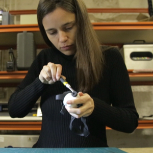
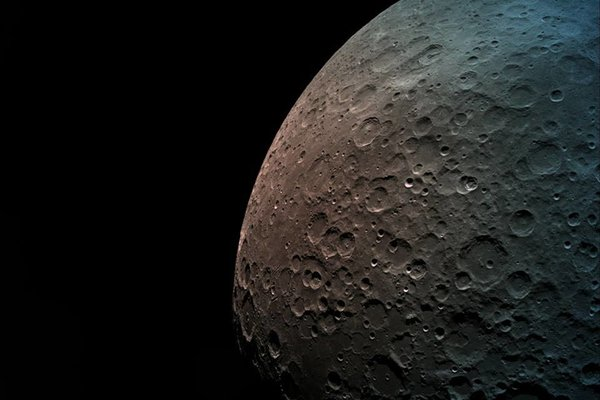
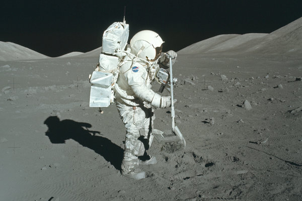
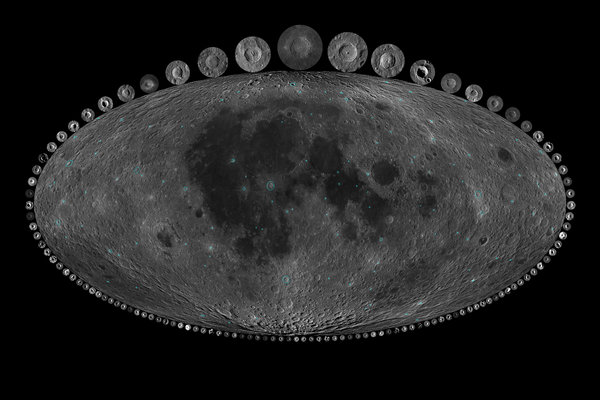
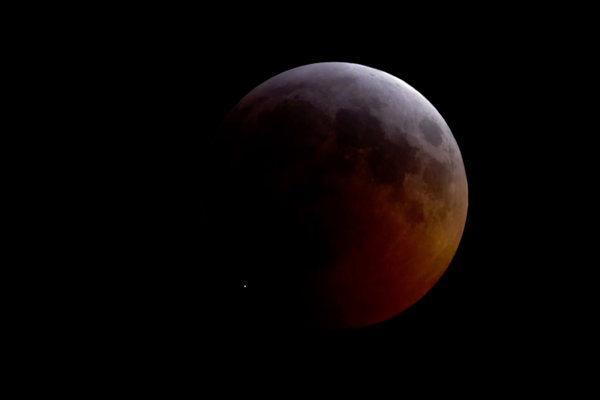

A Violent Splash of Magma That May Have Made the Moon

Advertisement

[

 [                      From Cold War politics  to warming polar ice.   Follow the facts  across continents.            Readers in the U.K.  subscribe for £1 a week.         See my options](https://www.nytimes.com/subscription/ads/wf-296703-intl-bau/%%CLICK_URL_ESC%%%%DEST_URL%%)](https://adclick.g.doubleclick.net/pcs/click%253Fxai%253DAKAOjst5dVLd4EWx0wY0G0ZadqlSKkuAuTAeyKJWNhLhpDkQttcS_bGgu5g-eYsCja-UchFvsbV86LGr8GJzq_imBtIYTbQIUbb3p7W8Vqm-y5TeoWOFgqSzgbH4xjAq0Oxw8XSiAXPGX9UX9MqNghfEDvUufjYAY8NWST3ZN_jcpizM2PG7N_ojBcynf_u52Qlce7VdccVlXBVSsYecA9IQNP-1YMmZXpChUpki8raWkQU5iJGUwCL-7OiEkgDZu1Pd%2526sig%253DCg0ArKJSzAU1WnOGSj1kEAE%2526urlfix%253D1%2526adurl%253Dhttps://ad.doubleclick.net/ddm/trackclk/N296811.6440THENEWYORKTIMESCOMPA/B22284777.243853230%3Bdc_trk_aid%3D440328481%3Bdc_trk_cid%3D114224619%3Bdc_lat%3D%3Bdc_rdid%3D%3Btag_for_child_directed_treatment%3D%3Btfua%3D)

Trilobites

# A Violent Splash of Magma That May Have Made the MoonA Violent Splash of Magma That May Have Made the Moon

The object thought to have formed our lunar companion may have smashed into a baby Earth still covered in a fiery ocean.

Video

An animation simulating an object’s collision with an Earth covered in an ocean of magma, resulting in the formation of the moon.CreditCreditBy 2019 Natsuki Hosono, Hirotaka Nakayama, 4D2U Project, Naoj

By Robin George Andrews

- May 1, 2019

-

    - 
    - 
    - [](https://www.nytimes.com/2019/05/01/science/moon-earth-collision.html?action=click&module=Discovery&pgtype=Homepagemailto:?subject=NYTimes.com%3A%20A%20Violent%20Splash%20of%20Magma%20That%20May%20Have%20Made%20the%20Moon&body=From%20The%20New%20York%20Times%3A%0A%0AA%20Violent%20Splash%20of%20Magma%20That%20May%20Have%20Made%20the%20Moon%0A%0AThe%20object%20thought%20to%20have%20formed%20our%20lunar%20companion%20may%20have%20smashed%20into%20a%20baby%20Earth%20still%20covered%20in%20a%20fiery%20ocean.%0A%0Ahttps%3A%2F%2Fwww.nytimes.com%2F2019%2F05%2F01%2Fscience%2Fmoon-earth-collision.html)

    -
    -

The moon is far more than a largely dead orb. Our planet’s pale satellite is the creator of tides, the [catcher of meteors](https://www.nytimes.com/2019/01/23/science/lunar-eclipse-meteor-moon.html?module=inline) and the only other world in the starry ocean where humanity has set foot. But scientists are still not entirely clear how it was made. Solving this mystery would not only reveal the moon’s origins, it would also help explain our own planet’s evolution.

A study published on Monday in [Nature Geoscience](https://www.nature.com/articles/s41561-019-0354-2) suggests that the moon was forged from the fires of an ocean of magma sloshing over baby Earth’s surface. If correct, this model may solve a longstanding paradox.

Lunar meteorites and samples collected during the Apollo missions show that the moon and Earth have remarkably similar geochemical fingerprints. Scientists suspect that this was likely the result of a [giant impactor the size of Mars](https://www.nhm.ac.uk/discover/how-did-the-moon-form.html), known as Theia, that slammed into a young Earth and sent into orbit a spiral of material that coalesced into the moon.

***[***[[*Sign up to get reminders for space and astronomy events on your calendar*](https://www.nytimes.com/interactive/2019/science/astronomy-space-calendar.html)](https://www.nytimes.com/interactive/2019/science/astronomy-space-calendar.html?module=inline)***.]***

Countless computer simulations show that this is possible, but there’s a problem. Such an impact on a relatively solid Earth would have created a moon made mostly out of Theia, not Earth (at least in simulations resulting in the Earth-moon system we observe today, complete with our 24-hour days).

Advertisement

 

From Yellow Vest populism
to red hat Trumpism.
 Follow the facts across continents.

Readers in the U.K.
subscribe for £1 a week.

See my options

[(L)](https://adclick.g.doubleclick.net/pcs/click%253Fxai%253DAKAOjsuMSrGUlA56Puf9jeZUl1CLzM3eKZnsMUf_wazaj7PCO6wyDt_SQT-8EQoSq3vV3k16-8IT4fAMJfLxA9QCPHq9sMI9lbU1Bm4NDoJzU3lXLYXc2BnGLL9ff2i-bfkcNnqFYjtH2jpC3EFkbJmUR-KtT_644K3QKfaV8vIp8TvvqxxD7Xr8gc1H3vVZ0duBdlfTX5U27oXS97dnyZlij78S-6Rw4_jfrEJtr69mcb7QaS_dHgezDgiInjEFAlv9%2526sig%253DCg0ArKJSzJZUt716g-8EEAE%2526urlfix%253D1%2526adurl%253Dhttps://ad.doubleclick.net/ddm/trackclk/N296811.6440THENEWYORKTIMESCOMPA/B22284777.243853230%3Bdc_trk_aid%3D440328481%3Bdc_trk_cid%3D114224619%3Bdc_lat%3D%3Bdc_rdid%3D%3Btag_for_child_directed_treatment%3D%3Btfua%3D)

Attempting to solve this paradox, some models have opted for more high-energy impacts, according to [Bill Bottke](http://www.boulder.swri.edu/~bottke/Reprints/Reprints.html), a planetary scientist at the Southwest Research Institute in Boulder, Colo., who was not involved with the current study. These models excavate more of Earth’s material for building the moon, but the moon’s orbit or Earth’s spin aren’t accurately reproduced without using convoluted workarounds.

The new research, led by [Natsuki Hosono](https://www.jamstec.go.jp/mat/j/members/hosono/index_e.html) of the Japan Agency for Marine-Earth Science and Technology, adds what may be the recipe’s missing ingredient. During Earth’s earliest days, it was covered by a sheet of molten silicate rock. Dr. Hosono’s team wondered what would have happened if Theia had crashed into Earth at that time, rather than during a later, cooler, more solid phase.

The team used a standard moon-forming simulation but adjusted it to better replicate density changes throughout the objects. With these tweaks, they found that the magma ocean made all the difference.

Immediately after Theia’s impact, Earth’s hot, squishy layer would have violently cascaded into space in huge volumes. This material orbited and coalesced around the young Earth, forming a moon made of about 70 percent terrestrial material, far more than in older, largely solid Earth models, which came out at [around 40 percent](https://www.nature.com/articles/s41561-019-0364-0).

[Robin Canup](https://www.boulder.swri.edu/~robin/), an astrophysicist at Southwest Research Institute, said that this magma-ocean model moves us some way toward explaining the geochemical mirroring of both objects, while also reproducing the way in which Earth and the moon dance around each other. “It’s a very exciting result,” she said. However, it is very different from earlier work, so the key to this model’s validity is to see if future models can replicate it.

## Editors’ Picks

[  ### Over 60: Why Own When You Can Rent?](https://www.nytimes.com/2019/05/03/realestate/over-60-renters.html?fallback=0&recId=1KmOsPey9CvJmnp99JJTEJrmKEE&locked=0&geoContinent=EU&geoRegion=CMD&recAlloc=story&geoCountry=GB&blockId=home-featured&imp_id=170067447)

[  ### She Pulled Her Debut Book When Critics Found It Racist. Now She Plans to Publish.](https://www.nytimes.com/2019/04/29/books/amelie-wen-zhao-blood-heir.html?fallback=0&recId=1KmOsPey9CvJmnp99JJTEJrmKEE&locked=0&geoContinent=EU&geoRegion=CMD&recAlloc=story&geoCountry=GB&blockId=home-featured&imp_id=475797625)

[  ### Years Ago, My Sister Vanished. I See Her Whenever I Want.](https://www.nytimes.com/2019/05/03/style/modern-love-sister-vanished.html?fallback=0&recId=1KmOsPey9CvJmnp99JJTEJrmKEE&locked=0&geoContinent=EU&geoRegion=CMD&recAlloc=story&geoCountry=GB&blockId=home-featured&imp_id=711553679)

 

 [ PAID POST: CARTIER WOMEN'S INITIATIVE](https://adclick.g.doubleclick.net/pcs/click?xai=AKAOjsvZ5g28BHJ0uFfkCP96SNMDxccZxqYKak1IycWfZrJhfkgc77tR1fXJpdgPb2ZGTI6C9reiLGo_7bebFGBkG3RF4lilTJcgWRH5TF3FE46rrdNsLPZCm2iH8ieRT7dnvZGW_aTtjqddZXLig7NTQ-pd811nzMJRb-cJYJEcrsORKr-GKcCTQNr2Ni9ZlhaWs29d0Jq2gF8rICvmoeZaqq0UCN0Ypwwj4mM3hm5IBSSfwVzVYQtXaVzSxFnryQ&sig=Cg0ArKJSzLagEpB3pnt7EAE&urlfix=1&adurl=https://www.nytimes.com/paidpost/cartier/women-making-waves-in-business.html%3Fcpv_ap_id%3D50006640%26sr_source%3Dlift_ed%26tbs_nyt%3D2019-april-nytnative_ed)[ Honoring Women-Led Start-Ups Leading Change](https://adclick.g.doubleclick.net/pcs/click?xai=AKAOjsvZ5g28BHJ0uFfkCP96SNMDxccZxqYKak1IycWfZrJhfkgc77tR1fXJpdgPb2ZGTI6C9reiLGo_7bebFGBkG3RF4lilTJcgWRH5TF3FE46rrdNsLPZCm2iH8ieRT7dnvZGW_aTtjqddZXLig7NTQ-pd811nzMJRb-cJYJEcrsORKr-GKcCTQNr2Ni9ZlhaWs29d0Jq2gF8rICvmoeZaqq0UCN0Ypwwj4mM3hm5IBSSfwVzVYQtXaVzSxFnryQ&sig=Cg0ArKJSzLagEpB3pnt7EAE&urlfix=1&adurl=https://www.nytimes.com/paidpost/cartier/women-making-waves-in-business.html%3Fcpv_ap_id%3D50006640%26sr_source%3Dlift_ed%26tbs_nyt%3D2019-april-nytnative_ed)

[Sara Russell](http://www.nhm.ac.uk/our-science/departments-and-staff/staff-directory/sara-russell.html), a professor of planetary sciences at the Natural History Museum in London, called this origin story compelling, but said scientists still have work to do to explain why the compositions of the moon and Earth are so similar. After all, this model still suggests that a significant percentage of lunar material is not derived from Earth.

Part of the problem is that scientists don’t have sufficient samples from which to obtain model data. Although [the Apollo rocks are an important scientific resource](https://www.nytimes.com/2019/03/13/science/moon-rocks-nasa.html?module=inline), they came only from a small patch near the moon’s Equator. “Imagine if we tried to reconstruct the entire history of the Earth using a tiny handful of samples,” she said. “We couldn’t do it.”

The next step, said Dr. Russell, is clear: We need to return to the moon, dig deep and bring home as many lunar fragments as possible.

## Sign up for Science Times

We’ll bring you stories that capture the wonders of the human body, nature and the cosmos.

Earlier reporting on the moon

[ Photos of the Moon by Israel’s Beresheet Spacecraft April 11, 2019  ](https://www.nytimes.com/interactive/2019/04/11/science/spaceil-beresheet-moon-photos.html?action=click&module=RelatedLinks&pgtype=Article)

[ Sealed Cache of Moon Rocks to Be Opened by NASA March 13, 2019  ](https://www.nytimes.com/2019/03/13/science/moon-rocks-nasa.html?action=click&module=RelatedLinks&pgtype=Article)

[ What Happened to Earth’s Ancient Craters? Scientists Seek Clues on the Moon’s Pocked Surface Jan. 17, 2019  ](https://www.nytimes.com/2019/01/17/science/craters-meteors-moon.html?action=click&module=RelatedLinks&pgtype=Article)

[ During the Lunar Eclipse, Something Slammed Into the Moon Jan. 23, 2019  ](https://www.nytimes.com/2019/01/23/science/lunar-eclipse-meteor-moon.html?action=click&module=RelatedLinks&pgtype=Article)

[ ##  Sync your calendar with the solar system](https://www.nytimes.com/interactive/2019/science/astronomy-space-calendar.html)

Never miss an eclipse, a meteor shower, a rocket launch or any other astronomical and space event that's out of this world.

 May 5  [The Eta Aquariids meteor shower will peak](https://www.nytimes.com/interactive/2019/science/astronomy-space-calendar.html?action=click&module=space-calendar-article-promo#MW9uMDJqbHJxOWc5MzZjbWtqcmVrdHBranEgbnl0aW1lcy5jb21fODlhaTRpanBiNzMzZ3QyOHJnMjFkMmMyZWtAZw)

 May 29  [The 100th anniversary of the 1919 solar eclipse](https://www.nytimes.com/interactive/2019/science/astronomy-space-calendar.html?action=click&module=space-calendar-article-promo#NGxhcTM4OWlwN3IxNHR2am5ocDN1OXZqMGQgbnl0aW1lcy5jb21fODlhaTRpanBiNzMzZ3QyOHJnMjFkMmMyZWtAZw)

 June 21  [Summer solstice](https://www.nytimes.com/interactive/2019/science/astronomy-space-calendar.html?action=click&module=space-calendar-article-promo#NWhldXAxMG5scWJsNzJrNmEyYmMyc3RnbjUgbnl0aW1lcy5jb21fODlhaTRpanBiNzMzZ3QyOHJnMjFkMmMyZWtAZw)

Add the calendar on [(L)](https://is.gd/8BKar3)
or
.

- 
- 
- [](https://www.nytimes.com/2019/05/01/science/moon-earth-collision.html?action=click&module=Discovery&pgtype=Homepagemailto:?subject=NYTimes.com%3A%20A%20Violent%20Splash%20of%20Magma%20That%20May%20Have%20Made%20the%20Moon&body=From%20The%20New%20York%20Times%3A%0A%0AA%20Violent%20Splash%20of%20Magma%20That%20May%20Have%20Made%20the%20Moon%0A%0AThe%20object%20thought%20to%20have%20formed%20our%20lunar%20companion%20may%20have%20smashed%20into%20a%20baby%20Earth%20still%20covered%20in%20a%20fiery%20ocean.%0A%0Ahttps%3A%2F%2Fwww.nytimes.com%2F2019%2F05%2F01%2Fscience%2Fmoon-earth-collision.html)

-

Advertisement