A cartoon intro to DNS over HTTPS – Mozilla Hacks - the Web developer blog

#   [    Hacks](https://hacks.mozilla.org/)

 **

 [**Hacks on YouTube](http://www.youtube.com/user/mozhacks)  [**@mozhacks on Twitter](https://twitter.com/mozhacks)  [**Hacks RSS Feed](https://hacks.mozilla.org/feed/)  [Download Firefox](https://www.mozilla.org/firefox/download/thanks/?utm_source=hacks.mozilla.org&utm_medium=referral&utm_campaign=header-download-button&utm_content=header-download-button)

# A cartoon intro to DNS over HTTPS

###    By [Lin Clark](https://twitter.com/linclark)

Posted on  May 31, 2018   in [Code Cartoons](https://hacks.mozilla.org/category/code-cartoons/), [Featured Article](https://hacks.mozilla.org/category/featured/), [Firefox](https://hacks.mozilla.org/category/firefox/), [Mozilla](https://hacks.mozilla.org/category/mozilla/), and [Security](https://hacks.mozilla.org/category/security/)

 [Share This](https://hacks.mozilla.org/2018/05/a-cartoon-intro-to-dns-over-https/#share-options)

Threats to users’ privacy and security are growing. At Mozilla, we closely track these threats. We believe we have a duty to do everything we can to protect Firefox users and their data.

We’re taking on the companies and organizations that want to secretly collect and sell user data. This is why we added [tracking protection](https://blog.mozilla.org/firefox/tracking-protection-always-on/) and created the [Facebook container extension](https://blog.mozilla.org/firefox/facebook-container-extension/). And you’ll be seeing us do more things to protect our users over the coming months.

[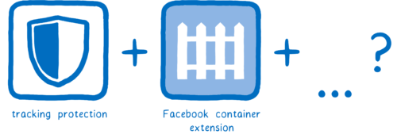](https://2r4s9p1yi1fa2jd7j43zph8r-wpengine.netdna-ssl.com/files/2018/05/00_01.png)

Two more protections we’re adding to that list are:

- DNS over HTTPS, a new IETF standards effort that we’ve championed
- Trusted Recursive Resolver, a new secure way to resolve DNS that we’ve partnered with [Cloudflare](https://www.cloudflare.com/) to provide

With these two initiatives, we’re closing data leaks that have been part of the domain name system since it was created 35 years ago. And we’d like your help in testing them. So let’s look at how DNS over HTTPS and Trusted Recursive Resolver protect our users.

But first, let’s look at how web pages move around the Internet.

*If you already know how DNS and HTTPS work, you can skip to [how DNS over HTTPS helps](https://hacks.mozilla.org/2018/05/a-cartoon-intro-to-dns-over-https/#trr-and-doh).*

### A brief HTTP crash course

When people explain how a browser downloads a web page, they usually explain it this way:

1. Your browser makes a GET request to a server.
2. The server sends a response, which is a file containing HTML.

[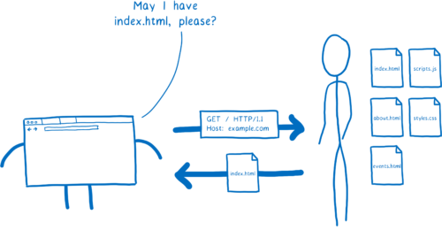](https://2r4s9p1yi1fa2jd7j43zph8r-wpengine.netdna-ssl.com/files/2018/05/01_01.png)

This system is called HTTP.

But this diagram is a little oversimplified. Your browser doesn’t talk directly to the server. That’s because they probably aren’t close to each other.

Instead, the server could be thousands of miles away. And there’s likely no direct link between your computer and the server.

**[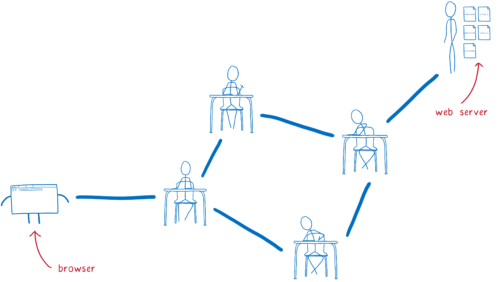](https://2r4s9p1yi1fa2jd7j43zph8r-wpengine.netdna-ssl.com/files/2018/05/01_02.png)**

So this request needs to get from the browser to that server, and it will go through multiple hands before it gets there. And the same is true for the response coming back from the server.

I think of this like kids passing notes to each other in class. On the outside, the note will say who it’s supposed to go to. The kid who wrote the note will pass it to their neighbor. Then that next kid passes it to one of their neighbors — probably not the eventual recipient, but someone who’s in that direction.

The problem with this is that anyone along the path can open up the note and read it. And there’s no way to know in advance which path the note is going to take, so there’s no telling what kind of people will have access to it.

It could end up in the hands of people who do harmful things…
Like sharing the contents of the note with everyone.

Or changing the response.

To fix these issues, a new, secure version of HTTP was created. This is called HTTPS. With HTTPS, it’s kind of like each message has a lock on it.

Both the browser and the server know the combination to that lock, but no one in between does.

With this, even if the messages go through multiple routers in between, only you and the web site will actually be able to read the contents.

This solves a lot of the security issues. But there are still some messages going between your browser and the server that aren’t encrypted. This means people along the way can still pry into what you’re doing.

One place where data is still exposed is in setting up the connection to the server. When you send your initial message to the server, you send the server name as well (in a field called “Server Name Indication”). This lets server operators run multiple sites on the same machine while still knowing who you are trying to talk to. This initial request is part of setting up encryption, but the initial request itself isn’t encrypted.

The other place where data is exposed is in DNS. But what is DNS?

### DNS: the Domain Name System

In the passing notes metaphor above, I said that the name of the recipient had to be on the outside of the note. This is true for HTTP requests too… they need to say who they are going to.

But you can’t use a name for them. None of the routers would know who you were talking about. Instead, you have to use an IP address. That’s how the routers in between know which server you want to send your request to.

[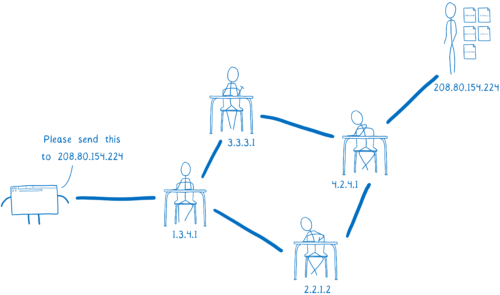](https://2r4s9p1yi1fa2jd7j43zph8r-wpengine.netdna-ssl.com/files/2018/05/02_01.png)

This causes a problem. You don’t want users to have to remember your site’s IP address. Instead, you want to be able to give your site a catchy name… something that users can remember.

This is why we have the domain name system (DNS). Your browser uses DNS to convert the site name to an IP address. This process — converting the domain name to an IP address — is called domain name resolution.

How does the browser know how to do this?

One option would be to have a big list, like a phone book in the browser. But as new web sites came online, or as sites moved to new servers, it would be hard to keep that list up-to-date.

So instead of having one list which keeps track of all of the domain names, there are lots of smaller lists that are linked to each other. This allows them to be managed independently.

[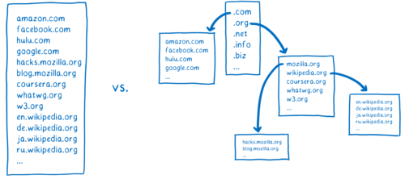](https://2r4s9p1yi1fa2jd7j43zph8r-wpengine.netdna-ssl.com/files/2018/05/02_03.png)

In order to get the IP address that corresponds to a domain name, you have to find the list that contains that domain name. Doing this is kind of like a treasure hunt.

What would this treasure hunt look like for a site like the English version of wikipedia, `en.wikipedia.org`?

We can split this domain into parts.

With these parts, we can hunt for the list that contains the IP address for the site. We need some help in our quest, though. The tool that will go on this hunt for us and find the IP address is called a resolver.

First, the resolver talks to a server called the Root DNS. It knows of a few different Root DNS servers, so it sends the request to one of them. The resolver asks the Root DNS where it can find more info about addresses in the `.org` top-level domain.

The Root DNS will give the resolver an address for a server that knows about `.org` addresses.

[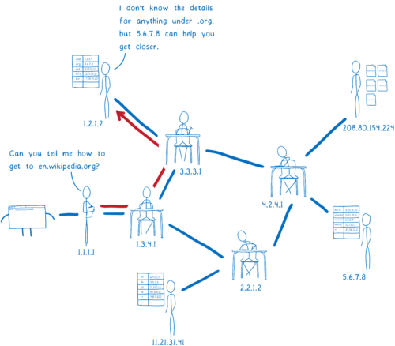](https://2r4s9p1yi1fa2jd7j43zph8r-wpengine.netdna-ssl.com/files/2018/05/02_05.png)

This next server is called a top-level domain (TLD) name server. The TLD server knows about all of the second-level domains that end with `.org`.

It doesn’t know anything about the subdomains under `wikipedia.org`, though, so it doesn’t know the IP address for `en.wikipedia.org`.

The TLD name server will tell the resolver to ask Wikipedia’s name server.

[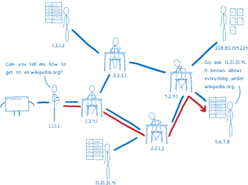](https://2r4s9p1yi1fa2jd7j43zph8r-wpengine.netdna-ssl.com/files/2018/05/02_06.png)

The resolver is almost done now. Wikipedia’s name server is what’s called the authoritative server. It knows about all of the domains under `wikipedia.org`. So this server knows about `en.wikipedia.org`, and other subdomains like the German version, `de.wikipedia.org`. The authoritative server tells the resolver which IP address has the HTML files for the site.

[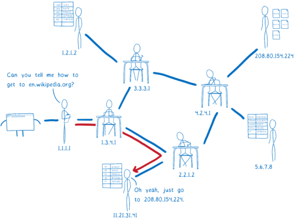](https://2r4s9p1yi1fa2jd7j43zph8r-wpengine.netdna-ssl.com/files/2018/05/02_07.png)

The resolver will return the IP address for `en.wikipedia.org` to the operating system.

This process is called recursive resolution, because you have to go back and forth asking different servers what’s basically the same question.

I said we need a resolver to help us in our quest. But how does the browser find this resolver? In general, it asks the computer’s operating system to set it up with a resolver that can help.

[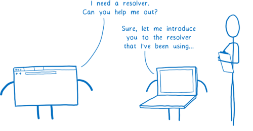](https://2r4s9p1yi1fa2jd7j43zph8r-wpengine.netdna-ssl.com/files/2018/05/02_08.png)

How does the operating system know which resolver to use? There are two possible ways.

You *can* configure your computer to use a resolver you trust. But very few people do this.

Instead, most people just use the default. And by default, the OS will just use whatever resolver the network told it to. When the computer connects to the network and gets its IP address, the network recommends a resolver to use.

[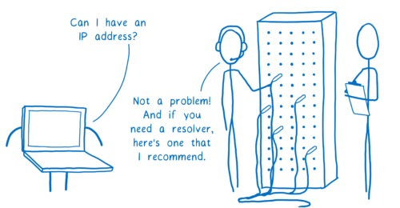](https://2r4s9p1yi1fa2jd7j43zph8r-wpengine.netdna-ssl.com/files/2018/05/02_09.png)

This means that the resolver that you’re using can change multiple times per day. If you head to the coffee shop for an afternoon work session, you’re probably using a different resolver than you were in the morning. And this is true even if you have configured your own resolver, because there’s no security in the DNS protocol.

### How can DNS be exploited?

So how can this system make users vulnerable?

Usually a resolver will tell each DNS server what domain you are looking for. This request sometimes includes your full IP address. Or if not your full IP address, increasingly often the request includes most of your IP address, which can easily be combined with other information to figure out your identity.

[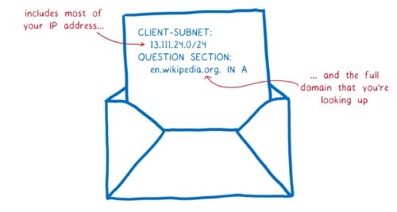](https://2r4s9p1yi1fa2jd7j43zph8r-wpengine.netdna-ssl.com/files/2018/05/03_01.png)

This means that every server that you ask to help with domain name resolution sees what site you’re looking for. But more than that, it also means that anyone on the path to those servers sees your requests, too.

There are a few ways that this system puts users’ data at risk. The two major risks are tracking and spoofing.

#### Tracking

Like I said above, it’s easy to take the full or partial IP address info and figure out who’s asking for that web site. This means that the DNS server and anyone along the path to that DNS server — called on-path routers — can create a profile of you. They can create a record of all of the web sites that they’ve seen you look up.

And that data is valuable. Many people and companies will pay lots of money to see what you are browsing for.

Even if you didn’t have to worry about the possibly nefarious DNS servers or on-path routers, you still risk having your data harvested and sold. That’s because the resolver itself — the one that the network gives to you — could be untrustworthy.

Even if you trust your network’s recommended resolver, you’re probably only using that resolver when you’re at home. Like I mentioned before, whenever you go to a coffee shop or hotel or use any other network, you’re probably using a different resolver. And who knows what its data collection policies are?

Beyond having your data collected and then sold without your knowledge or consent, there are even more dangerous ways the system can be exploited.

#### Spoofing

With spoofing, someone on the path between the DNS server and you changes the response. Instead of telling you the real IP address, a spoofer will give you the wrong IP address for a site. This way, they can block you from visiting the real site or send you to a scam one.

[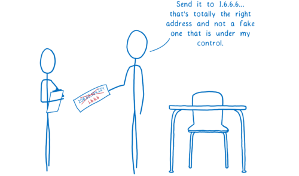](https://2r4s9p1yi1fa2jd7j43zph8r-wpengine.netdna-ssl.com/files/2018/05/03_03.png)

Again, this is a case where the resolver itself might act nefariously.

For example, let’s say you’re shopping for something at Megastore. You want to do a price check to see if you can get it cheaper at a competing online store, big-box.com.

But if you’re on Megastore WiFi, you’re probably using their resolver. That resolver could hijack the request to big-box.com and lie to you, saying that the site is unavailable.

### How can we fix this with Trusted Recursive Resolver (TRR) and DNS over HTTPS (DoH)?

At Mozilla, we feel strongly that we have a responsibility to protect our users and their data. We’ve been working on fixing these vulnerabilities.

We are introducing two new features to fix this — Trusted Recursive Resolver (TRR) and DNS over HTTPS (DoH). Because really, there are three threats here:

1. You could end up using an untrustworthy resolver that tracks your requests, or tampers with responses from DNS servers.

2. On-path routers can track or tamper in the same way.
3. DNS servers can track your DNS requests.

[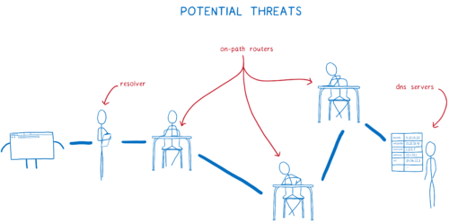](https://2r4s9p1yi1fa2jd7j43zph8r-wpengine.netdna-ssl.com/files/2018/05/03_04.png)

So how do we fix these?
1. Avoid untrustworthy resolvers by using Trusted Recursive Resolver.
2. Protect against on-path eavesdropping and tampering using DNS over HTTPS.
3. Transmit as little data as possible to protect users from deanonymization.

#### Avoid untrustworthy resolvers by using Trusted Recursive Resolver

Networks can get away with providing untrustworthy resolvers that steal your data or spoof DNS because very few users know the risks or how to protect themselves.

Even for users who do know the risks, it’s hard for an individual user to negotiate with their ISP or other entity to ensure that their DNS data is handled responsibly.

However, we’ve spent time studying these risks… and we have negotiating power. We worked hard to find a company to work with us to protect users’ DNS data. And we found one: [Cloudflare](https://www.cloudflare.com/).

Cloudflare is providing a recursive resolution service with a pro-user privacy policy. They have committed to throwing away all personally identifiable data after 24 hours, and to never pass that data along to third-parties. And there will be regular audits to ensure that data is being cleared as expected.

With this, we have a resolver that we can trust to protect users’ privacy. This means Firefox can ignore the resolver that the network provides and just go straight to Cloudflare. With this trusted resolver in place, we don’t have to worry about rogue resolvers selling our users’ data or tricking our users with spoofed DNS.

Why are we picking one resolver? Cloudflare is as excited as we are about building a privacy-first DNS service. They worked with us to build a DoH resolution service that would serve our users well in a transparent way. They’ve been very open to adding user protections to the service, so we’re happy to be able to collaborate with them.

But this doesn’t mean you have to use Cloudflare. Users can configure Firefox to use whichever DoH-supporting recursive resolver they want. As more offerings crop up, we plan to make it easy to discover and switch to them.

#### Protect against on-path eavesdropping and tampering using DNS over HTTPS

The resolver isn’t the only threat, though. On-path routers can track and spoof DNS because they can see the contents of the DNS requests and responses. But the Internet already has technology for ensuring that on-path routers can’t eavesdrop like this. It’s the encryption that I talked about before.

By using HTTPS to exchange the DNS packets, we ensure that no one can spy on the DNS requests that our users are making.

#### Transmit as little data as possible to protect users from deanonymization

In addition to providing a trusted resolver which communicates using the DoH protocol, Cloudflare is working with us to make this even more secure.

Normally, a resolver would send the whole domain name to each server—to the Root DNS, the TLD name server, the second-level name server, etc. But Cloudflare will be doing something different. It will only send the part that is relevant to the DNS server it’s talking to at the moment. This is called [QNAME minimization](https://datatracker.ietf.org/doc/rfc7816/?include_text=1).

[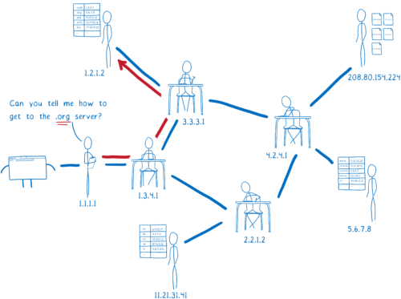](https://2r4s9p1yi1fa2jd7j43zph8r-wpengine.netdna-ssl.com/files/2018/05/03_05.png)

The resolver will also often include the first 24 bits of your IP address in the request. This helps the DNS server know where you are and pick a CDN closer to you. But this information can be used by DNS servers to link different requests together.

Instead of doing this, Cloudflare will make the request from one of their own IP addresses near the user. This provides geolocation without tying it to a particular user. In addition to this, we’re looking into how we can enable even better, very fine-grained load balancing in a privacy-sensitive way.

Doing this — removing the irrelevant parts of the domain name and not including your IP address — means that DNS servers have much less data that they can collect about you.

[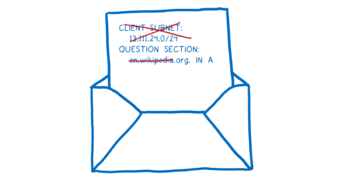](https://2r4s9p1yi1fa2jd7j43zph8r-wpengine.netdna-ssl.com/files/2018/05/03_06.png)

### What isn’t fixed by TRR with DoH?

With these fixes, we’ve reduced the number of people who can see what sites you’re visiting. But this doesn’t eliminate data leaks entirely.

After you do the DNS lookup to find the IP address, you still need to connect to the web server at that address. To do this, you send an initial request. This request includes a server name indication, which says which site on the server you want to connect to. And this request is unencrypted.

That means that your ISP can still figure out which sites you’re visiting, because it’s right there in the server name indication. Plus, the routers that pass that initial request from your browser to the web server can see that info too.

However, once you’ve made that connection to the web server, then everything is encrypted. And the neat thing is that this encrypted connection can be used for any site that is hosted on that server, not just the one that you initially asked for.

This is sometimes called HTTP/2 connection coalescing, or simply connection reuse. When you open a connection to a server that supports it, that server will tell you what other sites it hosts. Then you can visit those other sites using that existing encrypted connection.

Why does this help? You don’t need to start up a new connection to visit these other sites. This means you don’t need to send that unencrypted initial request with its server name indication saying which site you’re visiting. Which means you can visit any of the other sites on the same server without revealing what sites you’re looking at to your ISP and on-path routers.

With the rise of CDNs, more and more independent sites are being served by a single server. And since you can have multiple coalesced connections open, you can be connected to multiple shared servers or CDNs at once, visiting all of the sites across the different servers without leaking data. This means this will be more and more effective as a privacy shield.

### What is the status?

You can enable DNS over HTTPS in Firefox today, and we [encourage you to](https://blog.nightly.mozilla.org/2018/06/01/improving-dns-privacy-in-firefox/).

We’d like to turn this on as the default for all of our users. We believe that every one of our users deserves this privacy and security, no matter if they understand DNS leaks or not.

But it’s a big change and we need to test it out first. That’s why we’re conducting a study. We’re asking half of our [Firefox Nightly](https://www.mozilla.org/firefox/channel/desktop/#nightly) users to help us collect data on performance.

We’ll use the default resolver, as we do now, but we’ll also send the request to Cloudflare’s DoH resolver. Then we’ll compare the two to make sure that everything is working as we expect.

For participants in the study, the Cloudflare DNS response won’t be used yet. We’re simply checking that everything works, and then throwing away the Cloudflare response.

[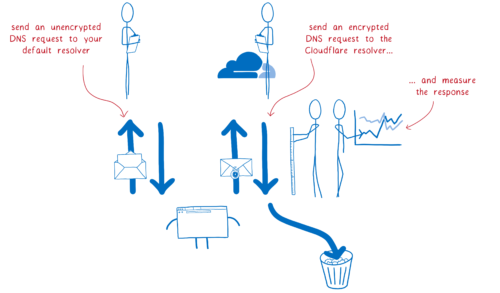](https://2r4s9p1yi1fa2jd7j43zph8r-wpengine.netdna-ssl.com/files/2018/05/05_01.png)

We are thankful to have the support of our Nightly users — the people who help us test Firefox every day — and we hope that you will help us test this, too.

## About [Lin Clark](https://twitter.com/linclark)

Lin works in Advanced Development at Mozilla, with a focus on Rust and WebAssembly.

- **https://twitter.com/linclark
- **[@linclark](http://twitter.com/linclark)

[More articles by Lin Clark…](https://hacks.mozilla.org/author/lclarkmozilla-com/)

## Learn the best of web development

Sign up for the Mozilla Developer Newsletter:

 E-mail

  I'm okay with Mozilla handling my info as explained in this [Privacy Policy](https://www.mozilla.org/privacy/).

* * *

### 62 comments

1.   **  Gabriel Gonzalez  **
>
> Wow, that’s great thanks for the explanation Lin!
>

 [May 31st, 2018 at 08:26](https://hacks.mozilla.org/2018/05/a-cartoon-intro-to-dns-over-https/#comment-23372)

2.   **  Valentin C.  **
>

> > After you do the DNS lookup to find the IP address, you still need to connect to the web server at that address. To do this, you send an initial request. This request includes a server name indication, which says which site on the server you want to connect to. And this request is unencrypted.

> Aside from DNS, when you use HTTPS there is still an initial unencrypted request ? I didn’t know that…

>

 [May 31st, 2018 at 08:47](https://hacks.mozilla.org/2018/05/a-cartoon-intro-to-dns-over-https/#comment-23374)

    1.   **  sapphirepaw  **
>

> To be technical, the HTTP request is protected, but the setup of the encryption (TLS handshake) is, indeed, not 100% protected.

> There was a problem with virtual hosting: the HTTP host name isn’t available until the TLS handshake completes, but the TLS handshake needs to provide the certificate for that specific host name. Nowadays, the browser provides the host name twice, and the first time is in the clear, to allow the server to choose the correct certificate. This is called Server Name Indication, or SNI.

> Before SNI, we had to use one IP per HTTPS host, and send a certificate based on IP address. As IPv4 space got scarce, and SNI support became widespread, the IP-based approach became uncommon.

>

 [May 31st, 2018 at 11:42](https://hacks.mozilla.org/2018/05/a-cartoon-intro-to-dns-over-https/#comment-23392)

        1.   **  Jamal  **
>

> Yes, without SNI people had to purchase additional IP addresses for each site they wanted to install a SSL certificate on on a single server/VPS.

>

 [June 4th, 2018 at 11:37](https://hacks.mozilla.org/2018/05/a-cartoon-intro-to-dns-over-https/#comment-23464)

3.   **  Michaël Polla  **
>
> Thank you for these well written and illustrated explanations, Lin!

> I’m wanting to help test DNS over HTTPS with Firefox Nighty (which I never used before).

> You say : “We’re asking half of our Firefox Nightly users to help us collect data” : is there an opt-in system for that, or are the users chosen randomly ?

>

 [May 31st, 2018 at 08:59](https://hacks.mozilla.org/2018/05/a-cartoon-intro-to-dns-over-https/#comment-23375)

    1.   ** •   Lin Clark  AUTHOR**
>
> This will be covered in more detail in a post tomorrow, but for now:
> Type about:config in location bar
> Search for network.trr
> Change network.trr.mode to 2 to enable DoH.

> Set network.trr.uri to your DoH server. Cloudflare’s is > [https://mozilla.cloudflare-dns.com/dns-query

> The DNS tab on the about:networking page indicates which names were resolved using the Trusted Recursive Resolver via DoH.

>

 [May 31st, 2018 at 10:01](https://hacks.mozilla.org/2018/05/a-cartoon-intro-to-dns-over-https/#comment-23383)

        1.   **  anonymous  **
>

> Can you explain why network.trr.uri uses a domain name? I’d expect it to be an IP.

>

 [June 1st, 2018 at 11:35](https://hacks.mozilla.org/2018/05/a-cartoon-intro-to-dns-over-https/#comment-23432)

        2.   **  Gustaff Weldon  **
>

> Perhaps I’m missing sth, but how is Firefox planning to avoid getting a forged IP address of the TRR if its name needs to be DNS resolved first from eg. “mozilla.cloudflare-dns.com” to an IP address (using OS resolver probably)?

> Are you going to use a certificate/key of some sort, to verify the resolver you are talking to, is truly the one you wanted to connect with? How is this going to be handled?

>

 [June 4th, 2018 at 09:23](https://hacks.mozilla.org/2018/05/a-cartoon-intro-to-dns-over-https/#comment-23461)

4.   **  Barry  **
>
> > You can enable DNS over HTTPS in Firefox today, and we encourage you to.

> That’s awesome. Can you confirm _where_ this is done (in FF 60.0.1) – is it via about:config?

>

 [May 31st, 2018 at 09:02](https://hacks.mozilla.org/2018/05/a-cartoon-intro-to-dns-over-https/#comment-23376)

    1.   ** •   Lin Clark  AUTHOR**
>

> You’ll want to use 62 for this feature, which is currently Nightly and will be release in early September.

>

 [May 31st, 2018 at 10:09](https://hacks.mozilla.org/2018/05/a-cartoon-intro-to-dns-over-https/#comment-23385)

    2.   **  ExE Boss  **
>

> The about:config settings to enable this are in Firefox since version 60, gHacks has an article explaining the settings: > [https://www.ghacks.net/2018/04/02/configure-dns-over-https-in-firefox/

>

 [May 31st, 2018 at 19:28](https://hacks.mozilla.org/2018/05/a-cartoon-intro-to-dns-over-https/#comment-23409)

        1.   ** •   Lin Clark  AUTHOR**
>

> Earlier versions were not as stable. We recommend using Firefox 62 for this feature.

>

 [June 1st, 2018 at 07:22](https://hacks.mozilla.org/2018/05/a-cartoon-intro-to-dns-over-https/#comment-23425)

5.   **  ᏒᏊᏀᏋᏒ ᏕξᏐ  **
>
> Awesome initiative and very easy to understand :)
>

 [May 31st, 2018 at 09:26](https://hacks.mozilla.org/2018/05/a-cartoon-intro-to-dns-over-https/#comment-23377)

6.   **  Deepak sharma  **
>

> Superb Explanation. Just WoW… Thank you for making understand how internet works in super simple way.

>

 [May 31st, 2018 at 09:35](https://hacks.mozilla.org/2018/05/a-cartoon-intro-to-dns-over-https/#comment-23378)

7.   **  Wellington Torrejais da Silva  **
>
> Nice! Waiting for this by default on all browsers. Thanks.
>

 [May 31st, 2018 at 09:44](https://hacks.mozilla.org/2018/05/a-cartoon-intro-to-dns-over-https/#comment-23379)

8.   **  axew3  **
>
> amazing way to explain things, clear and short. Great!
>

 [May 31st, 2018 at 09:45](https://hacks.mozilla.org/2018/05/a-cartoon-intro-to-dns-over-https/#comment-23380)

9.   **  Reuben  **
>
> Hey Lin Clark,

> Really enjoyed how you laid all this information out in an easily digestible way. Those illustrations are extremely helpful as well.

> Great article!
>

 [May 31st, 2018 at 09:51](https://hacks.mozilla.org/2018/05/a-cartoon-intro-to-dns-over-https/#comment-23381)

10.   **  Zach  **
>

> This was an impressive article! I was even able to send it to some of my non-computer-savvy friends and they understood it perfectly fine!

>

 [May 31st, 2018 at 09:59](https://hacks.mozilla.org/2018/05/a-cartoon-intro-to-dns-over-https/#comment-23382)

11.   **  Don Almeida  **
>
> Awesome illustrations… will use it with my CS students!!!
>

 [May 31st, 2018 at 10:18](https://hacks.mozilla.org/2018/05/a-cartoon-intro-to-dns-over-https/#comment-23386)

12.   **  Susie H.  **
>
> Awesome explanation. Easy to understand and entertaining! Thank you.
>

 [May 31st, 2018 at 10:21](https://hacks.mozilla.org/2018/05/a-cartoon-intro-to-dns-over-https/#comment-23387)

13.   **  Lee Herman  **
>
> How do I turn on DNS over HTTPS in Firefox Developer Edition?
>

 [May 31st, 2018 at 11:00](https://hacks.mozilla.org/2018/05/a-cartoon-intro-to-dns-over-https/#comment-23388)

    1.   ** •   Lin Clark  AUTHOR**
>

> It is in Firefox 62, which is the current Nightly. It will be in Dev Edition in late June/early July. There’s a blog post coming out tomorrow with details on how to enable.

>

 [May 31st, 2018 at 12:51](https://hacks.mozilla.org/2018/05/a-cartoon-intro-to-dns-over-https/#comment-23398)

14.   **  Sósthenes Neto  **
>
> Wonderful post! Great illustrations and so ease to understand.
>

 [May 31st, 2018 at 11:03](https://hacks.mozilla.org/2018/05/a-cartoon-intro-to-dns-over-https/#comment-23389)

15.   **  Kyle  **
>

> How does this help with tracking when TLS SNI means the server’s hostname is sent as part of the TLS handshake?

>

 [May 31st, 2018 at 12:32](https://hacks.mozilla.org/2018/05/a-cartoon-intro-to-dns-over-https/#comment-23395)

    1.   **  R  **
>

> This was directly addressed in the section titled “What isn’t fixed by TRR with DoH?”

> Partial answer: HTTP/2 connection coalescing helps a lot, to the maximum degree it’s possible to hide who you’re talking to when the IP address is still visible and you’re not using Tor.

> In fact, in addition to avoiding passive attacks (tracking), coalescing sounds like the logical hot new replacement for bypassing active attacks (censorship), ever since Amazon and Google both suddenly made ‘domain fronting’ impossible.

>

 [June 1st, 2018 at 00:51](https://hacks.mozilla.org/2018/05/a-cartoon-intro-to-dns-over-https/#comment-23415)

16.   **  Hussain  **
>
> @Lin, excellent and a must read piece!
>

 [May 31st, 2018 at 12:37](https://hacks.mozilla.org/2018/05/a-cartoon-intro-to-dns-over-https/#comment-23396)

17.   **  Brett Glass  **
>

> So, Mozilla intends to hack users’ DNS, redirecting their queries away from their ISPs (which are trustworthy and with which they have a business relationship) to an untrustworthy VPN vendor – Cloudflare. Those users are not Cloudflare’s customers, and so the only way Cloudflare can monetize this service is to spy on users and sell their personal information. In short, Mozilla is supporting, aiding, and abetting privacy invasion – probably in exchange for money from Cloudflare. Not only unethical but probably actionable by the FTC.

>

 [May 31st, 2018 at 12:43](https://hacks.mozilla.org/2018/05/a-cartoon-intro-to-dns-over-https/#comment-23397)

    1.   ** •   Lin Clark  AUTHOR**
>

> This is an optional feature. Users can choose whether they want to use TRR, and they can also choose their TRR provider.

>

 [May 31st, 2018 at 12:59](https://hacks.mozilla.org/2018/05/a-cartoon-intro-to-dns-over-https/#comment-23399)

        1.   **  Sara Dickinson  **
>

> But you do state clearly that “We’d like to turn this on as the default for all of our users. “. At that point I presume the default ‘TRR’ would be Cloudflare? If so, then in practice the vast majority of your users (non-technical ones who won’t read or necessarily understand the details of this change) will have their DNS queries from Firefox sent to Cloudflare – correct?

>

 [June 1st, 2018 at 02:34](https://hacks.mozilla.org/2018/05/a-cartoon-intro-to-dns-over-https/#comment-23419)

            1.   ** •   Lin Clark  AUTHOR**
>

> We are in early days of testing TRR and DoH and getting feedback from users, so it’s not clear whether this will be turned on by default, or what the roll-out would look like if we do. I do feel confident that we can find a way to communicate the choices to non-technical users though.

>

 [June 1st, 2018 at 08:26](https://hacks.mozilla.org/2018/05/a-cartoon-intro-to-dns-over-https/#comment-23427)

    2.   **  qgustavor  **
>

> I believe more on Cloudflare than public wifi providers. A better option is letting the user choosing what trusted resolver they want to use: don’t trust Cloudflare? Fine, choose other resolver.

> Or better (if it’s possible, I don’t know) run your own resolver proxying your trusted ISP DNS then when you’re not in your network you just connect to your own resolver avoiding the unsafe public wifi resolver.

> By the way, a special case: I believe more Cloudflare than my ISP because as they hijack DNS requests in order to show ads and other unwanted content.

>

 [May 31st, 2018 at 13:43](https://hacks.mozilla.org/2018/05/a-cartoon-intro-to-dns-over-https/#comment-23402)

        1.   ** •   Lin Clark  AUTHOR**
>

> A better option is letting the user choosing what trusted resolver they want to use: don’t trust Cloudflare? Fine, choose other resolver.

Yes, agreed, and that is why we are allowing users to choose their own resolver using network.trr.uri.

 [June 1st, 2018 at 07:19](https://hacks.mozilla.org/2018/05/a-cartoon-intro-to-dns-over-https/#comment-23424)

18.   **  Mohamed Hussain  **
>
> Thanks Lin…I learned how dns works
> and how the web page fetched from server
> and what are threats involved and how to overcome

> And what is resolcer and how cloudflare’s 1.1.1.1 resolver comes into the play

>

 [May 31st, 2018 at 13:28](https://hacks.mozilla.org/2018/05/a-cartoon-intro-to-dns-over-https/#comment-23400)

19.   **  Adam Logghe  **
>
> When will we see this on Firefox Mobile Beta (61.0b9) where it’s most needed?

> Most of us have much better control over our desktop and laptop DNS when needed or wanted but mobile operating systems are much more user hostile that way.

>

 [May 31st, 2018 at 13:42](https://hacks.mozilla.org/2018/05/a-cartoon-intro-to-dns-over-https/#comment-23401)

20.   **  RobertasR  **
>
> Explanation is super simple and detailed!

> This sounds all nice and pretty, but how would this work where you would have your local DNS servers with private TLD responsible for internal systems and internal IP addresses. How would DoH work then? How would the separation of local and public DNS queries be done? Can Firefox work in such split mode, or is it either on or off?

> I am willing to test this at work, just don’t want to end up not being able to reach local resources.

> Thanks for info!
>

 [May 31st, 2018 at 15:19](https://hacks.mozilla.org/2018/05/a-cartoon-intro-to-dns-over-https/#comment-23403)

21.   **  Joe G  **
>

> >We’ll use the default resolver, as we do now, but we’ll also send the request to Cloudflare’s DoH resolver. Then we’ll compare the two to make sure that everything is working as we expect.

> Concerns I have with this:

> 1) Leaking all DNS requests made to a 3rd party by default is a philosophical privacy concern

> 2) When/if Cloudlare’s HTTPS DNS becomes the “primary” DNS provider firefox uses, it will break split-horizon DNS use cases, such as an organization or school having sites that only resolve internally. Potentially will also the login functionality for hotel/airport wifi.

>

 [May 31st, 2018 at 15:40](https://hacks.mozilla.org/2018/05/a-cartoon-intro-to-dns-over-https/#comment-23406)

22.   **  Wajdi Dhifi  **
>
> Thank you for this interesting article that explains some new concepts to me.
> But I still have 2 questions :
> 1- Is DNS over HTTPS the same thing as DNS over TLS ?

> 2- Since DoH is relatively a new technology (please correct me if I’m wrong), I don’t think that all authoritative name servers (TLD name servers + name servers used by domain names) will provide support for this feature because it requires deploying valid TLS certificates on DNS servers and renewing them by server administrators before expiration. Hence, Cloudflare resolver won’t be able to establish secure connections with all name servers, and since the user thinks that his/her DNS requests are all encrypted during the whole process, what does 1.1.1.1 do in this case ? Does it use regular DNS and then on-path routers would be able to read the packers ?

> Thank you
>

 [May 31st, 2018 at 16:11](https://hacks.mozilla.org/2018/05/a-cartoon-intro-to-dns-over-https/#comment-23407)

23.   **  Jabber Yahya  **
>
> Great article, thank you!
>

 [May 31st, 2018 at 16:54](https://hacks.mozilla.org/2018/05/a-cartoon-intro-to-dns-over-https/#comment-23408)

24.   **  Dhiman, Abhimanyu  **
>

> It was fun reading this article, especially so with its turning the figgers into cartoons!

>

 [May 31st, 2018 at 22:40](https://hacks.mozilla.org/2018/05/a-cartoon-intro-to-dns-over-https/#comment-23411)

25.   **  Vladimir Pavlychev  **
>

> Thanks that visually demonstrated how the DNS works, as well as touched on security issues and the HTTPS protocol.

>

 [May 31st, 2018 at 23:38](https://hacks.mozilla.org/2018/05/a-cartoon-intro-to-dns-over-https/#comment-23412)

26.   **  Jimbo  **
>
> Would be good to see a DNS proxy that can do this ;)
>

 [June 1st, 2018 at 00:06](https://hacks.mozilla.org/2018/05/a-cartoon-intro-to-dns-over-https/#comment-23414)

27.   **  anonymouse  **
>
> I would be really cool if dns over http could provide ssl-certificates.

> Then Cloudflare could download the certificates (if it isn’t already written in a DNS record). And the client could use it for even faster initial handshake and more importantly avoid leaking SNI.

>

 [June 1st, 2018 at 01:14](https://hacks.mozilla.org/2018/05/a-cartoon-intro-to-dns-over-https/#comment-23416)

28.   **  Robert Lu  **
>
> Why not DNS over TLS?
> It’s covered by RFCs. And overt HTTPS have extra http layer.
> DNS over TLS have less latency time.
>

 [June 1st, 2018 at 01:59](https://hacks.mozilla.org/2018/05/a-cartoon-intro-to-dns-over-https/#comment-23417)

    1.   ** •   Lin Clark  AUTHOR**
>

> There’s a great write-up of the reasoning behind this: > [https://bitsup.blogspot.com/2018/05/the-benefits-of-https-for-dns.html

>

 [June 1st, 2018 at 07:23](https://hacks.mozilla.org/2018/05/a-cartoon-intro-to-dns-over-https/#comment-23426)

29.   **  Curious  **
>

> I want to (also) know more about any weaknesses in the digital certificate infrastructure.

> I am no expert and take the following with a grain of salt so to speak: I can’t help but wonder that a digital certificate can be either a) forged or b) duplicated, making me wonder if the whole system with certificates to enabled “blind trust” between you and other computers/servers, can be abused by state powers (or others) maybe having copies of digital certificates that allows them to randomly, casually, persistently, or oddly, or on demand, join someones browsing session for purpose of monitoring, or tampering/manipulation.

> Q: Is the blind trust problem of mine re. digital certificate system a real threat to use of encrypted TLS/HTTPS connections between computers? Or am I misunderstanding how things work re. the use of digital certificates, assuming that a state actor has a duplicate/forged certificate to any server that other traffic passes by.

>

 [June 1st, 2018 at 02:19](https://hacks.mozilla.org/2018/05/a-cartoon-intro-to-dns-over-https/#comment-23418)

30.   **  Me  **
>

> Wait a second, Cloudflare is based in the USA. So it is subjected to USA law and as such cannot be trusted regarding privacy by anyone outside the USA.

> If you consider to offer Cloudfare to users outside the USA, please be very clear about this and do not make it the default option.

> That aside, I really don’t think that this centralized approach is a good idea. Why not expand on DNSSEC? Why not get rid of external resolves all together?

>

 [June 1st, 2018 at 04:02](https://hacks.mozilla.org/2018/05/a-cartoon-intro-to-dns-over-https/#comment-23420)

31.   **  thamaraiselvam  **
>

> Thanks, Deep learning about DNS resolvers. Neat and simple explanation. So here you are talking about DNS new DNS resolver 1.1.1.1? Will it work as same If I use 1.1.1.1 as my default DNS resolver on my computer?

>

 [June 1st, 2018 at 05:31](https://hacks.mozilla.org/2018/05/a-cartoon-intro-to-dns-over-https/#comment-23421)

32.   **  Anon Coward  **
>

> You left out the server name(s) and SAN data that also comes back in plaintext before TLS is established. Frankly, it’s a major embarrassment that SNI and SAN, both in plaintext, both got into TLS. It’s crazy-obvious that that should be encrypted, and nobody needs to do name checking before establishing the cryptography ever, so it was a totally unnecessary mistake that should never have been permitted.

> SAN is also another major information leaker as well that needs to be fixed. It’s all very well to protect user privacy, but we should also be protecting site privacy as well. Take a look at all the private info that your own web site is leaking to the world on every connection for example:

> DNS Name=blog.mozilla.org
> DNS Name=blog.nightly.mozilla.org
> DNS Name=brendaneich.com
> DNS Name=research.mozilla.org
> DNS Name=openstandard.mozilla.org
> DNS Name=observatory-test.mozilla.org
> DNS Name=hacks.mozilla.org
> DNS Name=connected.mozilla.org
> DNS Name=mozilla.berlin
> DNS Name=blog.mozilla.com
> DNS Name=blog.seamonkeyproject.org
> DNS Name=blog.getfirebug.com
> DNS Name=www.brendaneich.com
> DNS Name=www.openstandard.org
> DNS Name=thewhiteroomnyc.org
> DNS Name=openstandard.org
> DNS Name=blog.seamonkey-project.org
> DNS Name=theglassroomnyc.org
> DNS Name=theglassroom.org
> DNS Name=www.theglassroomnyc.org
> DNS Name=www.theglassroom.org
> DNS Name=www.mozilla.berlin
> DNS Name=blog.lizardwrangler.com
> DNS Name=quality.mozilla.org
>

 [June 1st, 2018 at 06:46](https://hacks.mozilla.org/2018/05/a-cartoon-intro-to-dns-over-https/#comment-23422)

    1.   **  NiKiZe  **
>

> You do realize that without SNI being done before encryption there is no way for the server to know which certificate to use so “nobody needs to do name checking before establishing the cryptography ever” does not make sense.

> Without SNI we would need on IP per certificate – which is not possible with todays lack of available IPv4 addresses.

> Encryption before SNI might not be impossible, but it would add several roundtrips on top of the already big roundtrip mess. how is http/2 in this regard?

>

 [June 2nd, 2018 at 01:53](https://hacks.mozilla.org/2018/05/a-cartoon-intro-to-dns-over-https/#comment-23440)

    2.   **  Lennie  **
>

> If I’m not mistaken in TLS/1.3 the certificate and thus SAN (the host names of the server) are now encrypted.

> They are still busy figuring out how to do it for SNI (the name the client requests).

>

 [June 4th, 2018 at 00:05](https://hacks.mozilla.org/2018/05/a-cartoon-intro-to-dns-over-https/#comment-23458)

33.   **  Anup Mahindre  **
>

> Hello. This sounds great. Another addition to firefox’s privacy enabling features. I have another doubt though: Usually DNS requests are made using UDP. UDP being connectionless implies no connection setup and so faster DNS requests. But DNS over HTTPS sounds like something that would NEED TCP? Wouln’t that make each DNS request a bit slower and hence affect overall performance? (I’m not sure I’m right, please correct me if I’m wrong, I’m a CS UG student who has just learnt about Computer Networks ;-) )

>

 [June 1st, 2018 at 07:03](https://hacks.mozilla.org/2018/05/a-cartoon-intro-to-dns-over-https/#comment-23423)

34.   **  Ofek Shilon  **
>

> If I understand correctly, for every navigation there are several TLS handshakes where previously there were none (to each dns in the hierarchy). What is the navigation time impact? Do you have some benchmarks?

>

 [June 1st, 2018 at 08:48](https://hacks.mozilla.org/2018/05/a-cartoon-intro-to-dns-over-https/#comment-23428)

35.   **  Alejandro Ortiz  **
>
> This is a remarkable explanation and a pleasure to read. Thanks!!!
>

 [June 1st, 2018 at 09:05](https://hacks.mozilla.org/2018/05/a-cartoon-intro-to-dns-over-https/#comment-23429)

36.   **  NiKiZe  **
>
> This sounds good – for out in the wild internet usage.
> But what about my internal DNS that should always be checked first?
> It might be an .internal that handles several local things.

> It might be my official DNS name but is only accessible from inside my network.

> Or it might give different views depending on who calls it … if i reach for > [> http://www.mydomain](http://www.mydomain/)>  from an internal machine then I want it to return the internal IP for the server, and not the external one. How does mozilla intend to handle this in Firefox?

>

 [June 2nd, 2018 at 01:59](https://hacks.mozilla.org/2018/05/a-cartoon-intro-to-dns-over-https/#comment-23441)

37.   **  giuix  **
>

> Clear and understandable explanation! In the hope that users will pay mon attention.

>

 [June 2nd, 2018 at 03:18](https://hacks.mozilla.org/2018/05/a-cartoon-intro-to-dns-over-https/#comment-23442)

38.   **  Ayush Jain  **
>

> Pretty nice compiled cartoon article.Personally loved it want to get deep technical understanding about all this and want to help test.

> -:)-:)
>

 [June 2nd, 2018 at 06:59](https://hacks.mozilla.org/2018/05/a-cartoon-intro-to-dns-over-https/#comment-23444)

39.   **  Daniel Adamu  **
>
> Thank you.
>

 [June 2nd, 2018 at 08:25](https://hacks.mozilla.org/2018/05/a-cartoon-intro-to-dns-over-https/#comment-23445)

40.   **  Douglas Russell  **
>

> I’ve been looking into using a VPN precisely to get rid of the bums who follow us around. How does this welcome innovation relate to or overcome the need for a VPN? Does this compliment the efforts of a VPN or conflict with it?

>

 [June 2nd, 2018 at 17:17](https://hacks.mozilla.org/2018/05/a-cartoon-intro-to-dns-over-https/#comment-23446)

41.   **  AMD  **
>

> How do these improvements protect users compared to using a VPN. Does Firefox plan to offer an in browser VPN capability the way Quora does?

>

 [June 2nd, 2018 at 18:50](https://hacks.mozilla.org/2018/05/a-cartoon-intro-to-dns-over-https/#comment-23447)

42.   **  Andre  **
>
> Easy to understand, THANKS Lin!!!
>

 [June 3rd, 2018 at 11:43](https://hacks.mozilla.org/2018/05/a-cartoon-intro-to-dns-over-https/#comment-23453)

43.   **  Ken M  **
>

> What about LAN resources like intranet sites? I use a lot of locally hosted pages both at work and home.

>

 [June 4th, 2018 at 06:22](https://hacks.mozilla.org/2018/05/a-cartoon-intro-to-dns-over-https/#comment-23460)

44.   **  Majid  **
>
> Such a beautiful and Interesting writing
>

 [June 5th, 2018 at 01:54](https://hacks.mozilla.org/2018/05/a-cartoon-intro-to-dns-over-https/#comment-23468)

**Comments are closed for this article.**

Except where otherwise noted, content on this site is licensed under the [Creative Commons Attribution Share-Alike License v3.0](https://creativecommons.org/licenses/by-sa/3.0/) or any later version.

 