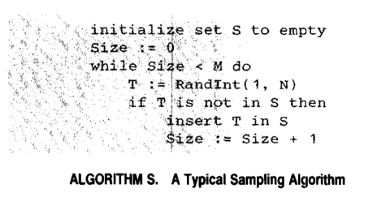
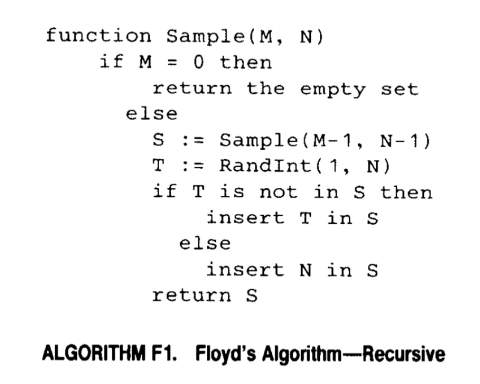
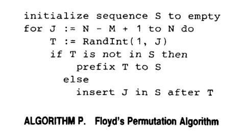

A sample of brilliance

# A sample of brilliance

January 30, 2018

[A sample of brilliance](http://fermatslibrary.com/s/a-sample-of-brilliance) Jon Bentley et al., *CACM 1987*

(Also available in )

Jon Bentley’s “Programming Pearls” was a well-loved column in CACM (and also available in [book form](https://www.amazon.co.uk/Programming-Pearls-ACM-Press-Bentley/dp/0201657880/ref=dp_ob_title_bk)). Today we’re taking at look at his “Sample of Brilliance” column from 1987, featuring guest contributions from none other then Bob Floyd (whose [Turing Award lecture](https://blog.acolyer.org/2018/01/29/the-paradigms-of-programming) we reviewed yesterday). It’s a chance to see Floyd’s algorithm development skills in action.

An earlier Jon Bentley column (December 1984) had discussed sampling algorithms. By sampling here we mean drawing a random sample without replacement. For example, dealing a hand of 5 cards (out of the 52 in a deck). Let’s assume we have to hand a function `RandInt(I,J)` that returns an integer uniformly distributed over `I..J` as a building block. For example, in JavaScript:

1
2
3
[object Object]  [object Object]
[object Object]  [object Object]
[object Object]

The sampling algorithm from the 1984 column, *algorithm ‘S’*, worked as follows:

Here’s a JavaScript rendition:
1
2
3
4
5
6
7
8
[object Object]
[object Object]  [object Object]
[object Object]  [object Object][object Object]  [object Object]
[object Object][object Object]
[object Object]
[object Object]
[object Object]  [object Object]
[object Object]

>  Algorithm S has many virtues: it is correct, fairly efficient, and remarkably succinct. It is so good, as a matter of fact, that I thought one couldn’t do better. In the December 1984 column I therefore charged ahead and described it in detail. Unfortunately I was wrong; fortunately, Bob Floyd caught me sleeping.

What had caught Floyd’s eye, was the case when N = M = 100. Suppose you have already drawn 99 random numbers, there is only one possible choice for the last one! And yet algorithm S will carry on blindly drawing random numbers until it hits by chance on that special last number. *Is there an algorithm that uses exactly one call of RandInt for each random number in S?*

>  Floyd’s key rule in this problem was, in his own words, to “look for a mathematical characterization of the solution before you think about an algorithm to obtain it.”

This led him to Algorithm F1:

With a fairly direct translation in JavaScript as follows:
1
2
3
4
5
6
7
8
9
[object Object]  [object Object]
[object Object]  [object Object][object Object]  [object Object]
[object Object]  [object Object]
[object Object]
[object Object]
[object Object]
[object Object]
[object Object]  [object Object]
[object Object]

>  We can appreciate the correctness of Floyd’s algorithm anecdotally. When M=5 and N=10, the algorithm first recursively computes in S a 4-element random sample from 1..9. Next it assigns to T a random integer in the range 1..10. Of the 10 values that T can assume, exactly 5 result in inserting 10 into S: the four values already in S, and the value 10 itself. Thus element 10 is inserted into the set with the correct probability of 5/10.

(You could construct a nice inductive proof based on those observations).

I’m sure you’ve noticed another inefficiency though – we’re creating a lot of Set objects! By introducing a temporary variable `J`, Floyd was able to eliminate the recursion and give an iterative algorithm almost as succinct as Algorithm S:

In JavaScript:
1
2
3
4
5
6
7
8
[object Object]  [object Object]
[object Object]  [object Object][object Object]  [object Object]
[object Object]  [object Object][object Object]  [object Object]
[object Object]
[object Object]
[object Object]
[object Object]  [object Object]
[object Object]
Let’s do a run with M=3 and N=10…
M = 3, N = 10, S = {}
Iteration 1: J = 8
Draw T = 7
S = {7}
Iteration 2: J = 9
Draw T = 4
S = {7, 4}
Iteration 3: J = 10
Draw T = 7 // again
S = {7, 4, 10}

I averaged the results of 10 runs each of algorithms S, F1, and F2, and you can clearly see the superiority of F2 as N gets larger (times are in ms on my laptop, ALG F1 runs out of stack when N is 100,00):

| N   | ALG S (N,N) | ALG F1 (N,N) | ALG F2 (N,N) |
| --- | --- | --- | --- |
| 10  | 0.32 | 0.18 | 0.17 |
| 100 | 5.24 | 0.80 | 0.60 |
| 1,000 | 7.84 | 3.42 | 2.09 |
| 10,000 | 68.96 | 15.76 | 12.79 |
| 100,000 | 1,063.54 | –   | 168.87 |
| 1,000,000 | 35,831.82 | –   | 3,652.89 |

If we’re interested not just in a random *set*, but also that the elements of the sample occur in a random order, then Algorithm F2 isn’t perfect. Notice that if we draw a random number we’ve seen before, we add `J` in increasing order with each iteration. Interestingly, the documentation for JavaScript’s Set also over specifies (in my view) what will happen when you iterate over set members – they are returned in the order you added them.

For the final piece of the puzzle therefore, Floyd gives us ‘Algorithm P’, a way of generating a random permutation.

>  To compute an M-element permutation from 1..N, it first computes an (M-1) element permutation from 1..N-1; a recursive version of the algorithm eliminates the variable J.

In JavaScript:
1
2
3
4
5
6
7
8
9
10
11
12
13
[object Object]  [object Object]
[object Object]  [object Object][object Object]  [object Object]
[object Object]  [object Object][object Object]  [object Object]
[object Object]
[object Object]
[object Object]  [object Object]
[object Object]
[object Object][object Object]  [object Object]
[object Object]
[object Object]
[object Object]
[object Object]  [object Object]
[object Object]

Doug McIlroy found an elegant way to show this is correct: “*there is one and only one way to produce each permutation, because the algorithm can be run backward*.”

Consider the case with M=5, N=10, and the final sequence is `7 2 9 1 5`. Because 10 (the final value of J) does not occur in S, the previous sequence must have been `2 9 1 5`, and `randInt` returned T = 7. Keep following the chain, and you can recover the entire sequence of random values. And therefore, “*because all random sequences are (supposedly) equally likely, all permutations are also*.”

>  Algorithm S is a pretty good algorithm, but not good enough for Bob Floyd. Not content with its inefficiency, he developed optimal algorithms for generating random samples and random permutations. His programs are a model of efficiency, simplicity, and elegance.

Following his mathematical analysis of the problem, and after conceiving Algorithm P, Floyd recalled, “*I knew it was right even before I proved it*.” But note that he did indeed go on to prove it!

If you want to play with these algorithms some more, the original column (link at the top of this post) contains a set of eight problems that will have you reasoning about different implementations of Sets and Sequences, as well as proofs of correctness.