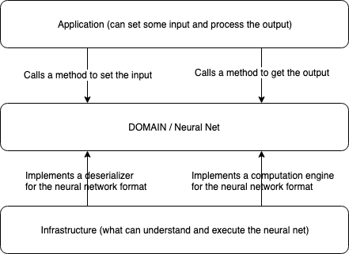
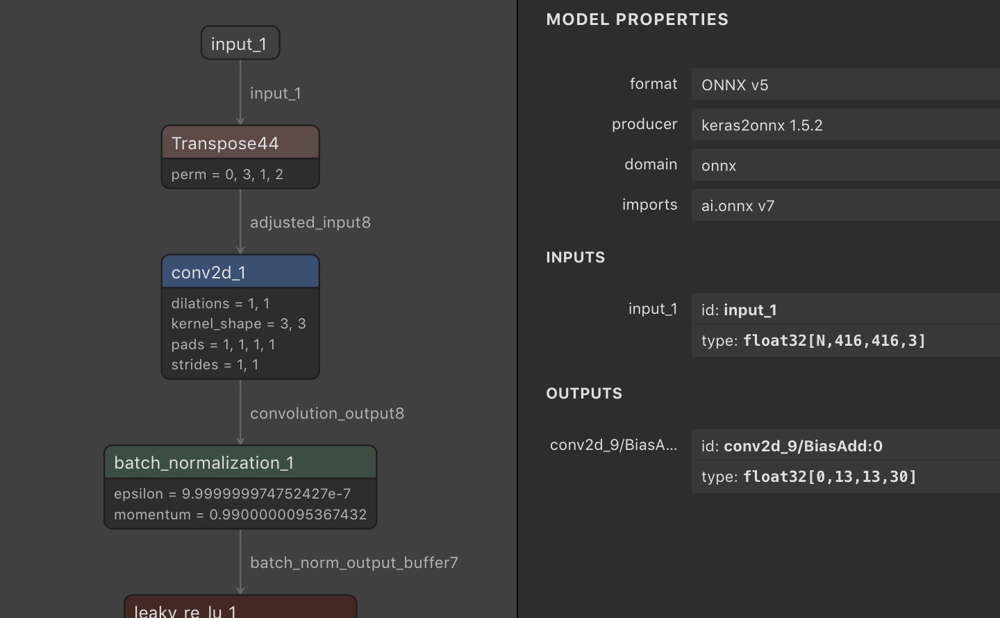
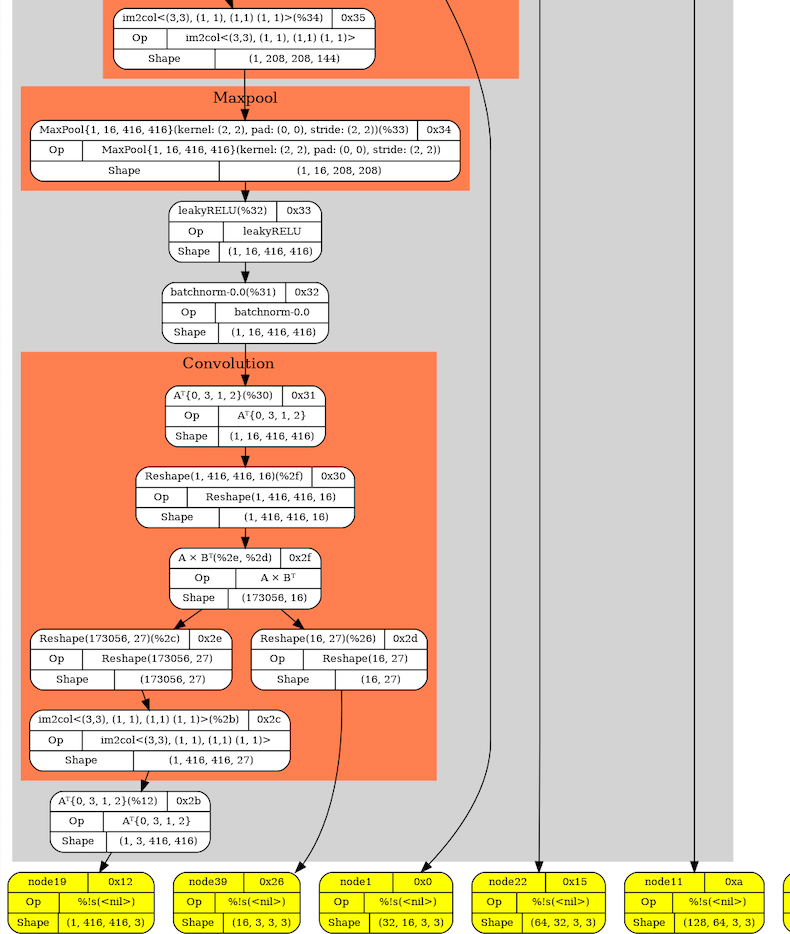
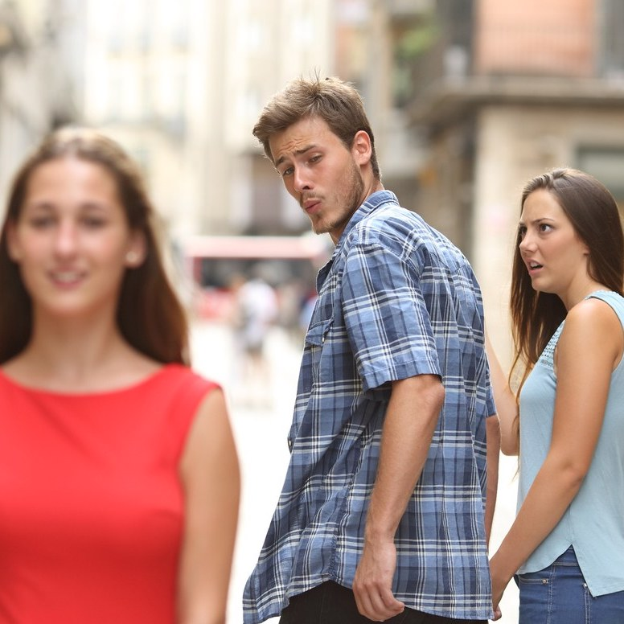
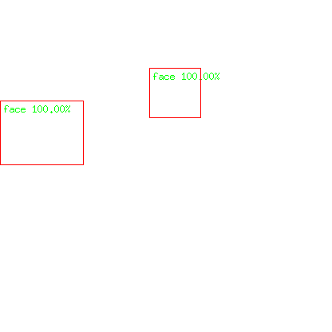

A simple face detection utility from Python to Go

# A simple face detection utility from Python to Go

  2019-08-16   · 2224 words   · 11 min read

## Table of Contents

-
    -

        - [Overall picture](https://blog.owulveryck.info/2019/08/16/a-simple-face-detection-utility-from-python-to-go.html#overall-picture)
- [Implementing the business logic with a neural network](https://blog.owulveryck.info/2019/08/16/a-simple-face-detection-utility-from-python-to-go.html#implementing-the-business-logic-with-a-neural-network)

    -

        - [Getting the weights](https://blog.owulveryck.info/2019/08/16/a-simple-face-detection-utility-from-python-to-go.html#getting-the-weights)
        - [Combining the weights and the model](https://blog.owulveryck.info/2019/08/16/a-simple-face-detection-utility-from-python-to-go.html#combining-the-weights-and-the-model)
        - [Generate the onnx file](https://blog.owulveryck.info/2019/08/16/a-simple-face-detection-utility-from-python-to-go.html#generate-the-onnx-file)
            - [Model visualization](https://blog.owulveryck.info/2019/08/16/a-simple-face-detection-utility-from-python-to-go.html#model-visualization)
            - [Preparing the test of the infrastructure](https://blog.owulveryck.info/2019/08/16/a-simple-face-detection-utility-from-python-to-go.html#preparing-the-test-of-the-infrastructure)
- [Infrastructure: Entering the Go world](https://blog.owulveryck.info/2019/08/16/a-simple-face-detection-utility-from-python-to-go.html#infrastructure-entering-the-go-world)

    -

        - [The Service Provider Interface (SPI)](https://blog.owulveryck.info/2019/08/16/a-simple-face-detection-utility-from-python-to-go.html#the-service-provider-interface-spi)
            - [Testing the infrastructure](https://blog.owulveryck.info/2019/08/16/a-simple-face-detection-utility-from-python-to-go.html#testing-the-infrastructure)
- [Writing the application in Go](https://blog.owulveryck.info/2019/08/16/a-simple-face-detection-utility-from-python-to-go.html#writing-the-application-in-go)
    - [The API](https://blog.owulveryck.info/2019/08/16/a-simple-face-detection-utility-from-python-to-go.html#the-api)
        - [Input](https://blog.owulveryck.info/2019/08/16/a-simple-face-detection-utility-from-python-to-go.html#input)
            - [GetTensorFromImage](https://blog.owulveryck.info/2019/08/16/a-simple-face-detection-utility-from-python-to-go.html#gettensorfromimage)
        - [Output](https://blog.owulveryck.info/2019/08/16/a-simple-face-detection-utility-from-python-to-go.html#output)
            - [Bounding boxes](https://blog.owulveryck.info/2019/08/16/a-simple-face-detection-utility-from-python-to-go.html#bounding-boxes)
            - [Get the bounding boxes](https://blog.owulveryck.info/2019/08/16/a-simple-face-detection-utility-from-python-to-go.html#get-the-bounding-boxes)
- [Final result](https://blog.owulveryck.info/2019/08/16/a-simple-face-detection-utility-from-python-to-go.html#final-result)
    - [Example](https://blog.owulveryck.info/2019/08/16/a-simple-face-detection-utility-from-python-to-go.html#example)
    - [Going a bit further: getting an output picture](https://blog.owulveryck.info/2019/08/16/a-simple-face-detection-utility-from-python-to-go.html#going-a-bit-further-getting-an-output-picture)
- [Conclusion](https://blog.owulveryck.info/2019/08/16/a-simple-face-detection-utility-from-python-to-go.html#conclusion)

In this article, I explain how to build a tool to detect faces in a picture. This article is a sort of how-to design and implements a tool by using a neural network.

For the design part, I describe how to:

- build the business model thanks to a neural network;
- adapt the network to the specific domain of face detection by changing its knowledge;
- use the resulting domain with a go-based infrastructure;
- code a little application in Go to communicate with the outside world.

On the technical side, I am using the following technologies:

- Python / Keras
- ONNX
- Go

**Note**: Some of the terms such as *domain*, *application*, and *infrastructure* refer to the concepts from Domain Driver Design (DDD) or the hexagonal architecture. For example, do not consider the infrastructure as boxes and wires, but see it as a service layer. The infrastructure represents everything that exists independently of the application.

**Disclaimer**: I am using those concepts to illustrate what I do; This is not a proper DDD design nor an authentic hexagonal architecture.

### Overall picture

Those layers can represent the architecture of the tool:
 

#### An overall picture of the architecture

The basic principle is that every layer is a “closed area”; therefore, it is accessible through API, and every layer is testable independently. Different paragraphs of this post describe each layer.

The “actor” here is a simple CLI tool. It is the main package of the application (and in go the main package is the package `main`); In the rest of the article, I reference it as “**the actor**”.

# Implementing the business logic with a neural network

The core functionality of the tool is to detect faces on a picture. I am using a neural network to achieve this. The model I have chosen is[Tiny YOLO v2](https://pjreddie.com/darknet/yolov2/), which can perform real-time object detection.

> “

> This model is designed to be small but powerful. It attains the same top-1 and top-5 performance as AlexNet but with 1/10th the parameters. It uses mostly convolutional layers without the large fully connected layers at the end. It is about twice as fast as AlexNet on CPU making it more suitable for some vision applications.

I am using the “tiny” version, which is based on the Darknet reference network and is much faster but less accurate than the regular YOLO model.

The model is just an “envelope.” It needs some training to be able to detect some objects. The objects it can detect is dependant of its knowledge. The weights tensors represent its knowledge. To detect faces, we need to apply the model to the picture with a knowledge (some weights) able to recognize faces.

> “

> The model is the envelope; it can detect many objects. The knowledge that makes it able to detect faces is in the weights.

### Getting the weights

By luck, an engineer named [Azmath Moosa](https://github.com/azmathmoosa) has trained the model and released a tool called [azface](https://github.com/azmathmoosa/azFace). The project is available on GitHub in LGPLv3 but, it does not contain the sources of the tool (only a Windows binary and some DLL are present). However, what I am interested in is not the tool as I am building my own. What I am seeking now is the weights, and the weights are present in the repository as well.

*Disclaimer*: the tool we are building is for academic purpose. I am not competing with Azmath’s tool in any way.

First, we clone the repository to have the weights locally:
`$ git clone https://github.com/azmathmoosa/azFace`

The weights are this heavy file of 61Mb: `weights/tiny-yolo-azface-fddb_82000.weights`.

### Combining the weights and the model

Now, we need to combine the knowledge and the model. Together, they constitute the core functionality of our domain.

The business logic should be as independent as possible of any framework. The best way to represent the neural network is to be as close as possible as its definition; The original implementation of the YOLO model (from “darknet”) is in C; There are other reimplementations in Tensorflow, Keras, Java, …

I am using [ONNX](https://onnx.ai/) as a format for the business logic; It is an Intermediate Representation that is, as a consequence, independant of a framework.

To create the ONNX format, I am using Keras with thei following tools:

- [`yad2k`](https://github.com/allanzelener/yad2k.git) to create a Keras model from YOLO;
- [`keras2onnx`](https://pypi.org/project/keras2onnx/) to encode it into ONNX.

The workflow is:

	                          yad2k                   keras2onnx
	darknet config + weights -------->  keras model --------------> onnx model

This script creates a Keras model from the config and the weights of `azface`
[object Object]
[object Object]

It generates a pre-trained [h5 version](https://drive.google.com/file/d/1O4BF8m3WrrHTIHnqFtl2oghaw_esRaYn/view) of the tiny YOLO v2 model, able to find faces.

Then, analyzing the resulting model with this code snippet gives the following result:

[object Object]
[object Object]
[object Object]
[object Object]
The resulting model looks ok.

### Generate the onnx file

To generate the ONNX representation of the model, I use [keras2onnx](https://github.com/onnx/keras-onnx):

[object Object]
[object Object]

#### Model visualization

It is interesting to visualize the result of the conversion. I am using the tool `netron` which have a [web version](https://lutzroeder.github.io/netron/).

Here is an extract of the picture it generates:
 

#### Netron representation of the tiny YOLO v2 graph

I made a copy of the full representation [here](https://blog.owulveryck.info/assets/yolofaces/netron.png) if you want to see how the model looks.

#### Preparing the test of the infrastructure

To validate our future infrastructure, I need a simple test.

What I am doing is applying the model on a zero value and save the result. I will do the same once the final infrastructure is up and compare the results.

[object Object]
[object Object]
Now, let’s move to the infrastructure and application part.

# Infrastructure: Entering the Go world

No surprises here: the infrastructure I am using is made of [`onnx-go`](https://github.com/owulveryck/onnx-go) to decode the onnx file, and [Gorgonia](https://github.com/gorgonia/gorgonia) to execute the model. This solution is an efficient solution for a tool; at runtime, it does not need any of the dependencies used to build the network (no more *Python*, *Tensorflow*, *Conda*, etc.). It gives the end-user of the tool a much better experience.

### The Service Provider Interface (SPI)

We’ve seen its model represents the neural network. The SPI should implement a model to fulfill the contract and understand the ONNX Intermediate Representation (IR). [Onnx-go](https://github.com/owulveryck/onnx-go)’s [`Model`](https://godoc.org/github.com/owulveryck/onnx-go#Model) object is a Go structure that acts as a receiver of the neural network model.

The other service required is a computation engine that understands and executes the model. [Gorgonia](https://github.com/gorgonia/gorgonia) assumes this function.

The **actor** uses those services. A basic implementation in Go is (note the package is `main`):

[object Object]
[object Object]

To use the model, we need to interact with its inputs and output. The model takes a tensor as input. To set this input, the `onnx-go` library provides a helper function called [`SetInput`](https://godoc.org/github.com/owulveryck/onnx-go#Model.SetInput).

For the output, a call to [`GetOutputTensors()`](https://godoc.org/github.com/owulveryck/onnx-go#Model.GetOutputTensors) extracts the resulting tensors.

[object Object]
[object Object]

The **actor** can use those methods, but, as the goal of the application is to analyze pictures, the application is going to encapsulate them. It provides a better user experience for the actor (the actors will probably not want to mess up with tensors).

#### Testing the infrastructure

We can now test the infrastructure to see if the implementation is ok. We set an empty tensor, compute it with Gorgonia, and compare the result with the one saved previously:

I wrote a small `test` file in the go format; for clarity, I am not copying it here, but you can find it in this [gist](https://gist.github.com/owulveryck/3d15c0eb9cf7dea6518116ec0a5be581#file-yolo_test-go).

[object Object]
[object Object]

*Note*: The ExprGraph used by Gorgonia can also be represented visually with Graphviz. This code generates the *dot* representation:

[object Object]
[object Object]

(the full graph is [here](https://blog.owulveryck.info/assets/yolofaces/yolo-gorgonia.png))

 

#### Gorgonia representation of the tiny YOLO v2 graph

The infrastructure is ok, and is implementing the SPI! Let’s move to the application part!

# Writing the application in Go

## The API

Let’s start with the interface of the application. I create a package `gofaces` to hold the logic of the application. It is a layer that adds some facilities to communicate with the outside world. This package is instantiable by anything from a simple CLI to a web service.

### Input

#### GetTensorFromImage

This function takes an image as input; The image is transferred to the function with a stream of bytes (`io.Reader`). It let the possibility for the end-user to use a regular file, to get the content from stdin, or to build a web service and get the file via HTTP. This function returns a tensor usable with the model; it also returns an error if it cannot process the file.

*Note* the full signature of the `GetTensorFromImage` function can be found on [GoDoc](https://godoc.org/github.com/owulveryck/gofaces#GetTensorFromImage)

If we switch back to **actor** implementation, we can now set an input picture with this code: (I skip the errors checking for clarity):

[object Object]
[object Object]

To run the model, we call the function [`backend.Run()`](https://blog.owulveryck.info/2019/08/16/Gorgonia%20fulfills%20the%20[%60ComputationBackend%60](https://godoc.org/github.com/owulveryck/onnx-go/backend#ComputationBackend)%20interface).

### Output

#### Bounding boxes

The model outputs a tensor. This tensor holds all pieces of information required to extract bounding boxes. Getting the bounding boxes is the responsibility of the application. Therefore, the package `gofaces` defines a [`Box`](https://godoc.org/github.com/owulveryck/gofaces#Box) structure.

A box contains a set of [`Elements`](https://godoc.org/github.com/owulveryck/gofaces#Element)

#### Get the bounding boxes

The application’s goal is to analyze the picture and to provide the bounding boxes that contain faces. What the **actor** needs are the resulting bounding boxes. The application provides them via a call to the [`ProcessOutput`](https://godoc.org/github.com/owulveryck/gofaces#ProcessOutput) function.

*Note* On top of this function, I include a function to [`Sanitize`](https://godoc.org/github.com/owulveryck/gofaces#Sanitize) the results (which could be in a separate package though because it is part of the post-processing).

# Final result

You can find the code of the application in my [`gofaces`](https://github.com/owulveryck/gofaces) repository.

The repository is composed of:

- the `gofaces` package which is at the root level (see the godoc [here](https://godoc.org/github.com/owulveryck/gofaces);
- a `cmd` subdirectory is holding a sample implementation to analyze the picture in the command line.

## Example

I am using a famous meme as input.
 

[object Object]
[object Object]
gives the following result
[object Object]
[object Object]

It has detected only one face; It is possible to play with the confidence threshold to detect other faces. I have found that it is not possible to detect the face of the *lover*; probably because the picture does not show her full face.

## Going a bit further: getting an output picture

It is not the responsibility of the `gofaces` package to generate a picture; its goal is to detect faces only. I have included in the repository another package, [`draw`](https://godoc.org/github.com/owulveryck/gofaces/draw). This package contains a single exported function. This function generates a Go `image.Image` with a transparent background and add the rectangles of the boxes.

I tweaked the primary tool to add an `-output` flag (in the `main` package). It writes a png file you can combine it with the original picture in post-processing.

Here is an example of post processing with [ImageMagick](https://imagemagick.org/index.php).

[object Object]
[object Object]

# Conclusion

Alongside this article, we made a tool by writing three testable packages (`gofaces`, `draw` and, obviously, `main`).

The Go self-contained binary makes it the right choice for playing with face detection on personal computers. On top of that, It is easy, for a developer, to adapt the tool by tweaking only the `main` package. He can use face detection to write the funniest or fanciest tool. The sky is the limit.

Thanks to the ONNX Intermediate Representation (IR), it is now possible to use machine learning to describe part of the business logic of a tool. Third-party implementations of the ONNX format allows writing efficient applications with different frameworks or runtime environments.

What I like the most with this idea is that we have a separation of concerns for building a modular and testable tool. Each part can have its lifecycle as long as they still fulfill the interfaces.

On top of that, each layer is fully testable, which brings quality in the final result.

   [Next**](https://blog.owulveryck.info/2019/04/03/from-a-project-to-a-product-the-state-of-onnx-go.html)