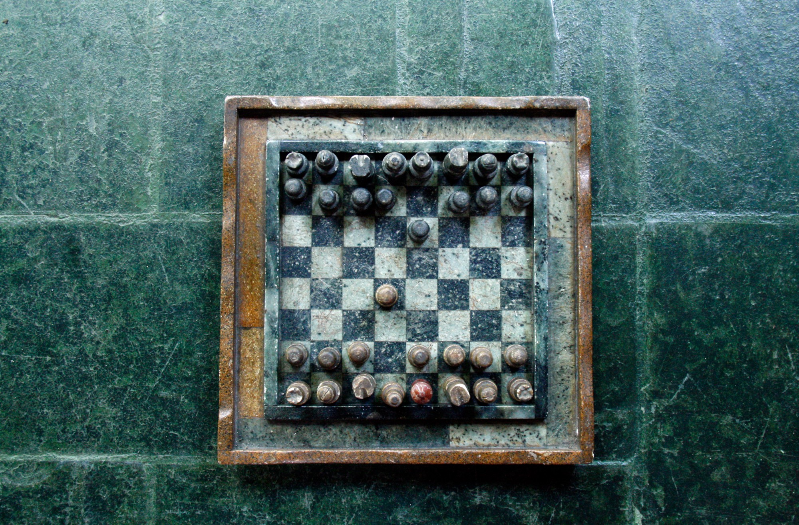
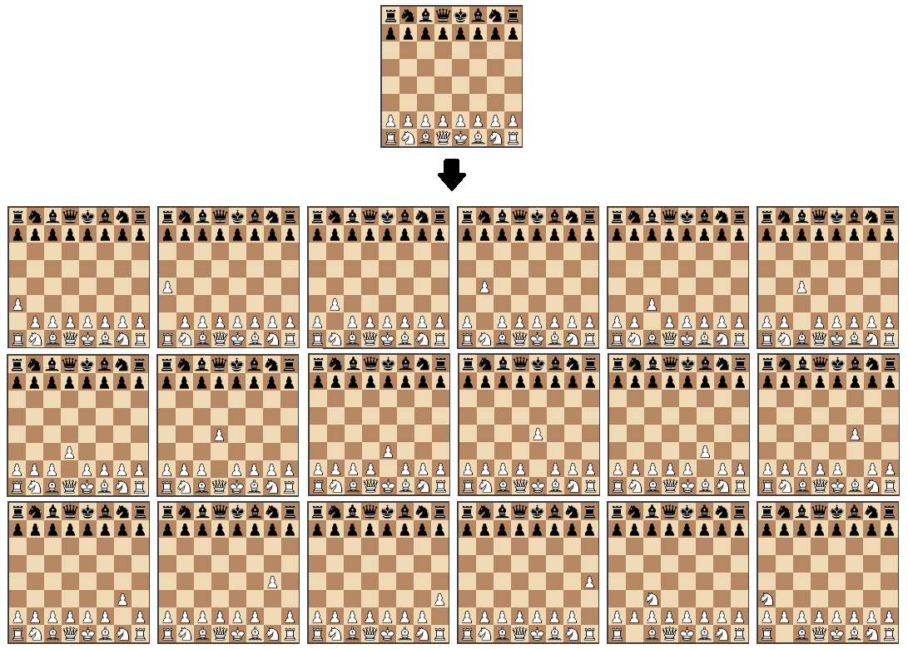
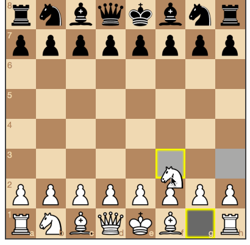
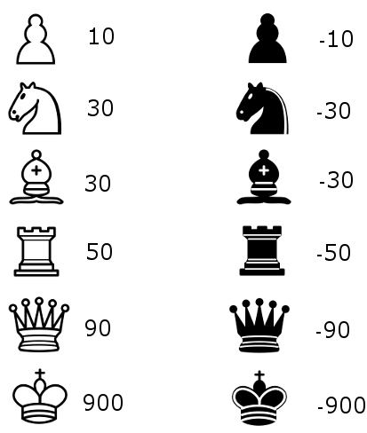
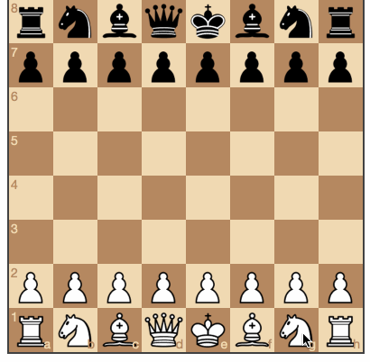
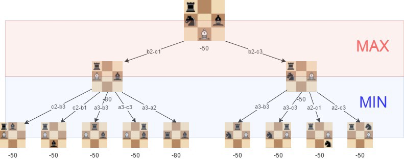
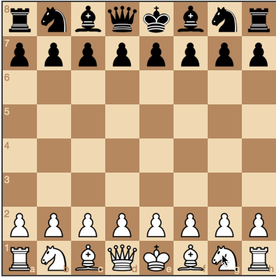
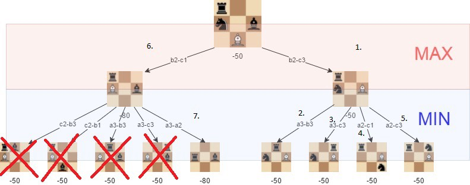
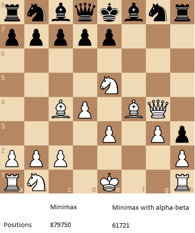
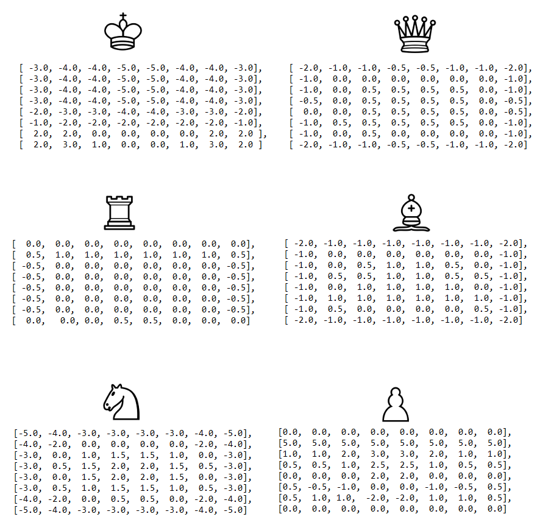

A step-by-step guide to building a simple chess AI – freeCodeCamp

# A step-by-step guide to building a simple chess AI

Let’s explore some basic concepts that will help us create a simple chess AI:

- •move-generation
- •board evaluation
- •minimax
- •and alpha beta pruning.

At each step, we’ll improve our algorithm with one of these time-tested chess-programming techniques. I’ll demonstrate how each affects the algorithm’s playing style.

You can view the final AI algorithm here on [GitHub](https://github.com/lhartikk/simple-chess-ai).

### Step 1: Move generation and board visualization

We’ll use the [chess.js](https://github.com/jhlywa/chess.js) library for move generation, and [chessboard.js](https://github.com/oakmac/chessboardjs/) for visualizing the board. The move generation library basically implements all the rules of chess. Based on this, we can calculate all legal moves for a given board state.

A visualization of the move generation function. The starting position is used as input and the output is all the possible moves from that position.

Using these libraries will help us focus only on the most interesting task: creating the algorithm that finds the best move.

We’ll start by creating a function that just returns a random move from all of the possible moves:

|     |     |
| --- | --- |
| 1   | var  calculateBestMove  =function(game) { |
| 2   |  //generate all the moves for a given position |
| 3   |  var newGameMoves =  game.ugly_moves(); |
| 4   |  return newGameMoves[Math.floor(Math.random() *  newGameMoves.length)]; |
| 5   | };  |

 [view raw](https://gist.github.com/lhartikk/db43b23183ede024825b333c81fdb916/raw/dbea34b6fe0f026465b28a0f4e6f49ed5caa9b3d/simple-chess-ai-step-1.js)  [simple-chess-ai-step-1.js](https://gist.github.com/lhartikk/db43b23183ede024825b333c81fdb916#file-simple-chess-ai-step-1-js) hosted with ❤ by [GitHub](https://github.com/)

Although this algorithm isn’t a very solid chess player, it’s a good starting point, as we can actually play against it:

Black plays random moves. Playable on https://jsfiddle.net/lhartikk/m14epfwb/4

### Step 2 : Position evaluation

Now let’s try to understand which side is stronger in a certain position. The simplest way to achieve this is to count the relative strength of the pieces on the board using the following table:

With the evaluation function, we’re able to create an algorithm that chooses the move that gives the highest evaluation:

|     |     |
| --- | --- |
| 1   | var  calculateBestMove  =  function (game) { |
| 2   |     |
| 3   |  var newGameMoves =  game.ugly_moves(); |
| 4   |  var bestMove =  null; |
| 5   |  //use any negative large number |
| 6   |  var bestValue =  -9999; |
| 7   |     |
| 8   |  for (var i =  0; i <  newGameMoves.length; i++) { |
| 9   |  var newGameMove = newGameMoves[i]; |
| 10  |  game.ugly_move(newGameMove); |
| 11  |     |
| 12  |  //take the negative as AI plays as black |
| 13  |  var boardValue =  -evaluateBoard(game.board()) |
| 14  |  game.undo(); |
| 15  |  if (boardValue > bestValue) { |
| 16  | bestValue = boardValue; |
| 17  | bestMove = newGameMove |
| 18  | }   |
| 19  | }   |
| 20  |     |
| 21  |  return bestMove; |
| 22  |     |
| 23  | };  |

 [view raw](https://gist.github.com/lhartikk/91148454a7ab57c061d4f18fdac3b68d/raw/42fd8e8a8e66817ae6f7a0d87c621511db54a738/simple-chess-ai-step-2.js)  [simple-chess-ai-step-2.js](https://gist.github.com/lhartikk/91148454a7ab57c061d4f18fdac3b68d#file-simple-chess-ai-step-2-js) hosted with ❤ by [GitHub](https://github.com/)

The only tangible improvement is that our algorithm will now capture a piece if it can.

Black plays with the aid of the simple evaluation function. Playable on https://jsfiddle.net/lhartikk/m5q6fgtb/1/

### Step 3: Search tree using Minimax

Next we’re going to create a search tree from which the algorithm can chose the best move. This is done by using the [Minimax](https://en.wikipedia.org/wiki/Minimax) algorithm.

In this algorithm, the recursive tree of all possible moves is explored to a given depth, and the position is evaluated at the ending “leaves” of the tree.

After that, we return either the smallest or the largest value of the child to the parent node, depending on whether it’s a white or black to move. (That is, we try to either minimize or maximize the outcome at each level.)

A visualization of the minimax algorithm in an artificial position. The best move for white is **b2-c3**, because we can guarantee that we can get to a position where the evaluation is **-50**

|     |     |
| --- | --- |
| 1   | var  minimax  =  function (depth, game, isMaximisingPlayer) { |
| 2   |  if (depth ===  0) { |
| 3   |  return  -evaluateBoard(game.board()); |
| 4   | }   |
| 5   |  var newGameMoves =  game.ugly_moves(); |
| 6   |  if (isMaximisingPlayer) { |
| 7   |  var bestMove =  -9999; |
| 8   |  for (var i =  0; i <  newGameMoves.length; i++) { |
| 9   |  game.ugly_move(newGameMoves[i]); |
| 10  | bestMove =  Math.max(bestMove, minimax(depth -  1, game, !isMaximisingPlayer)); |
| 11  |  game.undo(); |
| 12  | }   |
| 13  |  return bestMove; |
| 14  | } else { |
| 15  |  var bestMove =  9999; |
| 16  |  for (var i =  0; i <  newGameMoves.length; i++) { |
| 17  |  game.ugly_move(newGameMoves[i]); |
| 18  | bestMove =  Math.min(bestMove, minimax(depth -  1, game, !isMaximisingPlayer)); |
| 19  |  game.undo(); |
| 20  | }   |
| 21  |  return bestMove; |
| 22  | }   |
| 23  | };  |

 [view raw](https://gist.github.com/lhartikk/7a4eeaa91f874ab3b1468298320c5624/raw/1327787ec613da08bc1a256897cdc8547b7961bf/simple-chess-ai-step-3.js)  [simple-chess-ai-step-3.js](https://gist.github.com/lhartikk/7a4eeaa91f874ab3b1468298320c5624#file-simple-chess-ai-step-3-js) hosted with ❤ by [GitHub](https://github.com/)

With minimax in place, our algorithm is starting to understand some basic tactics of chess:

Minimax with depth level 2. Playable on: https://jsfiddle.net/k96eoq0q/1/

The effectiveness of the minimax algorithm is heavily based on the search depth we can achieve. This is something we’ll improve in the following step.

### Step 4: Alpha-beta pruning

[Alpha-beta](https://en.wikipedia.org/wiki/Alpha%E2%80%93beta_pruning) pruning is an optimization method to the minimax algorithm that allows us to disregard some branches in the search tree. This helps us evaluate the minimax search tree much deeper, while using the same resources.

The alpha-beta pruning is based on the situation where we can stop evaluating a part of the search tree if we find a move that leads to a worse situation than a previously discovered move.

The alpha-beta pruning does not influence the outcome of the minimax algorithm — it only makes it faster.

The alpha-beta algorithm also is more efficient if we happen to visit **first **those paths that lead to good moves.

The positions we do not need to explore if alpha-beta pruning isused and the tree is visited in the described order.

With alpha-beta, we get a significant boost to the minimax algorithm, as is shown in the following example:

The number of positions that are required to evaluate if we want to perform a search with depth of 4 and the “root” position is the one that is shown.

Follow [this link](https://jsfiddle.net/Laa0p1mh/3/) to try the alpha-beta improved version of the chess AI.

### Step 5: Improved evaluation function

The initial evaluation function is quite naive as we only count the material that is found on the board. To improve this, we add to the evaluation a factor that takes in account the position of the pieces. For example, a knight on the center of the board is better (because it has more options and is thus more active) than a knight on the edge of the board.

We’ll use a slightly adjusted version of piece-square tables that are originally described in the [chess-programming-wiki](https://chessprogramming.wikispaces.com/Simplified+evaluation+function).

The visualized piece-square tables visualized. We can decrease or increase the evaluation, depending on the location of the piece.

With the following improvement, we start to get an algorithm that plays some “decent” chess, at least from the viewpoint of a casual player:

Improved evaluation and alpha-beta pruning with search depth of 3. Playable on https://jsfiddle.net/q76uzxwe/1/

### Conclusions

The strength of even a simple chess-playing algorithm is that it doesn’t make stupid mistakes. This said, it still lacks strategic understanding.

With the methods I introduced here, we’ve been able to program a chess-playing-algorithm that can play basic chess. The “AI-part” (move-generation excluded) of the final algorithm is just 200 lines of code, meaning the basic concepts are quite simple to implement. You can check out the final version is on [GitHub](https://github.com/lhartikk/simple-chess-ai).

Some further improvements we could make to the algorithm would be for instance:

- •[move-ordering](https://chessprogramming.wikispaces.com/Move+Ordering)
- •faster [move generation](https://chessprogramming.wikispaces.com/Move+Generation)
- •and [end-game](https://chessprogramming.wikispaces.com/Endgame) specific evaluation.

If you want to learn more, check out the [chess programming wiki](https://chessprogramming.wikispaces.com/). It’s a helpful resource for exploring beyond these basic concepts I introduced here.

Thanks for reading!