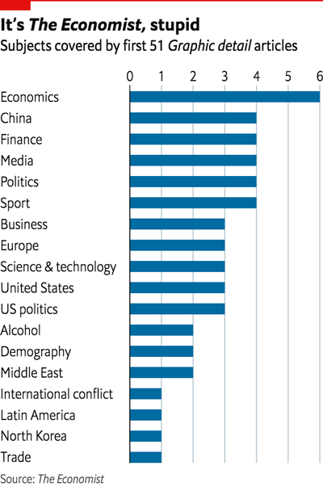
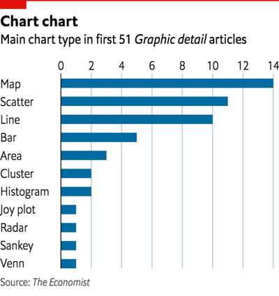

A year in Graphic detail

# A year in Graphic detail

## *An analysis of The Economist data-journalism team’s first year in print*

[Alex Selby-Boothroyd](https://medium.economist.com/@alexselbyboothroyd?source=post_page-----d1825b28e06f----------------------)

[Nov 1](https://medium.economist.com/a-year-in-graphic-detail-d1825b28e06f?source=post_page-----d1825b28e06f----------------------) · 5 min read

In October 2018 we launched [*Graphic detail*](https://medium.economist.com/data-journalism-at-the-economist-gets-a-home-of-its-own-in-print-92e194c7f67e), a new print section in *The Economist* dedicated to data journalism. One year and 51 issues later (we get a week off at Christmas), what have we learned?

**Sir, mix a lot

**Most sections in the newspaper have a clear remit. *Science and technology* is the natural home for a story about [plastic-eating caterpillars](https://www.economist.com/science-and-technology/2017/04/29/plastic-eating-caterpillars-could-save-the-planet) or [open-source computing](https://www.economist.com/science-and-technology/2018/07/19/python-has-brought-computer-programming-to-a-vast-new-audience), and the increasing importance of China led to the creation of a new Sino-centric section in 2012. But *Graphic detail* knows no such confines — the only requirement is a good dataset or two that we can use to tell a story visually.

If we took the easy route and went where the data were most bountiful, we’d write about American politics almost every week, with some (probably American) sport(s) stories thrown in.

Subject to change

Instead we try to mix it up a bit, and our first self-imposed rule was that no topic should be covered twice within a two-month period. Our reader-feedback survey suggests that this variety of subjects keeps things interesting, and it has forced our data journalists to widen their nets too, leading to stories on subjects as diverse as [mountain climbing](http://www.economist.com/graphic-detail/2019/05/11/how-mount-everest-went-mainstream), [the golden age of TV](http://www.economist.com/graphic-detail/2018/11/24/tvs-golden-age-is-real), [house-price forecasts](http://www.economist.com/graphic-detail/2019/06/29/for-now-residential-property-prices-are-likely-to-keep-rising) and [light emissions](http://www.economist.com/graphic-detail/2019/05/04/satellite-data-shed-new-light-on-north-koreas-opaque-economy).

**Habeas data**

Without data, there is no *Graphic detail* page. Yet acquiring a dataset or two is just the beginning of the process. Anyone involved in data journalism knows how long it can take to clean a dataset (three weeks is the current record), and that’s before you even begin to analyse it. We also learned early on that combining two or more datasets takes *far* longer than you might think.

On the other hand, having too much time can be counter-productive: a week spent immersed in a dataset might yield the same results as the initial couple of hours if your instincts were right in the first place. In one instance though, the extra time paid off: by letting our automated scraper run for months rather than a couple of weeks, we had even more data for our most popular story so far, an [analysis of Google News bias](http://www.economist.com/graphic-detail/2019/06/08/google-rewards-reputable-reporting-not-left-wing-politics).

**Laying it all out

**Once we have a good clean dataset, we still need to get over the next hurdle: does it “hold the page”? This is probably the most-repeated phrase in the department (despite my best efforts, not a *single person* has ever uttered the words “habeas data”). And for good reason. Our second rule before we began was that we should aim for a 2:1 ratio between the data visualisation and the text, and a simple line or bar chart is unlikely to fill that space. Sometimes this forces us to look for extra datasets (with the time-consuming caveat above); other times, we keep working with the data until a compelling visualisation emerges. The [ggplot package](https://ggplot2.tidyverse.org/) in R, an open-source statistical program, is our main tool for this.

Not including this chart

We also try to ensure that there is variety in our page design from week to week. Like some of our loyal readers, we stick every *Graphic detail* article up on the wall in chronological order. This lets us check that we’re not over-using certain data visualisation techniques. And we are reassured by our reader survey which indicates that unconventional chart types are a challenge to be relished rather than a barrier to entry, if well-designed.

**Save for later

**We’ve learned from reader surveys and website analytics what our readers find interesting. Stories about [China](http://www.economist.com/graphic-detail/2018/10/27/the-chinese-century-is-well-under-way) perform exceptionally well, and as half of our readership is in the United States, it wasn’t surprising that our [How to forecast an American’s vote article](https://www.economist.com/graphic-detail/2018/11/03/how-to-forecast-an-americans-vote), published a few days before the 2018 mid-term elections, was an instant hit. What has been eye-opening is the ebb and flow of traffic after publication: although the [Google News](https://www.economist.com/graphic-detail/2019/06/08/google-rewards-reputable-reporting-not-left-wing-politics) story took a couple of days to get going, aided by an [illuminating tweet-thread](https://twitter.com/J_CD_T/status/1137063752606605314?s=20) from the author, it has attracted interest several times since. And our [measles](http://www.economist.com/graphic-detail/2019/03/09/measles-outbreaks-in-america-are-getting-harder-to-contain) article lay dormant for three weeks before going viral when a state of emergency was called in New York.

Better late than never
**Charting the future

**Although we’ll keep striving to find unique datasets — quality Africa-related data remain particularly elusive — there are a handful of stories and concepts that we will return to. Our final Graphic detail of 2018 for example charted the [news events](https://www.economist.com/graphic-detail/2018/12/18/the-news-events-that-most-engrossed-audiences-in-2018) that most engrossed readers throughout the year, and we’ll do the same in our Christmas edition this year. We also revisited the ‘build a voter’ format to calculate support in Britain for three different [Brexit options](https://www.economist.com/graphic-detail/2019/02/23/british-voters-are-unimpressed-by-theresa-mays-brexit-deal) earlier this year, and might even come back to it again for the 2020 US presidential election. There are also many interesting chart types that we haven’t found the right data for yet (Marimekkos, stacked-area alluvial diagrams, multivariate hexbins, 3D pie charts).

Finally, we’ve gained a new data visualiser to work on our print section (welcome [Ros](https://twitter.com/_rospearce)!), and a new data journalist will be joining the team early next year, giving us fresh ideas for 2020 and beyond.

**The year in numbers

*4 ****prizes*: [Malofiej](https://drive.google.com/file/d/1eZjqf6UHzuVC7_N1EKDuexzV1IC0lQif/view) x3; [The Pudding Cup](https://pudding.cool/process/pudding-awards-2018/) x1

***3 ****other nominations*: [Data Journalism Awards](https://datajournalismawards.org/2019-shortlist/) x2; [Information is Beautiful](https://www.informationisbeautifulawards.com/showcase/3826-build-a-british-voter-interactive-ternary-plot) x1

***2**** consecutive references to pop songs released in 1998*: Only [one](https://www.youtube.com/watch?v=DL7-CKirWZE) was intentional

***1**** correction*: Sorry, University of Hull
***0**** typos*: Week 52 was a different matter…