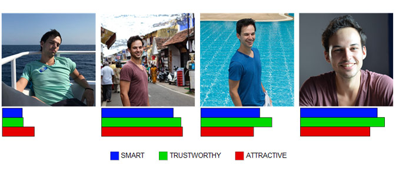
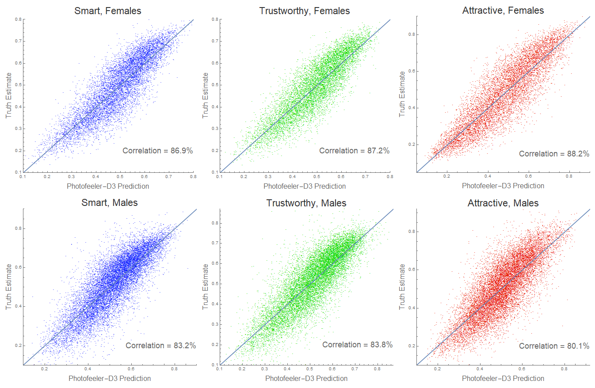
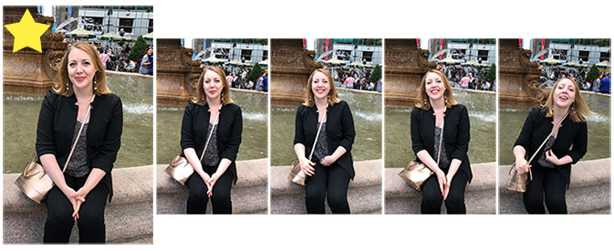

AI Trained on 100 Million Opinions Can Predict What People Will Think of Your Photos - Profiled

[...](https://blog.photofeeler.com/resources/more/)

# AI Trained on 100 Million Opinions Can Predict What People Will Think of Your Photos

Posted on May 17, 2019 by Photofeeler

***TL;DR: A record-shattering new AI called Photofeeler-D3 can predict first impressions from a photo or video. Soon, Photofeeler-D3 could help you pick the most flattering photos from your camera roll, recommend glasses for your face, and more.***

Which of your Tinder pics make you look attractive, smart, or trustworthy? A new artificial intelligence model, Photofeeler-D3, has the answer.

Photofeeler-D3 gets its name for representing the three Dating-category traits on [Photofeeler](https://www.photofeeler.com/?utm_source=blog&utm_medium=std&utm_campaign=photofeeler-d3).

If you’re thinking using AI to judge photos doesn’t sound new, that’s because it’s been tried before. Specifically, attractiveness prediction has been attempted many times (referred to as Facial Beauty Prediction in literature).

But existing attractiveness predictors are [bad](https://medium.com/@thomasrichierichardson/an-attractiveness-researcher-puts-the-internets-most-popular-hotness-algorithms-to-the-test-3278dbcb03b2), with roughly 52% correlation to human voters.

Here at [Photofeeler](https://www.photofeeler.com/?utm_source=blog&utm_medium=std&utm_campaign=photofeeler-d3), we’ve been offering scientifically-accurate, human-powered profile photo testing for years. Fact is, we know better than anyone how painstakingly difficult this is, which is why we didn’t think this was something that AI could do yet. But given enough (and the right kind of) inputs, neural networks can surprise you.

## As Accurate as 15 Human Opinions Combined

Thanks to Photofeeler’s vast real-world dataset and novel AI techniques, Photofeeler-D3 is equivalent to 15 human opinions averaged out for predicting how smart, trustworthy, and attractive a photo subject appears.

This is huge because, until now, other attempts at this haven’t even been comparable to humans.

As of this writing, Photofeeler-D3 achieves the following correlations:

Note that male attractiveness is significantly more difficult to predict than female attractiveness. That’s because human women are so split in their opinions of it.

## Example Use Cases

Photofeeler-D3 continues to be developed, but even in its current form, there are many possible use cases. Here are a few the Photofeeler team has come up with:

### Find your best pic out of a bunch

Because people rarely take one shot of anything, a lot of time is spent choosing the most flattering pic out of many similar ones.

A neural net as good as Photofeeler-D3 could automatically guess the best shots in a large set.

This capability could be used by portrait photographers to quickly sift through a session — or to assist individuals in making quick decisions (like choosing which photo from the evening to upload to Instagram).

### In-camera feedback to take better pictures

An AI as accurate as Photofeeler-D3 could provide feedback *while taking a photo* to help you choose the angle, pose, and expression that is most flattering, like this:

The video above uses the genuine Photofeeler-D3 neural network. Some interesting items of note:

- Notice how Smart is the dominant trait until he takes off his glasses
- When the glasses are taken off, his Attractive score rises
- There’s a quick dip in scores every time he blinks
- The overall top scores result from the genuine smile at the very end!

### Online shopping recommendations

As in the video demo above, Photofeeler-D3 could be used on top of virtual try-on software to sort styles of glasses, jewelry, or makeup from most to least flattering for an individual’s face.

### Auto cropping and filtering

Photofeeler-D3 could identify the best edit to apply (crop, brightness, contrast, and the like) to achieve the best likely impression.

### Image targeting by visual preferences

With Photofeeler’s sophisticated voter preference model, one could predict the best audience for a photo, answering questions like, *Will this photo do better with young or old voters? With men or women? With Americans or Europeans?*

This feature could be used by ad agencies to select stock photos for campaigns.

### Dating app matching based on personal “types”

Likewise, dating apps could use Photofeeler-D3 to identify pairs of users likely to find each other more attractive than others do.

On Photofeeler, we could even offer a test type that *only* targets voters with a positive bias for the photo, to find out how the ideal audience feels about it. Granted, this might not be helpful to users as long as other platforms don’t have the same capability. (e.g. Tinder’s elo score system demands profiles be attractive to the general population or get buried in the queue.)

In any case, we’re currently experimenting with ideas like these and more at Photofeeler.

## Besides Unique Data, What Can Be Credited for Photofeeler-D3’s Success?

Modeling individual voter impressions of the photo, rather than the “true score,” turns out to be very important to achieving the highest accuracy. That’s because there really isn’t a universal photo score; one can only predict the average of many opinions, like Photofeeler does.

Importantly, Photofeeler’s existing VoterStyles algorithm weeds out untrustworthy opinions and accounts for the way that people rate differently from one another.

Not only do people vary in how they assess what looks smart, trustworthy, or attractive, some people need a photo to be the worst they’ve ever seen to give a 0, and others hand out 0s liberally. These massive differences go unaccounted for when opinions are collected and averaged outright.

While the exact methods Photofeeler uses are proprietary, what’s important to note is that factoring in this rich layer of information about the raters themselves dramatically improves the quality of the scores — leading to Photofeeler-D3’s breakthrough results.

The same methods could be applied to any small, noisy datasets to increase reliability (think: product ratings, opinion polls, crowdsourced labor, and the like). They’re what has made it possible for us to provide accurate photo test results to individuals.

While training a neural net on a huge dataset like Photofeeler’s will work out a lot of noise on its own, the fact that we were already bolstering the statistical power of each vote gave Photofeeler-D3 the world’s best ground truth to work towards.

## Will Photofeeler-D3 Be Replacing Human Voting on Photofeeler?

Not yet. While Photofeeler-D3 is equivalent to 15 regular human votes, the underlying voting technology on Photofeeler is already so good that Photofeeler-D3 is equivalent to just 4-7 votes on [Photofeeler](https://www.photofeeler.com/?utm_source=blog&utm_medium=std&utm_campaign=photofeeler-d3).

Further, neural networks are capable of much larger errors than humans in the face of rare or unforeseen characteristics.

For these reasons and because Photofeeler is held to an extremely high standard of precision, we will continue to roll accuracy-boosting AI into human votes rather than replace human votes altogether.

## What’s Next

The initial version of Photofeeler-D3 was built in partnership between Photofeeler co-founder/CTO, [Ben Peterson, Ph.D.](https://www.linkedin.com/in/benpeters0n/), and computer vision expert/advisor, [Agastya Kalra](https://www.linkedin.com/in/agastya-kalra/). This research was published in the *Advancement in Intelligent Systems and Computing* journal and full technical detail is available to read in the whitepaper [here](https://arxiv.org/abs/1904.07435).

Since that initial project, many advancements have been made, so keep in mind that the numbers in this blog post are more current.

Following the Photofeeler-D3 project, Photofeeler’s CTO, Ben Peterson Ph.D., will be working on a 9-trait neural network project (additionally pulling from [Photofeeler](https://www.photofeeler.com/?utm_source=blog&utm_medium=std&utm_campaign=photofeeler-d3)‘s Social and Business categories) as well as the next release to the VoterStyles algorithm.

A limited Photofeeler-D3 demo is available to researchers upon request. Email support@photofeeler.com.

Share:

- [**](https://www.facebook.com/sharer/sharer.php?u=https://blog.photofeeler.com/photofeeler-d3/)
- [**](https://twitter.com/home?status=AI%20Trained%20on%20100%20Million%20Opinions%20Can%20Predict%20What%20People%20Will%20Think%20of%20Your%20Photos%20-%20https://blog.photofeeler.com/photofeeler-d3/)
- [**](http://www.linkedin.com/shareArticle?mini=true&url=https://blog.photofeeler.com/photofeeler-d3/&title=AI%20Trained%20on%20100%20Million%20Opinions%20Can%20Predict%20What%20People%20Will%20Think%20of%20Your%20Photos)
- [**](https://pinterest.com/pin/create/button/?url=https://blog.photofeeler.com/photofeeler-d3/&media=&description=AI%20Trained%20on%20100%20Million%20Opinions%20Can%20Predict%20What%20People%20Will%20Think%20of%20Your%20Photos)
- [**](https://plus.google.com/share?url=https://blog.photofeeler.com/photofeeler-d3/)