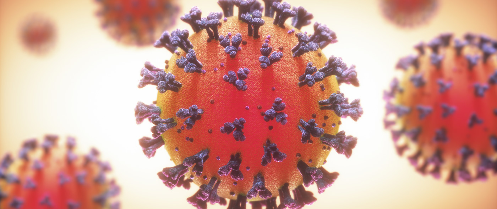
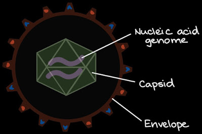

AI's role in the fight against Coronavirus

[March 02, 2020](http://ml-and-me.blogspot.com/2020/03/ais-role-in-fight-against-coronavirus.html)

### AI's role in the fight against Coronavirus

—

The past month has seen an exponential rise in the global death toll due to the Coronavirus, which started in Wuhan province, China and has now spread to more than 50 countries, including Thailand, Singapore, Malaysia, Iran, Japan, the UK and the US. As of now, there are confirmed 84,000 cases worldwide and around more than 2,800 confirmed deaths. If not controlled properly, it is predicted that this condition can affect almost 2/3rds of the world's population.

The reason why we still haven't found a cure yet is because this virus is so new and unlike the previous viruses we've discovered, so we don't understand how exactly it affects our body cells and how it spreads. In times like this, research speed matters a lot, so that we can catch up to the virus and halt its action before it affects more people. Where humans lack in speed, AI can be of help. So let's see how AI has been used and can been helpful in the fight against coronavirus.

Various amazing AI-based technologies have been developed to target different aspects of the disease, particularly disease detection methods, tracking the spreading patterns of the virus, drug development and understanding the basic biology of the virus.

### Finding disease spreading patterns

Since understanding the biology of the virus and developing a treatment takes some time, the best strategy at the moment is to study where and how the virus is spreading, in order to better develop ways to contain it. This is exactly what the Toronto based startup called "Bluedot" has been working on. They developed an AI-driven algorithm that pools in data from HealthMap, a website that aggregates data on disease outbreaks from online sources. It also gets access to airline ticketing information to identify where infected travellers are headed. This algorithm uses machine learning and particularly natural language processing techniques to sift through online content in 65 languages. After this initial sifting process, human analysis takes over to validate these patterns, which are then sent as reports to governments and health clients. As per latest news, Bluedot's algorithm correctly predicted that Coronavirus would travel from Wuhan to Bangkok, Seoul, Taipei and Tokyo after its initial outbreaks.

### Detecting the (potentially) infected

Lots of great work has come out in this area. A product called iThermo was developed in Singapore by a public healthcare tech agency together with a medtech startup called Kronikare. This is a temperature screening device that captures facial features and maps images from 3D and thermal cameras to measure temperature and spot febrile individuals, which removes the burden of physically examining long queues of people. It would save loads of time by allowing healthcare workers to identify and prioritize potentially infected individuals. Infervision, a Beijing based AI company is also developing deep learning and machine learning algorithms to spot the viral infection from lung images. While a manual inspection of a CT scan takes around 15-20 minutes, applying these algorithms to analyse shape, volume and density of lung lesions can help to quickly spot coronavirus-caused pneumonia, which could thereby reduce the turnaround time to around 10 seconds.

### Decoding the virus

This is a slightly tricky area because the virus is very new to us and the data is limited. But keeping coronavirus aside for now, we need to first understand, how does any virus work? Well, one key point about viruses is that they are not living things like bacteria. Bacteria (and any living thing for that matter) can grow, consume energy, reproduce and respond to a stimulus. If we wanted to kill a bacteria, we could design drugs i.e antibiotics that could stop growth, stop reproduction or any of the functions that the bacteria performs. Viruses, on the other hand, are small and chemically unreactive constructs of nature. Here is a structure of a generic virus below:

They have a surrounding envelope which is made up of special types of proteins, shown in blue and red. These proteins help the virus get into our cells. Inside the envelope is a capsid which is like a container for the viral DNA or viral genome. I'll go into genomes and genomics in a bit more detail in a future post, but all you need to know for now is that this genome is like a recipe book, containing instructions to create a new virus particle.

How does a virus work? Looking at the overall process, first the proteins on the envelope help the virus attach to our cells. After successfully attaching, the virus releases its genome into the cell. Then, the cell's machinery reads this genome and recreates components of this same virus. These components assemble together to form a new virus particle. Finally, the cell bursts and releases these virus particles, which enter more cells and the cycle restarts to make more and more virus! So essentially the virus is like a hijacker, taking control of the cell's machinery and using it to make more copies of itself so that it can transmit and infect more cells. If we cough without covering our mouth or are in physical contact with anyone, the virus can also spread to a new host and start the infection cycle there.

Now what I've explained so far is what happens in a generic virus; each and every type of virus, be it HIV or Ebola or Coronavirus, has its own specific set of envelope proteins, its own specific genome and a its own unique structure, which is why it is challenging to develop a cure. The genome for coronavirus was established mid-January, which is good because now we have a startpoint to understand how this virus works.

Coming back to the theme of AI, there has been some work that has managed to identify key features of coronavirus. It was established recently through research that the virus can enter human cells by binding to a molecule on the surface of the cells called ACE-2 (angiotensin converting enzyme-2). BenevolentAI, a medical AI research company here in the UK, developed a set of machine learning algorithms which creates a 'knowledge graph'  - essentially a network graph of connections between molecular structure and other relevant biomedical information from databases, which helps to identify relevant and related target molecules. Using these algorithms, they found a link between ACE-2 and a specific type of protein called 'kinase AAK1'. AAK1 regulates endocytosis - a process that engulfs materials into cells, which is a mode of virus infection. So designing drugs to target and inhibit AAK1 could be a way to treat this disease.

### Drug Development

Drug development is a painfully long process taking almost 12-15 years, but considering our current situation, its crucial that we come up with solutions as quickly as possible. Recently, BenevolentAI used its AI algorithms to screen around 378 potential AAK1 inhibitors molecules. They narrowed down the list to 47 drugs which are medically approved for use. Of these 47, 6 were highly effective at targeting AAK1. In the end, they arrived at the drug 'baricitinib'. Baricitinib is normally used to treat rheumatoid arthritis, although, it was found that this drug had a strong affinity for kinase AAK1. More importantly, they found that baricitinib was the least toxic and had the least side effects compared to other drugs they identified, which means it is safe for patients. This drug now needs to be tested on patients in a clinical setting to validate whether it will work or not. Cambridge-based startup HealX is also using similar AI approaches, to repurpose existing drugs for combating coronavirus. Overall, you can see that AI is beneficial for generating insights from already existing data, rather than deploying a whole new team to find a new solution.

But that isn't to say coming up with new solutions isn't worthwhile...The company Insilico recently developed AI algorithms to help design new drug molecules which could limit the extent to which coronavirus replicates in cells. These algorithms basically evaluate the structures of viral replication proteins and inhibitor drug molecules, to identify the molecules that are most identical to the coronavirus proteins and can target them effectively. As per reports, Insilico managed to identify 6 molecules which could be effective at targeting the virus.

So as you can see, AI has been of immense help when it comes to quickly finding solutions to understand and fight the coronavirus. Only with further research and testing can we tell whether these solutions are really effective or not. Personally, reading about all this fantastic research, my big takeaway is the fact that while all this work involves well trained mathematicians, programmers and engineers, having an excellent understanding of the biology and medical science (in this case, virology) is equally important and is what will actually help generate the most valuable insights, taking research to the next level.

**Links:**
https://www.wired.com/story/ai-epidemiologist-wuhan-public-health-warnings/

https://thenextweb.com/neural/2020/02/21/ai-sent-first-coronavirus-alert-but-underestimated-the-danger/

https://apnews.com/100fbb228c958f98d4c755b133112582

https://www.thelancet.com/journals/landig/article/PIIS2589-7500(20)30054-6/fulltext

https://www.telegraph.co.uk/technology/2020/02/22/ai-could-best-hope-fighting-next-coronavirus/

https://www.bloomberg.com/news/articles/2020-02-21/artificial-intelligence-gears-up-to-fight-a-future-coronavirus

https://eandt.theiet.org/content/articles/2020/02/coronavirus-using-ai-to-discover-a-cure/

https://time.com/5780683/coronavirus-ai/

[forbes.com/sites/tomtaulli/2020/02/02/coronavirus-can-ai-artificial-intelligence-make-a-difference/#4d2464205817](http://forbes.com/sites/tomtaulli/2020/02/02/coronavirus-can-ai-artificial-intelligence-make-a-difference/#4d2464205817)

https://cen.acs.org/physical-chemistry/computational-chemistry/Artificial-intelligence-finds-drug-that-could-fight-Wuhan-coronavirus/98/i6

https://www.thelancet.com/journals/laninf/article/PIIS1473-3099(20)30132-8/fulltext

https://www.thelancet.com/pdfs/journals/lancet/PIIS0140-6736(20)30304-4.pdf

https://www.straitstimes.com/singapore/health/coronavirus-new-ai-driven-temperature-screening-device-to-save-time-and-manpower?fbclid=IwAR26ovo_5YJKLmD3r4NwntQSS08JAfRle31oKPHOFx2GnDgxR2PuUT0zqLI

https://us.infervision.com/
https://bluedot.global/