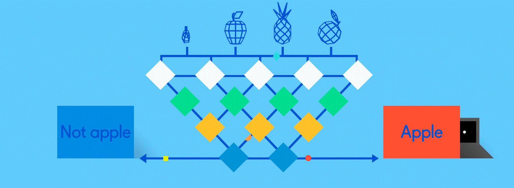
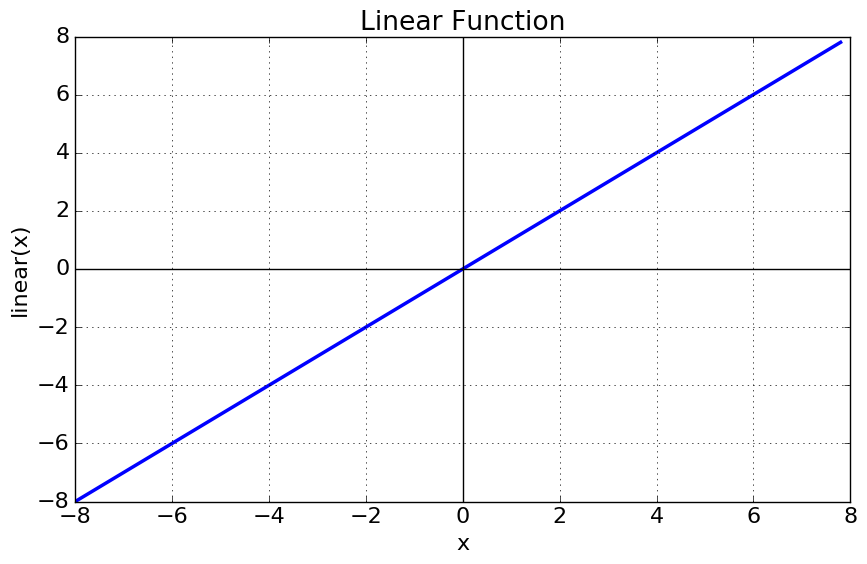
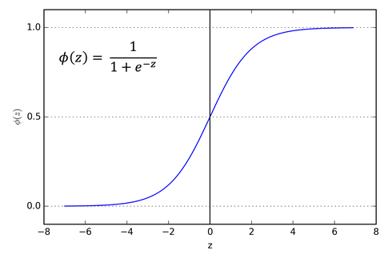
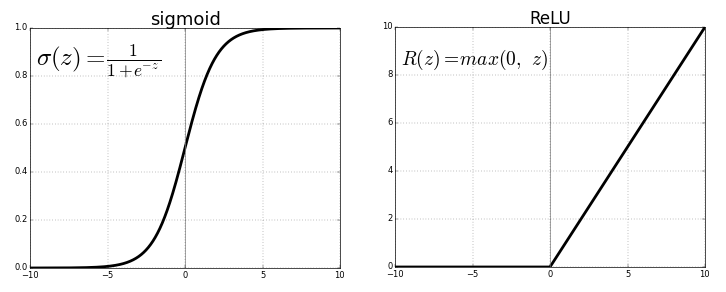
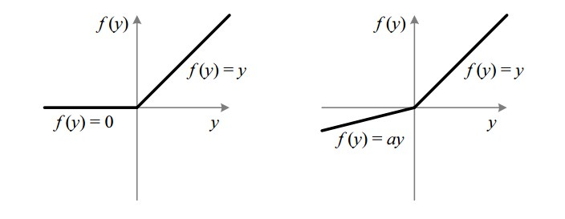

Activation Functions in Neural Networks - Towards Data Science

#### Top highlight

# Activation Functions in Neural Networks

## Sigmoid, tanh, Softmax, ReLU, Leaky ReLU EXPLAINED !!!

[SAGAR SHARMA](https://towardsdatascience.com/@sagarsharma4244?source=post_page-----1cbd9f8d91d6----------------------)

[Sep 6, 2017](https://towardsdatascience.com/activation-functions-neural-networks-1cbd9f8d91d6?source=post_page-----1cbd9f8d91d6----------------------) · 5 min read

## **What is Activation Function?**

> It’s just a thing function that you use to get the output of node. It is also known as **> Transfer Function**> .

* * *

*...*

## **Why we use Activation functions with Neural Networks?**

> It is used to determine the output of neural network like yes or no. It maps the resulting values in between 0 to 1 or -1 to 1 etc. (depending upon the function).

The Activation Functions can be basically divided into 2 types-
1. Linear Activation Function
2. Non-linear Activation Functions
**> FYI: The Cheat sheet is given below.**

* * *

*...*

## **Linear or Identity Activation Function**

As you can see the function is a line or linear. Therefore, the output of the functions will not be confined between any range.

**Fig: Linear Activation Function**
**Equation : **f(x) = x
**Range :** (-infinity to infinity)

It doesn’t help with the complexity or various parameters of usual data that is fed to the neural networks.

## **Non-linear Activation Function**

The Nonlinear Activation Functions are the most used activation functions. Nonlinearity helps to makes the graph look something like this

**Fig: Non-linear Activation Function**

It makes it easy for the model to generalize or adapt with variety of data and to differentiate between the output.

The main terminologies needed to understand for nonlinear functions are:

**> Derivative or Differential: **> Change in y-axis w.r.t. change in x-axis.It is also known as slope.

**> Monotonic function:**>  A function which is either entirely non-increasing or non-decreasing.

The Nonlinear Activation Functions are mainly divided on the basis of their **range or curves**-

## **1. Sigmoid or Logistic Activation Function**

The Sigmoid Function curve looks like a S-shape.

**Fig: Sigmoid Function**

The main reason why we use sigmoid function is because it exists between **(0 to 1). **Therefore, it is especially used for models where we have to **predict the probability** as an output.Since probability of anything exists only between the range of **0 and 1,** sigmoid is the right choice.

The function is **differentiable**.That means, we can find the slope of the sigmoid curve at any two points.

The function is **monotonic **but function’s derivative is not.

The logistic sigmoid function can cause a neural network to get stuck at the training time.

The **softmax function** is a more generalized logistic activation function which is used for multiclass classification.

## **2. Tanh or hyperbolic tangent Activation Function**

tanh is also like logistic sigmoid but better. The range of the tanh function is from (-1 to 1). tanh is also sigmoidal (s - shaped).

**Fig: tanh v/s Logistic Sigmoid**

The advantage is that the negative inputs will be mapped strongly negative and the zero inputs will be mapped near zero in the tanh graph.

The function is **differentiable**.
The function is **monotonic** while its **derivative is not monotonic**.
The tanh function is mainly used classification between two classes.

> Both tanh and logistic sigmoid activation functions are used in feed-forward nets.

## **3. ReLU (Rectified Linear Unit) Activation Function**

The ReLU is the most used activation function in the world right now.Since, it is used in almost all the convolutional neural networks or deep learning.

**Fig: ReLU v/s Logistic Sigmoid**

As you can see, the ReLU is half rectified (from bottom). f(z) is zero when z is less than zero and f(z) is equal to z when z is above or equal to zero.

**Range: **[ 0 to infinity)
The function and its derivative **both are**  **monotonic**.

But the issue is that all the negative values become zero immediately which decreases the ability of the model to fit or train from the data properly. That means any negative input given to the ReLU activation function turns the value into zero immediately in the graph, which in turns affects the resulting graph by not mapping the negative values appropriately.

## **4. Leaky ReLU**

It is an attempt to solve the dying ReLU problem

**Fig : ReLU v/s Leaky ReLU**
Can you see the Leak?

The leak helps to increase the range of the ReLU function. Usually, the value of **a **is 0.01 or so.

When **a is not 0.01** then it is called **Randomized ReLU**.
Therefore the **range** of the Leaky ReLU is (-infinity to infinity).

Both Leaky and Randomized ReLU functions are monotonic in nature. Also, their derivatives also monotonic in nature.

## Why derivative/differentiation is used ?

> When updating the curve, to know in **> which direction**>  and **> how much**>  to change or update the curve depending upon the slope.That is why we use differentiation in almost every part of Machine Learning and Deep Learning.

**Fig: Activation Function Cheetsheet**

**Fig: Derivative of Activation Functions**

* * *

*...*

I will be posting 2 posts per week so don’t miss the tutorial.

So, follow me on [Medium](https://medium.com/@sagarsharma4244), [Facebook](https://www.facebook.com/profile.php?id=100003188718299), [Twitter](https://twitter.com/SagarSharma4244), [LinkedIn](https://www.linkedin.com/in/sagar-sharma-232a06148/), [Google+](https://plus.google.com/u/0/+SAGARSHARMA4244), [Quora](https://www.quora.com/profile/Sagar-Sharma-71) to see similar posts.

Any comments or if you have any question, **write it in the comment.**
**Clap it! Share it! Follow Me!**
Happy to be helpful. kudos…..

* * *

*...*

# Previous stories you will love:

[ ## What is Linear Regression and How does it work? - theffork   ### It is a method used for predicting future values by finding a linear pattern in the previously given data. The linear…    #### theffork.com](https://theffork.com/what-is-linear-regression-and-how-does-it-work/)

[ ## What the Hell is “Tensor” in “TensorFlow”?   ### I didn’t know it…    #### hackernoon.com](https://hackernoon.com/what-the-hell-is-tensor-in-tensorflow-e40dbf0253ee)

[ ## Epoch vs Batch Size vs Iterations   ### Know your code…    #### towardsdatascience.com](https://towardsdatascience.com/epoch-vs-iterations-vs-batch-size-4dfb9c7ce9c9)

[ ## Monte Carlo Tree Search   ### MCTS For Every Data Science Enthusiast    #### towardsdatascience.com](https://towardsdatascience.com/monte-carlo-tree-search-158a917a8baa)

[ ## Policy Networks vs Value Networks in Reinforcement Learning   ### In Reinforcement Learning, the agents take random decisions in their environment and learns on selecting the right one…    #### towardsdatascience.com](https://towardsdatascience.com/policy-networks-vs-value-networks-in-reinforcement-learning-da2776056ad2)

[ ## TensorFlow Image Recognition Python API Tutorial   ### On CPU with Inception-v3(In seconds)    #### towardsdatascience.com](https://towardsdatascience.com/tensorflow-image-recognition-python-api-e35f7d412a70)

[ ## How to Send Emails using Python   ### Design Professional Mails using Flask!    #### medium.com](https://medium.com/@sagarsharma4244/how-to-send-emails-using-python-4293dacc57d9)