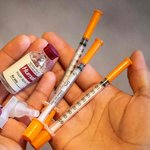
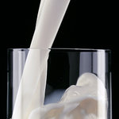
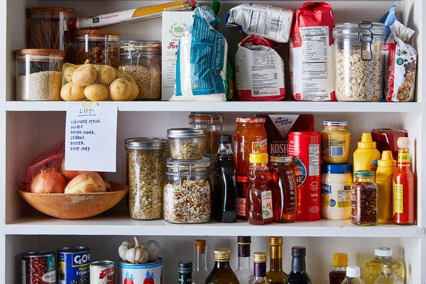

Alcoholics Anonymous vs. Other Approaches: The Evidence Is Now In - The New York Times

[![](data:image/svg+xml,%3csvg xmlns='http://www.w3.org/2000/svg' class='css-2ov6oh js-evernote-checked' width='122' height='24' viewBox='0 0 285 54' data-evernote-id='923'%3e%3ctitle%3eUpshot%3c/title%3e%3cpath d='M8.444 21.889c4.664 0 8.444-3.78 8.444-8.444a8.444 8.444 0 1 0-16.888 0 8.443 8.443 0 0 0 8.444 8.444M8.444 43a8.444 8.444 0 0 0 8.444-8.444 8.444 8.444 0 1 0-16.888 0A8.444 8.444 0 0 0 8.444 43' fill='%23bad62d'%3e%3c/path%3e%3cpath d='M57.971 20.687h-6.528v-6.145h-2.784v18.865h3.888V40.8H32.385v-7.393h3.84V14.542h-2.736v6.145h-6.576V7.148h31.059v13.539zM90.371 40.8h-12.77V27.263c0-2.112-1.008-3.265-2.592-3.265-1.873 0-2.593 1.633-2.593 3.937v6.625h1.92v6.24H59.744v-6.24h1.824V13.39h-1.824V7.148h12.673v13.346c3.024-2.208 4.944-3.217 7.776-3.217 4.177 0 8.257 2.305 8.257 7.585v9.697h1.921V40.8zM116.818 31.631h-15.121c.336 2.305 1.488 3.889 3.984 3.889 1.632 0 2.64-.769 3.6-2.017h7.537c-.528 1.681-1.393 3.169-2.641 4.417-2.399 2.399-6.048 3.36-9.36 3.36-3.456 0-7.297-.721-9.985-3.121-2.64-2.352-3.984-5.472-3.984-8.977 0-7.536 6.001-11.905 13.153-11.905 3.12 0 5.856.769 8.353 2.688 2.833 2.16 4.561 5.904 4.561 9.409-.001.769-.049 1.489-.097 2.257zm-9.457-3.552v-.576c0-1.969-.479-3.984-2.832-3.984-1.248 0-2.16.672-2.592 1.824-.336.815-.24 1.872-.24 2.736h5.664zM151.187 14.542h-2.64v15.265c0 3.12-.864 5.473-2.784 7.489-2.688 2.784-6.577 4.128-11.569 4.128-6.769 0-11.089-2.448-12.961-7.488-.672-1.776-.864-3.648-.864-7.537V14.542h-2.977V7.148h18.338v7.394h-2.929v13.201c0 1.68.24 2.784.769 3.696.72 1.199 2.16 1.92 3.792 1.92 2.257 0 3.841-1.584 3.841-3.984V14.542h-2.641V7.148h12.625v7.394zM177.634 37.92c-1.92 2.112-4.656 3.36-7.152 3.36-2.064 0-4.032-.673-6.961-2.448V43.2h2.593v6.24h-15.361V43.2h1.92V23.998h-1.92v-6.24h12.769v2.16c2.784-1.92 4.849-2.641 7.297-2.641 2.352 0 4.416.816 6.048 2.353 2.353 2.256 3.841 5.952 3.841 9.648-.002 3.41-1.106 6.53-3.074 8.642zm-10.993-14.401c-2.064 0-3.12 1.776-3.12 5.376 0 3.841.912 5.856 3.12 5.856 2.641 0 3.217-2.784 3.217-5.28-.001-2.208-.097-5.952-3.217-5.952zM195.775 41.28c-2.399 0-4.08-.385-7.488-1.633V40.8h-5.185v-7.681h5.137c.624 2.017 1.44 3.072 3.408 3.072 1.488 0 2.4-.624 2.4-1.776 0-.815-.528-1.439-1.536-1.872l-4.992-2.112c-2.545-1.104-3.889-3.36-3.889-5.76 0-3.937 3.889-7.394 8.785-7.394 2.016 0 3.696.433 5.952 1.44v-.96h5.232v7.393H198.8c-.432-2.304-1.296-3.552-3.024-3.552-1.248 0-2.208.768-2.208 1.775 0 .864.576 1.584 1.776 2.064l4.896 1.92c3.216 1.248 4.704 3.312 4.704 6.097 0 4.417-3.744 7.826-9.169 7.826zM236.145 40.8h-12.769V27.263c0-2.112-1.008-3.265-2.593-3.265-1.872 0-2.592 1.633-2.592 3.937v6.625h1.92v6.24h-14.593v-6.24h1.824V13.39h-1.824V7.148h12.673v13.346c3.024-2.208 4.944-3.217 7.776-3.217 4.177 0 8.257 2.305 8.257 7.585v9.697h1.92V40.8zM251.551 41.28c-7.152 0-13.969-4.177-13.969-11.953 0-7.825 6.672-12.05 13.921-12.05 7.345 0 13.873 4.177 13.873 12.098 0 7.776-6.673 11.905-13.825 11.905zm-.145-17.761c-2.592 0-2.976 3.36-2.976 5.28s.24 5.952 2.976 5.952c2.736 0 3.121-3.216 3.121-5.28 0-2.16-.144-5.952-3.121-5.952zM283.855 40.8H269.79V23.998h-2.16v-6.24h2.16v-7.2h10.849v7.2h3.217v6.24h-3.217V34.56h3.217v6.24z'%3e%3c/path%3e%3c/svg%3e)](https://www.nytimes.com/section/upshot)

The New HEALTH CARE

# Alcoholics Anonymous vs. Other Approaches: The Evidence Is Now InAlcoholics Anonymous vs. Other Approaches: The Evidence Is Now In

An updated review shows it performs better than other common treatments and is less expensive.

Credit...Tony Cenicola/The New York Times

By [Austin Frakt](https://www.nytimes.com/by/austin-frakt) and [Aaron E. Carroll](https://www.nytimes.com/by/aaron-e-carroll)

- March 11, 2020, 7:00 a.m. ET

-

    - 
    - 
    - [](https://www.nytimes.com/2020/03/11/upshot/alcoholics-anonymous-new-evidence.html?action=click&module=Well&pgtype=Homepage&section=The%20Upshotmailto:?subject=NYTimes.com%3A%20Alcoholics%20Anonymous%20vs.%20Other%20Approaches%3A%20The%20Evidence%20Is%20Now%20In&body=From%20The%20New%20York%20Times%3A%0A%0AAlcoholics%20Anonymous%20vs.%20Other%20Approaches%3A%20The%20Evidence%20Is%20Now%20In%0A%0AAn%20updated%20review%20shows%20it%20performs%20better%20than%20other%20common%20treatments%20and%20is%20less%20expensive.%0A%0Ahttps%3A%2F%2Fwww.nytimes.com%2F2020%2F03%2F11%2Fupshot%2Falcoholics-anonymous-new-evidence.html)

    -
    -
    -

For a long time, medical researchers were unsure whether Alcoholics Anonymous worked better than other approaches to treating people with alcohol use disorder. [In 2006](https://www.nytimes.com/2006/07/25/health/25drin.html), a review of the evidence concluded we didn’t have enough evidence to judge.

That has changed.

An [updated systematic review published](https://doi.org/10.1002/14651858.CD012880.pub2) by the Cochrane Collaboration found that A.A. leads to increased rates and lengths of abstinence compared with other common treatments. On other measures, like drinks per day, it performs as well as approaches provided by individual therapists or doctors who don’t rely on A.A.’s peer connections.

What changed? In short, the latest review incorporates more and better evidence. The research is based on an analysis of 27 studies involving 10,565 participants.

[The 2006 Cochrane Collaboration](https://www.cochranelibrary.com/cdsr/doi/10.1002/14651858.CD005032.pub2/full) review was based on just eight studies, and ended with a call for more research to assess the program’s efficacy. In the intervening years, researchers answered the call. The newer review also applied standards that weeded out some weaker studies that drove earlier findings.

In the last decade or so, researchers have published a number of very high-quality randomized trials and quasi-experiments. Of the 27 studies in the new review, 21 have randomized designs. Together, these flip the conclusion.

“These results demonstrate A.A.’s effectiveness in helping people not only initiate but sustain abstinence and remission over the long term,” said the review’s lead author, John F. Kelly, a professor of psychiatry at Harvard Medical School and director of the Recovery Research Institute at Massachusetts General Hospital. “The fact that A.A. is free and so widely available is also good news.

“It’s the closest thing in public health we have to a free lunch.”

Studies generally show that other treatments might result in about 15 percent to 25 percent of people who remain abstinent. With A.A., it’s somewhere between 22 percent and 37 percent (specific findings vary by study). Although A.A. may be better for many people, other approaches can work, too. And, [as with any treatment](https://www.nytimes.com/2015/01/27/upshot/can-this-treatment-help-me-theres-a-statistic-for-that.html), it doesn’t work perfectly all the time.

Rigorous study of programs like Alcoholics Anonymous is challenging because people self-select into them. Those who do so may be more motivated to abstain from drinking than those who don’t.

[Unless a study is carefully designed](https://www.nytimes.com/2015/04/07/upshot/alcoholics-anonymous-and-the-challenge-of-evidence-based-medicine.html), its results can be [driven by who participates](https://www.nytimes.com/2018/08/06/upshot/employer-wellness-programs-randomized-trials.html), not by what the program does. Even randomized trials can succumb to bias from self-selection if people assigned to**  **A.A. don’t attend, and if people assigned to the control group do. (It may go without saying, but we’ll say it: It would be unethical to prevent people in a control group from attending Alcoholics Anonymous if they wanted to.)

## Editors’ Picks

[### Daniel Craig Hosts ‘S.N.L.,’ but Elizabeth Warren Steals the Show](https://www.nytimes.com/2020/03/08/arts/television/snl-daniel-craig-elizabeth-warren-weeknd.html?algo=als1_desk_filter&fellback=false&imp_id=996698494&imp_id=311805787&action=click&module=editorContent&pgtype=Article&region=CompanionColumn&contentCollection=Trending)

[### No Cell Signal, No Wi-Fi, No Problem. Growing Up Inside America’s ‘Quiet Zone’](https://www.nytimes.com/2020/03/06/us/green-bank-west-virginia-quiet-zone.html?algo=als1_desk_filter&fellback=false&imp_id=672944501&imp_id=110906857&action=click&module=editorContent&pgtype=Article&region=CompanionColumn&contentCollection=Trending)

[### Sorry, but Working From Home Is Overrated](https://www.nytimes.com/2020/03/10/technology/working-from-home.html?algo=als1_desk_filter&fellback=false&imp_id=758211694&imp_id=653324360&action=click&module=editorContent&pgtype=Article&region=CompanionColumn&contentCollection=Trending)

Despite these challenges, some high-quality randomized trials of Alcoholics Anonymous have been conducted in recent years. [One, published in the journal Addiction](https://www.ncbi.nlm.nih.gov/pubmed/19207347), found that those who were randomly assigned to a 12-step-based directive A.A. approach, and were supported in their participation, attended more meetings and exhibited a greater degree of abstinence, compared with those in the other treatment groups. Likewise, other randomized studies found that [greater Alcoholics Anonymous participation](https://www.ncbi.nlm.nih.gov/pubmed/19309183) is associated with [greater alcohol abstinence](https://www.ncbi.nlm.nih.gov/pubmed/16669901).

Alcoholics Anonymous is often paired with other kinds of treatment that encourage engagement**  **with it. “For people already in treatment, if they add A.A. to it, their outcomes are superior than those who just get treatment without A.A.,” said Keith Humphreys, a Stanford University professor and co-author of the new Cochrane review.

Alcoholics Anonymous not only produced higher rates of abstinence and remission, but it also did so at a lower cost, the Cochrane review found. A.A. meetings are free to attend. Other treatments, especially those that use the health care system, are more expensive.

One [study](https://www.ncbi.nlm.nih.gov/pubmed/11371720) found that compared with Alcoholics Anonymous participants, those who received cognitive behavioral treatments had about twice as many outpatient visits — as well as more inpatient care — that cost just over $7,000 per year more in 2018 dollars. (Cognitive behavioral treatments help people analyze, understand and modify their drinking behavior and its context.)

[Another study](https://www.ncbi.nlm.nih.gov/pubmed/22633367) found that for each additional A.A. meeting attended, health care costs fell by almost 5 percent, mostly a result of fewer days spent in the hospital and fewer psychiatric visits.

A.A. meetings are ubiquitous and frequent, with no appointment needed; you [just show up](https://www.aa.org/pages/en_US/find-local-aa). The bonds formed from the shared challenge of addiction — building trust and confidence in a group setting — may be a key ingredient to help people stay on the road to recovery.

Worldwide, alcohol misuse and dependence are responsible for [3.3 million deaths per year](https://www.who.int/substance_abuse/publications/alcohol_2014/en/), 10 times the number of fatalities from all illicit drugs combined.

In the United States, alcohol is [a larger killer](https://www.cdc.gov/alcohol/fact-sheets/alcohol-use.htm) than [other drugs](https://www.cdc.gov/drugoverdose/data/statedeaths.html); accounts [for the majority](https://www.samhsa.gov/data/sites/default/files/NSDUH-DR-FFR2-2016/NSDUH-DR-FFR2-2016.htm) of all addiction treatment cases; and is responsible for at least [$250 billion per year](https://www.ncbi.nlm.nih.gov/pubmed/26477807) in lost productivity and costs related to crime, incarceration and health care. Moreover, American deaths related to alcohol [more than doubled](http://tracking.nihcm.org/track/click/30157056/www.nihcm.org?p=eyJzIjoiMmZwcDdSOWtXX1EwSVlWSkY5WFN5Zkt3Wm5rIiwidiI6MSwicCI6IntcInVcIjozMDE1NzA1NixcInZcIjoxLFwidXJsXCI6XCJodHRwczpcXFwvXFxcL3d3dy5uaWhjbS5vcmdcXFwvYWRtaW5pc3RyYXRvclxcXC9jb21wb25lbnRzXFxcL2NvbV9jaXZpY3JtXFxcL2Npdmljcm1cXFwvZXh0ZXJuXFxcL3VybC5waHA_dT0yOTg1OSZxaWQ9Nzc2ODA2OVwiLFwiaWRcIjpcImFkZjg1ZmE0MDkwYzQwNWE5ZDk3YjcwYjQ1OTA2ZjRhXCIsXCJ1cmxfaWRzXCI6W1wiZmRkMmVlYTQ0ZWQ1YTljMjFkMjMwOTIxMjM3OTlkZjVhNzc5NjAzMlwiXX0ifQ) between 1999 and 2017.

Reducing the human and financial burdens of alcohol is an often overlooked public health priority, and the new evidence suggests that on balance one of the oldest solutions — Alcoholics Anonymous has been around [almost 85 years](https://www.aa.org/pages/en_US/historical-data-the-birth-of-aa-and-its-growth-in-the-uscanada) — is still the better one.

Austin Frakt is director of the Partnered Evidence-Based Policy Resource Center at the V.A. Boston Healthcare System; associate professor with Boston University’s School of Public Health; and a senior research scientist with the Harvard T.H. Chan School of Public Health. He blogs at [The Incidental Economist](https://theincidentaleconomist.com/), and you can follow him on Twitter at   [@afrakt](https://twitter.com/afrakt)

Aaron E. Carroll is a professor of pediatrics at [Indiana University School of Medicine](https://medicine.iu.edu/) and the [Regenstrief Institute](https://www.regenstrief.org/) who blogs on health research and policy at [The Incidental Economist](https://theincidentaleconomist.com/) and makes videos at [Healthcare Triage](https://www.youtube.com/user/thehealthcaretriage). He is the author of [“The Bad Food Bible: How and Why to Eat Sinfully.”](https://www.amazon.com/Bad-Food-Bible-How-Sinfully/dp/0544952561/ref=as_li_ss_tl?_encoding=UTF8&qid=&sr=&linkCode=sl1&tag=dotswyogu-20&linkId=88052c6315484791d52b685db9f4fa08)    [@aaronecarroll](https://twitter.com/aaronecarroll)

- 
- 
- [](https://www.nytimes.com/2020/03/11/upshot/alcoholics-anonymous-new-evidence.html?action=click&module=Well&pgtype=Homepage&section=The%20Upshotmailto:?subject=NYTimes.com%3A%20Alcoholics%20Anonymous%20vs.%20Other%20Approaches%3A%20The%20Evidence%20Is%20Now%20In&body=From%20The%20New%20York%20Times%3A%0A%0AAlcoholics%20Anonymous%20vs.%20Other%20Approaches%3A%20The%20Evidence%20Is%20Now%20In%0A%0AAn%20updated%20review%20shows%20it%20performs%20better%20than%20other%20common%20treatments%20and%20is%20less%20expensive.%0A%0Ahttps%3A%2F%2Fwww.nytimes.com%2F2020%2F03%2F11%2Fupshot%2Falcoholics-anonymous-new-evidence.html)

-

## [The New Health Care](https://www.nytimes.com/column/the-new-health-care)

Informed by research, Austin Frakt and Aaron Carroll explore and explain the changing landscape of health care.

[### Coronavirus Highlights the Pitfalls of Health Deductibles](https://www.nytimes.com/2020/03/09/upshot/health-cost-sharing-coronavirus.html)March 9

[### Milk and Juice Are Not as Needed as You Might Think](https://www.nytimes.com/2020/02/24/upshot/milk-juice-health-recommendations.html)Feb. 24

[### The Health System We’d Have if Economists Ran Things](https://www.nytimes.com/2020/02/17/upshot/health-system-economists-survey.html)Feb. 17

## [More in The Upshot](https://www.nytimes.com/section/upshot?action=click&module=MoreInSection&pgtype=Article&region=Footer&contentCollection=The%20New%20Health%20Care)

[   Anna Moneymaker/The New York Times](https://www.nytimes.com/2020/03/11/upshot/coronavirus-older-lawmakers-congress-risk.html?action=click&module=moreIn&pgtype=Article&region=Footer&action=click&module=MoreInSection&pgtype=Article&region=Footer&contentCollection=The%20New%20Health%20Care)

[### Avoid Flights and Crowds? Try Telling That to Congress](https://www.nytimes.com/2020/03/11/upshot/coronavirus-older-lawmakers-congress-risk.html?action=click&module=moreIn&pgtype=Article&region=Footer&action=click&module=MoreInSection&pgtype=Article&region=Footer&contentCollection=The%20New%20Health%20Care)4h ago

[   Rebecca Cook/Reuters](https://www.nytimes.com/2020/03/11/upshot/sanders-biden-delegate-analysis.html?action=click&module=moreIn&pgtype=Article&region=Footer&action=click&module=MoreInSection&pgtype=Article&region=Footer&contentCollection=The%20New%20Health%20Care)

[### Sanders’s Big Problem Isn’t the Delegate Math. It’s the Voters.](https://www.nytimes.com/2020/03/11/upshot/sanders-biden-delegate-analysis.html?action=click&module=moreIn&pgtype=Article&region=Footer&action=click&module=MoreInSection&pgtype=Article&region=Footer&contentCollection=The%20New%20Health%20Care)4h ago

[   Lucas Jackson/Reuters](https://www.nytimes.com/2020/03/10/upshot/Bernie-Sanders-primaries-analysis.html?action=click&module=moreIn&pgtype=Article&region=Footer)

[### Why Tonight’s Primary Results Are So Important for Bernie Sanders](https://www.nytimes.com/2020/03/10/upshot/Bernie-Sanders-primaries-analysis.html?action=click&module=moreIn&pgtype=Article&region=Footer)March 10

[### Strikes and Attack Ads: The Hard Roads to Universal Health Care](https://www.nytimes.com/interactive/2020/03/10/upshot/the-hard-road-other-countries-single-payer-health-care.html?action=click&module=moreIn&pgtype=Article&region=Footer&action=click&module=MoreInSection&pgtype=Article&region=Footer&contentCollection=The%20New%20Health%20Care)March 10

[   Sarah Silbiger/Getty Images](https://www.nytimes.com/2020/03/10/upshot/coronavirus-paid-sick-leave.html?action=click&module=moreIn&pgtype=Article&region=Footer&action=click&module=MoreInSection&pgtype=Article&region=Footer&contentCollection=The%20New%20Health%20Care)

[### Coronavirus Brings a New Legislative Push for Paid Sick Leave](https://www.nytimes.com/2020/03/10/upshot/coronavirus-paid-sick-leave.html?action=click&module=moreIn&pgtype=Article&region=Footer&action=click&module=MoreInSection&pgtype=Article&region=Footer&contentCollection=The%20New%20Health%20Care)March 10

[   Gregory Bull/Associated Press](https://www.nytimes.com/2020/03/09/upshot/coronavirus-oil-prices-bond-yields-recession.html?action=click&module=moreIn&pgtype=Article&region=Footer&action=click&module=MoreInSection&pgtype=Article&region=Footer&contentCollection=The%20New%20Health%20Care)

[### Why the Outlook for the Economy Just Got Worse](https://www.nytimes.com/2020/03/09/upshot/coronavirus-oil-prices-bond-yields-recession.html?action=click&module=moreIn&pgtype=Article&region=Footer&action=click&module=MoreInSection&pgtype=Article&region=Footer&contentCollection=The%20New%20Health%20Care)March 9

## Editors’ Picks

[   Julia Gartland for The New York Times. Prop Stylist: Kristine Trevino.](https://www.nytimes.com/2020/03/06/dining/how-to-stock-a-pantry.html?algo=als1_desk_filter&fellback=false&imp_id=299726725&imp_id=521386862&action=click&module=editorsPicks&pgtype=Article&region=Footer)

[### Stocking Your Pantry, the Smart Way](https://www.nytimes.com/2020/03/06/dining/how-to-stock-a-pantry.html?algo=als1_desk_filter&fellback=false&imp_id=299726725&imp_id=521386862&action=click&module=editorsPicks&pgtype=Article&region=Footer)March 6

[   Warner Bros.](https://www.nytimes.com/2020/03/10/movies/contagion-movie-coronavirus.html?algo=als1_desk_filter&fellback=false&imp_id=496189983&imp_id=689162739&action=click&module=editorsPicks&pgtype=Article&region=Footer)

[### For Me, Rewatching ‘Contagion’ Was Fun, Until It Wasn’t](https://www.nytimes.com/2020/03/10/movies/contagion-movie-coronavirus.html?algo=als1_desk_filter&fellback=false&imp_id=496189983&imp_id=689162739&action=click&module=editorsPicks&pgtype=Article&region=Footer)March 10

[   Daniel Leal-Olivas/Agence France-Presse — Getty Images](https://www.nytimes.com/2020/03/04/automobiles/european-us-cars-automakers.html?algo=als1_desk_filter&fellback=false&imp_id=215216856&imp_id=702674451&action=click&module=editorsPicks&pgtype=Article&region=Footer)

[### Europe and the U.S. Share a Lot, Except When It Comes to Cars](https://www.nytimes.com/2020/03/04/automobiles/european-us-cars-automakers.html?algo=als1_desk_filter&fellback=false&imp_id=215216856&imp_id=702674451&action=click&module=editorsPicks&pgtype=Article&region=Footer)March 4

## Most Popular

### [Is This What Post-MeToo Looks Like?](https://www.nytimes.com/2020/03/10/style/agent-provocateur-athlete-advertisement.html?algo=top_conversion&fellback=false&imp_id=490038580&imp_id=293304323&action=click&module=trending&pgtype=Article&region=Footer)

### [Escape Into Cottagecore, Calming Ethos for Our Febrile Moment](https://www.nytimes.com/2020/03/10/style/cottagecore.html?algo=top_conversion&fellback=false&imp_id=349127022&imp_id=88020761&action=click&module=trending&pgtype=Article&region=Footer)

### [Weinstein Appealed to Bezos and Bloomberg for Help, Documents Show](https://www.nytimes.com/2020/03/10/nyregion/harvey-weinstein-bezos-bloomberg-aniston.html?algo=top_conversion&fellback=false&imp_id=712793989&imp_id=252088679&action=click&module=trending&pgtype=Article&region=Footer)

### [Stocking Your Pantry, the Smart Way](https://www.nytimes.com/2020/03/06/dining/how-to-stock-a-pantry.html?algo=top_conversion&fellback=false&imp_id=284195208&imp_id=329141379&action=click&module=trending&pgtype=Article&region=Footer)

### [Last Meals on Death Row, a Peculiarly American Fascination](https://www.nytimes.com/2020/03/10/dining/death-row-last-meals-jay-rayner.html?algo=top_conversion&fellback=false&imp_id=761367760&imp_id=198128718&action=click&module=trending&pgtype=Article&region=Footer)

### [Opinion: Joe Biden, Not Bernie Sanders, Is the True Scandinavian](https://www.nytimes.com/2020/03/10/opinion/sanders-biden-socialism.html?algo=top_conversion&fellback=false&imp_id=591834894&imp_id=982182814&action=click&module=trending&pgtype=Article&region=Footer)

### [Sorry, but Working From Home Is Overrated](https://www.nytimes.com/2020/03/10/technology/working-from-home.html?algo=top_conversion&fellback=false&imp_id=899782706&imp_id=887429138&action=click&module=trending&pgtype=Article&region=Footer)

### [Opinion: Joe Biden Beat Bernie Sanders. But So Did the Pandemic.](https://www.nytimes.com/2020/03/11/opinion/biden-sanders-michigan-coronavirus.html?algo=top_conversion&fellback=false&imp_id=183963497&imp_id=576516931&action=click&module=trending&pgtype=Article&region=Footer)

### [Opinion: Trump Can’t Handle the Truth](https://www.nytimes.com/2020/03/09/opinion/trump-economy-coronavirus.html?algo=top_conversion&fellback=false&imp_id=202304669&imp_id=633385875&action=click&module=trending&pgtype=Article&region=Footer)

### [Tejal Rao’s 10 Essential Indian Recipes](https://www.nytimes.com/2020/03/09/dining/indian-recipes.html?algo=top_conversion&fellback=false&imp_id=456506643&imp_id=155266176&action=click&module=trending&pgtype=Article&region=Footer)

Advertisement

[Continue reading the main story](https://www.nytimes.com/2020/03/11/upshot/alcoholics-anonymous-new-evidence.html?action=click&module=Well&pgtype=Homepage&section=The%20Upshot#after-bottom)