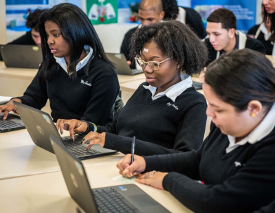

Amazon to fund computer science courses in over 1,000 US high schools

# Amazon to fund computer science courses in over 1,000 US high schools

[Sarah Perez](https://techcrunch.com/author/sarah-perez/)[@sarahintampa](https://twitter.com/sarahintampa) / 8 hours ago

[Amazon’s i](https://crunchbase.com/organization/amazon) recent [investments in NYC educational initiatives](https://techcrunch.com/2019/02/14/amazons-nyc-educational-investments-will-continue-despite-cancellation-of-new-york-hq2/) will continue, despite the company pulling its HQ2 plans for the area. But the company isn’t stopping there. Today, Amazon announced it will bring computer science courses to more than 1,000 high schools in all 50 states and the District of Columbia. The classes, which are funded through [Amazon’s Future Engineer program](https://blog.aboutamazon.com/community/building-futures-in-computer-science), will reach tens of thousands of students nationwide.

The Future Engineer program’s goal is to bring computer science courses to more than 100,000 underprivileged kids in 2,000 low-income high schools across the U.S. It also awards 100 students per year with four-year $10,000 scholarships and offers internships at Amazon.

The U.S. high schools will offer the Intro to Computer Science and AP Computer Science classes through the curriculum provider Edhesive, says Amazon. The funding will provide the lessons, tutorials, professional development for teachers, a fully sequenced and paced digital curriculum for students and live online support for both students and teachers alike.

All students in the courses also receive a membership to [AWS Educate](https://aws.amazon.com/education/awseducate/14-and-older/), which gives them free computing power in the AWS Cloud for their class projects and other content to learn about cloud computing.

While Amazon obviously has a vested interest in ensuring the next generation of engineers are learning its own technologies, including AWS, investments like this help to level the playing field some by offering more students the opportunity to study computer science — which can lead to their ability to get into higher-paying jobs down the road, including those outside of Amazon.

The Amazon Future Engineer program itself is part of Amazon’s larger $50 million investment in computer science and STEM education.

Amazon notes that there will be 1.4 million computer science jobs available by 2020, according to the Bureau of Labor statistics, but only 400,000 computer science grads with the skills needed to apply for them. Computer science is also the fastest-growing STEM profession, but only 8 percent of STEM grads are earning a computer science degree. And only a small fraction of those are from underprivileged background, Amazon says.

“We want to ensure that every child, especially those from underprivileged communities, has an opportunity to study computer science,” said Jeff Wilke, CEO Worldwide Consumer, Amazon, in a statement. “We are excited more than 1,000 schools will now provide these courses, and look forward to adding 1,000 more schools over the coming months.”

[## Disrupt SF 2019](https://techcrunch.com/events/disrupt-sf-2019/?ref=rightrailpromo#tickets)

[Save $500 on passes when registration opens](https://techcrunch.com/events/disrupt-sf-2019/?ref=rightrailpromo#tickets)

San FranciscoOct 2 - 4

[Sign Up Now](https://techcrunch.com/events/disrupt-sf-2019/?ref=rightrailpromo#tickets)