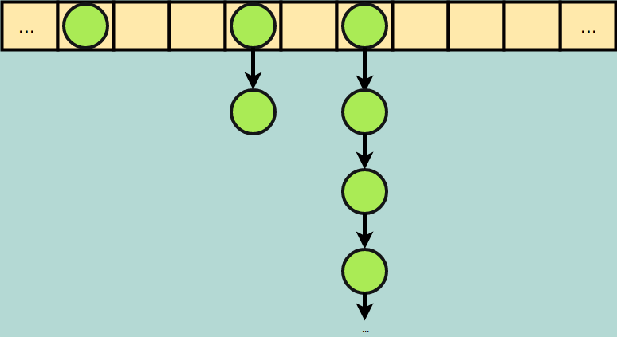
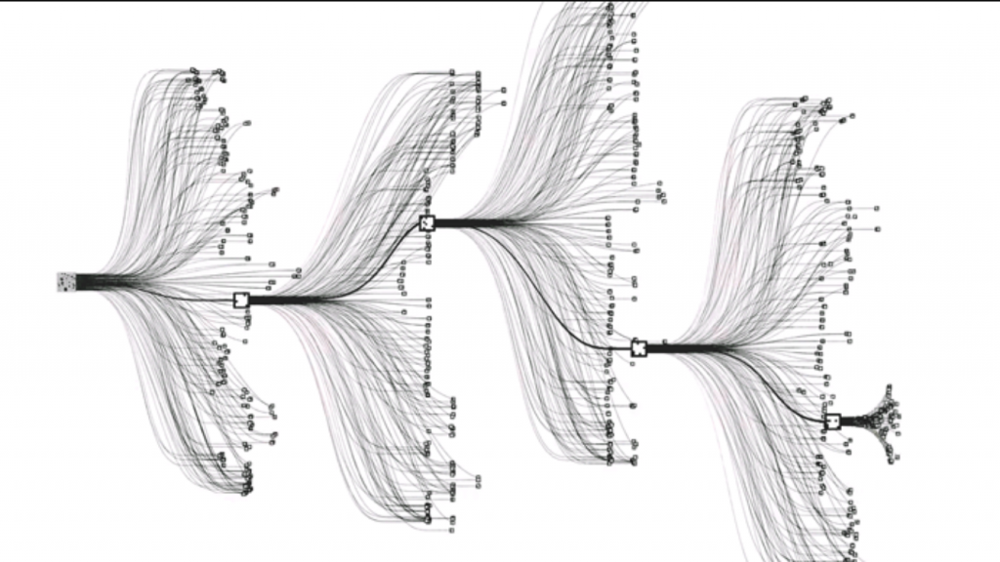
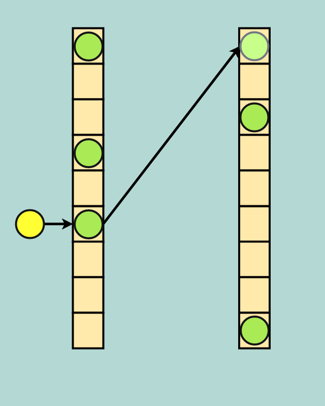
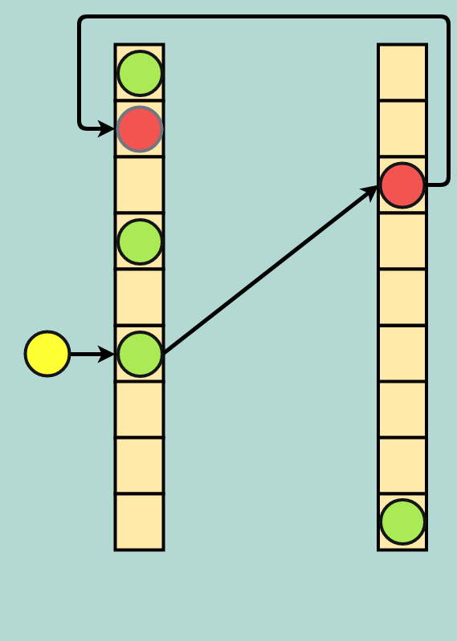

An Introduction to Hashing in the Era of Machine Learning

# An Introduction to Hashing in the Era of Machine Learning

Photo by [Tobias Fischer](https://unsplash.com/photos/PkbZahEG2Ng?utm_source=unsplash&utm_medium=referral&utm_content=creditCopyText) on [Unsplash](https://unsplash.com/?utm_source=unsplash&utm_medium=referral&utm_content=creditCopyText)

In December 2017, researchers at Google and MIT published a [provocative research paper](https://www.arxiv-vanity.com/papers/1712.01208/) about their efforts into “learned index structures”. The research is quite exciting, as the authors state in the abstract:

*“[…] we believe that the idea of replacing core components of a data management system through learned models has far reaching implications for future systems designs and that this work just provides a glimpse of what might be possible.”*

Indeed the results presented by the team of Google and MIT researchers includes findings that could signal new competition for the most venerable stalwarts in the world of indexing: the B-Tree and the Hash Map. The engineering community is ever abuzz about the future of machine learning; as such the research paper has made its rounds on Hacker News, Reddit, and through the halls of engineering communities worldwide.

New research is an excellent opportunity to reexamine the fundamentals of a field; and it’s not often that something as fundamental (and well studied) as indexing experiences a breakthrough. This article serves as an introduction to hash tables, an abbreviated examination of what makes them fast and slow, and an intuitive view of the machine learning concepts that are being applied to indexing in the paper.

> (If you’re already familiar with hash tables, collision handling strategies, and hash function performance considerations; you might want to skip ahead, or skim this article and read the three articles linked at the end of this article for a deeper dive into these topics.)

In response to the findings of the Google/MIT collaboration, Peter Bailis and a team of Stanford researchers went back to the basics and warned us not to [throw out our algorithms book just yet](http://dawn.cs.stanford.edu/2018/01/11/index-baselines/). Bailis’ and his team at Stanford recreated the learned index strategy, and were able to achieve similar results without any machine learning by using a classic hash table strategy called Cuckoo Hashing.

In a separate response to the Google/MIT collaboration, Thomas Neumann [describes another way to achieve performance similar to the learned index strategy](http://databasearchitects.blogspot.de/2017/12/the-case-for-b-tree-index-structures.html) without abandoning the well tested and well understood B-Tree. Of course, these conversations, comparisons, and calls for further research, are exactly what gets the Google/MIT team excited; in the paper they write:

> “It is important to note that we do not argue to completely replace traditional index structures with learned index structures. Rather, we outline a novel approach to build indexes, which complements existing work and, arguably, opens up an entirely new research direction for a decades-old field.”

So what’s all the fuss about? Are hash maps and B-Trees destined to become aging hall-of-famers? Are machines about to rewrite the algorithms textbook? What would it really mean for the computing world if machine learning strategies *really are *better than the general purpose indexes we know and love? Under what conditions will the learned indexes outperform the old standbys?

To address these questions, we need to understand what an index is, what problems they solve, and what makes one index preferable to another.

### What Is Indexing?

At its core, indexing is about making things easier to find and retrieve. Humans have been indexing things since long before the invention of the computer. When we use a well organized filing cabinet, we’re using an indexing system. Full volume encyclopedias could be considered an indexing strategy. The labeled aisles in a grocery store are a kind of indexing. Anytime we have lots of things, and we need to find or identify a specific thing within the set, an index can be used to make finding that thing easier.

Zenodotus, the first librarian of the Great Library of Alexandria, was charged with organizing the library’s grand collection. The system he devised included grouping books into rooms by genre, and shelving books alphabetically. His peer Callimachus went further, introducing a central catalogue called the *pinakes, *which allowed a librarian to lookup an author and determine where each book by that author could be found in the library*. *(You can read more about [the ancient library here](http://unllib.unl.edu/LPP/phillips.htm)). Many more innovations have since been made in library indexing, including the Dewey Decimal System, which was invented in 1876.

In the Library of Alexandria, indexing was used to map a piece of information (the name of a book or author) to a physical location inside the library. Although our computers are digital devices, any particular piece of data in a computer actually does reside in at least one *physical location*. Whether it’s the text of this article, the record of your most recent credit card transaction, or a video of a startled cat, the data exists in some physical place(s) on your computer.

In RAM and solid state hard drives, data is stored as electrical voltage traveling through a series of many [transistors](https://en.wikipedia.org/wiki/Transistor). In an older spinning disk hard drive, data is stored in a magnetic format on a specific arc of the disk. When we’re indexing information in computers, we create algorithms that map some portion of the data to the physical location within our computer. We call this location an *address*. In computers, the things being indexed are always bits of data, and indexes are used to map those data to their addresses.

Databases are the quintessential use-case for indexing. Databases are designed to hold lots of information, and generally speaking we want to retrieve that information efficiently. Search engines are, at their core, giant indexes of the information available on the Internet. Hash tables, binary search trees, tries, B-Trees, and bloom filters are all forms of indexing.

It’s easy to imagine the challenge of finding something specific in the labyrinthine halls of the massive Library of Alexandria, but we shouldn’t take for granted that the size of human generated data is growing exponentially. The amount of data available on the Internet has far surpassed the size of any individual library from any era, and Google’s goal is to index *all of it.* Humans have created many tactics for indexing; here we examine one of the most prolific data structures of all time, which happens to be an indexing structure: the hash table.

### What is a Hash Table?

Hash tables are, at first blush, simple data structures based on something called a hash function. There are many kinds of hash functions that behave somewhat differently and serve different purposes; for the following section we will be describing only hash functions that are used in a hash table, not cryptographic hash functions, checksums, or any other type of hash function.

A hash function accepts some input value (for example a number or some text) and returns an integer which we call the **hash code **or **hash value. **For any given input, the hash code is always the same; which just means the hash function must be deterministic.

When building a hash table we first allocate some amount of space ([in memory or in storage](https://www.backblaze.com/blog/whats-diff-ram-vs-storage/)) for the hash table — you can imagine creating a new array of some arbitrary size. If we have a lot of data, we might use a bigger array; if we have less data we can use a smaller array. Any time we want to index an individual piece of data we create a **key/value **pair where the key is some identifying information about the data (the primary key of a database record, for example) and the value is the data itself (the whole database record, for example).

To insert a value into a hash table we send the key of our data to the hash function. The hash function returns an integer (the hash code), and we use that integer — modulo the size of the array — as the storage index for our value within our array. If we want to get a value back out of the hash table, we simply recompute the hash code from the key and fetch the data from that location in the array. This location is the physical address of our data.

In a library using the Dewey Decimal system the “key” is the series of classifications the book belongs to and the “value” is the book itself. The “hash code” is the numerical value we create using the Dewey Decimal process. For example a book about analytical geometry gets a “hash code” of 516.3. Natural sciences is 500, mathematics is 510, geometry is 516, analytical geometry is 516.3. In this way the Dewey Decimal system could be considered a hash function for books; the books are then placed on the set of shelves corresponding to their hash values, and arranged alphabetically by author within their shelves.

Our analogy is not a perfect one; unlike the Dewey Decimal numbers, a hash value used for indexing in a hash table is typically not informative — in a perfect metaphor, the library catalogue would contain the exact location of every book based on one piece of information about the book (perhaps its title, perhaps its author’s last name, perhaps its ISBN number…), but the books would not be grouped or ordered in any meaningful way except that all books with the **same**  **key **would be put on the same shelf, and you can look-up that shelf number in the library catalogue using the key.

Fundamentally, this simple process is all a hash table does. However, a great deal of complexity has been built on top of this simple idea in order to ensure correctness and efficiency of hash based indexes.

### Performance Considerations of Hash Based Indexes

The primary source of complexity and optimization in a hash table stems from the problem of hash collisions. A collision occurs when two or more keys produce the same hash code. Consider this simple hash function, where the key is assumed to be an integer:

A simple hash function

Although any unique integer will produce a unique result when multiplied by 13, the resulting hash codes will still eventually repeat because of [the pigeonhole principle](https://en.wikipedia.org/wiki/Pigeonhole_principle): there is no way to put 6 things into 5 buckets without putting at least two items in the same bucket. Because we have a finite amount of storage, we have to use the hash value modulo the size of our array, and thus we will always have collisions.

Momentarily we will discuss popular strategies for handling these inevitable collisions, but first it should be noted that the choice of a hash function can increase or decrease the **rate **of collisions. Imagine we have a total of 16 storage locations, and we have to choose between these two hash functions:

In this case, if we were to hash the numbers 0–32, hash_b would produce 28 collisions; 7 collisions each for the hash values 0, 4, 8, and 12 (the first four insertions did not collide, but every subsequent insertion did). hash_a, however, would evenly spread the collisions, one collision per index, for 16 collisions total. This is because in hash_b, the number we’re multiplying by (4) is a factor of the hash table’s size (16). Because we chose a prime number in hash_a, unless our table size is a multiple of 13, we won’t have the grouping problem we see with hash_b.

To see this, you can run the following script:

Better hash functions spread collisions more uniformly across the table.

This hashing strategy, multiplying an incoming key by a prime number, is actually relatively common. The prime number reduces the likelihood that the output hash code shares a common factor with the size of the array, reducing the chance of a collision. Because hash tables have been around for quite some time, there are plenty of other competitive hash functions available to choose from.

[Multiply-shift hashing](https://lemire.me/blog/2016/06/27/a-fast-alternative-to-the-modulo-reduction/)is similar to the prime-modulo strategy, but avoids the relatively expensive modulo operation in favor of the very fast shift operation. [MurmurHash](https://en.wikipedia.org/wiki/MurmurHash) and [Tabulation Hashing](https://en.wikipedia.org/wiki/Tabulation_hashing) are strong alternatives to the multiply-shift family of hash functions. Benchmarking these hash functions involves examining their speed to compute, the distribution of produced hash codes, and their flexibility in handling different sorts of data (for example, strings and floating point numbers in addition to integers). For an example of a benchmarking suite for hash functions, checkout [SMhasher](https://github.com/rurban/smhasher).

If we choose a good hash function we can reduce our collision rate and still calculate a hash code quickly. Unfortunately, regardless of the hash function we choose, eventually we’ll have a collision. Deciding how to handle collisions will have a significant impact on the overall performance of our hash table. Two common strategies for collision handling are [chaining](http://www.cs.rmit.edu.au/online/blackboard/chapter/05/documents/contribute/chapter/05/chaining.html), and [linear probing](https://en.wikipedia.org/wiki/Linear_probing).

Chaining is straightforward and easy to implement. Instead of storing a single item at each index of our hash table, we store the head pointer of a linked list. Anytime an item collides with an already-filled index via our hash function, we add it as the final element in the linked list. Lookups are no longer strictly “constant time” since we have to traverse a linked list to find any particular item. If our hash function produces many collisions, we will have very long chains, and the performance of the hash table will degrade over time due to the longer lookups.

Chaining: repeated collisions create longer linked lists, but do not occupy any additional indexes of the array.

Linear probing is still simple in concept, but trickier to implement. In linear probing, every index in the hash table is still reserved for a single element. When a collision occurs at index i, we check if index i+1 is empty and if it is we store our data there; if i+1 also had an element, we check i+2, then i+3 and so on until we find an empty slot. As soon as we find an empty slot, we insert the value. Once again, lookups may no longer be strictly constant time; if we have multiple collisions in one index we will end up having to search a long series of items before we find the item we’re looking for. What’s more, every time we have a collision we increase the chance of subsequent collisions because (unlike with chaining) the incoming item ultimately occupies a new index.

Linear Probing: Given the same data and hash function as the above chaining image we get a new result. Elements that resulted in a collision (colored red) now reside in the same array, and occupy indexes sequentially starting from the collision index.

It might sound like chaining is the better option, but linear probing is widely accepted as having better performance characteristics. For the most part, this is due to the poor [cache utilization](https://en.wikipedia.org/wiki/Cache_%28computing%29) of linked lists, and the favorable cache utilization of arrays. The short version is that examining all the links in a linked list is significantly slower than examining all the indices of an array of the same size. This is because each index is *physically adjacent *in an array*. *In a linked list, however, each new node is given a location at the time of its creation. This new node is not necessarily physically adjacent to its neighbors in the list. The result is that in a linked list nodes that are “next to each other” in the list order are rarely *physically *next to each other in terms of the actual location inside our RAM chip. Because of the way our CPU cache works, accessing adjacent memory locations is fast, and accessing memory locations at random is significantly slower. Of course the [long version](https://www.akkadia.org/drepper/cpumemory.pdf) is a bit more complex.

### Machine Learning Fundamentals

To understand how machine learning was used to recreate the critical features of a hash table (and other indexes), it’s worth quickly revisiting the main idea of statistical modeling. A model, in statistics, is a function that accepts some vector as input and returns either: a label (for classification) or a numerical value (for regression). The input vector contains all the relevant information about a data-point, and the label/numerical output is the model’s prediction.

In a model that predicts if a high school student will get into Harvard, the vector might contain a student’s GPA, SAT Score, number of extra-curricular clubs to which that student belongs, and other values associated with their academic achievement; the label would be true/false (for will get into/won’t get into Harvard).

In a model that predicts mortgage default rates, the input vector might contain values for credit score, number of credit card accounts, frequency of late payments, yearly income, and other values associated with the financial situation of people applying for a mortgage; the model might return a number between 0 and 1, representing the likelihood of default.

Typically, machine learning is used to create a **statistical model**. Machine learning practitioners combine a large dataset with a machine learning algorithm, and the result of running the algorithm on the dataset is a **trained model.** At its core, machine learning is about creating algorithms that can automatically build accurate models from raw data**  **without the need for the humans to help the machine “understand” what the data actually represents. This is different from other forms of artificial intelligence where humans examine the data extensively, give the computer clues about what the data means (e.g. by defining [heuristics](https://en.wikipedia.org/wiki/Heuristic_%28computer_science%29)), and define how the computer will use that data (e.g. using [minimax](https://en.wikipedia.org/wiki/Minimax) or [A*](https://en.wikipedia.org/wiki/A*_search_algorithm)). In practice, though, machine learning is frequently combined with classical non-learning techniques; an AI agent will frequently use both learning, and non-learning tactics to achieve its goals.

Consider the famous Chess Playing AI “Deep Blue” and the recently acclaimed Go playing AI “AlphaGo”. Deep Blue was an entirely non-learning AI; human computer programmers collaborated with human chess experts to create a function which takes the state of a chess game as input (the position of all the pieces, and which player’s turn it is) and returned a value associated with how “good” that state was for Deep Blue. Deep Blue never “learned” anything — human chess players painstakingly codified the machine’s evaluation function. Deep Blue’s primary feature was the tree search algorithm that allowed it to compute all the possible moves, and all of it’s opponent’s possible responses to those moves, many moves into the future.

A visualization of AlphaGo’s tree search. [Source](https://blogs.loc.gov/maps/category/game-theory/).

AlphaGo also performs a tree search. Just like Deep Blue, AlphaGo looks several moves ahead for each possible move. Unlike Deep Blue, though, AlphaGo created its own evaluation function without explicit instructions from Go experts. In this case the evaluation function is a **trained model. **AlphaGo’s machine learning algorithm accepts as its input vector the state of a Go board (for each position, is there a white stone, a black stone, or no stone) and the label represents which player won the game (white or black). Using that information, across hundreds of thousands of games, a machine learning algorithm decided how to evaluate any particular board state. AlphaGo taught itself which moves will provide the highest likelihood of a win by looking at millions of examples.

*(This is a rather significant simplification of exactly how something like AlphaGo works, but the mental model is a helpful one. Read more about AlphaGo from the *[*creators of AlphaGo here*](https://deepmind.com/blog/alphago-zero-learning-scratch/)*.)*

### Models as Indexes, A Departure From ML Norms

In their paper, the Google researchers start with the premise that indexes are models; or at least that machine learning models could be used as indexes. The argument goes: models are machines that take in some input, and return a label; if the input is the key and the label is the model’s estimate of the memory address, then a model could be used as an index. Although that sounds pretty straightforward, the problem of indexing is not obviously a perfect fit for machine learning. Here are some areas where the Google team had to depart from machine learning norms to achieve their goals.

Typically, a machine learning model is trained on data it knows, and is tasked with giving an estimate for data it has not seen. When we’re indexing data, an estimate is not acceptable. An index’s *only job* is to actually find the *exact location *of some data in memory. An out-of-the-box neural net (or other machine learner) won’t provide this level of precision. Google tackled this problem by tracking the maximum (most positive) and minimum (most negative) error experienced for every node during training. Using these values as boundaries, the ML index can perform a search within those bounds to find the exact location of the element.

Another departure is that machine learning practitioners generally have to be careful to avoid “overfitting” their model to the training data; such an “over-fit” model will produce highly accurate predictions for data it has been trained on, but will often perform abysmally on data outside of the training set. Indexes, on the other hand, are by definition overfit. The training data **is the data being indexed**, which makes it the test data as well. Because lookups must happen on the actual data that was indexed, overfitting is somewhat more acceptable in this application of machine learning. Simultaneously though, if the model is overfit to existing data, then adding an item to the index might produce a horribly wrong prediction; as noted in the paper:

> “[…], there seems to be an interesting trade-off in the generalizability of the model and the “last mile” performance; the better the “last mile” prediction, arguably, the more the model is overfitting and less able to generalize to new data items.”

Finally, training a model is normally the most expensive part of the process. Unfortunately, in a wide array of database applications (and other indexing applications) adding data to the index is rather common. The team is candid about this limitation:

> “So far our results focused on index-structures for read-only in-memory database systems. As we already pointed out, the current design, even without any significant modifications, is already useful to replace index structures as used in data warehouses, which might be only updated once a day, or BigTable [> [> 18](https://www.arxiv-vanity.com/papers/1712.01208/#bib.bib18)> ] where B-Trees are created in bulk as part of the SStable merge process. ” — *> (SSTable is a key component of Google’s “*> [*> BigTable*](https://static.googleusercontent.com/media/research.google.com/en//archive/bigtable-osdi06.pdf)*> ”, *> [*> related reading on SSTable*](https://www.igvita.com/2012/02/06/sstable-and-log-structured-storage-leveldb/)*> )*

### Learning to Hash

The paper examined (among other things) the possibility of using a machine learning model to replace a standard hash function. One of the questions the researchers are interested in understanding is: does knowing the data’s distribution can help us create better indexes? With the traditional strategies we explored above (shift-multiply, murmur hash, prime number multiplication…) the distribution of the data is explicitly ignored. Each incoming item is treated as an independent value, not as part of a larger dataset with valuable properties to take into account. A result is that even in many state of the art hash tables, there is a lot of wasted space.

It is common for implementations of hash tables to have about 50% memory utilization, meaning the hash table takes up twice as much space as the data being stored actually needs. Said another way, half of the addresses in the hash table remain empty when we store exactly as many items as there are buckets in the array. By replacing the hash function in a standard hash table implementation with a machine learning model, researchers found that they could significantly decrease the amount of wasted space.

This is not a particularly surprising result: by training over the input data, the learned hash function can more evenly distribute the values across some space because the ML model already knows the distribution of the data!**  **It is, however, a potentially powerful way to significantly reduce the amount of storage required for hash-based indexes. This comes with a tradeoff: the ML model is somewhat slower to compute than the standard hash functions we saw above; and requires a training step that standard hash functions do not.

Perhaps using an ML based hash function could be used in situations where effective memory usage is a critical concern but where computational power is not a bottleneck. The research team at Google/MIT suggests data warehousing as a great use case, because the indexes are already rebuilt about once daily in an already expensive process; using a bit more compute time to gain significant memory savings could be a win for many data warehousing situations.

But there is one more plot twist, enter cuckoo hashing.

### Cuckoo Hashing

Cuckoo hashing was invented in 2001, and is named for the Cuckoo family of birds. Cuckoo hashing is an alternative to chaining and linear probing for collision handling (not an alternative hash function). The strategy is so named because in some species of Cuckoos, females who are ready to lay eggs will find an occupied nest, and remove the existing eggs from it in order to lay her own. In cuckoo hashing, incoming data steals the addresses of old data, just like cuckoo birds steal each others’ nests.

Here’s how it works: when you create your hash table you immediately break the table into two address spaces; we will call them the **primary **and **secondary **address spaces. Additionally, you also initialize two separate hash functions, one for each address space. These hash functions might be very similar — for example they could both be from the “prime multiplier” family, where each hash function uses a different prime number. We will call these the **primary **and **secondary** hash function.

Initially, inserts to a cuckoo hash only utilize the primary hash function and the primary address space. When a collision occurs, the new data evicts the old data; the old data is then hashed with the **secondary hash function** and put into the **secondary address space**.

Cuckoo for Collisions: Yellow data evicts green data, and green data finds a new home in the secondary address space (the faded green dot in the top index of the secondary space)

If that secondary address space is already occupied, another eviction occurs and the data in the secondary address space is sent back to the primary address space. Because it is possible to create an infinite loop of evictions, it is common to set a threshold of evictions-per-insert; if this number of evictions is reached the table is rebuilt, which may include allocating more space for the table and/or choosing new hash functions.

Double eviction: incoming yellow data evicts green; green evicts red; and red finds a new home in the primary address space (faded red dot)

This strategy is well known to be effective in memory constrained scenarios. The so called “power of two choices” allows a cuckoo hash to have stable performance even at very high utilization rates (something that is not true of chaining or linear probing).

Bailis’ and his team of researchers at Stanford have found that with a few optimizations, cuckoo hashing can be extremely fast and maintain high performance [even at 99% utilization](http://dawn.cs.stanford.edu/2018/01/11/index-baselines/). Essentially, cuckoo hashing can achieve the high utilization of the “machine learned” hash functions without an expensive training phase by leveraging the power of two choices.

### What’s Next For Indexing?

Ultimately, everyone is excited about the potential of indexing structures that learn. As more ML tools become available, and hardware advances like TPUs make machine learning workloads faster, indexing could increasingly benefit from machine learning strategies. At the same time, beautiful algorithms like cuckoo hashing remind us that machine learning is not a panacea. Work that combines the incredible power of both machine learning techniques, and age old theory like “the power of two choices” will continue to push the boundaries of computer efficiency and power.

It seems unlikely that the fundamentals of indexing will be replaced overnight by machine learning tactics, but the idea of self-tuning indexes is a powerful and exciting concept. As we continue to become more adept at harnessing machine learning, and as we continue to improve computers’ efficiency in processing machine learning workloads, new ideas that leverage those advances will surely find their way into mainstream use. The next [DynamoDB](https://aws.amazon.com/dynamodb/) or [Cassandra](http://cassandra.apache.org/) may very well leverage machine learning tactics; future implementations of PostgreSQL or MySQL could eventually adopt such strategies as well. Ultimately, it will depend on the success of future research, which will continue to build on both the state of the art non-learning strategies and the bleeding edge tactics of the “AI Revolution”.

Out of necessity, a number of details have been glossed over or simplified. The curious reader should follow up by reading:

- •[The Case For Learned Indexes (Google/MIT)](https://www.arxiv-vanity.com/papers/1712.01208/)
- •[Don’t Throw Out Your Algorithms Book Just Yet: Classical Data Structures That Can Outperform Learned Indexes (Stanford)](http://dawn.cs.stanford.edu/2018/01/11/index-baselines/) and;
- •[A Seven-Dimensional Analysis of Hashing Methods and its Implications on Query Processing](https://bigdata.uni-saarland.de/publications/p249-richter.pdf) (Saarland University)