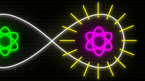
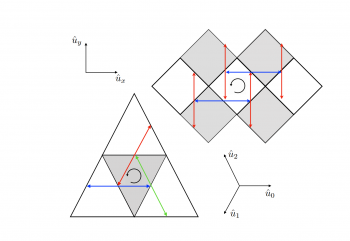

An important quantum algorithm may actually be a property of nature

### [Humans and Technology](https://www.technologyreview.com/humans-and-technology/)

# An important quantum algorithm may actually be a property of nature

## Evidence that quantum searches are an ordinary feature of electron behavior may explain the genetic code, one of the greatest puzzles in biology.

by [Emerging Technology from the arXiv](https://www.technologyreview.com/profile/emerging-technology-from-the-arxiv/)

Sep 12, 2019

#### Sign up for **The Download** — your daily dose of what's up in emerging technology

Also stay updated on MIT Technology Review initiatives and events?
YesNo

Back in 1996, a quantum physicist at Bell Labs in New Jersey published a new recipe for searching through a database of *N* entries. Computer scientists have long known that this process takes around *N* steps because in the worst case, the last item on the list could be the one of interest.

However, this physicist, Lov Grover, showed how the strange rules of quantum mechanics allowed the search to be done in a number of steps equal to the square root of *N*.

That was a big deal. Searching databases is a foundational task in computer science, used for everything from finding telephone numbers to breaking cryptographic codes. So any speed-up is a significant advance.

Quantum mechanics provided an additional twist. At the time, Grover’s recipe was only the second quantum algorithm that had been proved faster than its classical counterpart. (The first was Peter Shor’s algorithm for factoring numbers, which he discovered in 1994.) Grover’s work was an important factor in preparing the way for the quantum computing revolution that is still ongoing today.

But despite the interest, implementing Grover’s algorithm has taken time because of the significant technical challenges involved. The first quantum computer capable of implementing it appeared in 1998, but the first scalable version didn’t appear until 2017, and even then it worked with only three qubits. So new ways to implement the algorithm are desperately needed.

Today Stéphane Guillet and colleagues at the University of Toulon in France say this may be easier than anybody expected. They say they have evidence that Grover’s search algorithm is a naturally occurring phenomenon. “We provide the first evidence that under certain conditions, electrons may naturally behave like a Grover search, looking for defects in a material,” they say.

That has obvious implications for quantum computing, but its real import may be much more profound. For some time, theorists have debated whether quantum search could explain one of the greatest mysteries about the origin of life. The idea that Grover searches occur in nature could finally solve the conundrum.

First some background. Because it is so fundamental, Grover’s search algorithm can be reformulated in a variety of ways. One of these is as a quantum walk across a surface—the way a quantum particle would move randomly from one point to another.

##### What is quantum communication?

###### [Explainer: What is quantum communication?](https://www.technologyreview.com/s/612964/what-is-quantum-communications/)

Researchers and companies are creating ultra-secure communication networks that could form the basis of a quantum internet. This is how it works.

Clearly, this process is a kind of search of two-dimensional space. But because a quantum particle can explore many paths at the same time, it is much faster than a classical search.

The nature of the surface has an important influence on the search. For example, one type of surface consists of a square grid where the quantum particle has four possible moves at each vertex.

But there are many other possible grids; a triangular one, for example, where the quantum particle has three choices at each vertex. “The triangular grid is of particular interest because of its resemblance to several naturally occurring crystal-like materials,” say Guillet and co.

The team focused on simulating the way a Grover search works for electrons exploring triangular and square grids, but they also included other physically realistic effects, such as defects in the grid in the form of holes, and quantum properties such as interference effects.

The results are eye-opening. The question they ask is how quickly an electron can find the hole in a grid. And the team’s big breakthrough is to show that these simulations reproduce the way real electrons behave in real materials.

In other words, this is evidence that free electrons naturally implement the Grover search algorithm when moving across the surface of certain crystals.

That has immediate implications for quantum computing. “[This work] may be the path to a serious technological leap, whereby experimentalist would bypass the need for a full-fledged scalable and error-correcting Quantum Computer, and take the shortcut of looking for ‘natural occurrences’ of the Grover search instead,” say the team.

The work also has implications for our thinking about the genetic code and the origin of life. Every living creature on Earth uses the same code, in which DNA stores information using four nucleotide bases. The sequences of nucleotides encode information for constructing proteins from an alphabet of 20 amino acids.

But why these numbers—four and 20—and not some others? Back in 2000, just a few years after Grover published his work, [Apoorva Patel at the Indian Institute of Science in Bangalore showed how Grover’s algorithm could explain these numbers](https://arxiv.org/abs/quant-ph/0002037).

Patel’s idea is related to the way DNA is assembled inside cells. In this situation, the molecular machinery inside a cell must search through the molecular soup of nucleotide bases to find the right one. If there are four choices, a classical search takes four steps on average. So the machinery would have to try four different bases during each assembly step.

But a quantum search using Grover’s algorithm is much quicker: Patel showed that when there are four choices, a quantum search can distinguish between four alternatives in a single step. Indeed, four is optimal number.

This thinking also explains why there are 20 amino acids. In DNA, each set of three nucleotides defines a single amino acid. So the sequence of triplets in DNA defines the sequence of amino acids in a protein.

But during protein assembly, each amino acid must be chosen from a soup of 20 different options. Grover’s algorithm explains these numbers: a three-step quantum search can find an object in a database containing up to 20 kinds of entry. Again, 20 is the optimal number.

In other words, if the search processes involved in assembling DNA and proteins is to be as efficient as possible, the number of bases should be four and the number of amino acids should to be 20—exactly as is found. The only caveat is that the searches must be quantum in nature.

When Patel published his idea, quantum physicists immediately pooh-poohed it. At the time, they were bogged down in their own attempts to control quantum processes, which they could do only by isolating quantum particles in extreme environments such as at temperatures close to absolute zero.

The obvious problem, they said, was that living things operate in a warm, messy environment in which quantum states would be immediately destroyed.

Biologists were equally dismissive, saying that quantum processes couldn’t possibly be at work inside living things.

Since then, an increasing body of evidence has emerged that quantum processes play an important role in a number of biological mechanisms. Photosynthesis, for example, is now thought to be an essentially quantum process.

The work of Guillet and co throws a new perspective on all this. It suggests that Grover’s algorithm is not only possible in certain materials; it seems to be a property of nature. And if that’s true, then the objections to Patel’s ideas start to crumble.

It may be that life is just an example of Grover’s quantum search at work, and that this algorithm is itself a fundamental property of nature. That’s a Big Idea if ever there was one.

Ref: [arxiv.org/abs/1908.11213](https://arxiv.org/abs/1908.11213) : The Grover search as a naturally occurring phenomenon' class='jsx-671803276 js-evernote-checked' data-evernote-id='818'%3e%3c/path%3e%3c/svg%3e)

Share

[**](https://www.facebook.com/dialog/share?app_id=140586622674265&display=popup&title=An%20important%20quantum%20algorithm%20may%20actually%20be%20a%20property%20of%20nature&description=Evidence%20that%20quantum%20searches%20are%20an%20ordinary%20feature%20of%20electron%20behavior%20may%20explain%20the%20genetic%20code%2C%20one%20of%20the%20greatest%20puzzles%20in%20biology.&href=https%3A%2F%2Fwww.technologyreview.com%2Fs%2F614259%2Fan-important-quantum-algorithm-may-actually-be-a-property-of-nature%2F%3Futm_campaign%3Dsite_visitor.unpaid.engagement%26utm_source%3Dfacebook%26utm_medium%3Dsocial_share%26utm_content%3D2019-09-13)

[**](https://twitter.com/intent/tweet?text=An%20important%20quantum%20algorithm%20may%20actually%20be%20a%20property%20of%20nature%20-%20via%20%40techreview&url=https%3A%2F%2Fwww.technologyreview.com%2Fs%2F614259%2Fan-important-quantum-algorithm-may-actually-be-a-property-of-nature%2F%3Futm_campaign%3Dsite_visitor.unpaid.engagement%26utm_source%3Dtwitter%26utm_medium%3Dsocial_share%26utm_content%3D2019-09-13)

[**](https://reddit.com/submit?text=An%20important%20quantum%20algorithm%20may%20actually%20be%20a%20property%20of%20nature&url=https%3A%2F%2Fwww.technologyreview.com%2Fs%2F614259%2Fan-important-quantum-algorithm-may-actually-be-a-property-of-nature%2F%3Futm_campaign%3Dsite_visitor.unpaid.engagement%26utm_source%3Dreddit%26utm_medium%3Dsocial_share%26utm_content%3D2019-09-13)

[**](https://linkedin.com/shareArticle?text=An%20important%20quantum%20algorithm%20may%20actually%20be%20a%20property%20of%20nature&url=https%3A%2F%2Fwww.technologyreview.com%2Fs%2F614259%2Fan-important-quantum-algorithm-may-actually-be-a-property-of-nature%2F%3Futm_campaign%3Dsite_visitor.unpaid.engagement%26utm_source%3Dlinkedin%26utm_medium%3Dsocial_share%26utm_content%3D2019-09-13&summary=Evidence%20that%20quantum%20searches%20are%20an%20ordinary%20feature%20of%20electron%20behavior%20may%20explain%20the%20genetic%20code%2C%20one%20of%20the%20greatest%20puzzles%20in%20biology.)

[**](https://api.whatsapp.com/send?text=An%20important%20quantum%20algorithm%20may%20actually%20be%20a%20property%20of%20nature%20https%3A%2F%2Fwww.technologyreview.com%2Fs%2F614259%2Fan-important-quantum-algorithm-may-actually-be-a-property-of-nature%2F%3Futm_campaign%3Dsite_visitor.unpaid.engagement%26utm_source%3Dwhatsapp%26utm_medium%3Dsocial_share%26utm_content%3D2019-09-13)

[**](https://www.technologyreview.com/s/614259/an-important-quantum-algorithm-may-actually-be-a-property-of-nature/mailto:?subject=An%20important%20quantum%20algorithm%20may%20actually%20be%20a%20property%20of%20nature&body=From%20MIT%20Technology%20Review%3A%0A%0AAn%20important%20quantum%20algorithm%20may%20actually%20be%20a%20property%20of%20nature%0AEvidence%20that%20quantum%20searches%20are%20an%20ordinary%20feature%20of%20electron%20behavior%20may%20explain%20the%20genetic%20code%2C%20one%20of%20the%20greatest%20puzzles%20in%20biology.%0A%0Ahttps%3A%2F%2Fwww.technologyreview.com%2Fs%2F614259%2Fan-important-quantum-algorithm-may-actually-be-a-property-of-nature%2F%3Futm_campaign%3Dsite_visitor.unpaid.engagement%26utm_source%3Demail%26utm_medium%3Dsocial_share%26utm_content%3D2019-09-13)

Link

Author

[Emerging Technology from the arXiv](https://www.technologyreview.com/profile/emerging-technology-from-the-arxiv/)