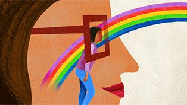
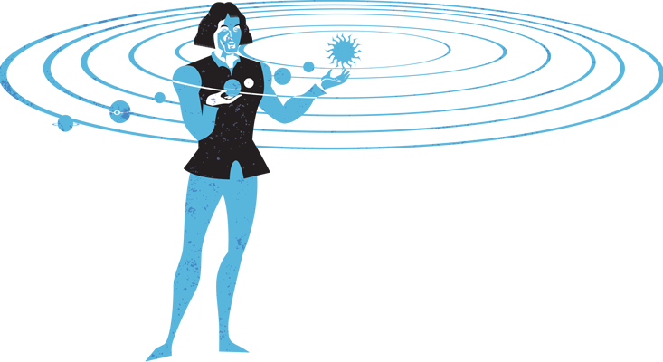
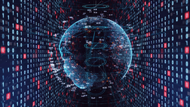
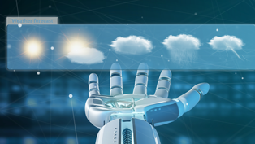
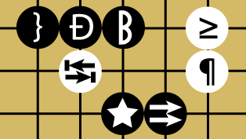
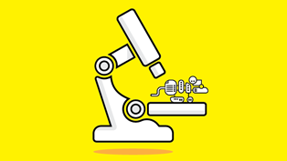
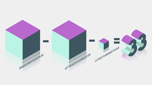

Are Neural Networks About to Reinvent Physics? - Issue 78: Atmospheres - Nautilus

 [ ](https://www.paypal.com/cgi-bin/webscr?cmd=_s-xclick&hosted_button_id=Q6JLSZ3H4UFVC)

|     |     |     |
| --- | --- | --- |
| [Numbers](http://nautil.us/term/l/Numbers) |     | [Math](http://nautil.us/term/f/Math) |

# Are Neural Networks About to Reinvent Physics?

## The revolution of machine learning has been greatly exaggerated.

By Gary Marcus & Ernest DavisNovember 21, 2019

- [*c* Add a comment](http://nautil.us/issue/78/atmospheres/are-neural-networks-about-to-reinvent-physics#comm)

- [*f* Facebook](https://www.facebook.com/sharer/sharer.php?s=100&p%5Bsite_name%5D=Nautilus&p%5Btype%5D=website&p%5Burl%5D=http%3A%2F%2Fnautil.us%2Fissue%2F78%2Fatmospheres%2Fare-neural-networks-about-to-reinvent-physics&p%5Btitle%5D=Are+Neural+Networks+About+to+Reinvent+Physics%3F+-+Issue+78%3A+Atmospheres+-+Nautilus&p%5Bsummary%5D=Can+AI+teach+itself+the+laws+of+physics%3F+Will+classical+computers+soon+be+replaced+by+deep+neural+networks%3F+Sure+looks+like+it%2C+if%26%238230%3B&p%5Bimages%5D%5B0%5D=http%3A%2F%2Fstatic.nautil.us%2F16597_5c08322f5911832e1f2a2f2f5e7de7d6.png)

- [*t* Twitter](https://twitter.com/share?url=http%3A%2F%2Fnautil.us%2Fissue%2F78%2Fatmospheres%2Fare-neural-networks-about-to-reinvent-physics&text=Are+Neural+Networks+About+to+Reinvent+Physics%3F&via=NautilusMag)

- [*m* Email](http://nautil.us/issue/78/atmospheres/are-neural-networks-about-to-reinvent-physicsmailto:?subject=Nautilus:%20Are%20Neural%20Networks%20About%20to%20Reinvent%20Physics?&body=I%20saw%20this%20article%20on%20Nautil.us%20and%20wanted%20to%20share%20it%20with%20you.%0D%0A---------------------------%0D%0AAre%20Neural%20Networks%20About%20to%20Reinvent%20Physics?%0D%0AMath:The%20revolution%20of%20machine%20learning%20has%20been%20greatly%20exaggerated.%0D%0A%0D%0ACan%20AI%20teach%20itself%20the%20laws%20of%20physics?%20Will%20classical%20computers%20soon%20be%20replaced%20by%20deep%20neural%20networks?%20Sure%20looks%20like%20it,%20if%20you%E2%80%99ve%20been%20following%20the%20news,%20which%20lately%20has%20been%20filled%20with%20headlines%20like,%20%E2%80%9CA%20neural%20net%20solves%20the%20three-body%20problem%20100%20million%20times%20faster:%20Machine%20learning%20provides%20an%20entirely%20new%20way%20to%20tackle%20one%20of%20the%20classic%20problems%20of%20applied%20mathematics,%E2%80%9D%20and%20%E2%80%9CWho%20needs%20Copernicus%20if%20you%20have%20machine%20learning?%E2%80%9D.%0D%0A%0D%0Ahttp://nautil.us/issue/78/atmospheres/are-neural-networks-about-to-reinvent-physics)

- [*U* Sharing]()
- [*X* Reddit](http://www.reddit.com/submit?title=Are+Neural+Networks+About+to+Reinvent+Physics%3F&url=http%3A%2F%2Fnautil.us%2Fissue%2F78%2Fatmospheres%2Fare-neural-networks-about-to-reinvent-physics)

- [*Y* Stumbleupon](http://www.stumbleupon.com/badge/?url=http%3A%2F%2Fnautil.us%2Fissue%2F78%2Fatmospheres%2Fare-neural-networks-about-to-reinvent-physics)

- [*V* Tumblr](http://tumblr.com/share?s=&v=3&t=Are+Neural+Networks+About+to+Reinvent+Physics%3F&u=http%3A%2F%2Fnautil.us%2Fissue%2F78%2Fatmospheres%2Fare-neural-networks-about-to-reinvent-physics)

- [*L* Pocket](https://getpocket.com/save?url=http%3A%2F%2Fnautil.us%2Fissue%2F78%2Fatmospheres%2Fare-neural-networks-about-to-reinvent-physics&title=Are+Neural+Networks+About+to+Reinvent+Physics%3F)

Can AI teach itself the laws of physics? Will classical computers soon be replaced by deep neural networks? Sure looks like it, if you’ve been following the news, which lately has been filled with headlines like, “[A neural net solves the three-body problem 100 million times faster](https://www.technologyreview.com/s/614597/a-neural-net-solves-the-three-body-problem-100-million-times-faster/): Machine learning provides an entirely new way to tackle one of the classic problems of applied mathematics,” and “[Who needs Copernicus if you have machine learning](https://www.technologyreview.com/s/611798/who-needs-copernicus-if-you-have-machine-learning/)?”. The latter was described by another journalist, in an article called “[AI Teaches Itself Laws of Physics](https://www.unite.ai/ai-teaches-itself-laws-of-physics/),” as a “monumental moment in both AI and physics,” which “could be critical in solving quantum mechanics problems.”

> The trouble is, the authors have given no compelling reason to think that they could actually do this.

>

None of these claims is even close to being true. All derive from just two recent studies that use machine learning to explore different aspects of planetary motion. Both papers represent interesting attempts to do new things, but neither warrant the excitement. The exaggerated claims made in both papers, and the resulting hype surrounding these, are symptoms of a tendency among science journalists—and sometimes scientists themselves—to overstate the significance of new advances in AI and machine learning.

As always, when one sees large claims made for an AI system, the first question to ask is, “What does the system actually do?”

**The Three-Body Problem**

The three-body problem is the problem of predicting how three objects—typically planets or stars—move over time under mutual gravitational force. If there are only two bodies, then, as Newton proved, the behavior is simple: Each of the objects moves along a circle, an ellipse, or a hyperbola. But, as Newton and his successors also determined, when there are three or more bodies involved, the behaviors can become very strange and complex. There is no simple mathematical formula; and accurate prediction over extended periods of time becomes very difficult. Finding good ways to calculate solutions to the three-body problem and the *n*-body problem (the same problem, with more objects) has been a major challenge for computational physics for 300 years. The  slew of “AI that solves the three-body problem” articles were based on an article in arXiv entitled “[Newton vs The Machine: Solving The Chaotic Three-Body Problem Using Deep Neural Networks](https://arxiv.org/abs/1910.07291).”

As is often the case, the technical article is less over the top than the popular ones, but, for a technical scientific article, this one is still pretty ambitious. It ends with the prediction that techniques developed for a narrow case should extend both to the general three-body problem and then ultimately to the four- and five-body problems and other chaotic systems, which could conceivably constitute a genuine revolution.

The trouble is, the authors have given no compelling reason to think that they could actually do this. In fact, they haven’t even engaged in the full breadth of the existing three-body problem. Instead, they focused only on a special case of the three-body problem, involving three particles of equal mass starting from specified positions with zero velocity.

Even here, they are entirely dependent on a conventional physics engine or simulator—which is to say no AI, no machine learning, just traditional numerical solution of the differential equations of motion—to generate the trajectories of motion over time from 10,000 different starting positions.

> The media enthusiasm is sending the wrong impression, making it sound like any old problem can be solved with a neural network.

They then used this classically-derived database as input, to train the neural network. In testing the neural network on new examples, whose true solution was also calculated by the simulator, they found that the neural network could predict the later positions of the particles with reasonable accuracy, orders of magnitude faster than the conventional simulator.

In essence, what they were doing was to use the neural network as a new tool for interpolating from known values derived using an external, classical system. The neural network may be better at interpolation with a smooth space of values than other techniques, but most of the work comes from the external prior system doing the work. And, crucially, they haven’t shown that the same sort of interpolation would actually work in the more complex physics of the actual world, even for simple cases (particles of different masses), let alone in situations with more bodies than just three.

Meanwhile, in technical terms, even within the three-body problem, the class of problems they have solved has is an easy subset viz. two degrees of freedom—that is, a problem instance is determined by two numerical parameters—whereas the general three-body problem has 10 degrees of freedom. In their limited version of the problem, the only choice you have in formulating a problem that fundamentally changes the behavior is where to place the third object relative to the first two. In the full problem, which they didn’t attempt, you can additionally choose the masses and initial velocities of the second and third objects; and each of these choices can radically change how the system evolves over time.

[Also in Math](http://nautil.us/term/f/Math)

#### [The Deceptions of Luck](http://nautil.us/issue/44/Luck/the-deceptions-of-luck)

By David J. Hand

Would you say you are a lucky person? Have unexpected things turned up which made your life better? I don’t mean something as extreme as a major lottery win, but perhaps getting a job because a stronger candidate dropped out...**[READ MORE](http://nautil.us/issue/44/Luck/the-deceptions-of-luck)**

And we know that the complexity of this kind of problem tends to increase exponentially with the number of degrees of freedom. So the problem they have solved is not five times easier than the general problem, it is vastly easier. And the problem gets rapidly worse as you add more points: the four-body problem has 17 degrees of freedom, the five-body has 24, the *n*-body has 7*n*-11.

Second, if you only have to worry about two dimensions, then calculating 10,000 data points gives pretty good coverage. If, let’s say, you want to map out the shape of a mountain, and you measure the elevation at 10,000 points—essentially, every point on a 100 x 100 grid—then you can estimate the elevation at any point in between pretty reliably. Things get much more complex as the number of dimensions increases, and the possibility of smooth interpolation working diminishes.

Third, the scientists failed to wrestle with the 800-pound chaotic butterfly in the room: the high degree of dependence on starting conditions. Two slightly different starting conditions can lead to radically different outcomes. This is not a limitation of the algorithm that you used to make the prediction; it is an inherent characteristic of the problem. Therefore, claiming that a machine learning system has learned to predict a chaotic system over the long term is like saying that it has learned to predict the behavior of a random process, like thermal noise or radioactive decay.  It simply can’t be done, regardless of the algorithm. (Kudos to [Caroline Delbert](https://www.popularmechanics.com/science/a29714375/three-body-problem-unsolvable/) at *Popular Mechanics *for noticing this; most journalists missed it.)

Finally, even the comparison with a conventional simulator was flawed. Jonathan Goodman, of the math department at New York University, an expert on these kinds of dynamical systems, assures us that modern adaptive methods can compute these trajectories much faster than the timings quoted in the paper; the conventional simulator was a straw model.

**THE DISCOVERER:** It’s misleading to say a neural network infers the planets revolve around the sun. It doesn’t understand anything is revolving around anything. The system is a calculator, Copernicus is the discoverer.Mario Breda / Shutterstock

**Copernicus**

The situation with the Copernicus project is no better.

Here a different set of authors, [in work to be published](https://arxiv.org/abs/1807.10300) in *Physical Review Letters*, constructed a neural network designed to take as input numerical data from a physical process and extract the key parameters that determine the behavior of the process. They described four experiments involving simple physical systems of different kinds, in which their neural network succeeds as they had hoped.

The supposed rediscovery of the Copernican system from astronomical observation is what caused excitement in the popular press.

The trouble is that it is entirely misleading to say that their neural network infers that “the Earth and Mars revolve about the sun.” The neural network doesn’t actually understand that anything is revolving around anything, in a geometric sense; it has no sense of geometry and no idea what it would mean to revolve. All the neural network does is to extract the two numerical parameters involved; it has no idea that these represent angles from some fixed central point. As far as the network is concerned, these could be time-varying masses, or electric charges, or angles from two different central points. Correlations between data sources were extracted, but the system made no inferences about how those data sources related to the world; it is the human scientists who identify these as the angles of the Earth and Mars as measured from the sun, and who abstract the facts that such parameters are best interpreted as orbits. All of the real work of Copernicus’ actual discovery is done in advance; the system was a calculator, not a discoverer.

Further, in the synthetic data the authors generated, the Earth and Mars move in constant-velocity circular orbits in the same plane. In the real solar system, things are notably trickier: The plane of Mars’ orbit is tilted at 1.8o to the plane of the Earth’s orbit (the ecliptic). In consequence, the apparent position of Mars against the fixed stars does not just move on an east-west circle, as it would if the two orbits were co-planar; it also moves back and forth on a north-south arc about 4o long. Viewed over a period of years, the position of Mars does not stay in a simple circular path in the sky; it lies in a strip that is 4o wide at its widest. Copernicus’ real challenge (solved long before modern computers, and without Big Data) was vastly more complex than what the network had to deal with.

**mars angles:** Mars is shown in its position furthest from the plane of the ecliptic. At that point the angle between the line from the sun to Mars and the ecliptic plane is then α = 1.8o. The position of the earth, when Mars is at that place, varies from year to year. Earth (1) is the closest that the earth comes to that position of Mars; when the earth is there, the angle between the line from earth to Mars and the ecliptic is β = 5.5o. Earth (2) is the furthest that earth gets from that position of Mars; when earth is there, the angle between the line from the earth to Mars and the ecliptic is γ = 1.1o. The vertical axis has been exaggerated, for clarity.

Four degrees may sound small, but by the standards of astronomical observations, it is huge.  By way of comparison, Orion’s belt is only 2.7o wide. Measurements in Ptolemy’s *Almagest *are mostly accurate to within about 1/10 of a degree.

Accordingly, both the Ptolemaic and the Copernican models of the solar system must have mechanisms to account for this transverse motion of Mars and the other planets. The Copernican model is therefore necessarily much more complicated than the simple model, that was produced (in a sense) by the neural network, in which the Earth and Mars revolve around the sun in circular orbits. In fact, the Copernican model included 48 epicycles, more than the Ptolemaic model, though it was simpler in other respects. The network system doesn’t even engage in the transverse movement.

Buoyed by their supposed success in duplicating Copernicus’ accomplishment, the authors and journalists look forward to the days when this kind of machine learning technology can make radical advances in theoretical physics. [An article](https://www.nature.com/articles/d41586-019-03332-7) in *Nature News* even enthused, “A neural network that teaches itself the laws of physics could help to solve quantum-mechanics mysteries.”

This is pure fantasy. In the examples in this experiment, the relation between the data observed and the parameters extracted is fairly straightforward. By contrast, in most of the experimental evidence for quantum theories, the relation between the observations and underlying theories is extraordinarily indirect and subtle and requires extremely ingenious theorizing to reveal; detecting correlations as these neural network systems does not even scratch the surface of what would be required.

**Why It Matters**

The flaws in these particular studies are not huge in themselves, but the way they have been reported is symptomatic of a problem that is in fact serious. Such overblown reports lend false credence to the idea—most notoriously promoted in Chris Anderson’s 2008 infamous article, “[The End of Theory: The Data Deluge Makes the Scientific Method Obsolete](https://www.wired.com/2008/06/pb-theory/),” and increasingly part of the general zeitgeist—that AI generally and deep learning theory will soon replace all other approaches to computation or even to knowledge, when nothing of the sort has been established. The media enthusiasm for deep learning is sending the wrong impression, making it sound like any old problem can be solved with a massive neural network and the right data set, without attention to the fundamentals in that domain.

The truth is that many of the hard, open problems in the world require a great deal of expertise in particular domains. In the sort of problems in these two papers, it means if someone wants to make a useful contribution to the solution of the three-body problem or similar problems, one has to spend serious time studying the sophisticated science of differential equations, numerical computation, and dynamical systems. In the domain of natural language understanding, it might similar mean incorporating a great deal of work in linguistics and psycholinguistics, rather than gathering just a large data set and large assembly of sophisticated computers.

The widespread misimpression that data + neural networks is a universal formula has real consequences: in what scientists choose to research, in what companies and governments choose to fund, in what journals and conferences choose to accept for publication, in what students choose to study, and in what universities choose to teach. The reality is that neural networks, in anything like their current form, cannot replace the sophisticated tools of scientific analysis, developed over centuries, and have not thus far duplicated the great scientific accomplishments of the past—let alone improved upon them. They should be seen as tools that supplement existing techniques, not foundational revisions to how we do science.

**Acknowledgements**

*Thanks to Jonathan Goodman for very useful information about the three-body problem study, and to him and Kyle Cranmer for helpful feedback on a draft.*

*Gary Marcus and Ernie Davis are co-authors of *Rebooting AI: Building Artificial Intelligence We Can Trust, *and of numerous scientific and popular articles on cognitive psychology and artificial intelligence.*

*Gary Marcus is a scientist, best-selling author, and entrepreneur. He is the founder and CEO of [Robust.AI](http://robust.ai/), and was the founder and CEO of Geometric Intelligence, a machine learning company acquired by Uber in 2016. In addition to *Rebooting AI,* he is the author of five books, including *The Algebraic Mind Kluge*, *The Birth of the Mind*, and *The New York Times* best seller *Guitar Zero.

*Ernie Davis is a professor of computer science at the Courant Institute of Mathematical Sciences, New York University. He is one of the world’s leading experts on common sense reasoning for artificial intelligence. He is the author of four books, including the textbooks* Representations of Commonsense Knowledge *and *[Linear Algebra and Probability for Computer Science Applications](https://cs.nyu.edu/faculty/davise/MathTechniques/index.html), *and *[Verses for the Information Age](http://www.cs.nyu.edu/faculty/davise/Verses/), *a collection of light verse. With his late father Philip J. Davis, he edited *[Mathematics, Substance and Surmise: Views on the Meaning and Ontology of Mathematics](http://www.cs.nyu.edu/faculty/davise/MathOntology/).

*Lead image: metamorworks / Shutterstock*

## Issue 078

### Atmospheres

#### [Explore This Issue](http://nautil.us/issue/78/atmospheres)

- Chapter three

Matter

    - [  Math   Are Neural Networks About to Reinvent Physics?](http://nautil.us/issue/78/atmospheres/are-neural-networks-about-to-reinvent-physics)

    - [  Linguistics   A Lexicon of Light](http://nautil.us/issue/78/atmospheres/a-lexicon-of-light)
    - [  Artificial Intelligence   How to Predict Extreme Weather](http://nautil.us/issue/78/atmospheres/how-to-predict-extreme-weather)

Join the Discussion

- [9 comments]()
- [**Nautilus**](https://disqus.com/home/forums/nautilusmag/)
- [Marc Cohen](https://disqus.com/embed/comments/?base=default&f=nautilusmag&t_i=http%3A%2F%2Fnautil.us%2Fissue%2F78%2Fatmospheres%2Fare-neural-networks-about-to-reinvent-physics&t_u=http%3A%2F%2Fnautil.us%2Fissue%2F78%2Fatmospheres%2Fare-neural-networks-about-to-reinvent-physics&t_d=Are%20Neural%20Networks%20About%20to%20Reinvent%20Physics%3F%20-%20Issue%2078%3A%20Atmospheres%20-%20Nautilus&t_t=Are%20Neural%20Networks%20About%20to%20Reinvent%20Physics%3F%20-%20Issue%2078%3A%20Atmospheres%20-%20Nautilus&s_o=default#)
- [](https://disqus.com/home/inbox/)
- [ Recommend  5](https://disqus.com/embed/comments/?base=default&f=nautilusmag&t_i=http%3A%2F%2Fnautil.us%2Fissue%2F78%2Fatmospheres%2Fare-neural-networks-about-to-reinvent-physics&t_u=http%3A%2F%2Fnautil.us%2Fissue%2F78%2Fatmospheres%2Fare-neural-networks-about-to-reinvent-physics&t_d=Are%20Neural%20Networks%20About%20to%20Reinvent%20Physics%3F%20-%20Issue%2078%3A%20Atmospheres%20-%20Nautilus&t_t=Are%20Neural%20Networks%20About%20to%20Reinvent%20Physics%3F%20-%20Issue%2078%3A%20Atmospheres%20-%20Nautilus&s_o=default#)
- tTweetfShare
- [Sort by Best](https://disqus.com/embed/comments/?base=default&f=nautilusmag&t_i=http%3A%2F%2Fnautil.us%2Fissue%2F78%2Fatmospheres%2Fare-neural-networks-about-to-reinvent-physics&t_u=http%3A%2F%2Fnautil.us%2Fissue%2F78%2Fatmospheres%2Fare-neural-networks-about-to-reinvent-physics&t_d=Are%20Neural%20Networks%20About%20to%20Reinvent%20Physics%3F%20-%20Issue%2078%3A%20Atmospheres%20-%20Nautilus&t_t=Are%20Neural%20Networks%20About%20to%20Reinvent%20Physics%3F%20-%20Issue%2078%3A%20Atmospheres%20-%20Nautilus&s_o=default#)

Join the discussion…

-

    - [−](https://disqus.com/embed/comments/?base=default&f=nautilusmag&t_i=http%3A%2F%2Fnautil.us%2Fissue%2F78%2Fatmospheres%2Fare-neural-networks-about-to-reinvent-physics&t_u=http%3A%2F%2Fnautil.us%2Fissue%2F78%2Fatmospheres%2Fare-neural-networks-about-to-reinvent-physics&t_d=Are%20Neural%20Networks%20About%20to%20Reinvent%20Physics%3F%20-%20Issue%2078%3A%20Atmospheres%20-%20Nautilus&t_t=Are%20Neural%20Networks%20About%20to%20Reinvent%20Physics%3F%20-%20Issue%2078%3A%20Atmospheres%20-%20Nautilus&s_o=default#)
    - [****](https://disqus.com/embed/comments/?base=default&f=nautilusmag&t_i=http%3A%2F%2Fnautil.us%2Fissue%2F78%2Fatmospheres%2Fare-neural-networks-about-to-reinvent-physics&t_u=http%3A%2F%2Fnautil.us%2Fissue%2F78%2Fatmospheres%2Fare-neural-networks-about-to-reinvent-physics&t_d=Are%20Neural%20Networks%20About%20to%20Reinvent%20Physics%3F%20-%20Issue%2078%3A%20Atmospheres%20-%20Nautilus&t_t=Are%20Neural%20Networks%20About%20to%20Reinvent%20Physics%3F%20-%20Issue%2078%3A%20Atmospheres%20-%20Nautilus&s_o=default#)

 [EL BURRO](https://disqus.com/by/thedonkeyshow/)    •  [4 days ago](http://nautil.us/issue/78/atmospheres/are-neural-networks-about-to-reinvent-physics#comment-4698790458)

This sort of hubris forms from a fundamental aspect of human behavior: we are not good at dealing with uncertainty. Many many thinkers in the past have purported to "solve" the issue with uncertainty, pitching their philosophy as a "solution" for all humanity. AI is following in the same footsteps, using data as the crutch to hold up an idea that is fundamentally false; "if you just give us enough data our algorithms can know everything." The idea that all systems can be demonstrated to be deterministic (and therefore in our minds, controllable) is a fallacy meant to ease our anxiety about uncertainty. This anxiety and its corresponding desire to control uncertainty has caused untold carnage and atrocities when implemented at a human level. Millions of people around the world are still living with its fallout.

-

    - [−](https://disqus.com/embed/comments/?base=default&f=nautilusmag&t_i=http%3A%2F%2Fnautil.us%2Fissue%2F78%2Fatmospheres%2Fare-neural-networks-about-to-reinvent-physics&t_u=http%3A%2F%2Fnautil.us%2Fissue%2F78%2Fatmospheres%2Fare-neural-networks-about-to-reinvent-physics&t_d=Are%20Neural%20Networks%20About%20to%20Reinvent%20Physics%3F%20-%20Issue%2078%3A%20Atmospheres%20-%20Nautilus&t_t=Are%20Neural%20Networks%20About%20to%20Reinvent%20Physics%3F%20-%20Issue%2078%3A%20Atmospheres%20-%20Nautilus&s_o=default#)
    - [****](https://disqus.com/embed/comments/?base=default&f=nautilusmag&t_i=http%3A%2F%2Fnautil.us%2Fissue%2F78%2Fatmospheres%2Fare-neural-networks-about-to-reinvent-physics&t_u=http%3A%2F%2Fnautil.us%2Fissue%2F78%2Fatmospheres%2Fare-neural-networks-about-to-reinvent-physics&t_d=Are%20Neural%20Networks%20About%20to%20Reinvent%20Physics%3F%20-%20Issue%2078%3A%20Atmospheres%20-%20Nautilus&t_t=Are%20Neural%20Networks%20About%20to%20Reinvent%20Physics%3F%20-%20Issue%2078%3A%20Atmospheres%20-%20Nautilus&s_o=default#)

 [yandoodan](https://disqus.com/by/yandoodan/)    •  [5 days ago](http://nautil.us/issue/78/atmospheres/are-neural-networks-about-to-reinvent-physics#comment-4698324225)

There exists an algorithm that, given enough data, can independently make original scientific discoveries -- this idea is not new with neural networks. Fifty years ago, social scientists were wasting graduate assistants' time trying to demonstrate that factor analysis was this algorithm, and that massive 1965 mainframes could provide enough data. No one now would call this anything but silly, but this time it's different ...

-

    - [−](https://disqus.com/embed/comments/?base=default&f=nautilusmag&t_i=http%3A%2F%2Fnautil.us%2Fissue%2F78%2Fatmospheres%2Fare-neural-networks-about-to-reinvent-physics&t_u=http%3A%2F%2Fnautil.us%2Fissue%2F78%2Fatmospheres%2Fare-neural-networks-about-to-reinvent-physics&t_d=Are%20Neural%20Networks%20About%20to%20Reinvent%20Physics%3F%20-%20Issue%2078%3A%20Atmospheres%20-%20Nautilus&t_t=Are%20Neural%20Networks%20About%20to%20Reinvent%20Physics%3F%20-%20Issue%2078%3A%20Atmospheres%20-%20Nautilus&s_o=default#)
    - [****](https://disqus.com/embed/comments/?base=default&f=nautilusmag&t_i=http%3A%2F%2Fnautil.us%2Fissue%2F78%2Fatmospheres%2Fare-neural-networks-about-to-reinvent-physics&t_u=http%3A%2F%2Fnautil.us%2Fissue%2F78%2Fatmospheres%2Fare-neural-networks-about-to-reinvent-physics&t_d=Are%20Neural%20Networks%20About%20to%20Reinvent%20Physics%3F%20-%20Issue%2078%3A%20Atmospheres%20-%20Nautilus&t_t=Are%20Neural%20Networks%20About%20to%20Reinvent%20Physics%3F%20-%20Issue%2078%3A%20Atmospheres%20-%20Nautilus&s_o=default#)

 [bobg](https://disqus.com/by/disqus_GwxotnEN4S/)    •  [3 days ago](http://nautil.us/issue/78/atmospheres/are-neural-networks-about-to-reinvent-physics#comment-4699541572)

I am pleased that Nautilus is telling us about fake news. Hopefully it will refrain from publishing it

-

    - [−](https://disqus.com/embed/comments/?base=default&f=nautilusmag&t_i=http%3A%2F%2Fnautil.us%2Fissue%2F78%2Fatmospheres%2Fare-neural-networks-about-to-reinvent-physics&t_u=http%3A%2F%2Fnautil.us%2Fissue%2F78%2Fatmospheres%2Fare-neural-networks-about-to-reinvent-physics&t_d=Are%20Neural%20Networks%20About%20to%20Reinvent%20Physics%3F%20-%20Issue%2078%3A%20Atmospheres%20-%20Nautilus&t_t=Are%20Neural%20Networks%20About%20to%20Reinvent%20Physics%3F%20-%20Issue%2078%3A%20Atmospheres%20-%20Nautilus&s_o=default#)
    - [****](https://disqus.com/embed/comments/?base=default&f=nautilusmag&t_i=http%3A%2F%2Fnautil.us%2Fissue%2F78%2Fatmospheres%2Fare-neural-networks-about-to-reinvent-physics&t_u=http%3A%2F%2Fnautil.us%2Fissue%2F78%2Fatmospheres%2Fare-neural-networks-about-to-reinvent-physics&t_d=Are%20Neural%20Networks%20About%20to%20Reinvent%20Physics%3F%20-%20Issue%2078%3A%20Atmospheres%20-%20Nautilus&t_t=Are%20Neural%20Networks%20About%20to%20Reinvent%20Physics%3F%20-%20Issue%2078%3A%20Atmospheres%20-%20Nautilus&s_o=default#)

 [sigmaalgebra](https://disqus.com/by/sigmaalgebra/)    •  [4 days ago](http://nautil.us/issue/78/atmospheres/are-neural-networks-about-to-reinvent-physics#comment-4699259864)  •  edited

With irony, the neural network work on the three planets illustrates not the promise of that technique but its severe limitation: The technique needs so much input data that there is no hope of applying it to astronomy where the amount of data needed for the technique could take millions to billions of years.

In radically strong contrast, in real science and real learning, from Ptolemy to Newton was less than 2000 years, and from Copernicus and Kepler to Newton, much shorter. Then Newton did three "biggies": (1) Calculus, (2) the law of gravity, and (3) the second law of motion where the story is that the crucial data was just his observation of a falling apple.

Then Einstein did better mostly just by starting with Maxwell's equations, the work of Lorentz and Riemann, and doing *thought* experiments.

Neural networks are a case of brute force nonlinear *curve fitting* and interpolation that typically needs huge amounts of data.

For connections with biological life, there may be some connection with low level parts of the processing of the signals from the sensors in the eyes of, say, some insects.

Calling that curve fitting technique *machine learning, artificial intelligence,*  *neural, learning, deep learning* is misuse of dictionary meanings. I.e., the "deep" just means relatively more stages in the network. The "neural" seems to refer to use of essentially a sigmoid curve and suggestions that some biological neurons work something like that. Yes, IIRC, there is a math result that sigmoid curves can provide relatively general means of fitting -- so can eigen vectors, sine waves, wavelets, Nyquist sampling, the canonical theorem of interpolation, Lagrangian interpolation, and indicator functions (as in measure theory), but math has known about all of these for decades or centuries without claims of "learning" or "intelligence".

It appears that there was a remark in the movie *Lawrence of Arabia* that explains most of the current attention to *machine learning* and *artificial intelligence:* IIRC a reporter says: "You want your story told, and I desperately want a story to tell.".

Will the news story be a good one? We can borrow from two old movies, one with "If it isn't good, I'll make it good" and "A good reporter doesn't get great stories. A good reporter makes them great."

Back in the 1950s there was hype about IBM vacuum tube computers as "giant electronic human brains". In the 1980s there *artificial intelligence* via "rule based programming". Then we had an "AI winter". Now we have some large scale curve fitting and hype. What we still don't have is anything like a computer *learning* or being *intelligent*. Copernicus, Kepler, Newton, Lagrange, Fourier, Riemann, Einstein, and Schrödinger were intelligent. For *learning*, I'm doing that, from some patterns and data: There is a lot of hype that is from nonsense to a flim-flam, fraud scam close to snake oil potions. It's sickening.

[see more]()

-

    - [−](https://disqus.com/embed/comments/?base=default&f=nautilusmag&t_i=http%3A%2F%2Fnautil.us%2Fissue%2F78%2Fatmospheres%2Fare-neural-networks-about-to-reinvent-physics&t_u=http%3A%2F%2Fnautil.us%2Fissue%2F78%2Fatmospheres%2Fare-neural-networks-about-to-reinvent-physics&t_d=Are%20Neural%20Networks%20About%20to%20Reinvent%20Physics%3F%20-%20Issue%2078%3A%20Atmospheres%20-%20Nautilus&t_t=Are%20Neural%20Networks%20About%20to%20Reinvent%20Physics%3F%20-%20Issue%2078%3A%20Atmospheres%20-%20Nautilus&s_o=default#)
    - [****](https://disqus.com/embed/comments/?base=default&f=nautilusmag&t_i=http%3A%2F%2Fnautil.us%2Fissue%2F78%2Fatmospheres%2Fare-neural-networks-about-to-reinvent-physics&t_u=http%3A%2F%2Fnautil.us%2Fissue%2F78%2Fatmospheres%2Fare-neural-networks-about-to-reinvent-physics&t_d=Are%20Neural%20Networks%20About%20to%20Reinvent%20Physics%3F%20-%20Issue%2078%3A%20Atmospheres%20-%20Nautilus&t_t=Are%20Neural%20Networks%20About%20to%20Reinvent%20Physics%3F%20-%20Issue%2078%3A%20Atmospheres%20-%20Nautilus&s_o=default#)

 [thecity2](https://disqus.com/by/thecity2/)    •  [4 days ago](http://nautil.us/issue/78/atmospheres/are-neural-networks-about-to-reinvent-physics#comment-4699249588)

This article reads like gate keeping although I generally am in agreement with the authors. As a former scientist scientist who has transitioned to data science and uses a fair amount of deep learning, the hype is justified in many respects but goes over the top quite often. I suppose this is inevitable, but some push back is probably a good idea just to keep it somewhat in check.

-

    - [−](https://disqus.com/embed/comments/?base=default&f=nautilusmag&t_i=http%3A%2F%2Fnautil.us%2Fissue%2F78%2Fatmospheres%2Fare-neural-networks-about-to-reinvent-physics&t_u=http%3A%2F%2Fnautil.us%2Fissue%2F78%2Fatmospheres%2Fare-neural-networks-about-to-reinvent-physics&t_d=Are%20Neural%20Networks%20About%20to%20Reinvent%20Physics%3F%20-%20Issue%2078%3A%20Atmospheres%20-%20Nautilus&t_t=Are%20Neural%20Networks%20About%20to%20Reinvent%20Physics%3F%20-%20Issue%2078%3A%20Atmospheres%20-%20Nautilus&s_o=default#)
    - [****](https://disqus.com/embed/comments/?base=default&f=nautilusmag&t_i=http%3A%2F%2Fnautil.us%2Fissue%2F78%2Fatmospheres%2Fare-neural-networks-about-to-reinvent-physics&t_u=http%3A%2F%2Fnautil.us%2Fissue%2F78%2Fatmospheres%2Fare-neural-networks-about-to-reinvent-physics&t_d=Are%20Neural%20Networks%20About%20to%20Reinvent%20Physics%3F%20-%20Issue%2078%3A%20Atmospheres%20-%20Nautilus&t_t=Are%20Neural%20Networks%20About%20to%20Reinvent%20Physics%3F%20-%20Issue%2078%3A%20Atmospheres%20-%20Nautilus&s_o=default#)

 [mmm mmm](https://disqus.com/by/disqus_4KBBsVKYl7/)    •  [5 days ago](http://nautil.us/issue/78/atmospheres/are-neural-networks-about-to-reinvent-physics#comment-4697712525)

Congratulations to the authors for their lucidity. I would add, however, that "six impossible things before breakfast" is a recurring rather than a new phenomenon. Just to cite one of many ludicrous past examples: not long ago, the same kind of excitement bubbled around the idea that macroscopic devices would be built one-molecule-at-a-time. Back then, the bubble could be burst by a very simple reasoning: just calculate the number of molecules involved, assume they will be moved at the speed of light, and estimate the amount of time needed to build one such machine by moving the molecules one-at-a-time over (say) a few inches. And yet, the bubble was not suddenly burst. Instead, the excitement just died down as the trumpeted breakthroughs failed to materialize.

-

    - [−](https://disqus.com/embed/comments/?base=default&f=nautilusmag&t_i=http%3A%2F%2Fnautil.us%2Fissue%2F78%2Fatmospheres%2Fare-neural-networks-about-to-reinvent-physics&t_u=http%3A%2F%2Fnautil.us%2Fissue%2F78%2Fatmospheres%2Fare-neural-networks-about-to-reinvent-physics&t_d=Are%20Neural%20Networks%20About%20to%20Reinvent%20Physics%3F%20-%20Issue%2078%3A%20Atmospheres%20-%20Nautilus&t_t=Are%20Neural%20Networks%20About%20to%20Reinvent%20Physics%3F%20-%20Issue%2078%3A%20Atmospheres%20-%20Nautilus&s_o=default#)
    - [****](https://disqus.com/embed/comments/?base=default&f=nautilusmag&t_i=http%3A%2F%2Fnautil.us%2Fissue%2F78%2Fatmospheres%2Fare-neural-networks-about-to-reinvent-physics&t_u=http%3A%2F%2Fnautil.us%2Fissue%2F78%2Fatmospheres%2Fare-neural-networks-about-to-reinvent-physics&t_d=Are%20Neural%20Networks%20About%20to%20Reinvent%20Physics%3F%20-%20Issue%2078%3A%20Atmospheres%20-%20Nautilus&t_t=Are%20Neural%20Networks%20About%20to%20Reinvent%20Physics%3F%20-%20Issue%2078%3A%20Atmospheres%20-%20Nautilus&s_o=default#)

 [Дмитрий](https://disqus.com/by/disqus_Iucjj4UR0G/)    •  [5 days ago](http://nautil.us/issue/78/atmospheres/are-neural-networks-about-to-reinvent-physics#comment-4697457932)  •  edited

Just one remark.

> They then used this classically-derived database as input, to train the neural network

But it could get the real data from the real objects, and get same or even better results.

    -

        - [−](https://disqus.com/embed/comments/?base=default&f=nautilusmag&t_i=http%3A%2F%2Fnautil.us%2Fissue%2F78%2Fatmospheres%2Fare-neural-networks-about-to-reinvent-physics&t_u=http%3A%2F%2Fnautil.us%2Fissue%2F78%2Fatmospheres%2Fare-neural-networks-about-to-reinvent-physics&t_d=Are%20Neural%20Networks%20About%20to%20Reinvent%20Physics%3F%20-%20Issue%2078%3A%20Atmospheres%20-%20Nautilus&t_t=Are%20Neural%20Networks%20About%20to%20Reinvent%20Physics%3F%20-%20Issue%2078%3A%20Atmospheres%20-%20Nautilus&s_o=default#)
        - [****](https://disqus.com/embed/comments/?base=default&f=nautilusmag&t_i=http%3A%2F%2Fnautil.us%2Fissue%2F78%2Fatmospheres%2Fare-neural-networks-about-to-reinvent-physics&t_u=http%3A%2F%2Fnautil.us%2Fissue%2F78%2Fatmospheres%2Fare-neural-networks-about-to-reinvent-physics&t_d=Are%20Neural%20Networks%20About%20to%20Reinvent%20Physics%3F%20-%20Issue%2078%3A%20Atmospheres%20-%20Nautilus&t_t=Are%20Neural%20Networks%20About%20to%20Reinvent%20Physics%3F%20-%20Issue%2078%3A%20Atmospheres%20-%20Nautilus&s_o=default#)

 [sigmaalgebra](https://disqus.com/by/sigmaalgebra/)    [*>* Дмитрий](http://nautil.us/issue/78/atmospheres/are-neural-networks-about-to-reinvent-physics#comment-4697457932)  •  [4 days ago](http://nautil.us/issue/78/atmospheres/are-neural-networks-about-to-reinvent-physics#comment-4699205025)

Where to get three planets of equal weight and with velocities zero? And even if find them, then will have weight maybe a billion years for the same amount of data they got from their simulator based on the numerical solution of the differential equations.

-

    - [−](https://disqus.com/embed/comments/?base=default&f=nautilusmag&t_i=http%3A%2F%2Fnautil.us%2Fissue%2F78%2Fatmospheres%2Fare-neural-networks-about-to-reinvent-physics&t_u=http%3A%2F%2Fnautil.us%2Fissue%2F78%2Fatmospheres%2Fare-neural-networks-about-to-reinvent-physics&t_d=Are%20Neural%20Networks%20About%20to%20Reinvent%20Physics%3F%20-%20Issue%2078%3A%20Atmospheres%20-%20Nautilus&t_t=Are%20Neural%20Networks%20About%20to%20Reinvent%20Physics%3F%20-%20Issue%2078%3A%20Atmospheres%20-%20Nautilus&s_o=default#)
    - [****](https://disqus.com/embed/comments/?base=default&f=nautilusmag&t_i=http%3A%2F%2Fnautil.us%2Fissue%2F78%2Fatmospheres%2Fare-neural-networks-about-to-reinvent-physics&t_u=http%3A%2F%2Fnautil.us%2Fissue%2F78%2Fatmospheres%2Fare-neural-networks-about-to-reinvent-physics&t_d=Are%20Neural%20Networks%20About%20to%20Reinvent%20Physics%3F%20-%20Issue%2078%3A%20Atmospheres%20-%20Nautilus&t_t=Are%20Neural%20Networks%20About%20to%20Reinvent%20Physics%3F%20-%20Issue%2078%3A%20Atmospheres%20-%20Nautilus&s_o=default#)

 [sigmaalgebra](https://disqus.com/by/sigmaalgebra/)    •  [4 days ago](http://nautil.us/issue/78/atmospheres/are-neural-networks-about-to-reinvent-physics#comment-4699268740)  •  edited

Nautilus, your line lengths are way, Way, WAY, **WAY** TOO darned WIDE. As a result, your site is next to unreadable. Make your line lengths MUCH shorter AND use the standard HTML page width options to permit reflowing text within the width of the user's window, even when the user has asked the Web browser to make the fonts larger. Also your fonts are way, Way, WAY **WAY** TOO DARNED SMALL. What's with these itty, bitty, tinny, tiny, itsy, bitsy fonts????? Get the font sizes up, Up, UP, way, Way, WAY **WAY UP**. Do that or I won't come back. Broadly a Web page has lots of vertical space but not much horizontal space. You are trying to get WAY to much into the horizontal space. For a screen, I have a really nice HP laptop, but with your Web pages I'd need a movie theater screen. Smartphone users will be in really bad shape.

- [Powered by Disqus](https://disqus.com/)
- [*✉*Subscribe*✔*](https://disqus.com/embed/comments/?base=default&f=nautilusmag&t_i=http%3A%2F%2Fnautil.us%2Fissue%2F78%2Fatmospheres%2Fare-neural-networks-about-to-reinvent-physics&t_u=http%3A%2F%2Fnautil.us%2Fissue%2F78%2Fatmospheres%2Fare-neural-networks-about-to-reinvent-physics&t_d=Are%20Neural%20Networks%20About%20to%20Reinvent%20Physics%3F%20-%20Issue%2078%3A%20Atmospheres%20-%20Nautilus&t_t=Are%20Neural%20Networks%20About%20to%20Reinvent%20Physics%3F%20-%20Issue%2078%3A%20Atmospheres%20-%20Nautilus&s_o=default#)
- [*d*Add Disqus to your site](https://publishers.disqus.com/engage?utm_source=nautilusmag&utm_medium=Disqus-Footer)
- [**Disqus' Privacy Policy](https://help.disqus.com/customer/portal/articles/466259-privacy-policy)

## Next Article:

Ideas

### [A Lexicon of Light](http://nautil.us/issue/78/atmospheres/a-lexicon-of-light)

By Jonathon Keats

## Related Articles:

- Numbers

### [Why Robot Brains Need Symbols](http://nautil.us/issue/67/reboot/why-robot-brains-need-symbols)

By Gary Marcus

- Numbers

### [Machine Behavior Needs to Be an Academic Discipline](http://nautil.us/issue/58/self/machine-behavior-needs-to-be-an-academic-discipline)

By Iyad Rahwan & Manuel Cebrian

- Numbers

### [How Search Algorithms Are Changing the Course of Mathematics](http://nautil.us/issue/70/variables/how-search-algorithms-are-changing-the-course-of-mathematics)

By John Pavlus