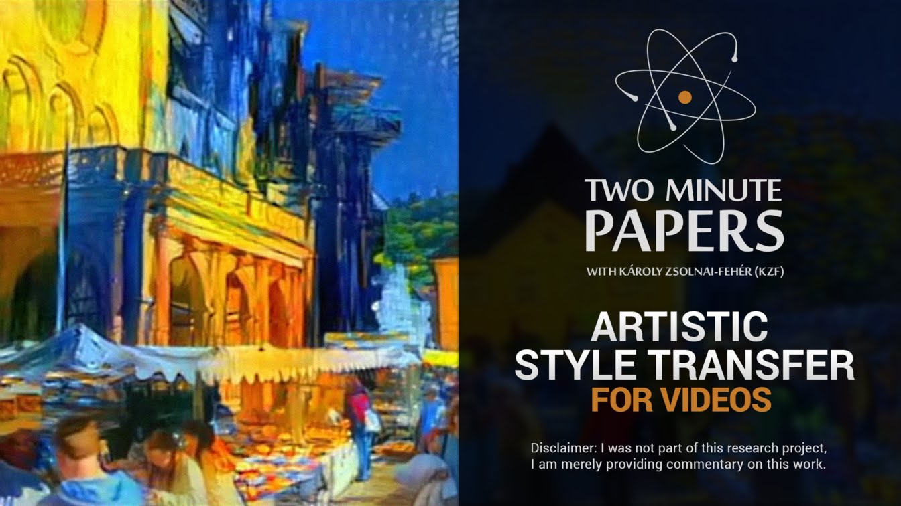

Artistic Style Transfer For Videos | Two Minute Papers

Artistic Style Transfer For Videos | Two Minute Papers
https://www.youtube.com/watch?v=Uxax5EKg0zA
[Two Minute Papers](https://www.youtube.com/channel/UCbfYPyITQ-7l4upoX8nvctg)
21,424 views viewsNew
Published on May 22, 2016

|     |
| --- |
| [(L)](https://www.youtube.com/watch?v=Uxax5EKg0zA) |

Description

Artificial neural networks were inspired by the human brain and simulate how neurons behave when they are shown a sensory input (e.g., images, sounds, etc). They are known to be excellent tools for image recognition, any many other problems beyond that - they also excel at weather predictions, breast cancer cell mitosis detection, brain image segmentation and toxicity prediction among many others. Deep learning means that we use an artificial neural network with multiple layers, making it even more powerful for more difficult tasks.

This time they have been shown to be apt at reproducing the artistic style of many famous painters, such as Vincent Van Gogh and Pablo Picasso among many others. All the user needs to do is provide an input photograph and a target image from which the artistic style will be learned.

And now, onto the next frontier: transferring artistic style to videos!

_________

The paper "Artistic style transfer for videos" is available here:
http://arxiv.org/abs/1604.08610

The implementation of this technique is also available:

[https://github.com/manuelruder/artist...](https://github.com/manuelruder/artistic-videos)

Recommended for you:

Deep Neural Network Learns Van Gogh's Art - [https://www.youtube.com/watch?v=-R9bJ...](https://www.youtube.com/watch?v=-R9bJGNHltQ)

Deep Learning Program Learns to Paint - [https://www.youtube.com/watch?v=UGAzi...](https://www.youtube.com/watch?v=UGAzi1QBVEg)

From Doodles To Paintings With Deep Learning - [https://www.youtube.com/watch?v=jMZqx...](https://www.youtube.com/watch?v=jMZqxfTls-0)

Sintel Movie copyright: Blender Foundation
https://durian.blender.org/sharing/

WE WOULD LIKE TO THANK OUR GENEROUS SUPPORTERS WHO MAKE TWO MINUTE PAPERS POSSIBLE:

Sunil Kim.
https://www.patreon.com/TwoMinutePapers

Subscribe if you would like to see more of these! - [http://www.youtube.com/subscription_c...](http://www.youtube.com/subscription_center?add_user=keeroyz)

The thumbnail background image was taken from the corresponding paper.

Splash screen/thumbnail design: Felícia Fehér - [http://felicia.hu](http://felicia.hu/)

Károly Zsolnai-Fehér's links:

Facebook → [https://www.facebook.com/TwoMinutePap...](https://www.facebook.com/TwoMinutePapers/)

Twitter → https://twitter.com/karoly_zsolnai
Web → https://cg.tuwien.ac.at/~zsolnai/

Top Comments

Marsel Khadiyev | 11 months ago

Next step: incorporate deep image (depth, alpha, diffuse) data produced by conventional 3d rendering or stereo video capture to separate individual scene elements and produce a more coherent effect. This could make a great post-production tool akin to color correction if used properly.

Kram1032 | 11 months ago

Now THAT is looking awesome! I love how it is sufficient to look at a flat image stream's optical flow to get very plastic-looking effects. Next up: Apply it to a 3D movie. And then: A VR environment. Of course a huge advantage of fully computer-generated graphics is that you can calculate optical flow exactly and you can even throw in depth-information to the mix. (Though I doubt something interactive like VR environment could actually be processed fast enough for now)

Ryan N | 11 months ago

It's so weird to see how a little blog post about using feedback to observe the inner state of a neural network (based on even earlier work on adversarial networks now that I think about it) has evolved into something like this.

chkone007 | 11 months ago

I'm really curious about how someone study arts see this kind of work. We approch the problem of style transfert technically. If my eyes (or any kind of metrics) say me "I trust the result" we accept it as is. For me Its amazing, but I'm not an artist and I don't have enough artistic culture/knowledge to feel/describ a style. I'm sure (intuition) to claim the "style is transferted" we have something to consider globally the image (the all is bigger than the sum of elements). On this case an artist will not use the same technics to describe the motion, that could be a posture or iconics... etc. That's why I'm would be interested to see what an artist will say about that :)

FernestHall | 11 months ago

I should have done my master and Ph.D. Such a beautiful time to be a scientist. Sucks how stupidly boring and unimaginative every lecture has been.

Ralph Olynyk | 4 months ago

wow, synchronicity at work!!!, i'm working on a graphic novel, which has my contee medium style drawings, and im working to make the novel as an animation (3d) also... been struggling with how to get my style and textures of the contee into the 3D version, and then i tripped over this video!!!!!! :) AWESOME..encouraging , and inspiring to know the concept can be done...i feel liberated and stoked!!! thank!!!!!

Esoteric Ideology | 11 months ago
Cant wait to give this a go when the 1080s release in a month :)

Neoshaman Fulgurant | 11 months ago

wow WOW, this is the level above! I planned to make a movie with style transfer once My synopsis is done, I never expected the technique to go that fast! Not long ago it would took 4years for a feature length movie (7400€ at the rate of cloud computing), now it works quasi in real time, hi resolutions, and now it don't need correction over multiple frames. That's not just a revolution, it's a game changer!

Fefinix | 11 months ago
The future is now. Wow...

Latte_di_cocco | 1 month ago
please say [teKnik] in future 😊