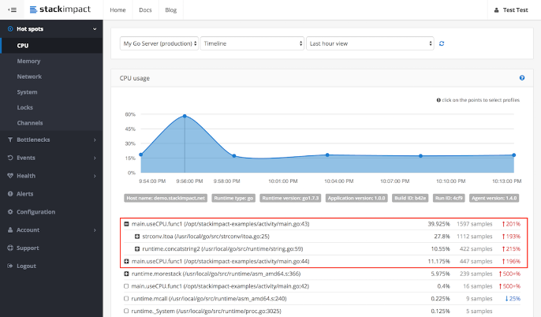
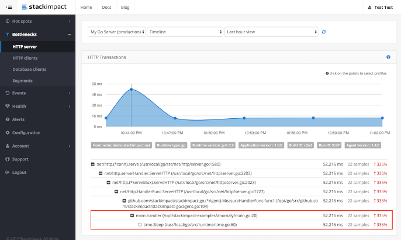

Automatic Performance Profiling in Go Applications | StackImpact

In the previous blog posts we wrote about the importance and problems with production profiling in Go:

- [Continuous, Low-Overhead Production Profiling](https://stackimpact.com/blog/continuous-low-overhead-production-profiling/)
- [Profiling Go Applications in Production](https://stackimpact.com/blog/profiling-go-applications-in-production/)

In this post we’ll explain how complete automation of production profiling is possible and why continuous visibility into production application performance is critical.

#### Automating pprof

When pprof is used in development environment, we control when the application is started, when profiling is initiated and what workload is simulated during profiling, e.g. a benchmark test. In production environments this is not possible.

If pprof is activated in production and all necessary preparations are done, i.e. pprof is listening on a port, a port is accessible, the host is identifiable, etc., it will be possible to request various profiles from production manually. Unless the performance issue is persistent, this does not guarantee that we hit the right moment and the profile will contain the information needed for troubleshooting.

To overcome this problem, profiling should be started automatically in the following situations:

- *Activity* – changes in application execution metrics, such as **CPU usage** or **number of goroutines**.
- *Anomalies* – some execution metrics show anomalous dynamics. For example **HTTP requests** or instrumented functions.
- *Regular intervals* – profiling at regular intervals makes sure the rest of the cases are covered. It also enables historical analysis of application performance with line-of-code precision.

#### Adding relevant context

Each profile is only complete if it is accompanied with information about the application and application state at the moment of profiling. This context information should include the following:

- Application version
- Build identification information
- Host, instance or container
- Version of Golang runtime
- Version of profiling agent, if any

For example, if performance regression is detected, it is important to check whether it correlates with application or runtime version change.

#### Using the StackImpact agent to automate production profiling

The StackImpact agent automatically initiates profiling in all above mentioned situations and reports them to the Dashboard along with context information and full set of application metrics.

It additionally provides an API for measuring arbitrary code segments and HTTP requests as well as monitoring panics and errors.

#### An example of CPU usage-triggered profiling

The following example demonstrates how profiling is initiated in case of CPU usage change. CPU activity is simulated for 10 seconds, the agent detects the activity and initiates recording of a [CPU profile](https://stackimpact.com/docs/#cpu-usage-profile).

package mainimport  ("time""math""strconv""github.com/stackimpact/stackimpact-go")func main()  {agent := stackimpact.NewAgent()agent.Start(stackimpact.Options{AgentKey:  "agent key here",AppName:  "My Go Server",AppVersion:  "1.0.0",AppEnvironment:  "production",})// simulate activityactivityTimer := time.NewTimer(180  * time.Second)go func()  {<-activityTimer.C// simulate additional CPU load ~50%useCPU(10,  50)}()// simulate CPU load ~20%useCPU(math.MaxInt64,  20)}func useCPU(duration int, usage int)  {for j :=  0; j < duration; j++  {go func()  {for i :=  0; i < usage*800000; i++  {str :=  "str"  + strconv.Itoa(i)str = str +  "a"}}()time.Sleep(1  * time.Second)}}

After running this code over some period of time, we will see a set of CPU profiles in the Dashboard. The selected profile was triggered when the CPU usage increased and we can clearly identify the root cause (marked in the following screenshot).

#### An example of HTTP request anomaly-triggered profiling

When Segment API, e.g. HTTP handler wrapper, is used, the agent will also monitor code segment and request execution time in order to initiate profiling in case of anomalies.

The following example demonstrates how profiling is initiated in case of anomalies in HTTP response time. Requests are slowed down for 10 seconds, the agent detects the anomaly and initiates recording of a [bottleneck profile](https://stackimpact.com/docs/#bottleneck-profiling).

package mainimport  ("fmt""net/http""time""github.com/stackimpact/stackimpact-go")var slow bool  =  falsefunc handler(w http.ResponseWriter, r *http.Request)  {if slow {time.Sleep(50  * time.Millisecond)}  else  {time.Sleep(10  * time.Millisecond)}fmt.Fprintf(w,  "Hello world!")}func main()  {agent := stackimpact.NewAgent()agent.Start(stackimpact.Options{AgentKey:  "agent key here",AppName:  "My Go Server",AppVersion:  "1.0.0",AppEnvironment:  "production",})// make requests slow for 10 secondsmakeSlowTimer := time.NewTimer(180  * time.Second)go func()  {<-makeSlowTimer.C

slow =  true// make requests fast againmakeFastTimer := time.NewTimer(10  * time.Second)go func()  {<-makeFastTimer.C

slow =  false}()}()http.HandleFunc(agent.MeasureHandlerFunc("/some-handler", handler))http.ListenAndServe(":8080",  nil)}

After generating requests (~100 per second) to this application over some period of time, we will see a set of profiles in the Dashboard. The selected profile was triggered when the response time increased and we can see the root cause, i.e. the `time.Sleep` function and the location in the source code, where it was called.

More information on StackImpact setup and features is available on the [documentation](https://stackimpact.com/docs/) page.

#### Conclusion

Without automatic detection of application activity and anomalies, spotting and profiling relevant events in production would be extremely hard. Many applications experience performance problems at some point in their lifecycle. Therefore, we strongly recommend to prepare for performance problems in advance by experimenting with pprof, and make sure it is possible to profile production Go applications when needed.