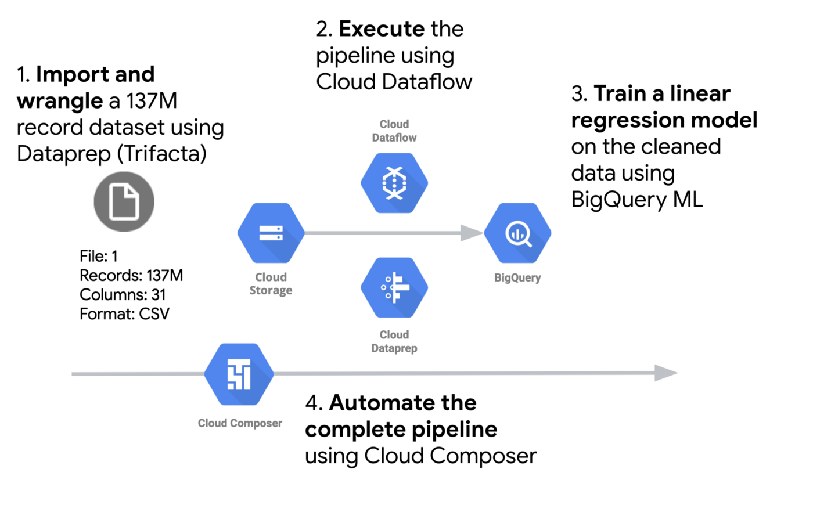
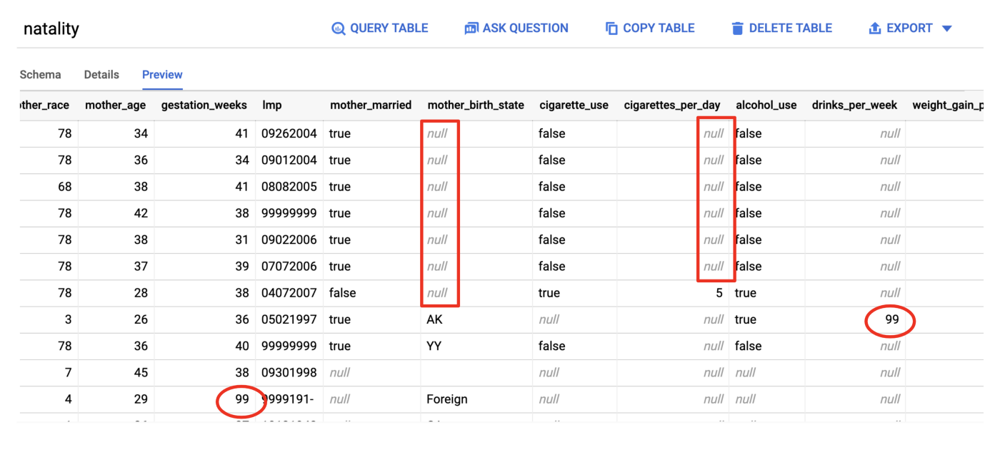
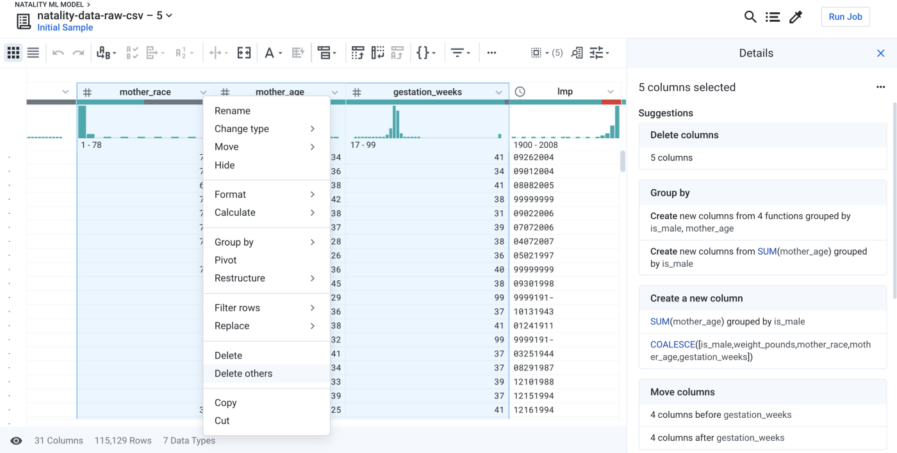
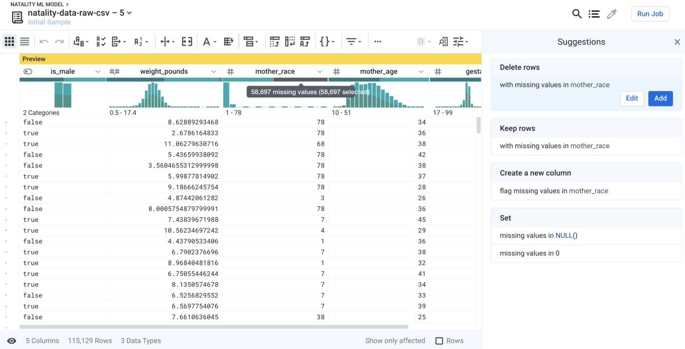
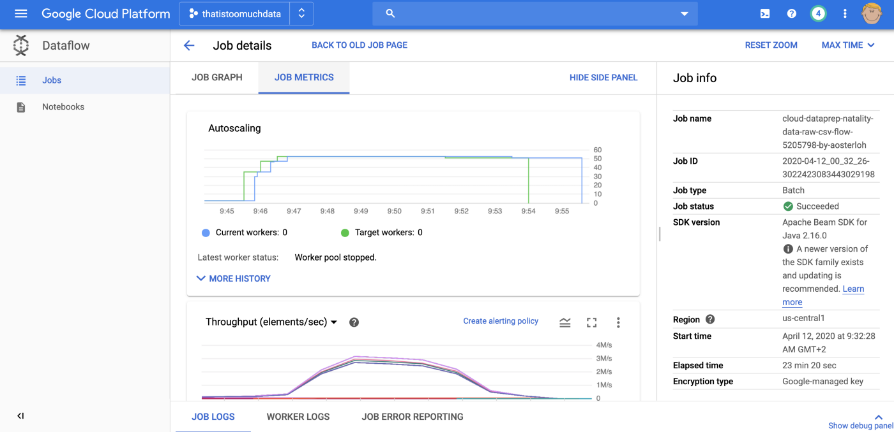
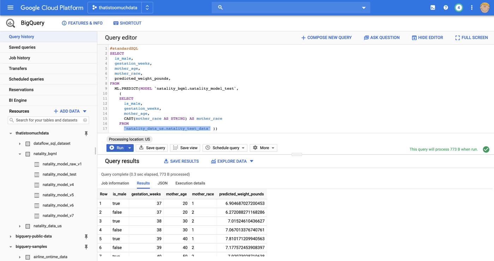
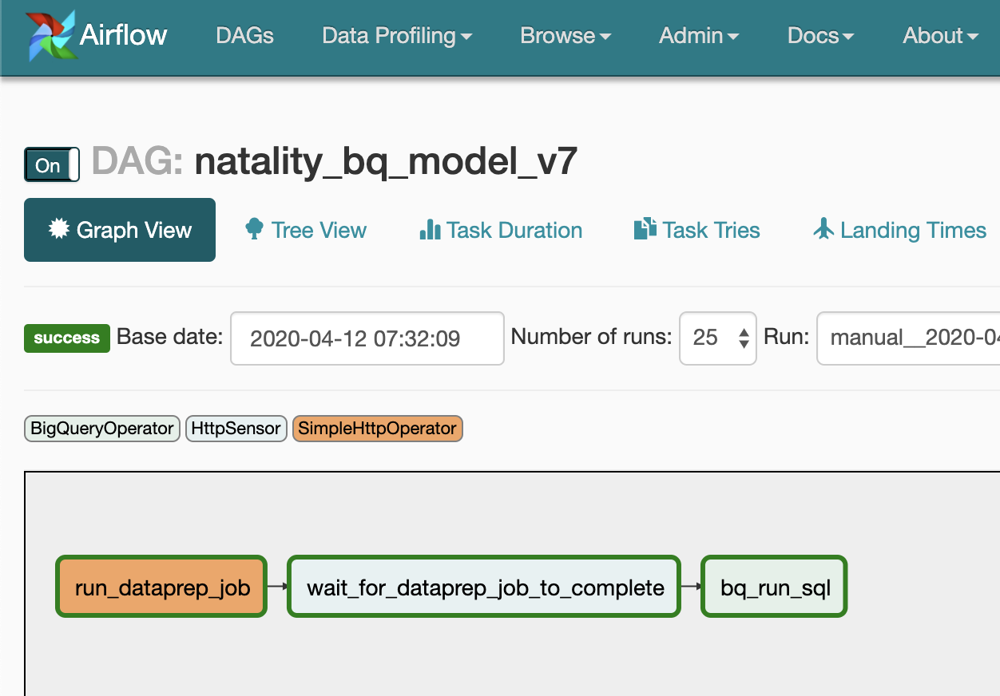

Automation of Data Wrangling and Machine Learning on Google Cloud

# Automation of Data Wrangling and Machine Learning on Google Cloud

## Using Cloud Dataprep, Cloud Composer and BigQuery ML

[Alex Osterloh](https://medium.com/@aosterloh34?source=post_page-----7de6a80fde91----------------------)

[Apr 15](https://medium.com/google-cloud/automation-of-data-wrangling-and-machine-learning-on-google-cloud-7de6a80fde91?source=post_page-----7de6a80fde91----------------------) · 5 min read

I recently read this [blog post](https://cloud.google.com/blog/products/data-analytics/how-to-orchestrate-cloud-dataprep-jobs-using-cloud-composer) on using the [**Cloud Dataprep** API](https://cloud.google.com/dataprep/docs/html/API-JobGroups-Create-v4_145281446) to trigger automated wrangling jobs with Cloud Composer (based on Apache Airflow).

I took the concept of using the **BigQuery**  [public dataset](https://cloud.google.com/bigquery/public-data?csw=1) on US birth stats (to play with the data first, see [post](https://medium.com/@ImJasonH/exploring-natality-data-with-bigquery-ed9b7fc6478a) by [Jason](https://medium.com/u/4a0637341451?source=post_page-----7de6a80fde91----------------------) on using the data with **BigQuery**). Except that this time, in addition to cleaning the data I added a step to train a linear regression model using **BigQuery ML** (see [documentation](https://cloud.google.com/bigquery-ml/docs/bigqueryml-natality) for more).

**As shown above I will use:**
1. **Cloud Dataprep (Trifacta Service)** to
import and wrangle a 14GB public dataset on birth stats with 137M records
2. **BigQuery ML** to
train a linear regression model on the cleaned data
3. **Cloud Composer** to
automate both steps above

# 1. Let’s get some data

In most projects, Data Professionals don’t usually deal with straightforward **BigQuery** datasets, but instead they find themselves dealing with different kinds of data as found in the wild. To bring this example closer to reality, we will export this **BigQuery** dataset as CSV into a Google Cloud Storage bucket. Looking at the data in **BigQuery** you can see there are 31 columns and some of the data has missing values. To train our model later to predict baby weight, we only need a handful of features (columns). Also we want to ignore records that have missing or wrong values (e.g. a mother having 99 alcoholic drinks per week even beats my best college days; also, giving birth in week 99 is [unlikely among humans](https://www.livescience.com/33086-what-animal-has-the-longest-pregnancy.html)).

Data shows more columns than we need and many missing or wrong values

# 2. Clean the data

I am using **Cloud Dataprep**, a managed service by **Trifacta** for wrangling, cleaning and preparing structured and unstructured data. In just 2 minutes I can take a 137M record file, delete all but 5 columns and filter out all rows that have missing or wrong values. All with a nice and tidy interface and by simple pointing and clicking. You can save all these steps into a *recipe* which will let you repeatedly and consistently apply them later. Running the *recipe* takes another 20+ minutes to execute all the transformations using **Cloud **[**Dataflow**](https://cloud.google.com/dataflow), a managed service on Google cloud for stream and batch data processing.

Just select the columns you want to keep and choose to ‘Delete others’

Next in **Cloud Dataprep** I can identify missing values by clicking on the black area underneath the column name adding the *Delete Rows *step to my wrangling *recipe*.

It’s easy to remove records with missing or wrong values, or replace values with e.g. mean

Of course you can do far more sophisticated transformations, split e.g. semistructured data into multiple columns, add new columns with derived values or join datasets from different sources. To execute the pipelines I click *Run Job* top right where I then select an output destination. In this case I choose to write to a new **BigQuery **table, as we want to train a model using **BigQuery ML** in the next step.

Output of the pipeline execution shows e.g. the auto-scaling feature of Cloud Dataflow

# 3. Let’s train a machine learning model

Now that we have a cleaned set of the data in **BigQuery,** we can train a model using **BigQuery ML**. I will not go into details here, as this is explained in detail, using the same dataset, in the [**BigQuery ML** documentation](https://cloud.google.com/bigquery-ml/docs/bigqueryml-natality).

Calling ML.PREDICT on some test data to predict baby weight

**Spoiler alert: the model trained on the cleaned data performs better than the model of the original dataset**

# 4. Finally, let’s automate everything

Assuming your input data changes daily (like COVID-19 cases), you would need to manually run the steps above or write some script/code to trigger the following steps:

1. Calling the **Dataprep API** with the recipe ID and auth token
2. Wait for the **Dataflow** job to finish
3. Train a new version of the model with **BigQuery ML**

Automating this process would also require deploying the code somewhere, configuring scheduling/triggers, contemplating error handling, retrials with exponential backoff, automated retries, and more.

Or…(insert drumroll)… we could use Cloud Composer instead. Cloud Composer is a managed version of Apache Airflow for orchestrating data pipelines. Airflow defines orchestration steps using Python DAGs (directed acyclic graph). It’s mostly boilerplate code that defines parameters, order of execution and dependencies between the steps. My colleague [Tahir Fayyaz](https://medium.com/u/61dbd674077e?source=post_page-----7de6a80fde91----------------------) wrote a [nice post on working with Airflow and BigQuery](https://cloud.google.com/blog/products/gcp/how-to-aggregate-data-for-bigquery-using-apache-airflow).

The simple DAG has basically 2 steps: First run the Dataprep job using Cloud Dataflow (then wait for completion) and when done, create a new linear regression model using BigQuery ML

Here is my example (abbreviated) code on [GitHub](https://github.com/aosterloh/natality-bqml-composer-dataprep/blob/master/dataprep-bqml-pipeline_v7.py) that you see below.

import Airflow
...default_args = {
'owner': 'Alex Osterloh',
'depends_on_past': False,
...
'schedule_interval': '[@daily](http://twitter.com/daily)'
}...#common DAG parameters like scheduling
with airflow.DAG(
'natality_bq_model_v8',
default_args=default_args,

# Not scheduled, trigger only

schedule_interval=None,
user_defined_macros={
'json': json
}
) as dag:# Trigger Dataprep via HTTP POST call
run_dataprep_task = SimpleHttpOperator(
task_id='run_dataprep_job',
endpoint='/v4/jobGroups',
data=json.dumps({"wrangledDataset": {"id": int(recipe_id)}}),
....
)# Wait for Dataprep job to finish
wait_for_dataprep_job_to_complete = HttpSensor(
task_id='wait_for_dataprep_job_to_complete',

endpoint='/v4/jobGroups/{{ json.loads(ti.xcom_pull(task_ids="run_dataprep_job"))["id"] }}?

.....
)# Train new model using BigQuery ML
bigquery_run_sql = bigquery_operator.BigQueryOperator(
task_id='bq_run_sql',
....
sql='''
CREATE OR REPLACE MODEL `<project-name>.natality_bqml.natality_model_v7`
OPTIONS
(model_type='linear_reg', input_label_cols=['weight_pounds']) AS
SELECT
weight_pounds,
is_male,
gestation_weeks,
mother_age,
CAST(mother_race AS string) AS mother_race
FROM
`thatistoomuchdata.natality_data_us.natality_data_clean_model_v6`
WHERE
weight_pounds IS NOT NULL
AND RAND() < 0.001
'''
)# Define the task dependencies
run_dataprep_task >> wait_for_dataprep_job_to_complete >> bigquery_run_sql

# Next steps

If you are into data automation, machine learning and jazz, I summed everything up in this 6 minute video, enjoy.

*Thanks *[*Felipe*](https://www.linkedin.com/in/felipemartina/)* for helping me get the wording right. This is not official Google work. Let me know if I missed something.*