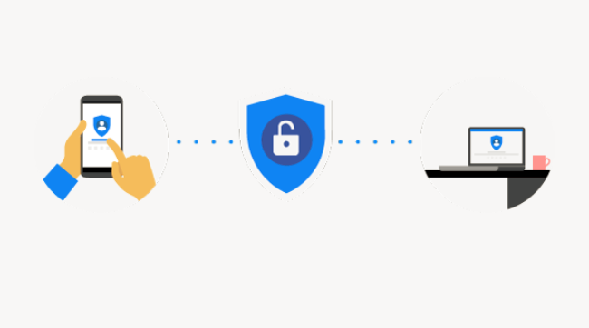
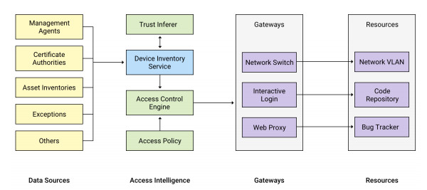

BeyondCorp: How Google Ditched VPNs for Remote Employee Access - The New Stack

# BeyondCorp: How Google Ditched VPNs for Remote Employee Access

#### 3 Jan 2018 9:34am,

by

Today, none of Google’s employee-facing applications are on a virtual private network. They all have public IP addresses.

The company feels this approach, which it has dubbed [BeyondCorp](https://cloud.google.com/beyondcorp/), is the “new cloud model,” for doing cloud security, asserted [Neal Mueller](http://www.nealmueller.com/), head of infrastructure product marketing at Google, who gave [a presentation](https://conferences.oreilly.com/security/sec-ny/public/schedule/detail/61327) on this approach at the [O’Reilly Security](https://conferences.oreilly.com/security/sec-ny) conference, held recently in New York.

This model can be fall under a number of rubrics in the security community, including “zero-trust” or “perimeter-less” security. It is the opposite of the traditional approach of security, which Mueller described as “the castle” approach, in which a strong firewall is used to set off an internal network that can only be accessed by way of a virtual private network (VPN).

The problem with the “castle” approach is that once the perimeter is breached, the entire internal network, and all the associated applications, are at risk. “Do not trust your network. It is probably already owned,” added [Max Saltonstall](https://research.google.com/pubs/MaxSaltonstall.html), a Google program manager for corporate engineering, who also participated in the presentation. Phishing, man-in-the-middle, SQL Injection attacks all find fertile ground on VPNs.

Plus, a VPN was cumbersome to use, and slowed performance, especially for overseas workers. And it is no walk in the park for admins either. To set up a new user, the admin would typically have to configure the cloud network, along with setting up the IPSec rules and firewall rules, the VPN. This is followed by a lot of testing.

At Google, “we embraced the fact that walls don’t work,” Mueller said. “Rather than have a VPN around all this infrastructure, we decided to get rid of the walls entirely.”

Google’s approach involves comprehensive inventory management, one that keeps track of who owns which machine in the network. A Device Inventory Service collects a variety of live information about each device from multiple system management sources, such as Active Directory or Puppet.

Authentication is then based on a set of “Trust Tiers” represent levels of increasing sensitivity. Employees get the appropriate level of access regardless of what device they are using or where in the world they are logging in from. Lower levels of access require less stringent checks on the device itself.

“The access is granted based on context: Who are you? Have you authenticated in a strong way? What are you using? What do I know about your device?” Saltonstall summarized.

The network itself is unprivileged. For identity management, the company uses security keys, which are much harder to forge than passwords and are tied to the individual users themselves. Each work device has a certificate issued by Google. Encryption across the network is done through TLS (transport layer security), which is terminated at the access proxy.

BeyondCorp infrastructure (USENIX)

All the corporate resources are behind this uber-reverse proxy. Based on a decision provided by its “trust engine,” the proxy makes the decision of whether or not to provide access to the desired application. If permissions are in place, according to the tiered trust model, it forwards the requests to the application, along with the security credentials. The applications themselves are routinely checked for breaches by vulnerability scanners.

Amazingly, Google was able to shift all of its employees, including remotes ones, over to this new model, with minimal disruption, Saltonstall said.

To prepare for a transparent shift, which started in 2013, the migration team recorded all the actions that Google employees did on the old network, then rerun a simulation of the traffic on the new network. This monitoring [gathered about 80TB a day](https://www.informationweek.com/mobile/mobile-devices/google-beyondcorp-breaks-with-enterprise-security-tradition/d/d-id/1325017?) (The model benefited the fact that all of Google’s internal applications are already on the Web).

“If you play back the current traffic on the new network, you can see what will break,” Saltonstall said. This lets the team identify those end-services that weren’t fully compliant yet, as well as identified users who could seamlessly switch over to the new network.

This approach has some good additional benefits, Saltonstall said. Provisioning Chromebooks for new employees is a minimal processing, taking no longer than 90 seconds worth of configuration settings.

With the “BeyondCorp” approach, “You are taking operation problems, and turning them into engineering problems, and then engineer them away,” Saltonstall said. “All the frustrating, boring human grunt-work becomes automated.”

[Google](http://bit.ly/2x5VLZD) is a sponsor of The New Stack.