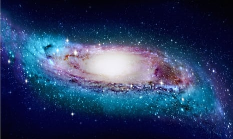
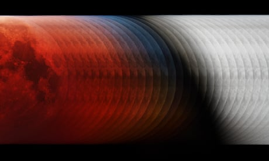

Black hole at centre of galaxy is getting hungrier, say scientists

[Astronomy](https://www.theguardian.com/science/astronomy)

# Black hole at centre of galaxy is getting hungrier, say scientists

Scientists say Milky Way’s Sagittarius A* has been more active in recent months

[Hannah Devlin](https://www.theguardian.com/profile/hannah-devlin) Science correspondent

[@hannahdev](https://twitter.com/hannahdev)

Fri 13 Sep 2019 15.06 BSTLast modified on Fri 13 Sep 2019 23.50 BST

- 
- 
- 

Shares

631

An artist’s impression of the Milky Way galaxy. Photograph: Chen Xiaodian

Unseeable and inescapable, black holes already rank among the more sinister phenomena out in the cosmos. So it may come as disconcerting news that the supermassive black hole at the centre of the Milky Way appears to be growing hungrier.

Astronomers monitoring the colossal object, called [Sagittarius A*](https://www.theguardian.com/science/2019/jan/11/scientists-close-to-capturing-first-image-of-black-hole-at-the-centre-of-the-milky-way), found that in the past year it appears to have consumed nearby matter at an unprecedented rate.

“We have never seen anything like this in the 24 years we have studied the supermassive black hole,” said Andrea Ghez, a professor of physics and astronomy at the University of California, Los Angeles, and a senior author of the research. “It’s usually a pretty quiet, wimpy black hole on a diet. We don’t know what is driving this big feast.”

 

##   [Sign up for Lab Notes - the Guardian's weekly science update]()

   

Read more

 [(L)](https://www.theguardian.com/science/2016/jun/07/sign-up-for-lab-notes-the-guardians-weekly-science-update)

In the latest study, the team analysed more than 13,000 observations of the black hole from 133 nights since 2003, gathered by the Keck Observatory in Hawaii and the European Southern Observatory’s Very Large Telescope in Chile. The black hole itself cannot be seen because it acts as a one-way trapdoor even for light. But it is possible to detect radiation blazing from gas and dust just outside the “event horizon” as they are accelerated towards their final fate.

The team found that on 13 May the area just outside the black hole’s point of no return was twice as bright as the next brightest observation. They also observed large changes on two other nights this year, with all three of those changes being unprecedented, according to Ghez.

The team also used a technique called speckle holography to reanalyse older, fainter observations dating back 24 years, from which they concluded that the level of brightness seen this year was unprecedented in the last quarter of a century.

“The big question is whether the black hole is entering a new phase … and the rate of gas falling down the black hole drain has increased for an extended period, or whether we have just seen the fireworks from a few unusual blobs of gas falling in,” said Mark Morris, a professor of physics and astronomy at UCLA and the paper’s co-senior author.

 

##   [Astronomy Photographer of the Year 2019 – winning images]()

   

 [(L)](https://www.theguardian.com/science/gallery/2019/sep/13/astronomy-photographer-of-the-year-2019-winning-images)

One hypothesis is that the feeding frenzy is linked to the closest approach to the black hole of a star called S0-2 during the summer of 2018, and that a large quantity of gas from the star could have reached Sagittarius A* this year.

Another possibility involves a bizarre object known as G2, which is most likely a pair of binary stars, which made its closest approach to the black hole in 2014. It is possible the black hole could have stripped off the outer layer of G2, Ghez said, which could help explain the increased brightness just outside the black hole. A third suggestion is that several large asteroids have been drawn into the cosmic sinkhole.

Advertisement

The black hole is about 26,000 light years from Earth and poses no danger to our planet. The findings appear in [Astrophysical Journal Letters](https://iopscience.iop.org/article/10.3847/2041-8213/ab38c3).

##  More people in France…

... like you, are reading and supporting The Guardian’s independent, investigative journalism than ever before. And unlike many new organisations, we have chosen an approach that allows us to keep our journalism accessible to all, regardless of where they live or what they can afford. But we need your ongoing support to keep working as we do.

The Guardian will engage with the most critical issues of our time – from the escalating climate catastrophe to widespread inequality to the influence of big tech on our lives. At a time when factual information is a necessity, we believe that each of us, around the world, deserves access to accurate reporting with integrity at its heart.

Our editorial independence means we set our own agenda and voice our own opinions. Guardian journalism is free from commercial and political bias and not influenced by billionaire owners or shareholders. This means we can give a voice to those less heard, explore where others turn away, and rigorously challenge those in power.

We need your support to keep delivering quality journalism, to maintain our openness and to protect our precious independence. Every reader contribution, big or small, is so valuable. **Support The Guardian from as little as €1 – and it only takes a minute. Thank you.**

 [Support The Guardian](https://support.theguardian.com/eu/contribute?REFPVID=k0jav1hkdrvh8jkaxd9j&INTCMP=gdnwb_copts_memco_epic_country_name_control&acquisitionData=%7B%22source%22%3A%22GUARDIAN_WEB%22%2C%22componentId%22%3A%22gdnwb_copts_memco_epic_country_name_control%22%2C%22componentType%22%3A%22ACQUISITIONS_EPIC%22%2C%22campaignCode%22%3A%22gdnwb_copts_memco_epic_country_name_control%22%2C%22abTest%22%3A%7B%22name%22%3A%22ContributionsEpicCountryName%22%2C%22variant%22%3A%22control%22%7D%2C%22referrerPageviewId%22%3A%22k0jav1hkdrvh8jkaxd9j%22%2C%22referrerUrl%22%3A%22https%3A%2F%2Fwww.theguardian.com%2Fscience%2F2019%2Fsep%2F13%2Fblack-hole-at-centre-of-our-galaxy-is-getting-hungrier-say-scientists%22%7D)

 

Topics

- [Astronomy/](https://www.theguardian.com/science/astronomy)
- [Black holes/](https://www.theguardian.com/science/black-holes)
- [Space/](https://www.theguardian.com/science/space)
- [news/](https://www.theguardian.com/tone/news)
- 
- 
- 
- [Share on LinkedIn](http://www.linkedin.com/shareArticle?mini=true&title=Black%20hole%20at%20centre%20of%20galaxy%20is%20getting%20hungrier%2C%20say%20scientists&url=https%3A%2F%2Fwww.theguardian.com%2Fscience%2F2019%2Fsep%2F13%2Fblack-hole-at-centre-of-our-galaxy-is-getting-hungrier-say-scientists)
- [Share on Pinterest](http://www.pinterest.com/pin/find/?url=https%3A%2F%2Fwww.theguardian.com%2Fscience%2F2019%2Fsep%2F13%2Fblack-hole-at-centre-of-our-galaxy-is-getting-hungrier-say-scientists)
- [Reuse this content](https://syndication.theguardian.com/automation/?url=https%3A%2F%2Fwww.theguardian.com%2Fscience%2F2019%2Fsep%2F13%2Fblack-hole-at-centre-of-our-galaxy-is-getting-hungrier-say-scientists&type=article&internalpagecode=6596274)