BlandAltmanLeh Intro

# BlandAltmanLeh Intro

#### *Bernhard Lehnert*

#### *Dec, 23 2015*

# Bland-Altman-Plots

Bland-Altman plots are a well established method to check the agreement of different measurement methods or the retest-reliability of a single measurement method. (Apparently, Bland-Altman plots are otherwise known as Tukey’s Mean Difference Plot.) They do not come included in R but can easily be produced using R (find an overview of alternatives for this package at the end of this document). The BlandAltmanLeh package tries to make Bland-Altman plots even more accessible. It also features confidence intervals and the combination of Bland-Altman-/Tukey Mean Difference Plot and sunflower plot.

This package is based on the 1986 publication of JM Bland and DG Altman. It is available for free download on http://www-users.york.ac.uk/~mb55/meas/ba.htm Written for medical doctors, this article is very well readable for the non-statistician and thus highly recommended.

## What’s the main idea behind Bland-Altman plots?

Imagine, you’ve measured some parameter with two different measurements at different times or under differing conditions. Let’s say you have measured the following dependend measurements.

	A <- c(-0.358, 0.788, 1.23, -0.338, -0.789, -0.255, 0.645, 0.506,
	0.774, -0.511, -0.517, -0.391, 0.681, -2.037, 2.019, -0.447,
	0.122, -0.412, 1.273, -2.165)
	B <- c(0.121, 1.322, 1.929, -0.339, -0.515, -0.029, 1.322, 0.951,
	0.799, -0.306, -0.158, 0.144, 1.132, -0.675, 2.534, -0.398, 0.537,
	0.173, 1.508, -1.955)

Your first attempt to inspect these data may be a scatter plot like

	plot(A, B, main="Scatter plot")
	abline(0,1)

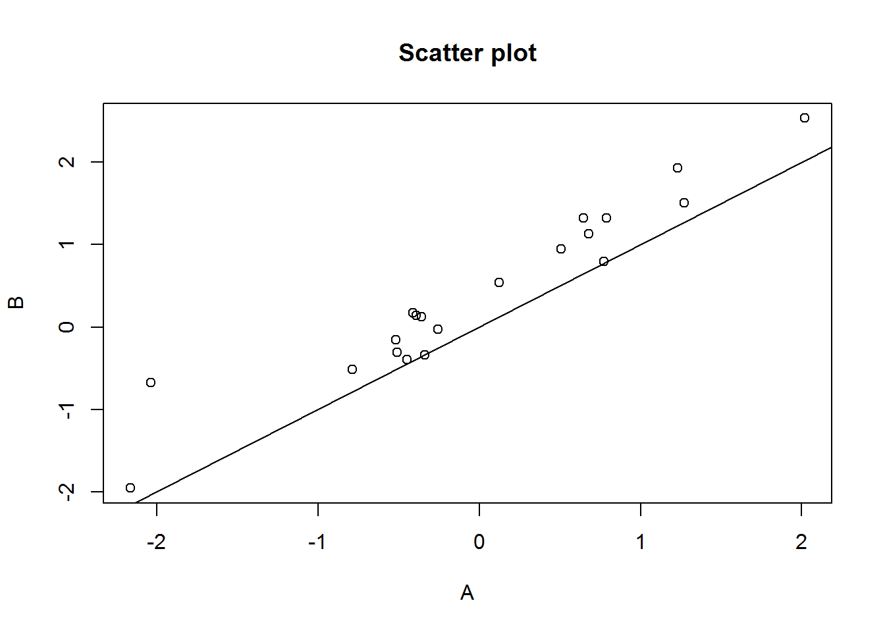

This is a useful plot but may often not be optimal. As the data will mostly be placed on a diagonal line, most of the space in the diagram is wasted. Deviations from identity are displayed on a diagonal line which may not be what our brain recognises best. Finally, the choice of which measurement is placed on the horizontal and which on the vertical axis is often arbitrary. Bland and Altman (and apparently Tukey before them) propose a different approach, where the x axis is the mean of two measurements each and the y axis is the difference between them.

`plot((A+B)/2, A-B, main="Mean-Difference-Plot")`
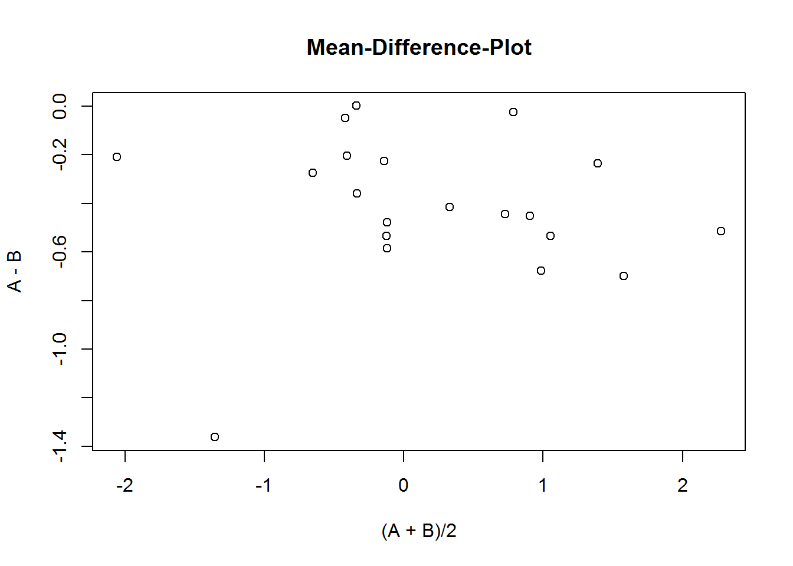

As can easily be seen, the dots are scattered over more “space”, thus using the space better. There also is less inclination to tilt one’s head as there is no need to judge deviations from a diagonal line.

As the differences are what we are looking for, three additional lines with information on the differences are added: the mean of the differences and 2 (1,96 resp.) standard deviations above and below that.

	library(BlandAltmanLeh)
	bland.altman.plot(A, B, main="This is a Bland Altman Plot", xlab="Means", ylab="Differences")

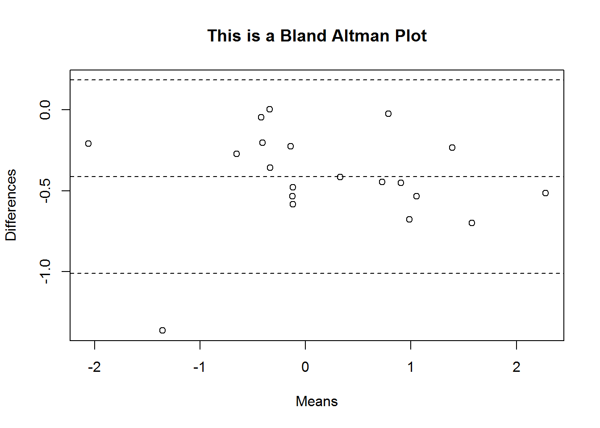

## ggplot2

Of course you might be inclined to draw that using ggplot2, which is as easy as:

	library(ggplot2)
	pl <- bland.altman.plot(A, B, graph.sys = "ggplot2")
	print(pl)

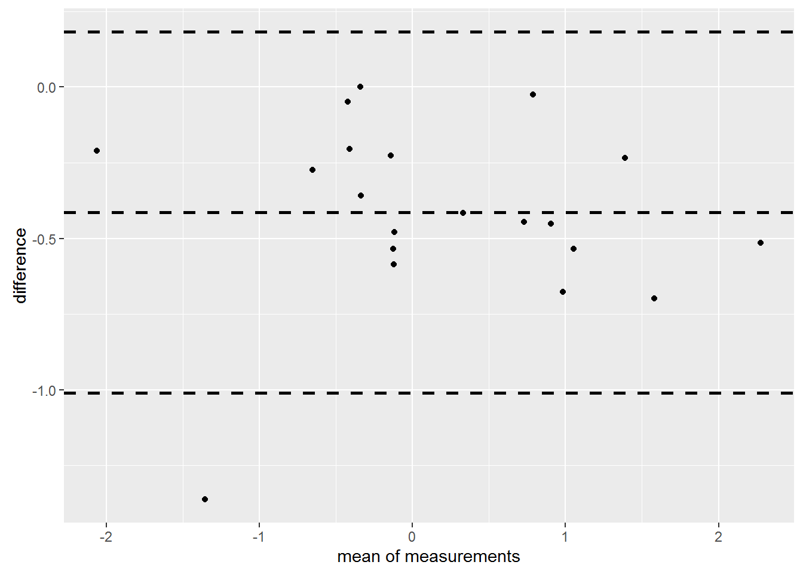

There are good reasons to prefer each of the graphics systems. Mostly it is a matter of taste.

As you can see, 1 out of 20 data points in the figure above falls out of the 95% confidence interval depicted by the upper and lower line. That’s just what one would expect in case of normal distribution.

## Confidence Intervals

Of course, these lines have an error margin and Bland and Altman 1986 describe how to compute confidence intervals for the lines. These can also be calculated and printed with the BlandAltmanLeh package as in:

	A <- rnorm(50)
	B <- A +runif(50, -.3, .3)
	pl <- bland.altman.plot(A, B, graph.sys="ggplot2", conf.int=.95)
	print(pl)

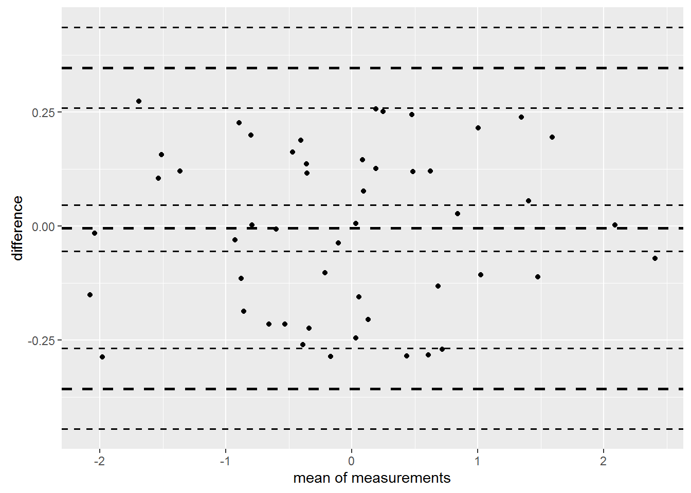

	*# or in base-graphics:*
	bland.altman.plot(A, B, conf.int=.95, pch=19)

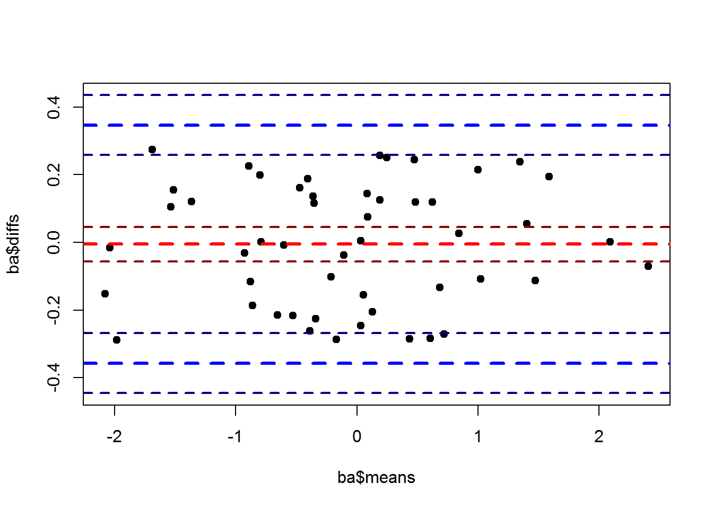

## DIY - drawing your own plots

If you want to make a specialty Bland Altman Plot of your own, you can still use the BlandAltmanLeh package to compute the statistics behind the as in this little example, where male and female data are to be drawn in different colors:

	A <- c(-0.358, 0.788, 1.23, -0.338, -0.789, -0.255, 0.645, 0.506,
	0.774, -0.511, -0.517, -0.391, 0.681, -2.037, 2.019, -0.447,
	0.122, -0.412, 1.273, -2.165)
	B <- c(0.121, 1.322, 1.929, -0.339, -0.515, -0.029, 1.322, 0.951,
	0.799, -0.306, -0.158, 0.144, 1.132, -0.675, 2.534, -0.398, 0.537,
	0.173, 1.508, -1.955)
	sex <- c( 1,1,1,1,2,2,2,1,1,1,2,2,2,2,2,1,1,2,1,2)

	ba.stats <- bland.altman.stats(A, B)

	plot(ba.stats$means, ba.stats$diffs, col=sex,
	     sub=paste("critical difference is", round(ba.stats$critical.diff,4)),
	     main="make your own graph easily", ylim=c(-1.5,1.5), pch=18-sex)
	abline(h = ba.stats$lines, lty=c(2,3,2), col=c("lightblue","blue","lightblue"),
	       lwd=c(3,2,3))
	legend(x = "topright", legend = c("male","female"), fill = 1:2)

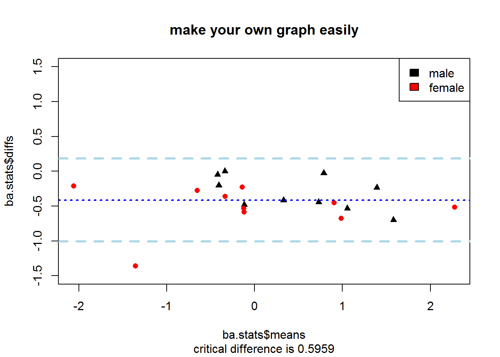

Thus, you have the full flexibility of the R graphic systems but no need to worry about details like missing data etc.

## Options for data with ties

Sometimes data have ties. Imagine a questionnaire which will only ever give scores between 0 and 10 and you are checking retest-agreement:

	A <- c(7, 8, 4, 6, 4, 5, 9, 7, 5, 8, 1, 4, 5, 7, 3, 4, 4, 9, 3, 3,
	1, 4, 5, 6, 4, 7, 4, 7, 7, 5, 4, 6, 3, 4, 6, 4, 7, 4, 6, 5, 1, 1, 1, 1, 1, 1)
	B <- c(8, 7, 4, 6, 3, 6, 9, 8, 4, 9, 0, 5, 5, 9, 3, 5, 5, 8, 3, 3,
	1, 4, 4, 7, 4, 8, 3, 7, 7, 5, 6, 7, 3, 3, 7, 3, 6, 5, 9, 5, 1, 1, 1, 1, 1, 1)

	bland.altman.plot(A, B)

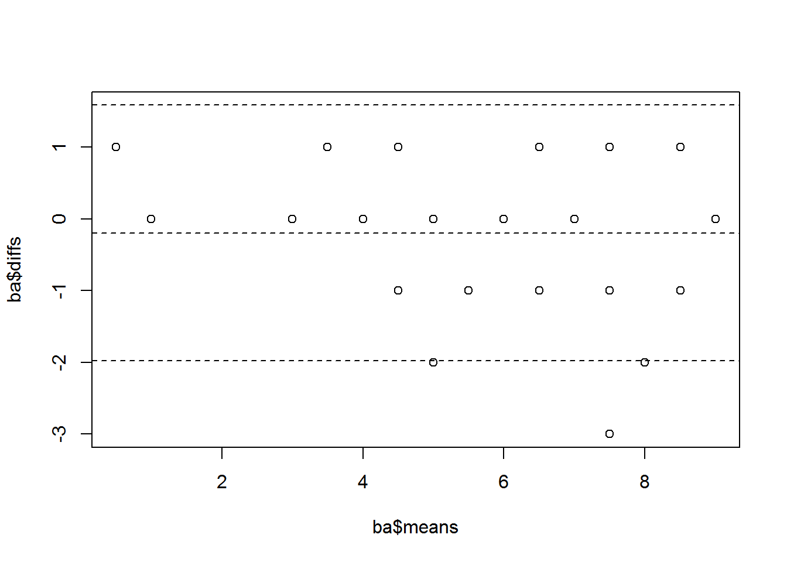

Obviously there is a lot of ties in these data. There are 21 data points visible even though there are 46 data points contained. The BlandAltmanLeh package offers two solutions to that problem, one for base graphics and one for ggplot2. Of course you could always calculate just the statistics with bland-altman.stats(), then add some jitter to the data points and plot this yourself. In base graphics BlandAltmanLeh features the Bland Altman Plot as a sunflower plot

`bland.altman.plot(A, B, sunflower=TRUE)`
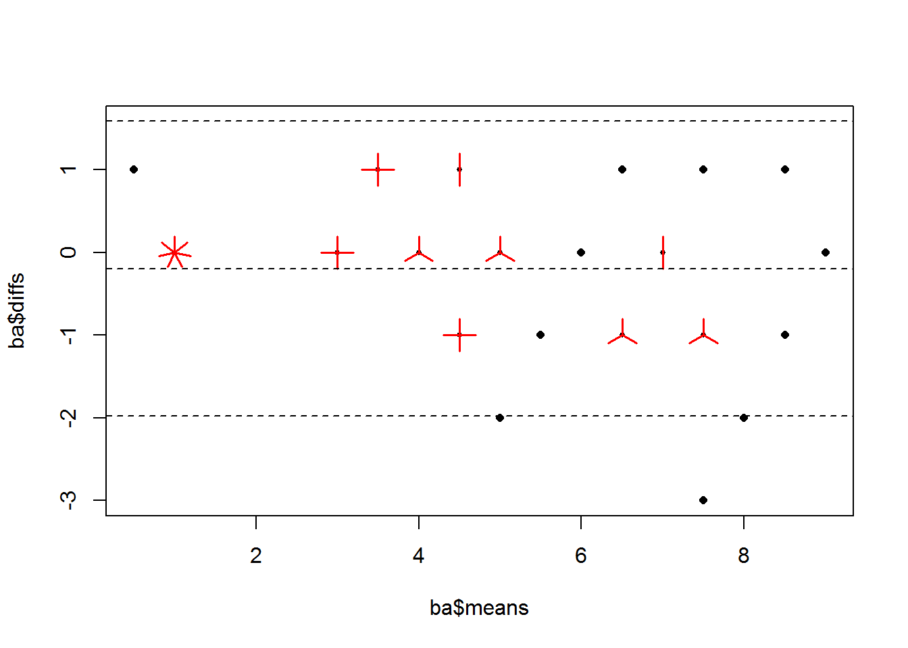

Unfortunately, this option does not exist with ggplot2 output. However, starting from version 2.0, ggplot2 features an alternative with the geom_count, which draws bigger dots if there is more than one data point at a given location as in

`print( bland.altman.plot(A, B, graph.sys = "ggplot2", geom_count = TRUE) )`
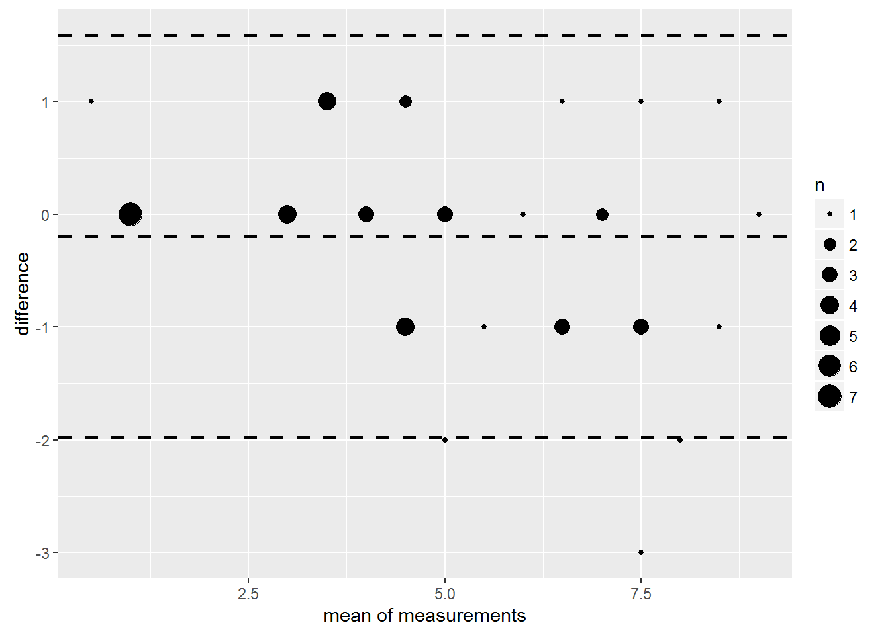

Hadley Wickhams announcement of the geom_count geom: http://blog.rstudio.org/2015/12/21/ggplot2-2-0-0/ in more detail: http://docs.ggplot2.org/dev/geom_count.html

Of course, there are countless ways to build on top of such a plot. Find an example of an ggplot2 bland.altman.plot combined with a ggplot2 regression line and regression line confidence intervall on this poster in fig 3: Evans R, Gonnermann U, Koch A, Lehnert B, GMS Curr Posters Otorhinolaryngol Head Neck Surg 2015; 11:Doc310 (20150416) http://www.egms.de/static/pdf/journals/cpo/2015-11/cpo001275.pdf .

There is a lot of worthwhile additions available on CRAN. I would like to point to the ggExtra package, which can be used to display marginal distributions at ggplot2-plots like so:

	library(ggExtra)
	print(ggMarginal(bland.altman.plot(a, b, graph.sys = "ggplot2"),
	           type = "histogram", size=4))

`## `stat_bin()` using `bins = 30`. Pick better value with `binwidth`.`
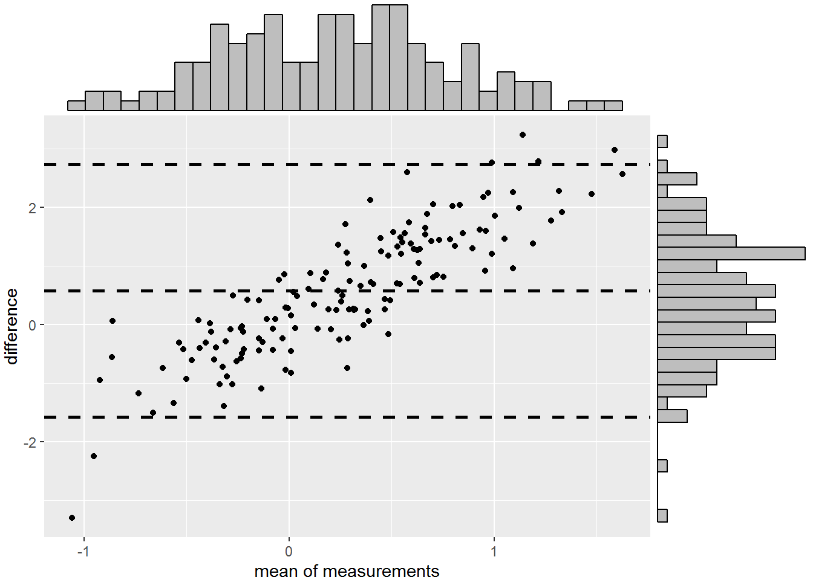

# Yet another Bland-Altman procedure? What’s in a name?

With Bland-Altman plots being a standard analysis, one should think, there are lots of packages on CRAN. Yes, there are:

- Package **PairedData** has a function plotBA based on ggplot2 (and I prefer base plots) and no stats as return value
- Package **ResearchMethods** has a function BlandAltman which focuses on a GUI and has no return values.
- Package **epade has** a function bland.altman.ade which appears to have no return values.
- Package **MethComp** has a functino BlandAltman that is deprecated and a function ba.plot which does a lot, mainly regression and from first glance seems to be worthy of further investigation for serious work.
- There are **probably other packages** that I did not mention. There I did not want to give this package a name like RBlandAltman but state, that this is just humble one approach by one Person (Lehnert) and therefore BlandAltmanLeh

# Last but not least

Before using this in any serious work consider the small version number and perform plausibility checks.

Enjoy!
Bernhard Lehnert, University Medicine Greifswald, Germany