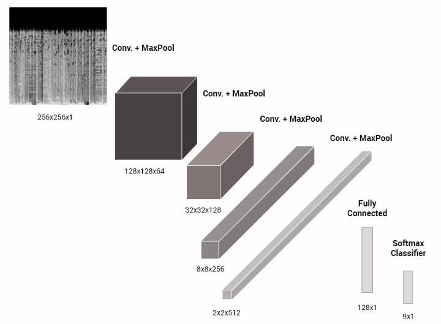

Building a Music Recommender with Deep Learning – Matt Murray

## Building a Music Recommender with Deep Learning

I’ve spent a lot of money on music over the years and one website that I have purchased mp3’s from is [JunoDownload](http://www.junodownload.com/). It’s a digital download website predominantly used by DJs and has a huge back catalogue of tracks for sale on its platform.

It’s a great music resource and they provide a generous 2 minute sample mp3 file for each song they have for sale. The only problem is…it’s really hard to find music on the site that isn’t a new release or currently top of the sales charts.

The website is heavily geared towards promoting new content, and that makes sense as it’s going to be the new music that generates the most revenue – but what about the other 99% of tracks for sale on the website?

## Music recommendations

There are a number of track recommendations already on the website. On the main site, there’s sales chart lists, new release lists and a plethora of curated recommendation lists by staff and DJs.

On top of that, on each individual track / single web page, running along the right hand side of the window are recommenders for *‘people who bought this also bought’*, *‘other releases by the artist’* and *‘other releases on this record label’*, which are also useful.

But with such a large database of music, I feel that the site is missing a content-based *‘you might also like’* type recommender that suggests similar songs that a user might like based on what they are currently listening to, have added to their cart etc.

Wouldn’t it be cool if you could discover music that was released a few years ago that sounds similar to a new song that you like? Surely Juno are missing out on potential sales by not offering this type of feature on their website.

After being inspired by a [blog post](https://chatbotslife.com/finding-the-genre-of-a-song-with-deep-learning-da8f59a61194) I’d read recently from somebody who had classified music genres for songs in their own music library, I decided to see if I could adapt that methodology to build a music recommender.

## Process

Achieving this goal required a number of data acquisition, processing and model training steps. Here’s a rundown of all the steps involved:

### Download mp3 files

The first thing I needed to do was download a large number of the sample mp3 files to work with.

After scraping track information for more than 400,000 music files available for sale on the website, I arbitrarily picked 9 different music genres and then selected at random 1,000 tracks from each of these genres.

The 9 genres were:

- Breakbeat
- Dancehall
- Downtempo
- Drum and Bass
- Funky House
- Hop Hop / R&B
- Minimal House
- Rock/Indie
- Trance

Over the next few days (my script was deliberately slow so I didn’t bombard the website with download requests) I downloaded all 9,000 mp3 files.

### Convert audio to spectrograms

There’s way too much data contained within an audio file, and so a large part of this whole process is essentially trying to condense the information from the music and extract the main features while eliminating all the ‘noise’. It’s basically an exercise in dimensionality reduction, and the first stage of this was to convert the audio into an image format.

Using Discrete Fourier Transforms to convert the audio signals into the frequency domain, I processed each of my 9,000 mp3 audio files and saved spectrogram images for each song. A spectrogram is a visual representation of the spectrum of frequencies of sound as it varies with time. The intensity of colour on the image represents the amplitude of the sound at that frequency.

I chose to create monochrome spectrograms, like this one below:

This is around 20 seconds of audio generated from a hip hop track. On the x-axis is time, and on the y-axis are the frequencies of the sound.

### Split images into 256×256 squares

In order to train a model on this data, I needed all of my images to be of equal dimensions, so I split all of my spectrograms into 256×256 squares. This represents just over 5 seconds of audio on each image.

By now, I had more than 185,000 images in total, each with a label for the music genre it represented.

I split my data into a training set of 120,000, a validation set of 45,000 and a holdout set of 20,000 images.

### Train a Convolutional Neural Network on the images

I trained a CNN on my image data. I needed to teach it to recognise what the different types of music ‘looked’ like in the spectrogram images, so I used the genre labels and trained it to identify the music genre from the images.

Below is a visualisation of the CNN pipeline:

Starting with the spectrogram image on the upper left hand side, the image is converted into a matrix of numbers representing the colours in each of the pixels. From there, the data passes through various layers in the pipeline and through each layer the shape of the matrix is transformed until it eventually reaches a softmax classifier in the bottom right hand corner. This is a vector of 9 numbers and contains the probabilities for each of the 9 music genres the CNN assigns to the image.

One step in from that is the fully connected layer. This is a vector of 128 numbers and these are essentially 128 music features that have been extracted from the image after passing through the various layers. Another way of thinking about this layer is that all the key information in the original image has been compacted into 128 numbers that ‘explain’ the image.

## So how well did the CNN do?

It was capable of classifying the music genre of a song with 75% accuracy, which I felt was pretty good. Music genres are somewhat subjective and music often transcends more than one genre, so I felt happy that it was doing a good job. Here’s a breakdown of the classification accuracies:

- Trance: 91%
- Drum & Bass: 90%
- Dancehall: 79%
- Breakbeat: 78%
- Funky House: 71%
- Downtempo: 71%
- Rock/Indie: 70%
- Minimal House: 63%
- Hip Hop / R&B: 61%

It did a really good job classifying trance music while at the other end of the scale was hip hop / R&B with 61%, which is still almost 6 times better than randomly assigning a genre to the image. I suspect that there’s some crossover between hip hop, breakbeat and dancehall and that might have resulted in a lower classification accuracy. Trance music is quite different to the other 8 genres in the list, so perhaps that’s also why it did so much better at identifying that type of music.

Nevertheless, these numbers weren’t too important to me; what was important was that it was capable of differentiating between different types of music.

## What about the music recommender?

Now that I had a trained neural network capable of ‘seeing’ music in spectrograms, I no longer needed the softmax classifier, so I removed that layer and extracted the 128 music feature vectors for all 185,000 images in my data set.

With each image representing just over 5 seconds of audio, and the sample mp3 files being around 2 minutes long in total, I had approximately 23 images – and therefore 23 feature vectors – for each music file. I calculated the mean (average) vector for each song, giving me 9,000 feature vectors; one for each of the 9,000 songs I had originally downloaded.

So just as a quick recap – I started with 9,000 audio files, converted them into 9,000 spectrograms, split them up into 185,000 smaller spectrograms and trained a convolutional neural network on these images. I then extracted 185,000 feature vectors for all these images and calculated the average vector for each of the 9,000 original audio files.

At this point I had now extracted 128 features from the music files that identified different characteristics in the music. So in order to create recommendations of songs that shared similar characteristics, all I needed to find were the vectors that were most similar to one another. To do that, I calculated the cosine similarity between all 9,000 vectors.

## Example recommendations

The last step was to select a song at random, and then have the model return the best recommendations of similar music (the songs with the greatest cosine similarities) out of the entire data set of 9,000 mp3s I had downloaded.

Below are a few examples of the recommender in action. The first song that plays is the one that I picked at random, and the 3 that follow are the 3 best recommendations of songs it returned. I think it’s pretty awesome, but see what you think for yourself:

[Drum & Bass music recommendation](https://www.youtube.com/watch?v=H1cN4uzxZZw)

[Downtempo music recommendation](https://www.youtube.com/watch?v=cPHpr_u62ZM)

[Funky House music recommendation](https://www.youtube.com/watch?v=cizXW9vvoRA)

[Hip Hop music recommendation](https://www.youtube.com/watch?v=VDuOu4BMDz8)

[Indie music recommendation](https://www.youtube.com/watch?v=7M5_TKOOGBg)

[Trance music recommendation](https://www.youtube.com/watch?v=PnK8pX8f9A4)

I think the coolest thing about it is that this is entirely unsupervised. Imagine how long it would take if you had to actually *listen* to each one of these 9,000 songs and take notes evaluating them against different features and characteristics. Now imagine doing it for *one million* songs or more.

The folks at [Pandora](https://www.pandora.com/) are the only people I know of that have attempted this as part of their ongoing “Music Genome Project”. According to [this article](http://boingboing.net/2014/05/24/pandoras-music-genome-proj.html), they have 25 music analysts listening to and grading 10,000 songs ***a month*** (for some context, this entire project from start to finish took me three weeks) on up to 450 different musical features.

That is why I’m really pleased with the results from my recommender; it does a pretty good job of finding songs that sound alike without requiring anybody to have to listen to the audio beforehand – and in a fraction of the time it would take a human to do the same.

## Code

https://github.com/mattmurray/juno_crawler
https://github.com/mattmurray/music_recommender

[**Previous Post](http://mattmurray.net/predicting-premier-league-points/)

[Next Post**](http://mattmurray.net/classifying-san-francisco-crime-incidents/)