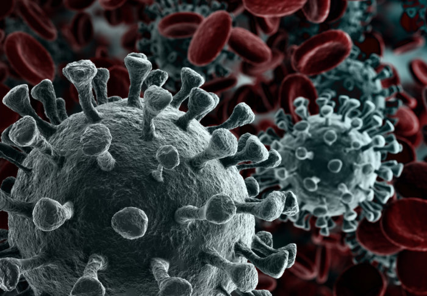
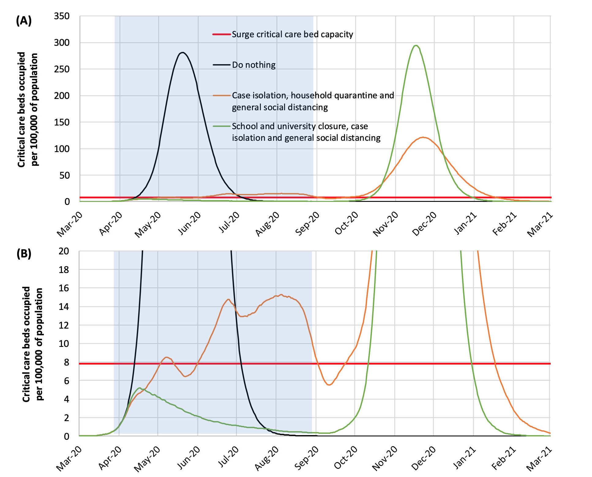

COVID-19: Imperial researchers model likely impact of public health measures | Imperial News | Imperial College London

# COVID-19: Imperial researchers model likely impact of public health measures

by[Dr Sabine L. van Elsland](https://www.imperial.ac.uk/news/196234/covid19-imperial-researchers-model-likely-impact/?utm_medium=email&utm_campaign=Imperial%20Today%201042%20%20Wednesday%2018%20March%202020&utm_content=Imperial%20Today%201042%20%20Wednesday%2018%20March%202020+CID_8eb4cae60c07aadded39511d0a652be8&utm_source=Campaign%20Monitor%20Imperial%20News&utm_term=COVID-19%20measures#authorbox),[Ryan O'Hare](https://www.imperial.ac.uk/news/196234/covid19-imperial-researchers-model-likely-impact/?utm_medium=email&utm_campaign=Imperial%20Today%201042%20%20Wednesday%2018%20March%202020&utm_content=Imperial%20Today%201042%20%20Wednesday%2018%20March%202020+CID_8eb4cae60c07aadded39511d0a652be8&utm_source=Campaign%20Monitor%20Imperial%20News&utm_term=COVID-19%20measures#authorbox)17 March 2020

Researchers from Imperial have analysed the likely impact of multiple public health measures on slowing and suppressing the spread of coronavirus.

The [latest analysis](https://www.imperial.ac.uk/mrc-global-infectious-disease-analysis/news--wuhan-coronavirus/) comes from a team modelling the spread and impact COVID-19 and whose data are informing current UK government policy on the pandemic.

The findings are published in the [9th report from the WHO Collaborating Centre for Infectious Disease Modelling](https://www.imperial.ac.uk/mrc-global-infectious-disease-analysis/news--wuhan-coronavirus/) within the [MRC Centre for Global Infectious Disease Analysis](https://www.imperial.ac.uk/mrc-global-infectious-disease-analysis), [J-IDEA](https://www.imperial.ac.uk/jameel-institute/), Imperial College London.

Professor Neil Ferguson, head of the MRC GIDA team and director of the [Abdul Latif Jameel Institute for Disease and Emergency Analytics (J-IDEA)](https://www.imperial.ac.uk/jameel-institute/), said: “The world is facing the most serious public health crisis in generations. Here we provide concrete estimates of the scale of the threat countries now face.

“We use the latest estimates of severity to show that policy strategies which aim to mitigate the epidemic might halve deaths and reduce peak healthcare demand by two-thirds, but that this will not be enough to prevent health systems being overwhelmed. More intensive, and socially disruptive interventions will therefore be required to suppress transmission to low levels. It is likely such measures – most notably, large scale social distancing – will need to be in place for many months, perhaps until a vaccine becomes available.”

## Combining multiple measures

In the current absence of vaccines and effective drug treatments, there are several public health measures countries can take to help slow the spread of the COVID-19. The team focused on the impact of five such measures, alone and in combination:

- Home isolation of cases – whereby those with symptoms of the disease (cough and/or fever) remain at home for 7 days following the onset of symptoms
- Home quarantine – whereby all household members of those with symptoms of the disease remain at home for 14 days following the onset of symptoms
- Social distancing – a broad policy that aims to reduce overall contacts that people make outside the household, school or workplace by three-quarters.
- Social distancing of those over 70 years – as for social distancing but just for those over 70 years of age who are at highest risk of severe disease
- Closure of schools and universities

Modelling available data, the team found that depending on the intensity of the interventions, combinations would result in one of two scenarios.

In the first scenario, they show that interventions could slow down the spread of the infection but would not completely interrupt its spread. They found this would reduce the demand on the healthcare system while protecting those most at risk of severe disease. Such epidemics are predicted to peak over a three to four-month period during the spring/summer.

In the second scenario, more intensive interventions could interrupt transmission and reduce case numbers to low levels. However, once these interventions are relaxed, case numbers are predicted to rise. This gives rise to lower case numbers, but the risk of a later epidemic in the winter months unless the interventions can be sustained.

**Flattening the curve:** The report highlights suppression strategy scenarios for the UK showing intensive care unit (ICU) bed requirements. The black line shows the unmitigated epidemic. Green shows a suppression strategy incorporating closure of schools and universities, case isolation and population-wide social distancing beginning in late March 2020. The orange line shows a containment strategy incorporating case isolation, household quarantine and population-wide social distancing. The red line is the estimated surge ICU bed capacity in GB. The blue shading shows the 5-month period in which these interventions are assumed to remain in place. (B) shows the same data as in panel (A) but zoomed in on the lower levels of the graph. (Source: WHO collaborating Centre / MRC GIDA / J-IDEA)

## Slowing and suppressing the outbreak

The report details that for the first scenario (slowing the spread), the optimal policy would combine home isolation of cases, home quarantine and social distancing of those over 70 years. This could reduce the peak healthcare demand by two-thirds and reduce deaths by half. However, the resulting epidemic would still likely result in an estimated 250,000 deaths and therefore overwhelm the health system (most notably intensive care units).

> The world is facing the most serious public health crisis in generations. >   > – > Prof. Neil Ferguson>   > Director, J-IDEA

In the second scenario (suppressing the outbreak), the researchers show this is likely to require a combination of social distancing of the entire population, home isolation of cases and household quarantine of their family members (and possible school and university closure). The researchers explain that by closely monitoring disease trends it may be possible for these measures to be relaxed temporarily as things progress, but they will need to be rapidly re-introduced if/when case numbers rise. They add that the situation in China and South Korea in the coming weeks will help to inform this strategy further.

[Professor Azra Ghani](https://www.imperial.ac.uk/people/a.ghani), Chair in Infectious Disease Epidemiology from the MRC Centre for Global Infectious Disease Analysis, said: “The current situation with the COVID-19 pandemic is evolving rapidly; governments and societies therefore need to be flexible in responding the challenges it poses. Our results indicate that widescale social distancing measures, that are likely to have a major impact on our day-to-day lives, are now necessary to reduce further spread and prevent our health system being overwhelmed. Close monitoring will be required in the coming weeks and months to ensure that we minimise the health impact of this disease.”

[Professor Christl Donnelly](https://www.imperial.ac.uk/people/c.donnelly), Professor of Statistical Epidemiology within J-IDEA, said: “The challenges we collectively face are daunting.  However, our work indicates if a combination of measures are implemented, then transmission can be substantially reduced.  These measures will be disruptive but uncertainties will reduce over time, and while we await effective vaccines and drugs, these public health measures can reduce demands on our healthcare systems.”

[Professor Steven Riley](https://www.imperial.ac.uk/people/s.riley), Professor of Infectious Disease Dynamics within J-IDEA, said: “We have to accept that COVID-19 is a severe infection and it is currently able to spread in countries such as the US and the UK. In this report, we show that the most stringent traditional interventions are required in the short term to halt its spread. Once they are in place, it becomes a common priority for us all to find the best possible ways to improve on those interventions”

-

This article is adapted from a press release from the MRC Centre for Global Infectious Disease Analysis

The full report is available on the [MRC Centre for Global Infectious Disease Analysis webpage](https://www.imperial.ac.uk/mrc-global-infectious-disease-analysis/news--wuhan-coronavirus/).

Article text (excluding photos or graphics) © Imperial College London.

Photos and graphics subject to third party copyright used with permission or © Imperial College London.

## Reporters

**Dr Sabine L. van Elsland**
School of Public Health

####  Contact details

Tel: +44 (0)20 7594 3896

Email: [s.van-elsland@imperial.ac.uk](https://www.imperial.ac.uk/news/196234/covid19-imperial-researchers-model-likely-impact/?utm_medium=email&utm_campaign=Imperial%20Today%201042%20%20Wednesday%2018%20March%202020&utm_content=Imperial%20Today%201042%20%20Wednesday%2018%20March%202020+CID_8eb4cae60c07aadded39511d0a652be8&utm_source=Campaign%20Monitor%20Imperial%20News&utm_term=COVID-19%20measuresmailto:s.van-elsland@imperial.ac.uk)

[Show all stories by this author](https://www.imperial.ac.uk/news/search?author=01017814)

**Ryan O'Hare**
Communications and Public Affairs

####  Contact details

Tel: +44 (0)20 7594 2410

Email: [r.ohare@imperial.ac.uk](https://www.imperial.ac.uk/news/196234/covid19-imperial-researchers-model-likely-impact/?utm_medium=email&utm_campaign=Imperial%20Today%201042%20%20Wednesday%2018%20March%202020&utm_content=Imperial%20Today%201042%20%20Wednesday%2018%20March%202020+CID_8eb4cae60c07aadded39511d0a652be8&utm_source=Campaign%20Monitor%20Imperial%20News&utm_term=COVID-19%20measuresmailto:r.ohare@imperial.ac.uk)

[Show all stories by this author](https://www.imperial.ac.uk/news/search?author=00939214)

#### Tags:

[Viruses](https://www.imperial.ac.uk/news/search?tag=74),[JIDEA](https://www.imperial.ac.uk/news/search?tag=190),[Coronavirus](https://www.imperial.ac.uk/news/search?tag=194),[Public-health](https://www.imperial.ac.uk/news/search?tag=53),[COVIDWEF](https://www.imperial.ac.uk/news/search?tag=195)

**[See more tags](https://www.imperial.ac.uk/news/tagcloud)**

## Leave a comment

Your comment may be published, displaying your name as you provide it, unless you request otherwise. Your contact details will never be published.

Name (required)Email (required)Message (required)  * please state if you do not wish your comment to be published.

2,000 characters remaining

[Be the first to comment](https://www.imperial.ac.uk/news/196234/covid19-imperial-researchers-model-likely-impact/?utm_medium=email&utm_campaign=Imperial%20Today%201042%20%20Wednesday%2018%20March%202020&utm_content=Imperial%20Today%201042%20%20Wednesday%2018%20March%202020+CID_8eb4cae60c07aadded39511d0a652be8&utm_source=Campaign%20Monitor%20Imperial%20News&utm_term=COVID-19%20measures#comments)

[Share this](https://www.imperial.ac.uk/news/196234/covid19-imperial-researchers-model-likely-impact/?utm_medium=email&utm_campaign=Imperial%20Today%201042%20%20Wednesday%2018%20March%202020&utm_content=Imperial%20Today%201042%20%20Wednesday%2018%20March%202020+CID_8eb4cae60c07aadded39511d0a652be8&utm_source=Campaign%20Monitor%20Imperial%20News&utm_term=COVID-19%20measures#)

[Tweet this](https://www.imperial.ac.uk/news/196234/covid19-imperial-researchers-model-likely-impact/?utm_medium=email&utm_campaign=Imperial%20Today%201042%20%20Wednesday%2018%20March%202020&utm_content=Imperial%20Today%201042%20%20Wednesday%2018%20March%202020+CID_8eb4cae60c07aadded39511d0a652be8&utm_source=Campaign%20Monitor%20Imperial%20News&utm_term=COVID-19%20measures#)

[Share on reddit](https://www.imperial.ac.uk/news/196234/covid19-imperial-researchers-model-likely-impact/?utm_medium=email&utm_campaign=Imperial%20Today%201042%20%20Wednesday%2018%20March%202020&utm_content=Imperial%20Today%201042%20%20Wednesday%2018%20March%202020+CID_8eb4cae60c07aadded39511d0a652be8&utm_source=Campaign%20Monitor%20Imperial%20News&utm_term=COVID-19%20measures#)

[Share on LinkedIn](https://www.imperial.ac.uk/news/196234/covid19-imperial-researchers-model-likely-impact/?utm_medium=email&utm_campaign=Imperial%20Today%201042%20%20Wednesday%2018%20March%202020&utm_content=Imperial%20Today%201042%20%20Wednesday%2018%20March%202020+CID_8eb4cae60c07aadded39511d0a652be8&utm_source=Campaign%20Monitor%20Imperial%20News&utm_term=COVID-19%20measures#)

[Print this story](https://www.imperial.ac.uk/news/196234/covid19-imperial-researchers-model-likely-impact/?utm_medium=email&utm_campaign=Imperial%20Today%201042%20%20Wednesday%2018%20March%202020&utm_content=Imperial%20Today%201042%20%20Wednesday%2018%20March%202020+CID_8eb4cae60c07aadded39511d0a652be8&utm_source=Campaign%20Monitor%20Imperial%20News&utm_term=COVID-19%20measures#)

* * *

### Related stories

[**Imperial researchers in race to develop a coronavirus vaccine**](https://www.imperial.ac.uk/news/195055/imperial-researchers-race-develop-coronavirus-vaccine)

[Coronavirus fatality rate estimated by Imperial scientists](https://www.imperial.ac.uk/news/195217/coronavirus-fatality-rate-estimated-imperial-scientists)

[Coronavirus outbreak in China may have infected thousands, estimate scientists](https://www.imperial.ac.uk/news/194815/coronavirus-outbreak-china-have-infected-thousands)

[Rapid response research centre to predict and prevent global health crises](https://www.imperial.ac.uk/news/193428/rapid-response-research-centre-predict-prevent)

[Crunching the numbers for coronavirus](https://www.imperial.ac.uk/news/196137/crunching-numbers-coronavirus)

* * *

### Featured

- [Professor Christl A Donnelly FRS](https://www.imperial.ac.uk/people/c.donnelly)

*School of Public Health*

- [Professor Azra C H Ghani](https://www.imperial.ac.uk/people/a.ghani)

*School of Public Health*

- [Professor Neil M Ferguson](https://www.imperial.ac.uk/people/neil.ferguson)

*School of Public Health*

- [Professor Steven Riley](https://www.imperial.ac.uk/people/s.riley)

*School of Public Health*

* * *

### Media mentions

[Financial Times - UK’s original coronavirus plan risked ‘hundreds of thousands’ dead](https://www.ft.com/content/249daf9a-67c3-11ea-800d-da70cff6e4d3)

[BBC Today - "We're about three weeks behind Italy", says Neil Ferguson](https://www.bbc.co.uk/programmes/p086vhdb?at_medium=custom7&at_custom1=%5Bpost+type%5D&at_campaign=64&at_custom2=twitter&at_custom3=%40BBCr4today&at_custom4=EE8E8652-6837-11EA-B011-55213A982C1E)

[The Guardian - New data, new policy: why UK's coronavirus strategy changed](https://www.theguardian.com/world/2020/mar/16/new-data-new-policy-why-uks-coronavirus-strategy-has-changed)

[New York Times - White House Takes New Line After Dire Report on Death Toll](https://www.nytimes.com/2020/03/16/us/coronavirus-fatality-rate-white-house.html)

* * *

### More

- [MRC Centre for Global Infectious Disease Research](https://www.imperial.ac.uk/mrc-global-infectious-disease-analysis)
- [J-IDEA - Abdul Latif Jameel Institute for Disease and Emergency Analytics](https://www.imperial.ac.uk/jameel-institute/)
- [Health](https://www.imperial.ac.uk/medicine/)