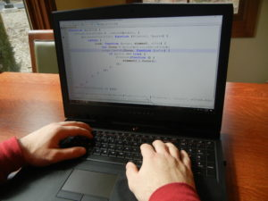

CS department updates introductory courses

# CS department updates introductory courses

February 28, 2017[3 Comments](http://www.stanforddaily.com/2017/02/28/cs-department-updates-introductory-courses/#disqus_thread)

-
-

|     |
| --- |
| [Stephanie Brito](http://www.stanforddaily.com/author/stephaniebrito/) Contributing Writer |

Adapting to industry shifts and student feedback, the computer science department has implemented various changes to its introductory courses, CS106 and CS107.

This spring, a pilot version of CS106A, tentatively called CS106J, will be taught in Javascript instead of Java. Meanwhile, CS106S: “Programming Abstractions and Social Good” is being offered as a standalone class for the first time this winter, encouraging students to consider the social impact their work can have. In addition, recent changes to CS107 have sought to make the course more manageable for students.

Student coding in Javascript (VEDI CHAUDHRI/The Stanford Daily).
**Introducing CS106J **

Eric Roberts, emeritus professor of computer science and pioneer of the CS106 series, has been working on the transition to Javascript for the past five years. Roberts has written a new textbook, created assignments of the appropriate scope and trained new teaching assistants (TAs).

The computer science department has cycled through several languages over the past decades. When Roberts came to Stanford in 1990, CS106A was still taught in Pascal, a programming language he described as not “clean.” The department adopted the C language in 1992.

When Java came out in 1995, the computer science faculty was excited to transition to the new language. Roberts wrote the textbooks, worked with other faculty members to restructure the course and assignments and introduced Java at Stanford in 2002.

“Java had stabilized,” Roberts said. “It was clear that many universities were going in that direction. It’s 2017 now, and Java is showing its age.”

According to Roberts, Java was intended early on as “the language of the Internet”. But now, more than a decade after the transition to Java, Javascript has taken its place as a web language.

Roberts will come out of retirement to teach the new class this spring with Jerry Cain M.S. ’98, lecturer in the CS department. The class will be capped at 100 students and will employ TAs instead of the traditional section leaders.

Both undergraduates and grad students can still serve as TAs. However, the department will select for those more proficient in Javascript.

**Continuing CS106S**

After receiving positive feedback for last year’s optional CS106S section, the CS department has decided to offer it as a one-unit class this quarter.

CS106S: “Computer Science + Social Good” allows CS students to see practical applications of their coding and to “start thinking about using their skills for social good early on in their computer science careers,” according to course instructor Priya Ganesan ’17.

“Students in CS106B/X are at an ideal level for this class because they’ve gained enough skills to build complex technical projects, but also don’t necessarily have preconceived notions about fields or careers within the tech industry,” Ganesan said.

The class is currently offered as a one-unit course capped at 30 students per quarter, but additional students are allowed to audit the class. Ganesan also said that the course will be offered again during the next school year.

**Revising CS107 **

According to student reviews on Carta, a course planning site that displays course reviews, CS107 is one of the more difficult courses offered at Stanford. “It will maybe destroy your life, but you’ll learn a lot in the destruction,” reads one review.

Responding to students’ concerns, course instructor Cynthia Lee decided to revise the syllabus to make the material less daunting to students.

“I have heard on occasion students who believe that 107 or 110 or any of the courses in our department were intended to be set up as some sort of weeder, and it’s so important to me that we let students know that that was never anyone’s intention,” Lee said.

Some of the changes implemented this fall include giving two midterms, instead of one midterm, including more aid on assignments and allowing students to use a website for debugging.

Lee, who taught CS107 in the fall and winter, will continue to teach the course in the spring with the updated syllabus.

*Contact Stephanie Brito at sbrito ‘at’ stanford.edu.*

Share
-
-

Subscribe[Click here](http://www.stanforddaily.com/subscriptions/) to subscribe to our daily newsletter of top headlines.