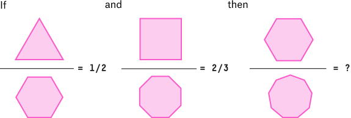
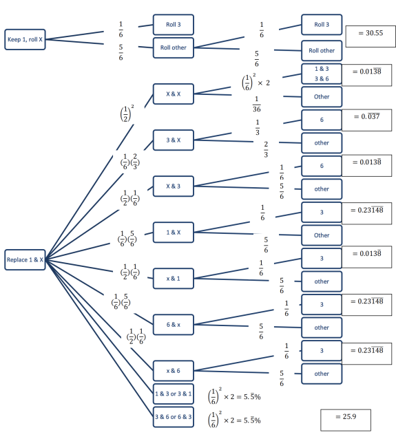

Can You Do Math With Shapes?

#  Can You Do Math With Shapes?

Illustration by Guillaume Kurkdjian

Welcome to The Riddler. Every week, I offer up problems related to the things we hold dear around here: math, logic and probability. There are two types: Riddler Express for those of you who want something bite-size and Riddler Classic for those of you in the slow-puzzle movement. Submit a correct answer for either,[1](https://fivethirtyeight.com/features/can-you-do-math-with-shapes/?ex_cid=538twitter#fn-1) and you may get a shoutout in next week’s column. If you need a hint or have a favorite puzzle collecting dust in your attic, [find me on Twitter](https://twitter.com/ollie).

## Riddler Express

From Derik Moore, some shapely arithmetic:

[Submit your answer](https://docs.google.com/forms/d/e/1FAIpQLSfqyKue1aExQ_AA70mai7l-kMpWSnctvVpqfKgClOkWdl8XKw/viewform?usp=sf_link)

ADVERTISEMENT

## Riddler Classic

From Sam Bollier, a digital dilemma:

How many decimal numbers are there whose value equals the average of their digits? The digits of the number 2.3, for example, are 2 and 3, and their average is 2.5 — so that doesn’t quite work. But there are at least a few that do.

Two quick technical rules: First, no trailing zeros are allowed, so 2.250 doesn’t count because it could be written as 2.25. Second, if the average value of your number’s digits is a repeating decimal, it can be truncated to the length of the number you started with, but the rules of rounding still apply. For example, 5.66 doesn’t *quite* work because its average digit value is (5+6+6)/3 = 5.6666… repeating, but that would round up to 5.67 if it were expressed using three digits.

Happy hunting!

[Submit your answer](https://docs.google.com/forms/d/e/1FAIpQLSeMHjQTBzr1Ojr5-0o5BySXYiyNseE3CWj-HTmkR15ahAlWxw/viewform?usp=sf_link)

## Solution to last week’s Riddler Express

Congratulations to 👏 Eli Wolfhagen 👏 of Brooklyn, winner of [last week’s Riddler Express](https://fivethirtyeight.com/features/are-you-the-perfect-yahtzee-player/)!

Last week we pulled out a cup and a pair of dice for a game of Yahtzee. (To refresh yourself on the rules, [see here](https://www.hasbro.com/common/documents/dad2af551c4311ddbd0b0800200c9a66/8302F43150569047F57EB8D746BA9D86.pdf).) For the Express puzzle, you play a one-turn game of Yahtzee, in which your only consideration is to maximize your score on a single turn. After your second of three rolls, your five dice show 4, 4, 4, 5 and 5. You could keep all of your dice and score 25 points for a full house. Or you could reroll your 5s and try for the 50-point Yahtzee (which is when all five dice show the same number) — but then you’d run the risk of scoring a lowly three- or four-of-a-kind instead, which are worth the sum of your five dice. What is the best strategy for maximizing your expected score?

Let’s walk carefully through two possible strategies.

First, suppose you keep all your dice. This one’s easy: You’ll score *25 points* for sure for your full house. For the other strategy to be preferable, it needs to net more than 25 points, on average.

So suppose you risk it and reroll your two 5s. There are 36 (or 6×6) ways those two dice could fall. In only one of those cases will they both land as 4s, giving you your 50-point Yahtzee. In five other cases, where your two rerolled dice match, you’ll have another full house and earn 25 points. In the other 30 cases, you’ll wind up with a three- or four-of-a-kind, which is worth only the sum your five dice. The average of the sum of your dice in those 30 cases is 19. So, putting this all together, your expected score when rerolling your two 5s is (1/36)(50) + (5/36)(25) + (30/36)(19) ≈ *20.69 points*. You can see your expected score given the possible outcomes of your two dice in the table below.

##### Expected combined score for the possible outcomes of your two dice

| 1   | 2   | 3   | 4   | 5   | 6   |
| --- | --- | --- | --- | --- | --- |
| 1   | 25 pts. | 15  | 16  | 17  | 18  | 19  |
| 2   | 15  | 25  | 17  | 18  | 19  | 20  |
| 3   | 16  | 17  | 25  | 19  | 20  | 21  |
| 4   | 17  | 18  | 19  | 50  | 21  | 22  |
| 5   | 18  | 19  | 20  | 21  | 25  | 23  |
| 6   | 19  | 20  | 21  | 22  | 23  | 25  |

The average of every entry in this table, each of which is equally likely, is 20.69. This is clearly less than 25, so you’re better off holding your dice than rerolling your two 5s.

In fact, you’re better off keeping the numbers you have in front of you than you are rerolling any combination of your dice. A handful of solvers wrote programs to calculate the expected score of possible rerolls. Every option, from rerolling a single die to rerolling all five, scores less than 25 points in expectation. But surprisingly to me, if you were *forced* to reroll, your best bet would be to keep one 4 and one 5 and just let the other three rip. You’d score an average of *22.76 points* in that case, since you can catch a few straights that way.

## Solution to last week’s Riddler Classic

Congratulations to 👏 Amy DeRocher 👏 of Bothell, Washington, winner of [last week’s Riddler Classic](https://fivethirtyeight.com/features/are-you-the-perfect-yahtzee-player/)!

For the Classic puzzle, it’s your final turn in a heated game of Yahtzee, and the only combination of dice you still need is a large straight, where all five dice show numbers in sequential order. On the first of your three possible rolls during your final turn, you roll 1, 2, 4, 5 and X (where X is not a 3). You could reroll the X in hopes of getting a 3. Or you could reroll the 1 and the X in hopes that they eventually land in some combination of 3 and 6. What is the best strategy for hitting a large straight and winning the game?

You should just reroll your X in hopes of getting a 3.

Why? There are two future rolls — your second and third rolls — we need to consider. If we reroll just the X, there is a 1/6 chance we complete our large straight with the first roll, and a 5/6 chance that we don’t. If we still need another roll, there is again a 1/6 chance we complete our large straight and a 5/6 chance that we don’t. Overall, that’s a (1/6) + (5/6)(1/6) = 11/36 ≈ .306 chance you complete your large straight using this strategy.

If we reroll the 1 and the X — keeping 2, 4 and 5 — it’s a little more complicated. For your first reroll, solver Guy Moore explained, there are four outcomes, each of which has an optimal next step for the second reroll.

- On the first reroll, there’s a 1/4 chance that you get two “useless” numbers — 2, 4 or 5. If you *do* get one of those useless numbers, the best thing to do is reroll each die, with a 1/9 chance of completing the large straight.
- On the first reroll, there’s a 7/36 chance to get one 3 and another useless number. If that happens, you should keep the 3 and throw the remaining die, which has a 1/3 chance of getting your remaining 1 or 6.
- On the first reroll, there’s a 4/9 chance to get at least one 1 or 6 and no 3. In that event, you should keep either the 1 or the 6 and reroll the remaining die, which has a 1/6 chance of hitting your remaining 3.
- And, finally, there’s a 1/9 chance to get a 3 and a 1 or a 6 on the first reroll. That completes our large straight, so there’s nothing to do next!

Putting those probabilities together, you have a (1/4)(1/9) + (7/36)(1/3) + (4/9)(1/6) + (1/9)(1) ≈ 27.8 percent chance to hit that large straight. That’s less than the 30.6 chance you had rerolling just one die. In other words, the strategies succeed with 11/36 and 10/36 probabilities, respectively.

Solver Joshua Luckhaupt approached the problem using the tree diagram below, providing some visual structure to these calculations:

This solution is also verified by Tom Verhoeff and Erik Scheffers’s [Optimal Yahtzee Player](http://www-set.win.tue.nl/~wstomv/misc/yahtzee/osyp.php), which says that rerolling the X is about 2 points better than rerolling the 1 and the X. If you’re into optimal Yahtzee play (which you obviously are), that site offers a simulator as well as a “Yahtzee Proficiency Test.”

Happy rolling!

## Want to submit a riddle?

Email me at oliver.roeder@fivethirtyeight.com.