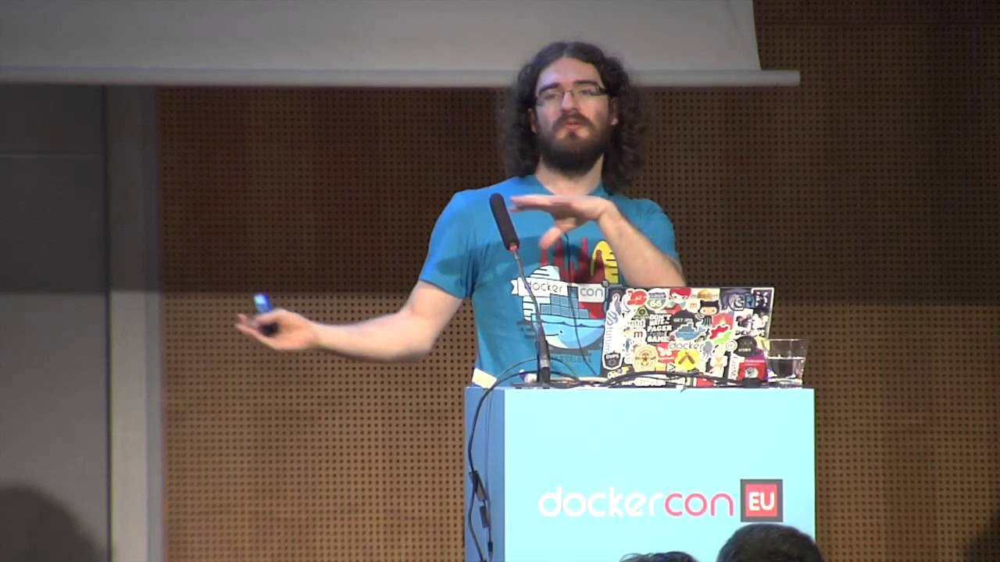

Cgroups, namespaces, and beyond: what are containers made from?

Cgroups, namespaces, and beyond: what are containers made from?
https://www.youtube.com/watch?v=sK5i-N34im8
[Docker](https://www.youtube.com/channel/UC76AVf2JkrwjxNKMuPpscHQ)
27,043 views views
Published on Dec 3, 2015

|     |
| --- |
| [(L)](https://www.youtube.com/watch?v=sK5i-N34im8) |

Description

with Jérôme Petazzoni, Tinkerer Extraordinaire, Docker

Linux containers are different from Solaris Zones or BSD Jails: they use discrete kernel features like cgroups, namespaces, SELinux, and more. We will describe those mechanisms in depth, as well as demo how to put them together to produce a container. We will also highlight how different container runtimes compare to each other.

Learn more about Docker http://www.docker.com/what-docker

--

Docker is an open platform for developers and system administrators to build, ship and run distributed applications. With Docker, IT organizations shrink application delivery from months to minutes, frictionlessly move workloads between data centers and the cloud and can achieve up to 20X greater efficiency in their use of computing resources. Inspired by an active community and by transparent, open source innovation, Docker containers have been downloaded more than 700 million times and Docker is used by millions of developers across thousands of the world’s most innovative organizations, including eBay, Baidu, the BBC, Goldman Sachs, Groupon, ING, Yelp, and Spotify. Docker’s rapid adoption has catalyzed an active ecosystem, resulting in more than 180,000 “Dockerized” applications, over 40 Docker-related startups and integration partnerships with AWS, Cloud Foundry, Google, IBM, Microsoft, OpenStack, Rackspace, Red Hat and VMware.