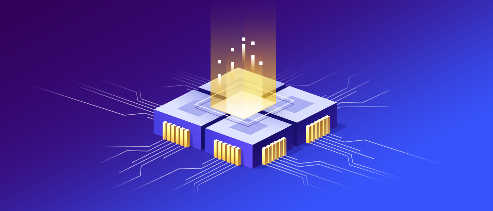
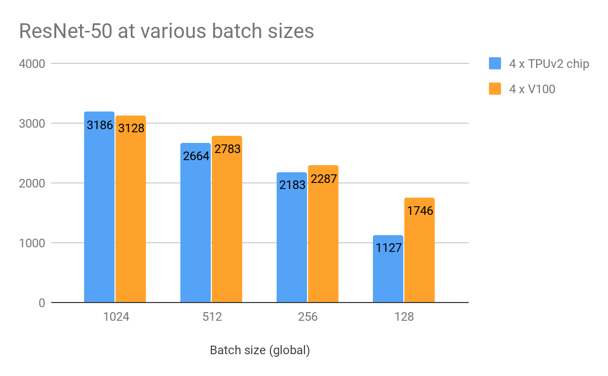
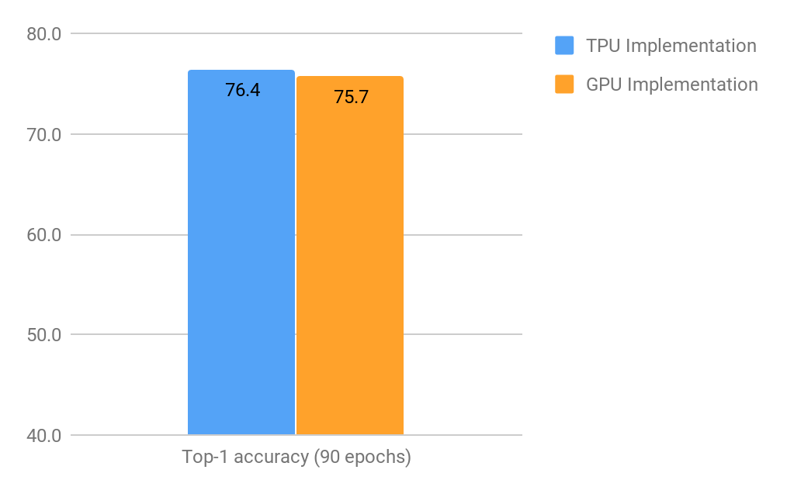
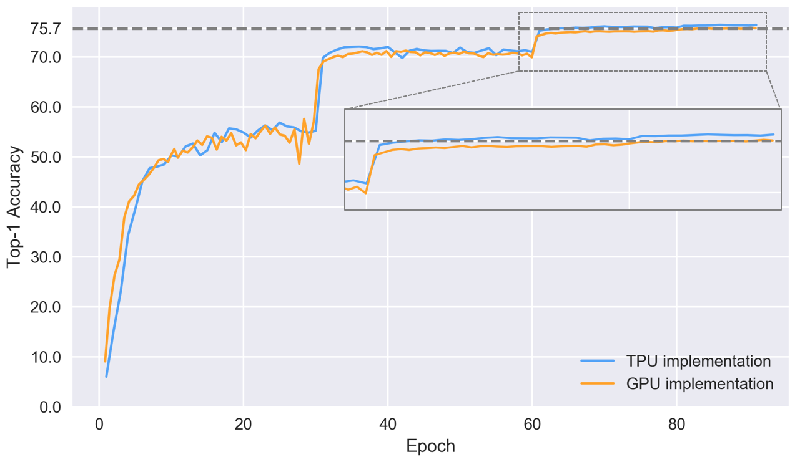
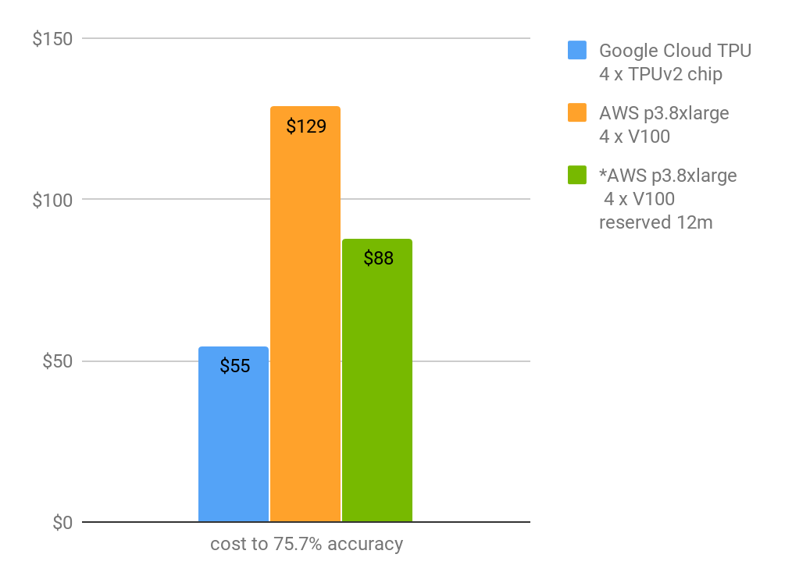

Comparing Google’s TPUv2 against Nvidia’s V100 on ResNet-50

# Comparing Google’s TPUv2 against Nvidia’s V100 on ResNet-50

Google recently added the [Tensor Processing Unit v2 (TPUv2)](https://cloudplatform.googleblog.com/2018/02/Cloud-TPU-machine-learning-accelerators-now-available-in-beta.html), a custom-developed microchip to accelerate deep learning, to its cloud offering. The TPUv2 is the second generation of this chip and the first publicly available deep learning accelerator that has the potential of becoming an alternative to Nvidia GPUs. We recently reported our [first experience](https://blog.riseml.com/benchmarking-googles-new-tpuv2-121c03b71384) and received a lot of requests for a more detailed comparison to [Nvidia V100 GPUs](https://www.nvidia.com/en-us/data-center/tesla-v100/).

Providing a balanced and meaningful comparison for deep learning accelerators is not a trivial task. Due to the future importance of this product category and the lack of detailed comparisons we felt the need to create one on our own. This also includes listening to possibly opposing sides. That’s why we established contact early on with Google and Nvidia engineers and let them comment on drafts of this article. To guarantee that we are not treating one side unfairly we additionally invited independent experts to review the article. This makes it to our knowledge the most thorough comparison between TPUv2 and V100 chips to date.

**Experimental setup**

Below, we compare four TPUv2 chips (which form one Cloud TPU) to four Nvidia V100 GPUs. Both have a total memory of 64 GB, so the same models can be trained and the same batch sizes can be used. In our experiments, we also train models in the same fashion: the four TPUv2 chips on a Cloud TPU run a form of synchronous data parallel distributed training as do the four V100s.

As model, we decided to use the [ResNet-50](https://arxiv.org/abs/1512.03385) model on [ImageNet](http://www.image-net.org/), a de facto standard and reference point for image classification. Reference implementations of ResNet-50 are publicly available, but there is currently no single implementation that supports both training on a Cloud TPU and multiple GPUs.

For the V100s, Nvidia recommended to use [MXNet](https://mxnet.incubator.apache.org/) or TensorFlow implementations, both available in Docker images on the [Nvidia GPU Cloud](https://ngc.nvidia.com/). However, we found both implementations didn’t converge well out-of-the-box with multiple GPUs and the resulting large batch sizes. This requires adjustments, in particular, in the learning rate schedule.

Instead, we used the ResNet-50 implementation from TensorFlow’s [benchmark](https://github.com/tensorflow/benchmarks/tree/a03070c016ab33f491ea7962765e378000490d99/scripts/tf_cnn_benchmarks) repository and ran it in a Docker image (tensorflow/tensorflow:1.7.0-gpu, CUDA 9.0, CuDNN 7.1.2). It is considerably faster than Nvidia’s recommended TensorFlow implementation and only slightly slower (~3%, see below) than the MXNet implementation. However, it converged well. This also has the added benefit of comparing two implementations in the same framework at the same version (TensorFlow 1.7.0).

For the Cloud TPU, Google recommended we use the [bfloat16 implementation](https://github.com/tensorflow/tpu/tree/16f9fd0514caeae87c09ae73ea1d665421d8750a/models/experimental/resnet_bfloat16) from the official TPU repository with TensorFlow 1.7.0. Both the TPU and GPU implementations make use of mixed-precision computation on the respective architecture and store most tensors with half-precision.

For the V100 experiments, we used a p3.8xlarge instance (Xeon E5–2686@2.30GHz 16 cores, 244 GB memory, Ubuntu 16.04) on AWS with** four V100 GPUs** (16 GB of memory each). For the TPU experiments, we used a small n1-standard-4 instance as host (Xeon@2.3GHz two cores, 15 GB memory, Debian 9) for which we provisioned a Cloud TPU (v2–8) consisting of **four TPUv2 chips **(16 GB of memory each).

We performed two different comparisons. First, we look at the raw performance in terms of throughput (images per second) on synthetic data and without data augmentation. This comparison is independent of convergence and ensures no bottlenecks in I/O or data augmentation influence the results. In the second comparison, we look at accuracy and convergence of the two implementations on ImageNet.

**Throughput results**

We measured throughput in terms of **images per second** on **synthetic data**, i.e.,**  **with training data created on the fly, at various batch sizes. Note that the only recommended batch size for the TPU is 1024, but based on a lot of requests from our readers, we also report performance on other batch sizes.

**Performance in images per second at various batch sizes on synthetic data and w/o data augmentation. Batch sizes are “global”, e.g., 1024 means a batch size of 256 on each GPU/TPU chip at each step.**

With a batch size of 1024, there’s practically no difference in throughput! The TPU comes out ahead very slightly with a difference of around 2%. Smaller batch sizes come with a drop in throughput on both platforms and GPUs perform slightly better there. But as stated above, these batch size are currently not a recommended setting for TPUs.

As per Nvidia’s recommendation, we also ran an experiment using GPUs on [MXNet](https://mxnet.incubator.apache.org/). We used the ResNet-50 implementation provided in the Docker image (*mxnet:18.03-py3*) available on the [Nvidia GPU Cloud](https://ngc.nvidia.com/). With a batch size of 768 (1024 is too large), the GPUs process **around 3280 images per second. **This is around 3% faster than the best TPU result above. However, as mentioned above, the MXNet implementation didn’t converge well on multiple GPUs at that batch size, which is why we focus on the TensorFlow implementation here and below.

**Cost based on cloud prices**

The Cloud TPU (four TPUv2 chips) is currently only available on the Google Cloud. It is attachable to any VM instance on-demand, only when computation is required. The cloud offering we consider for V100s is from AWS (V100s are not yet available on the Google Cloud). Based on the results above, we can normalize to *number of images per second per $ *on the respective platform and provider.

**Performance in images per second per $.**

With this pricing, the Cloud TPU is a clear winner. However, the situation may look different if you consider renting for a longer term or buying hardware (albeit, not an option for the Cloud TPU currently). Above, we also included the price of a p3.8xlarge reserved instance on AWS when renting for 12 months (no upfront payment). This drives the price down considerably and results in 375 images/s per $.

For GPUs, there are further interesting options to consider next to buying. For example, [Cirrascale](http://www.cirrascale.com/pricing_x86BM.php) offers monthly rentals of a server with four V100 GPUs for around $7.5k (~$10.3 per hour). However, further benchmarks are required to allow a direct comparison since the hardware differs from that on AWS (type of CPU, memory, NVLink support etc.).

**Accuracy and convergence**

In addition to reporting raw performance, we wanted to validate that the computations are actually “meaningful”, i.e., that the implementations converge to good results. **Since we compared two different implementations, some deviation can be expected**. Our comparison is therefore not only a measure of hardware speed, but also of the quality of the implementation. For example, the TPU implementation applies very compute-intensive image pre-processing steps and actually**  **sacrifices raw throughput**.** This is expected behaviour according to Google and, as we will see below, it pays out.

We trained the models on the [ImageNet](http://www.image-net.org/) dataset, where the task is to classify an image into one of 1000 categories, like *Hummingbird*, *Burrito,* or *Pizza*. The dataset consists of about 1.3 million images for training (~142 GB) and 50 thousand images for validation (~7 GB).

We ran training with a batch size of 1024 for 90 epochs and compared results on the validation data. The TPU implementation consistently processes about **2796 images per second** and the GPU implementation about **2839 images per second**. This is different from the throughput results above, where we had disabled data augmentation and used synthetic data to compare the raw speed of the TPU and GPU.

**Top-1 accuracy (i.e., only considering the prediction with highest confidence for each image) of the two implementations after 90 epochs.**

As shown above, the top-1 accuracy after 90 epochs for the TPU implementation is 0.7% better. This may seem minor, but making improvements at this already very high level is extremely difficul and, depending on the application, such small improvements may make a big difference in the end.

Let’s have a look at the top-1 accuracy across the different epochs as the models learn.

**Top-1 accuracy on the validation set for the two implementations.**

The sharp changes in the graph above coincide with changes in the learning rate. Convergence behaviour of the TPU implementation is better and reaches a final accuracy of 76.4% after 86 epochs. The GPU implementation lags behind and reaches the final accuracy of 75.7% after 84 epochs, while the TPU implementation only needs 64 epochs to reach this accuracy. The improved TPU convergence is likely due to the better pre-processing and data augmentation, but further experiments are needed to confirm this.

**Cost-to-solution based on cloud prices**

Ultimately, what matters is the time and cost it takes to reach a certain accuracy. If we assume an acceptable solution at 75.7% (the best accuracy achieved by the GPU implementation), we can calculate the cost to achieve this accuracy based on required epochs and training speed in images per second. This excludes time to evaluate the model in-between epochs and training startup time.

**Cost to reach 75.7% top-1 accuracy. *reserved for 12 months**

As shown above, the current pricing of the Cloud TPU allows to train a model to 75.7% on ImageNet from scratch for $55 in less than 9 hours! Training to convergence at 76.4% costs $73. While the V100s perform similarly fast, the higher price and slower convergence of the implementation results in a considerably higher cost-to-solution.

Again, note that this comparison depends on the quality of the implementation as well as the cloud pricing.

Another interesting comparison would be based on power consumption. However, we are currently not aware of any publicly available information on TPUv2 power consumption.

**Summary**

In terms of raw performance on ResNet-50, four TPUv2 chips (one Cloud TPU) and four V100 GPUs are equally fast (within 2% of each other) in our benchmarks. We will likely see further optimizations in software (e.g., TensorFlow or CUDA) that improve performance and change this.

What often matters most in practice though, is the time and cost it takes to reach a certain accuracy on a certain problem instance. The current pricing of Cloud TPUs coupled with a world-class implementation of ResNet-50 results in an impressive time- and cost-to-accuracy on ImageNet, which allows to train a model to an accuracy of 76.4% for about $73.

In the future, benchmarks of models from other domains and with different network architectures are needed to provide further insight. One interesting point to consider as well is how much effort it is to make efficient use of a given hardware platform. For example, mixed-precision computation comes with a great performance increase, but implementation and behaviour on GPUs and TPUs differs.

Thanks to Hannah Bast (University of Freiburg), David Andersen (Carnegie Mellon University), Tim Dettmers, and Mathias Meyer for reading drafts of this.

**About RiseML**

At [RiseML](https://riseml.com/) we are building an end-to-end machine learning platform based on Kubernetes that accelerates model development and lowers IT operations costs. RiseML supports Nvidia GPUs out-of-the box. Google Cloud TPUs are available in a closed alpha to select users. Please [contact us](https://blog.riseml.com/comparing-google-tpuv2-against-nvidia-v100-on-resnet-50-c2bbb6a51e5emailto:contact@riseml.com) for a trial.