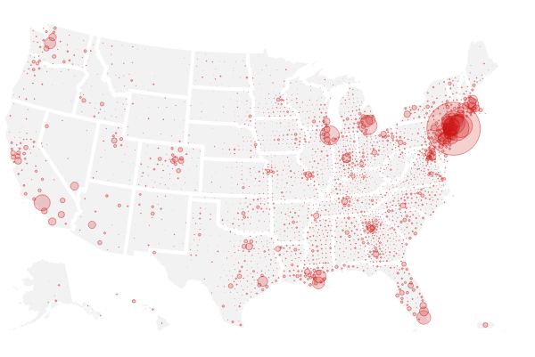
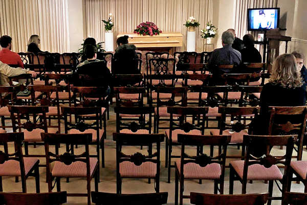

Coronavirus Case Data for Every U.S. County - The New York Times

 [The Coronavirus Outbreak](https://www.nytimes.com/news-event/coronavirus?action=click&pgtype=Article&state=default&module=styln-coronavirus-national&variant=show&region=TOP_BANNER&context=storyline_menu)

- LIVE

 [Latest Updates](https://www.nytimes.com/2020/04/10/us/coronavirus-updates-usa.html?action=click&pgtype=Article&state=default&module=styln-coronavirus-national&variant=show&region=TOP_BANNER&context=storyline_menu)

- [Maps](https://www.nytimes.com/interactive/2020/world/coronavirus-maps.html?action=click&pgtype=Article&state=default&module=styln-coronavirus-national&variant=show&region=TOP_BANNER&context=storyline_menu)

- [F.A.Q. on Small Business Relief](https://www.nytimes.com/article/small-business-loans-stimulus-grants-freelancers-coronavirus.html?action=click&pgtype=Article&state=default&module=styln-coronavirus-national&variant=show&region=TOP_BANNER&context=storyline_menu)

- [What You Can Do](https://www.nytimes.com/interactive/2020/world/coronavirus-preparation-preparedness.html?action=click&pgtype=Article&state=default&module=styln-coronavirus-national&variant=show&region=TOP_BANNER&context=storyline_menu)

- [Newsletter](https://www.nytimes.com/newsletters/coronavirus-briefing?action=click&pgtype=Article&state=default&module=styln-coronavirus-national&variant=show&region=TOP_BANNER&context=storyline_menu)

# We’re Sharing Coronavirus Case Data for Every U.S. County

With no detailed government database on where the thousands of coronavirus cases have been reported, a team of New York Times journalists is attempting to track every case.

By The New York Times

- March 28, 2020

-

    - 
    - 
    - [](https://www.nytimes.com/article/coronavirus-county-data-us.htmlmailto:?subject=NYTimes.com%3A%20We%E2%80%99re%20Sharing%20Coronavirus%20Case%20Data%20for%20Every%20U.S.%20County&body=From%20The%20New%20York%20Times%3A%0A%0AWe%E2%80%99re%20Sharing%20Coronavirus%20Case%20Data%20for%20Every%20U.S.%20County%0A%0AWith%20no%20detailed%20government%20database%20on%20where%20the%20thousands%20of%20coronavirus%20cases%20have%20been%20reported%2C%20a%20team%20of%20New%20York%20Times%20journalists%20is%20attempting%20to%20track%20every%20case.%0A%0Ahttps%3A%2F%2Fwww.nytimes.com%2Farticle%2Fcoronavirus-county-data-us.html%3Fsmid%3Dem-share)

    -
    -

Download county-level data for coronavirus cases in the United States from The New York Times [on GitHub](https://github.com/nytimes/covid-19-data).

As the coronavirus has spread across the United States, killing hundreds of people and sickening tens of thousands more, comprehensive data on the extent of the outbreak has been difficult to come by.

No single agency has provided the public with an accurate, up-to-date record of coronavirus cases, tracked to the county level. To fill the gap, The New York Times has launched a round-the-clock effort to tally every known coronavirus case in the United States. The data, which The Times will continue to track, is being made available to the public on Friday.

Individual states and counties have tracked their own cases and presented them to the public with varying degrees of speed and accuracy, but those tallies provide only limited snapshots of the nation’s outbreak. A [publicly available tracker from the federal Centers for Disease Control and Prevention](https://www.cdc.gov/coronavirus/2019-ncov/cases-updates/cases-in-us.html), updated five times a week, includes only state-level data. Other entities have made efforts, including [a notable one by Johns Hopkins University](https://www.arcgis.com/apps/opsdashboard/index.html#/bda7594740fd40299423467b48e9ecf6), to track cases worldwide or [within the United States](https://coronavirus.1point3acres.com/en).

In late January, not long after the first known case was reported in Washington State, The Times began tracking each known U.S. case as counties and states began reporting results of testing. Such testing, which had been delayed, gradually became more widely available. For the last eight weeks, a team of Times journalists has recorded an array of details — locations, dates, ages and conditions, when possible — about newly confirmed cases reported by state and local officials.

By Friday morning, The Times had tracked more than 85,000 cases in all 50 states, the District of Columbia and three U.S. territories. There have been [more known cases in the United States than in China, Italy or any other country](https://www.nytimes.com/2020/03/26/health/usa-coronavirus-cases.html), and more than 1,200 people have died in the United States. Researchers, scientists, government officials and business executives have requested access to the information. The Times is releasing its data publicly in an effort to broaden understanding of the virus’s toll.

“We hope the data set can help inform the ongoing public health response to the pandemic and ultimately, save lives,” said Dean Baquet, the executive editor of The Times. “We believe the data may help reveal how Covid-19 has spread through communities and clusters; which geographic areas may be hit the hardest; and how its spread in hard-hit areas may offer clues for regions that could face wider outbreaks in the future.”

The U.S. map of known cases

[ Coronavirus in the U.S.: Latest Map and Case Count  A detailed county map shows the extent of the coronavirus outbreak, with tables of the number of cases by county. March 3, 2020  ](https://www.nytimes.com/interactive/2020/us/coronavirus-us-cases.html?action=click&module=RelatedLinks&pgtype=Article)

The tracking has shown how quickly a single known case can mushroom into an uncontrolled outbreak, as has happened in [Louisiana](https://www.nytimes.com/2020/03/26/us/coronavirus-louisiana-new-orleans.html).

The database has shown how the detection of a small cluster in one area, like New Rochelle, N.Y., can precede the discovery of thousands more cases in nearby cities and states.

And it has shown, with tragic frequency, how vulnerable older adults are to the worst of the virus. Public health officials have linked at least 37 deaths to the [Life Care nursing facility in Kirkland, Wash](https://www.nytimes.com/2020/03/21/us/coronavirus-nursing-home-kirkland-life-care.html). The Times has also tracked outbreaks at other nursing and senior living facilities in Washington State, Colorado, Florida and Louisiana.

# [Latest Updates: Coronavirus Outbreak in the U.S.](https://www.nytimes.com/2020/04/10/us/coronavirus-updates-usa.html?action=click&pgtype=Article&state=default&module=styln-coronavirus-national&variant=show&region=MID_MAIN_CONTENT&context=storyline_updates_national)

- •[Global toll approaches 100,000, as N.Y. region again tallies its highest daily death count.](https://www.nytimes.com/2020/04/10/us/coronavirus-updates-usa.html?action=click&pgtype=Article&state=default&module=styln-coronavirus-national&variant=show&region=MID_MAIN_CONTENT&context=storyline_updates_national#link-27e1369d)

- •[National rivalries are jeopardizing access to medical goods that may determine who lives and who die.](https://www.nytimes.com/2020/04/10/us/coronavirus-updates-usa.html?action=click&pgtype=Article&state=default&module=styln-coronavirus-national&variant=show&region=MID_MAIN_CONTENT&context=storyline_updates_national#link-63825618)

- •[Antibody tests will be available soon, Fauci says, but they are not a silver bullet.](https://www.nytimes.com/2020/04/10/us/coronavirus-updates-usa.html?action=click&pgtype=Article&state=default&module=styln-coronavirus-national&variant=show&region=MID_MAIN_CONTENT&context=storyline_updates_national#link-1c9fe9fd)

 [See more updates](https://www.nytimes.com/2020/04/10/us/coronavirus-updates-usa.html?action=click&pgtype=Article&state=default&module=styln-coronavirus-national&variant=show&region=MID_MAIN_CONTENT&context=storyline_updates_national)

Updated 4m ago

 More live coverage:  [Global](https://www.nytimes.com/2020/04/10/world/coronavirus-news.html?action=click&pgtype=Article&state=default&module=styln-coronavirus-national&variant=show&region=MID_MAIN_CONTENT&context=storyline_updates_national)  [Markets](https://www.nytimes.com/2020/04/10/business/stock-market-today-coronavirus.html?action=click&pgtype=Article&state=default&module=styln-coronavirus-national&variant=show&region=MID_MAIN_CONTENT&context=storyline_updates_national)  [New York](https://www.nytimes.com/2020/04/09/nyregion/coronavirus-new-york-update.html?action=click&pgtype=Article&state=default&module=styln-coronavirus-national&variant=show&region=MID_MAIN_CONTENT&context=storyline_updates_national)

The goal of the tracking was to compile a historical record, [with as much detail about individual patients as can be obtained,](https://www.nytimes.com/interactive/2020/03/21/us/coronavirus-us-cases-spread.html)of the largest public health crisis in modern American history. By collecting the data continuously, and from multiple levels of government, The Times has been able to [map the spread of the virus](https://www.nytimes.com/interactive/2020/us/coronavirus-us-cases.html), with updated information published several times a day.

Truckers in a new landscape

We follow the [journey of a truck driver as the country adapts to the pandemic](https://www.nytimes.com/2020/03/28/us/coronavirus-truckers.html?action=click&module=RelatedLinks&pgtype=Article).

The Times’s database has already informed academic research that showed [how the virus might be slowed](https://www.nytimes.com/interactive/2020/03/20/us/coronavirus-model-us-outbreak.html), and [what might happen](https://www.gainesville.com/opinion/20200325/stephen-j-hagen-and-peter-j-hirschfeld-florida-must-be-locked-down-now) if it is not. In the weeks and months ahead, it is our hope that the data can continue to inform researchers, policymakers and journalists as they seek to understand how this pandemic evaded containment, how it still might be mitigated and how similar disasters might be avoided in the future.

The tracking effort grew from a handful of Times correspondents to a large team of journalists that includes experts in data and graphics, staff news assistants and freelance reporters, as well as journalism students from Northwestern University, the University of Missouri and the University of Nebraska-Lincoln. The reporting continues nearly all day and night, seven days a week, across U.S. time zones, to record as many details as possible about every case in real time. The Times is committed to collecting as much data as possible in connection with the outbreak and is collaborating with the University of California, Berkeley, on an effort in that state.

In tracking the cases, the reporting process is labor-intensive but straightforward much of the time. But with dozens of states and hundreds of local health departments using their own reporting methods — and sometimes moving patients from county to county or state to state with no explanation — judgment calls have sometimes been required.

When the federal government arranged flights to the United States for Americans exposed to the coronavirus in China and Japan, The Times recorded their cases in the states where they subsequently were treated, even though local health departments generally did not.

Hope in Crisis

As the pandemic worsens, here are some [uplifting stories that may give you hope](https://www.nytimes.com/article/virus-hope-uplift-distraction.html?action=click&module=RelatedLinks&pgtype=Article).

When a [resident of Florida died in Los Angeles](https://www.nytimes.com/2020/03/22/us/coronavirus-deaths-united-states.html), we recorded her death as having occurred in California, though officials in Florida counted her case in their own records. When officials in some states reported new cases without immediately identifying where they were being treated, our team attempted to add county information later, once it became available.

**University Grades**

College students are pushing to [abolish grades during the virus outbreak](https://www.nytimes.com/2020/03/28/us/coronavirus-college-pass-fail.html?action=click&module=RelatedLinks&pgtype=Article).

This accounting is an attempt to record how and where the coronavirus has spread across the United States. But it is a product of a fragmented American public health system in which overwhelmed officials at the state or local level have sometimes struggled to report accurately and consistently.

On several occasions, officials have corrected information hours or days after they first reported it. Or cases have disappeared from a local database. Or states have created confusing, sometimes duplicative ways of tracking the cases of people who became ill while traveling. In those instances, which have become more common as caseloads have increased, The Times has sought to reflect the most current, accurate information while ensuring that every known case, [each of them representing someone’s loved one](https://www.nytimes.com/2020/03/22/us/coronavirus-deaths-united-states.html), is counted.

Coronavirus in the United States

[ She Was More Than a Statistic in a Pandemic: ‘We Didn’t Want Her to Get Lost’ March 22, 2020  ](https://www.nytimes.com/2020/03/22/us/coronavirus-deaths-united-states.html?action=click&module=RelatedLinks&pgtype=Article)

[ Coronavirus Means Funerals Must Wait: ‘We Can’t Properly Bury Our Dead’ March 25, 2020  ](https://www.nytimes.com/2020/03/25/us/coronavirus-funerals.html?action=click&module=RelatedLinks&pgtype=Article)

[ New Orleans Faces a Virus Nightmare, and Mardi Gras May Be Why March 26, 2020  ](https://www.nytimes.com/2020/03/26/us/coronavirus-louisiana-new-orleans.html?action=click&module=RelatedLinks&pgtype=Article)

- 
- 
- [](https://www.nytimes.com/article/coronavirus-county-data-us.htmlmailto:?subject=NYTimes.com%3A%20We%E2%80%99re%20Sharing%20Coronavirus%20Case%20Data%20for%20Every%20U.S.%20County&body=From%20The%20New%20York%20Times%3A%0A%0AWe%E2%80%99re%20Sharing%20Coronavirus%20Case%20Data%20for%20Every%20U.S.%20County%0A%0AWith%20no%20detailed%20government%20database%20on%20where%20the%20thousands%20of%20coronavirus%20cases%20have%20been%20reported%2C%20a%20team%20of%20New%20York%20Times%20journalists%20is%20attempting%20to%20track%20every%20case.%0A%0Ahttps%3A%2F%2Fwww.nytimes.com%2Farticle%2Fcoronavirus-county-data-us.html%3Fsmid%3Dem-share)

-

#   [The Coronavirus Outbreak](https://www.nytimes.com/news-event/coronavirus?action=click&pgtype=Article&state=default&module=styln-coronavirus-national&variant=show&region=BELOW_MAIN_CONTENT&context=storyline_faq)

 '%3e %3cpath fill-rule='evenodd' clip-rule='evenodd' d='M0 0H7V5.5V11H0V0Z' fill='%23333333'%3e%3c/path%3e %3c/g%3e %3c/svg%3e)

-

## Frequently Asked Questions and Advice

Updated April 4, 2020

    - •

#### **Should I wear a mask?**

The C.D.C. has [recommended](https://www.nytimes.com/2020/04/03/world/coronavirus-news-updates.html?action=click&pgtype=Article&state=default&module=styln-coronavirus-national&variant=show&region=BELOW_MAIN_CONTENT&context=storyline_faq) that all Americans wear cloth masks if they go out in public. This is a shift in federal guidance reflecting[new concerns that the coronavirus is being spread by infected people who have no symptoms](https://www.nytimes.com/2020/03/31/health/coronavirus-asymptomatic-transmission.html?action=click&pgtype=Article&state=default&module=styln-coronavirus-national&variant=show&region=BELOW_MAIN_CONTENT&context=storyline_faq). Until now, the C.D.C., like the W.H.O., has advised that ordinary people don’t need to wear masks unless they are sick and coughing. Part of the reason was to preserve medical-grade masks for health care workers who desperately need them at a time when they are in continuously short supply. Masks don’t replace hand washing and social distancing.

    - •

#### **What should I do if I feel sick?**

[If you’ve been exposed to the coronavirus or think you have,](https://www.nytimes.com/2020/03/22/well/what-if-i-have-coronavirus.html?action=click&pgtype=Article&state=default&module=styln-coronavirus-national&variant=show&region=BELOW_MAIN_CONTENT&context=storyline_faq) and have a fever or symptoms like a cough or difficulty breathing, call a doctor. They should give you advice on whether you should be tested, how to get tested, and how to seek medical treatment without potentially infecting or exposing others.

    - •

#### **How do I get tested?**

If you’re sick and you think you’ve been exposed to the new coronavirus, [the C.D.C. recommends that you call your healthcare provider and explain your symptoms and fears.](https://www.nytimes.com/2020/03/22/well/what-if-i-have-coronavirus.html?action=click&pgtype=Article&state=default&module=styln-coronavirus-national&variant=show&region=BELOW_MAIN_CONTENT&context=storyline_faq)They will decide if you need to be tested. Keep in mind that there’s a chance — because of a lack of testing kits or because you’re asymptomatic, for instance — you won’t be able to get tested.

    - •

#### **How does coronavirus spread?**

It seems to spread [very easily from person to person,](https://www.nytimes.com/interactive/2020/03/22/world/coronavirus-spread.html?action=click&pgtype=Article&state=default&module=styln-coronavirus-national&variant=show&region=BELOW_MAIN_CONTENT&context=storyline_faq) especially in homes, hospitals and other confined spaces. The pathogen can be carried on tiny respiratory droplets that fall as they are coughed or sneezed out. It may also be transmitted when we touch a contaminated surface and then touch our face.

    - •

#### **Is there a vaccine yet?**

No. [The first testing in humans of an experimental vaccine began in mid-March.](https://www.nytimes.com/2020/03/19/us/politics/coronavirus-vaccine-competition.html?action=click&pgtype=Article&state=default&module=styln-coronavirus-national&variant=show&region=BELOW_MAIN_CONTENT&context=storyline_faq) Such rapid development of a potential vaccine is unprecedented, but even if it is proved safe and effective, it probably will not be available for 12 to18 months.

    - •

#### **What makes this outbreak so different?**

Unlike the flu, there is no known treatment or vaccine, and [little is known about this particular virus so far.](https://www.nytimes.com/article/what-is-coronavirus.html?action=click&pgtype=Article&state=default&module=styln-coronavirus-national&variant=show&region=BELOW_MAIN_CONTENT&context=storyline_faq) It seems to be more lethal than the flu, but the numbers are still uncertain. And it hits the elderly and those with underlying conditions — not just those with respiratory diseases — particularly hard.

    - •

#### **What if somebody in my family gets sick?**

If the family member doesn’t need hospitalization and can be cared for at home, you should help him or her with basic needs and monitor the symptoms, while also keeping as much distance as possible, [according to guidelines issued by the C.D.C.](https://www.nytimes.com/2020/03/22/well/what-if-i-have-coronavirus.html?action=click&pgtype=Article&state=default&module=styln-coronavirus-national&variant=show&region=BELOW_MAIN_CONTENT&context=storyline_faq) If there’s space, the sick family member should stay in a separate room and use a separate bathroom. If masks are available, both the sick person and the caregiver should wear them when the caregiver enters the room. Make sure not to share any dishes or other household items and to regularly clean surfaces like counters, doorknobs, toilets and tables. Don’t forget to wash your hands frequently.

    - •

#### **Should I stock up on groceries?**

Plan two weeks of meals if possible. But people should not hoard food or supplies. Despite the empty shelves, [the supply chain remains strong.](https://www.nytimes.com/2020/03/15/business/coronavirus-food-shortages.html?action=click&pgtype=Article&state=default&module=styln-coronavirus-national&variant=show&region=BELOW_MAIN_CONTENT&context=storyline_faq) And remember to wipe the handle of the grocery cart with a disinfecting wipe and wash your hands as soon as you get home.

    - •

#### **Can I go to the park?**

Yes, but make sure you keep six feet of distance between you and people who don’t live in your home. [Even if you just hang out in a park, rather than go for a jog or a walk, getting some fresh air, and hopefully sunshine, is a good idea.](https://www.nytimes.com/2020/03/19/well/move/coronavirus-covid-exercise-outdoors-infection-fitness.html?action=click&pgtype=Article&state=default&module=styln-coronavirus-national&variant=show&region=BELOW_MAIN_CONTENT&context=storyline_faq)

    - •

#### **Should I pull my money from the markets?**

[That’s not a good idea.](https://www.nytimes.com/2020/02/26/your-money/stock-market-changes-virus.html?action=click&pgtype=Article&state=default&module=styln-coronavirus-national&variant=show&region=BELOW_MAIN_CONTENT&context=storyline_faq) Even if you’re retired, having a balanced portfolio of stocks and bonds so that your money keeps up with inflation, or even grows, makes sense. But retirees may want to think about having enough cash set aside for a year’s worth of living expenses and big payments needed over the next five years.

    - •

#### **What should I do with my 401(k)?**

Watching your balance go up and down can be scary. [You may be wondering if you should decrease your contributions — don’t!](https://www.nytimes.com/2020/03/07/your-money/target-date-funds-stock-market.html?action=click&pgtype=Article&state=default&module=styln-coronavirus-national&variant=show&region=BELOW_MAIN_CONTENT&context=storyline_faq) If your employer matches any part of your contributions, make sure you’re at least saving as much as you can to get that “free money.”

* * *

 

Advertisement

[Continue reading the main story](https://www.nytimes.com/article/coronavirus-county-data-us.html#after-bottom)