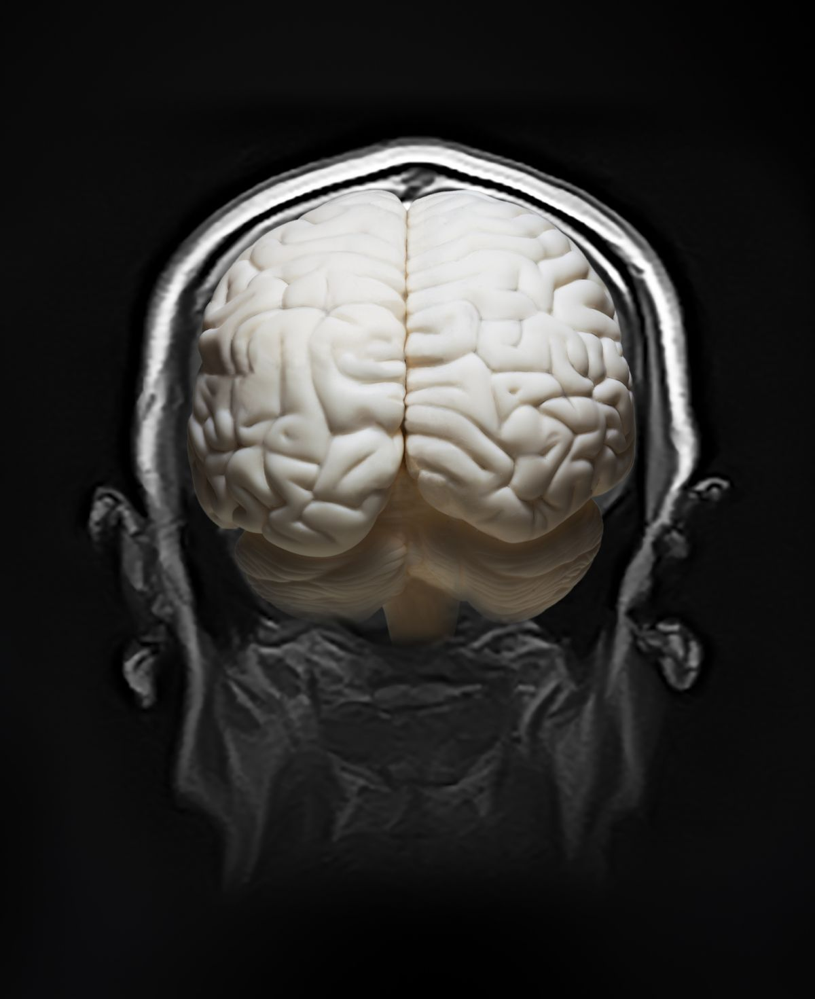

DARPA's new brain device increases learning speed by 40%

**

*![](data:image/svg+xml,%3csvg xmlns='http://www.w3.org/2000/svg' fill='currentColor' style='display:inline-block%3bvertical-align:middle' height='19.8' width='19.8' viewBox='0 0 512 512'%3e%3ctitle%3eTweet This%3c/title%3e%3cpath d='M492%2c109.5c-17.4%2c7.7-36%2c12.9-55.6%2c15.3c20-12%2c35.4-31%2c42.6-53.6c-18.7%2c11.1-39.4%2c19.2-61.5%2c23.5 C399.8%2c75.8%2c374.5%2c64%2c346.8%2c64c-53.5%2c0-96.8%2c43.4-96.8%2c96.9c0%2c7.6%2c0.8%2c15%2c2.5%2c22.1C172%2c179%2c100.5%2c140.4%2c52.8%2c81.7 c-8.3%2c14.3-13.1%2c31-13.1%2c48.7c0%2c33.6%2c17.1%2c63.3%2c43.1%2c80.7C67%2c210.7%2c52%2c206.3%2c39%2c199c0%2c0.4%2c0%2c0.8%2c0%2c1.2c0%2c47%2c33.4%2c86.1%2c77.7%2c95 c-8.1%2c2.2-16.7%2c3.4-25.5%2c3.4c-6.2%2c0-12.3-0.6-18.2-1.8c12.3%2c38.5%2c48.1%2c66.5%2c90.5%2c67.3c-33.1%2c26-74.9%2c41.5-120.3%2c41.5 c-7.8%2c0-15.5-0.5-23.1-1.4C62.8%2c432%2c113.7%2c448%2c168.3%2c448C346.5%2c448%2c444%2c300.3%2c444%2c172.2c0-4.2-0.1-8.4-0.3-12.5 C462.5%2c146%2c479%2c129%2c492%2c109.5z M434.2%2c146.7l-7%2c5.1l0.4%2c8.6c0.2%2c3.8%2c0.3%2c7.8%2c0.3%2c11.8c0%2c30.2-5.9%2c61.8-17%2c91.5 c-11.7%2c31.2-28.5%2c59.4-50%2c83.8c-23%2c26.1-50.2%2c46.5-81.1%2c60.8c-33.8%2c15.7-71.3%2c23.6-111.5%2c23.6c-28.9%2c0-57.4-4.8-84.5-14.2 c9.9-1.9%2c19.6-4.6%2c29.1-7.9c21.7-7.6%2c41.9-18.7%2c60.1-33l35.3-27.7l-44.9-0.8c-26.1-0.5-49.7-13.4-64.3-33.9 c7.3-0.5%2c14.5-1.8%2c21.5-3.7l60.7-20.2l-61.7-10.9c-29.6-5.9-52.8-27.9-61.3-55.8c7.8%2c2%2c15.4%2c2.8%2c23.9%2c3.3c0%2c0%2c31.8%2c1.4%2c55.8-0.1 c-13-6.2-46.4-29.2-46.4-29.2c-22.5-15.1-36-40.2-36-67.4c0-6.4%2c0.8-12.8%2c2.2-19c21.9%2c22.4%2c47%2c41.1%2c75.1%2c55.5 c37%2c19.1%2c76.9%2c29.8%2c118.6%2c31.9l21.2%2c1.1l-4.8-20.7c-1.4-5.9-2.1-12.1-2.1-18.5c0-44.4%2c36.3-80.7%2c80.9-80.7c22.3%2c0%2c43.8%2c9.3%2c59%2c25.6 l6.1%2c6.5l8.7-1.7c4.5-0.9%2c8.9-1.9%2c13.3-3.1c-1%2c1.4-5.7%2c6.1-11%2c10.8c-4.5%2c4-17.8%2c16.5-17.8%2c16.5s13%2c4.1%2c21.1%2c5 c8.1%2c0.9%2c17.4-0.6%2c18.9-0.8C442.2%2c141.1%2c437.2%2c144.6%2c434.2%2c146.7z'%3e%3c/path%3e%3c/svg%3e)*

*![](data:image/svg+xml,%3csvg xmlns='http://www.w3.org/2000/svg' fill='currentColor' style='display:inline-block%3bvertical-align:middle' height='19.8' width='19.8' viewBox='0 0 64 64'%3e%3ctitle%3eCopy Link%3c/title%3e%3cpath stroke-width='2' stroke-miterlimit='10' d='M37.004%2c32.166c1.224%2c0.533%2c2.576%2c0.829%2c3.997%2c0.828 c3.271-0.003%2c6.175-1.576%2c7.998-4.006L60.99%2c16.98c1.255-1.673%2c1.998-3.751%2c1.996-6.002c-0.003-5.522-4.484-9.997-10.007-9.993 c-2.251%2c0.002-4.327%2c0.747-5.999%2c2.004L33.989%2c15.998c-1.768%2c1.805-2.997%2c4.277-2.996%2c7.003c0.001%2c1.424%2c0.3%2c2.778%2c0.837%2c4.003' fill='none' stroke='currentColor'%3e%3c/path%3e%3cpath stroke-width='2' stroke-miterlimit='10' d='M37.004%2c32.166' fill='none' stroke='currentColor'%3e%3c/path%3e%3cpath stroke-width='2' stroke-miterlimit='10' d='M31.831%2c27.004c0.053%2c0.121%2c0.107%2c0.24%2c0.166%2c0.358' fill='none' stroke='currentColor'%3e%3c/path%3e%3cpath stroke-width='2' stroke-miterlimit='10' d='M26.997%2c31.836c-1.225-0.535-2.577-0.831-3.998-0.83 c-2.251%2c0.002-4.328%2c0.747-5.999%2c2.004L4.01%2c46.02c-1.768%2c1.804-2.997%2c4.276-2.995%2c7.002c0.003%2c5.522%2c4.484%2c9.997%2c10.007%2c9.993 c3.271-0.003%2c6.174-1.576%2c7.997-4.006L31.01%2c47.001c1.255-1.673%2c1.998-3.751%2c1.996-6.002c-0.001-1.422-0.299-2.774-0.835-3.998' fill='none' stroke='currentColor'%3e%3c/path%3e%3cline stroke-width='2' stroke-miterlimit='10' x1='23.006' y1='41.006' x2='40.994' y2='22.994' fill='none' stroke='currentColor'%3e%3c/line%3e%3c/svg%3e)*

**

###### Hard Science

# DARPA’s New Brain Device Increases Learning Speed by 40%

#### Brain stimulation may be the key to quicker learning.

[Dom Galeon](https://futurism.com/authors/domgaleon)October 26th 2017

## Cheap and Non-Invasive

New research funded by the U.S. Department of Defense’s [Defense Advanced Research Project Agency (DARPA)](https://www.darpa.mil/) has successfully demonstrated how a non-invasive method of stimulating the brain can boost cognitive performance. Working under DARPA’s [Restoring Active Memory (RAM) program](https://www.darpa.mil/program/restoring-active-memory), scientists from [HRL Laboratories](http://www.hrl.com/) in California, [McGill University](http://www.mcgill.ca/) in Montreal, Canada, and [Soterix Medical](https://soterixmedical.com/) in New York tested their brain device on macaques and observed a substantial increase in the monkeys’ ability to quickly perform certain tasks.

**[Click to View Full Infographic](https://futurism.com/images/reprogramming-the-human-mind-heres-how-well-make-humanity-2-0-infographic/)**

In their study published, which has been published in the journal *[Current Biology,](http://www.cell.com/current-biology/fulltext/S0960-9822(17)31185-5)* the HRL team describes how they used non-invasive transcranial direct current stimulation (tDCS) to stimulate the prefrontal cortex in the macaques. They then prompted the animals to perform a task based on associative learning — learning associations between visual cues and a location — in order to get a reward.

The macaques that wore the tDCS brain device significantly outperformed the control group. The former needed only 12 trials to learn how to immediately get the reward, while the latter needed 21 trials, with the tDCS device accounting for the 40 percent increase in learning speed, according to the researchers.

“In this experiment, we targeted the prefrontal cortex with individualized non-invasive stimulation montages,” lead HRL researcher Praveen Pilly [said in a statement](http://www.hrl.com/news/2017/10/12/hrl-and-mcgill-scientists-confirm-transcranial-stimulation-effects-and-determine-a-key-mechanism). “That is the region that controls many executive functions, including decision-making, cognitive control, and contextual memory retrieval. It is connected to almost all the other cortical areas of the brain, and stimulating it has widespread effects.”

Based on the results of their study, the researchers say the increased learning speed was caused by the modulated connectivity between brain areas and not the rate at which neurons fired.

## All in the Mind

The ability to [increase one’s brain function](https://futurism.com/do-not-edit-nootropics-and-the-future-of-brain-enhancing-smart-drugs/) almost instantaneously is no doubt appealing. As such, the concept has been a fixture of science fiction for decades (see: “Flowers for Algernon,” “Limitless”), but advancements in technology seem to be bringing us closer to a future in which quickly leveling-up intelligence is a real possibility.

In addition to this DARPA device, researchers from Boston University have developed their own [non-invasive method to improve learning](https://futurism.com/scientists-just-used-brain-stimulation-to-literally-change-how-people-think/) using high-definition transcranial alternating current stimulation (HD-tACS). However, the DARPA researchers claim their device is cheap, which may make it more appealing than other technologies like it.

Simply making people smarter is not the sole purpose of this type of research. A potentially more immediate application of DARPA’s brain device is the treatment of people suffering from neural degeneration that causes a loss of memory function.

[As the team noted in their study](http://www.cell.com/current-biology/fulltext/S0960-9822(17)31185-5), “These results are consistent with the idea that tDCS leads to widespread changes in brain activity and suggest that it may be a valuable method for cheaply and non-invasively altering functional connectivity in humans.”

### Keep up. Subscribe to our daily newsletter.

I understand and agree that registration on or use of this site constitutes agreement to its User Agreement and Privacy Policy