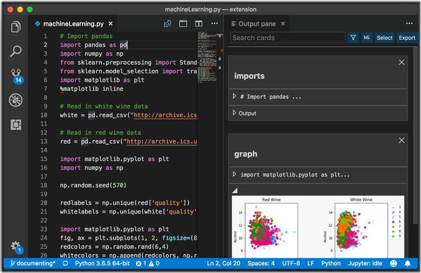
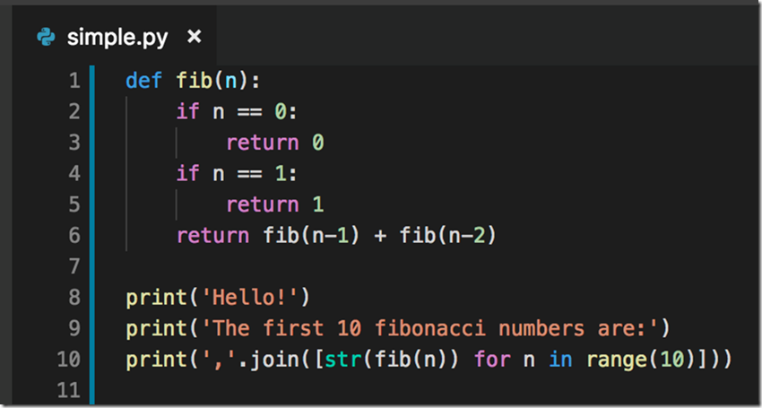
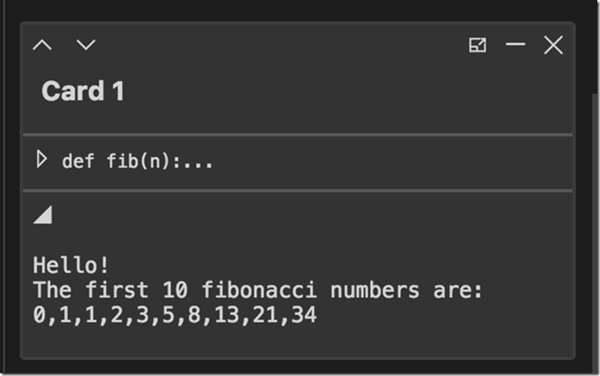
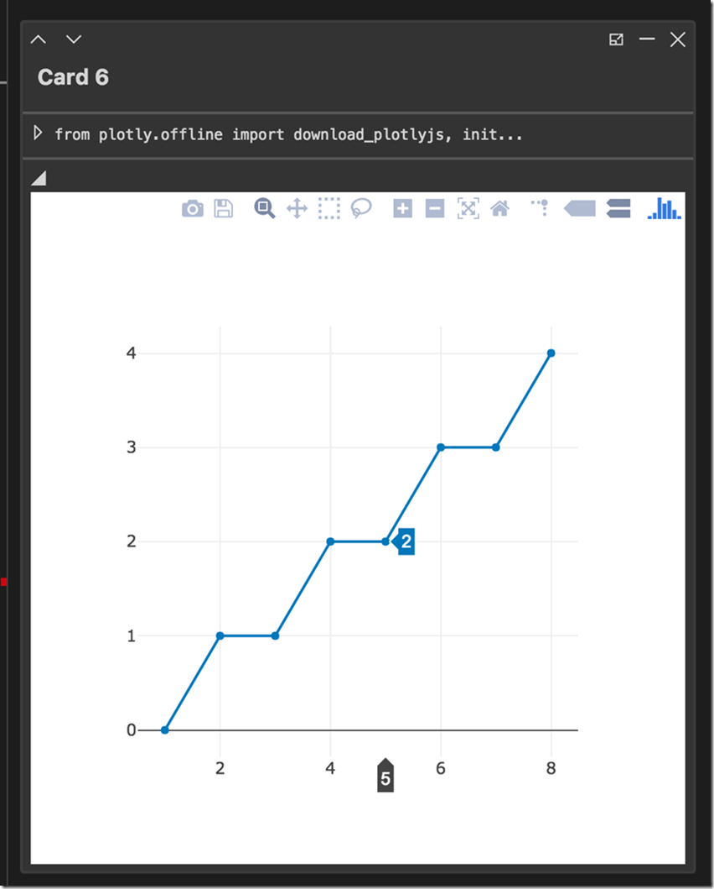
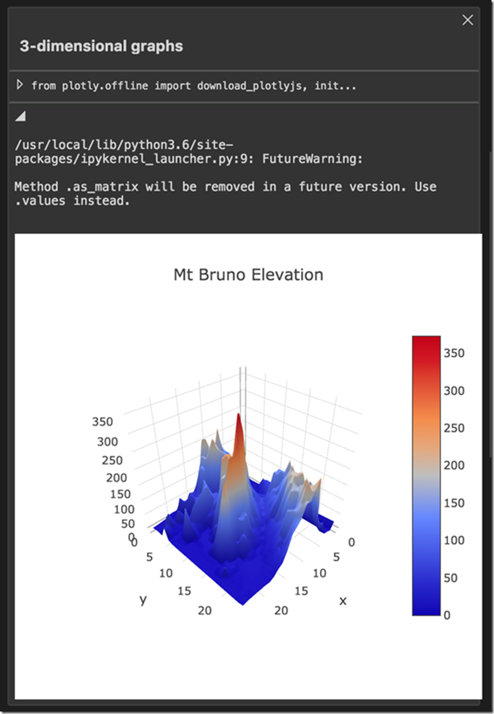
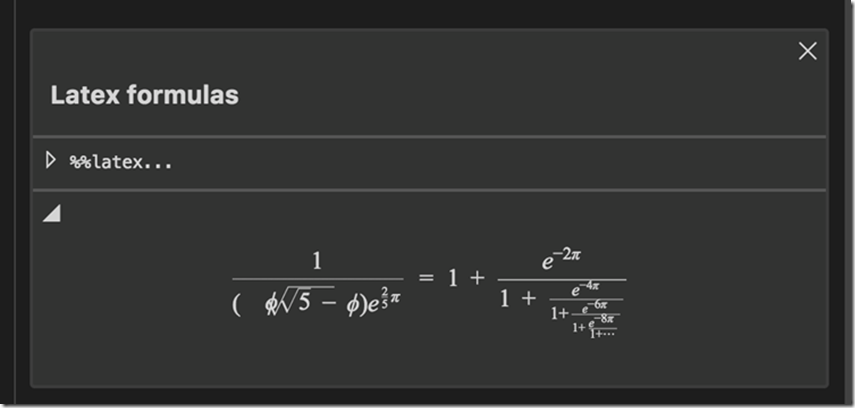

Data Science in Visual Studio Code using Neuron, a new VS Code extension

# Data Science in Visual Studio Code using Neuron, a new VS Code extension

Rate this article
★★★★★
★★★★
★★★
★★
★

[Lee Stott](https://social.msdn.microsoft.com/profile/Lee+Stott)October 29, 2018[1](https://blogs.msdn.microsoft.com/uk_faculty_connection/2018/10/29/data-science-in-visual-studio-code-using-neuron-a-new-vs-code-extension/#comments)

- [(L)](https://www.facebook.com/sharer/sharer.php?kid_directed_site=0&sdk=joey&u=https%3A%2F%2Fblogs.msdn.microsoft.com%2Fuk_faculty_connection%2F2018%2F10%2F29%2Fdata-science-in-visual-studio-code-using-neuron-a-new-vs-code-extension%2F&display=popup&ref=plugin&src=share_button)
- [0](https://blogs.msdn.microsoft.com/uk_faculty_connection/2018/10/29/data-science-in-visual-studio-code-using-neuron-a-new-vs-code-extension/#)
- [0](https://blogs.msdn.microsoft.com/uk_faculty_connection/2018/10/29/data-science-in-visual-studio-code-using-neuron-a-new-vs-code-extension/#)

* * *

Guest post by [Lorenzo Silvestri](https://www.linkedin.com/in/silvestri-lorenzo), Electronic and Information Engineering Student at Imperial College London.

### Introduction

In this post, I’ll give a short explanation of *neuron*, a Visual Studio Code extension that aims to be a one-stop-shop for data scientists. It’s an extension I developed as part of a team of students at Imperial College London, in collaboration with Microsoft, in the summer of 2018.

### A bit of context – a.k.a. why *neuron* exists in the first place

Data science is the buzz-word of the 21st century. From IoT devices generating thousands of data points per day, to social media connecting people’s information on a scale never seen before, a lot of the development that goes on today sooner or later comes into contact with “data science”.

Data scientists come from various different technical backgrounds, but the vast majority of them use a standard set of tools of the trade: Python, *<insert name of trending machine-learning library*>, and Jupyter Notebooks.

So Microsoft approached us with an idea. Can we integrate all of these tools into a single, intuitive workspace? More specifically, can we create an extension to Visual Studio Code that provided ways to run data analysis directly next to the code, without breaking the developer’s workflow?

The benefits of this are obvious. You get the power of an intelligent Python editor (Visual Studio Code), combined with the rapidity of execution and visualisation abilities of Jupyter Notebooks. All in a single window. Thus, *neuron* was born.

### What *neuron* does, and how to use it

The principle of *neuron* is dead simple. You start off with your regular Python or R code editor – the bit you type code into – inside Visual Studio Code. Alongside it, taking up the other half of the screen, is *neuron*. It’s a blank page at first, but as you run snippets of your code, the output gets turned into interactive cards. They can be plain text, tables, images, graphs, maps… you name it. Here’s a first look:

#### 1. Installing the extension

You can find *neuron* on the marketplace at https://marketplace.visualstudio.com/items?itemName=neuron.neuron-IPE.

Once installed, a button will come up in the editor pane whenever you’re editing a supported file (currently, Python or R).

Clicking it will bring up the main *neuron* output pane, and you’re good to go.

#### 2. Setting up

The extension uses Jupyter Notebooks in the background to produce the visualisations that you know and love. If you’re a data scientist, chances are you already have Jupyter installed on your machine. If not, *neuron* will offer to install it for you when you first open the extension.

#### 3. Using the interface

The first step is to write some code. The extension currently supports Python and R, as they are the two most common languages used by data scientists. Let’s open a new Python file and write some code:

Not exactly Big Data, but you get the idea. To run this code and get the output, all we need to do is select it and hit **Alt+Enter **(**option+return** on Macs). You can also right-click on your selection and select “Send code to output pane”, if you prefer.

And… here it is!

A card with the output of your code appears on the right-hand side. You can delete it, move it up and down the list, minimise it, or expand it into a separate window. Neuron keeps track of the code snippets associated with each card, so that you can keep track of them and re-run them if needed.

#### 4. Moving on to richer outputs

Complicated visualisation of data is where *neuron* really shines. It supports more output types than Jupyter Notebooks!

For example, a standard way of creating graphs in Python is through the popular library *plotly*. Let’s try plotting some simple data points on a 2D plane.

from plotly.offline import download_plotlyjs, init_notebook_mode, plot, iplot
from plotly.graph_objs import Scatter, Figure, Layout
iplot([{"x": [1, 2, 3, 4, 5, 6, 7, 8], "y": [0, 1, 1, 2, 2, 3, 3, 4]}])
Once again, select the text, hit **Alt+Enter**, and the card is generated.

The card is interactive, so you can zoom and pan as necessary, as well as mark values on the graph or export the image to a PNG. If you want to edit the data points, all you need to do is go back to your original code, change some values, and run it again. The new card will appear just below the old one: *neuron* keeps track of your code’s history until you close Visual Studio.

Neuron also supports 3D graphs, geographical maps, LaTeX formulas, markdown, HTML, and various static image types. The steps to generate them are the same as what I’ve demonstrated above, and you can find examples of all of them in our demo file below.

#### 5. Try it yourself

If you’re looking for a hands-on tutorial to get started with *neuron*, try our demo file that walks you through *neuron*’s most useful features: https://github.com/lorenzo2897/vscode-ipe/blob/master/test/demo.py

### Tips and tricks

**Filtering your output cards:** the list of cards can get a bit overwhelming to navigate if you’ve been running lots of code snippets. Filter the cards by keywords or by card type, using the search box and the filter button in the toolbar of the output pane.

**Is Jupyter acting up?** If you’re getting strange and inconsistent errors when running your Python code, it might be helpful to restart the Jupyter instance running in the background. There’s an option in the command palette called “IPE: Restart active kernels” that does just that.

**Sharing your output with others:**  *neuron* supports interoperability with Jupyter notebooks. You can import an existing notebook using the “IPE: Import Jupyter notebook” command, and it will convert all Jupyter cells to cards. Likewise, you can export the state of your output pane into a notebook, via the “Export” button in the extension’s toolbar.

### Conclusion

I’m really excited to share with you that Microsoft has decided to integrate the work that we did in *neuron* into the Python extension for Visual Studio Code. You can track the project’s progress at the Python extension’s [Github repository](https://emea01.safelinks.protection.outlook.com/?url=https%3A%2F%2Fgithub.com%2FMicrosoft%2Fvscode-python&data=02%7C01%7Cleestott%40microsoft.com%7C7437400eef1f43dbeb2208d63f69571b%7C72f988bf86f141af91ab2d7cd011db47%7C1%7C0%7C636766119012741564&sdata=sTyOq0ZOT0D6yaDjrSzNxENMWzbzoT1IhlvchvwdRns%3D&reserved=0). I look forward to seeing what you create with it!

Tags [Academic](https://blogs.msdn.microsoft.com/uk_faculty_connection/tag/academic/)  [Data Science](https://blogs.msdn.microsoft.com/uk_faculty_connection/tag/data-science/)  [Faculty](https://blogs.msdn.microsoft.com/uk_faculty_connection/tag/faculty/)  [Imperial College](https://blogs.msdn.microsoft.com/uk_faculty_connection/tag/imperial-college/)  [IXN](https://blogs.msdn.microsoft.com/uk_faculty_connection/tag/ixn/)  [Jupyter](https://blogs.msdn.microsoft.com/uk_faculty_connection/tag/jupyter/)  [learning](https://blogs.msdn.microsoft.com/uk_faculty_connection/tag/learning/)  [notebooks](https://blogs.msdn.microsoft.com/uk_faculty_connection/tag/notebooks/)  [Student](https://blogs.msdn.microsoft.com/uk_faculty_connection/tag/student/)  [Visual Studio Code](https://blogs.msdn.microsoft.com/uk_faculty_connection/tag/visual-studio-code/)  [VSCode](https://blogs.msdn.microsoft.com/uk_faculty_connection/tag/vscode/)

* * *