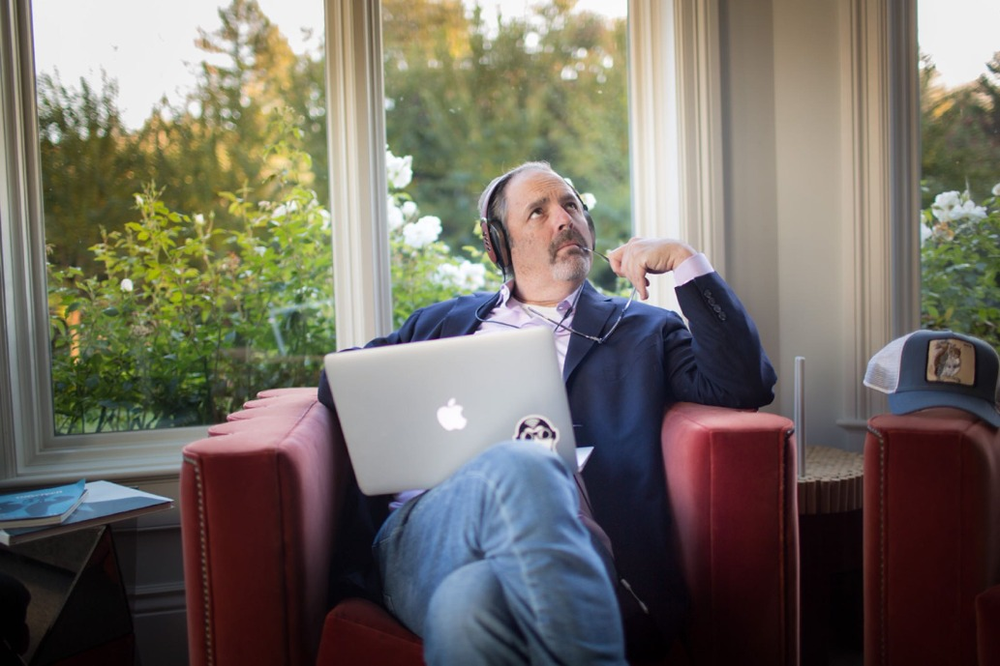
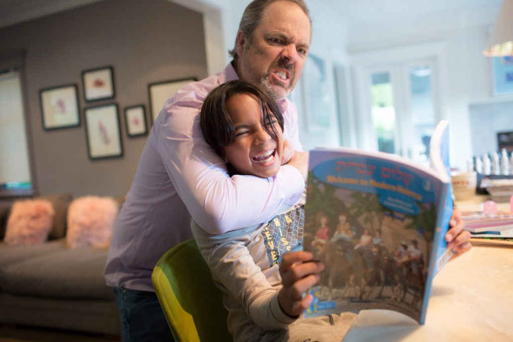
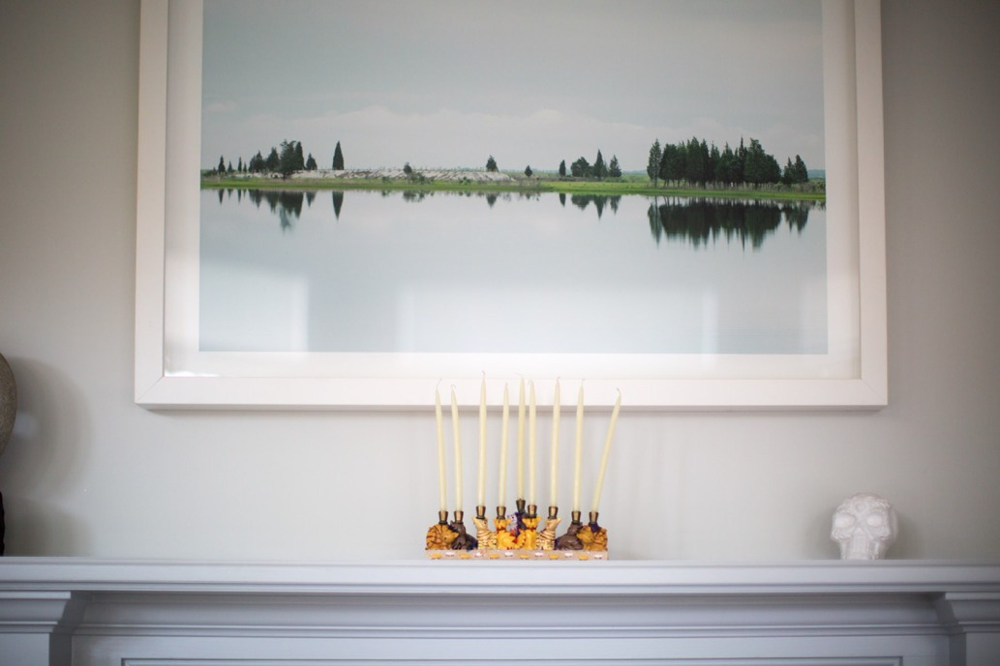
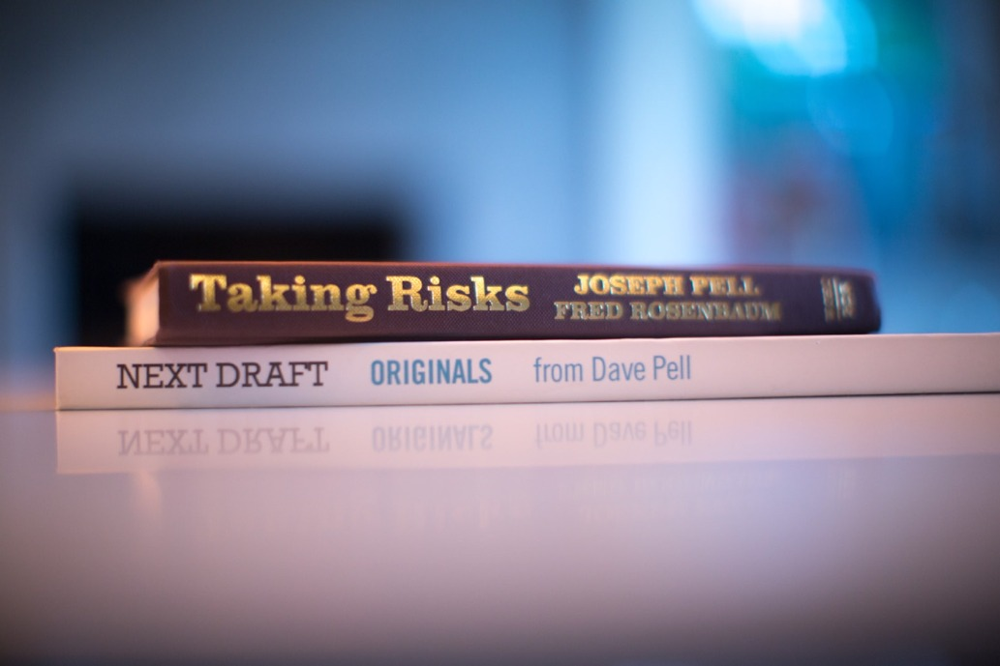
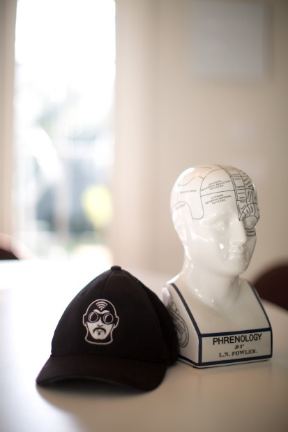
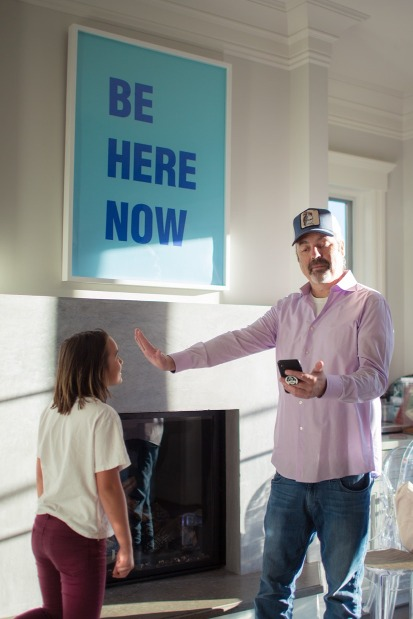
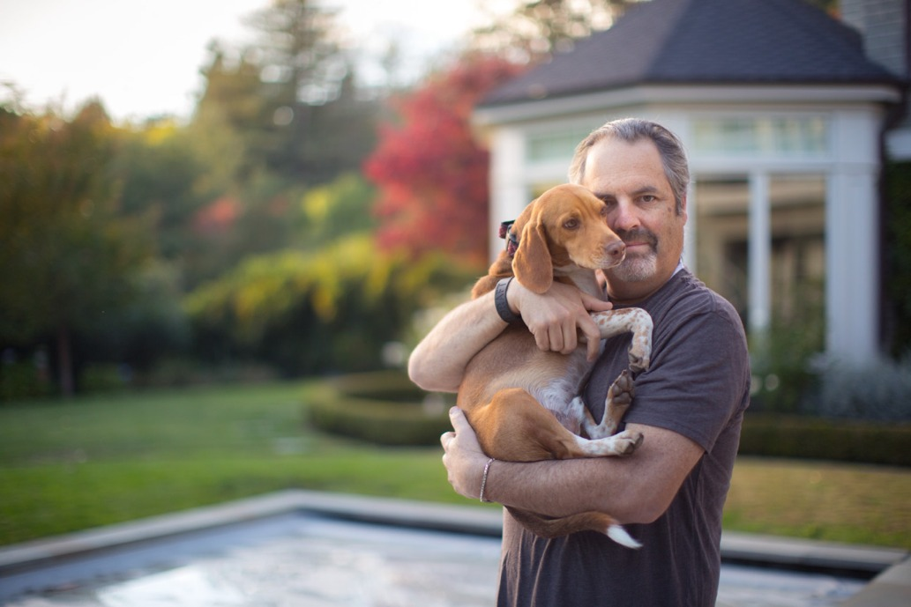
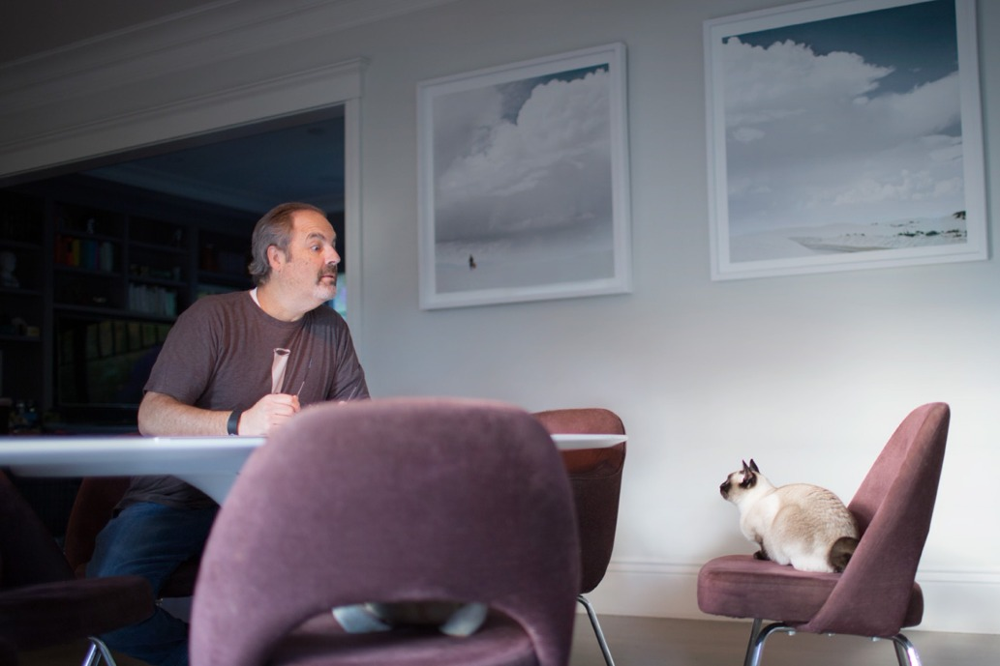
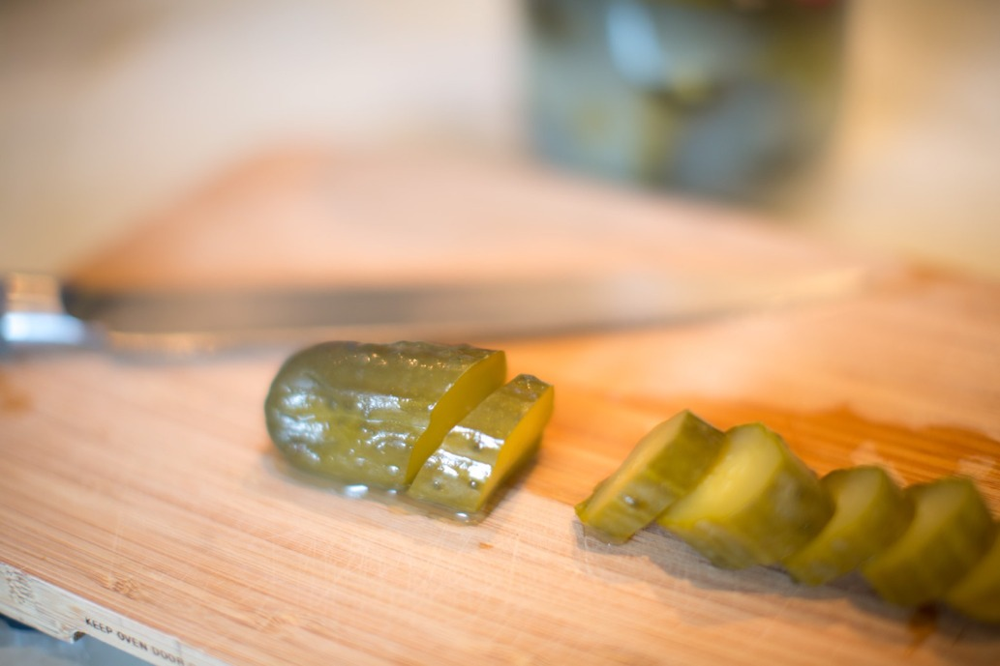

Dave Pell - ARQ

- [      all](http://thisisarq.com/read)

- [    #myjudaica](http://thisisarq.com/read-type/myjudaica)
- [    Field Guides](http://thisisarq.com/read-type/field-guides)
- [    Interviews](http://thisisarq.com/read-type/interviews)
- [    The Ish](http://thisisarq.com/read-type/the-ish)

   [< prev](http://thisisarq.com/read/new-moon-reading-9)  [next >](http://thisisarq.com/read/no-111)

Interviews

# Dave Pell

September 19, 2017

In addition to being [the Internet’s most fascinating newsletter writer](https://techcrunch.com/2014/10/03/the-internets-most-fascinating-newsletter-writer-dave-pell/), Dave Pell is a very tall vegetarian, a determined pickler, a habitual swearer, an angel investor who worries about the coming backlash against the startup community, and a humble and proud son, husband, and father.

 
**What is your earliest memory?**
I was a weird eater as a kid.

I ate no meat, other than bacon, which is odd for a Jewish boy, but my mom wanted me to get some protein. Every night, I would have 4 pieces of bacon, then I’d have a milkshake, and my mom would put a lot of raw eggs in there. When I’d have cereal, she’d cover it with wheat germ.

It was especially touchy, because my dad is the son of a butcher. Luckily, my son is a meat fanatic, so he’s the son my dad never had.

My parents are about 5’6,” and I’m about 6’4,” so, apparently, the protein advice we got as kids was a myth. Lettuce is the key to height.

**What’s the story behind your name?**

My mom is from Germany and my dad is from Poland. They’re both Holocaust survivors, and, after coming to America, they went with pretty generic names. My sisters are Debbie, Karen, and Becky, and I’m Dave.

They thought about giving me Herschel, a name from both sides of their family, but they thought it would be too weird of a name. We named my son Herschel, and it ended up being a pretty cool name. I’m actually glad they saved it, so I could use it for him.

My daughter’s name is Octavia. Hers is a little bit more simple: we just named her after a street sign in San Francisco. She’s named after a street that my wife and I used to live on.

 
**Did you know what you wanted to be when you grew up?**
I’ve always been into writing.

It was the easiest thing for me in school, and I would write a lot of stories, speeches, help other kids with their writing. Then, I was an English major in college.

During college and right after, I used to write these long essays on different areas of my life with some political commentary and some humor and some personal stuff mixed in. Then, I’d go to the copy store and print them out and bind them and send them to all my friends.

That was my first attempt at blogging. It was offline blogging.

As soon as I saw the Internet, it was like a light went off, and it was my dream come true. Probably also a dream for the people who used to receive my physical packages. They became more optional.

**How did Judaism play into your life growing up?**
Judaism was always the context of our lives.

I don’t know if it was necessarily religious Judaism as much as cultural and Holocaust-surviving Judaism. That was a cloud that my parents had to deal with. I joke with my mom that basically every dinner conversation somehow came back to why does anti-Semitism exist, and what can we do about it?

I had a typical Jewish male adolescence: I went to Hebrew school 2 days a week and saw a therapist 3 days a week.

People often ask me, “Are you a practicing Jew?” I usually say, “No, I just show up on game days.” It was the defining element of my life culturally. In terms of the actual religion, I always took that with a grain of salt, or, in biblical terms, a pillar of salt.

 
**How has your parents’ Holocaust experience had an impact on you?**

I learned the importance of being aware of what’s going on around you. Not just in your community, but in the world. Thinking more critically about when leaders say things. What they really mean, and what’s really motivating them. Reading between the lines of news.

The key moment in my dad’s and, in many ways, our family’s experience was in 1993. My dad, mom, my older sister Debbie, and I went to go see the town that my dad grew up in. It’s called [Biała Podlaska](https://en.wikipedia.org/wiki/Bia%C5%82a_Podlaska).

My dad brought a few cases of Marlboro cigarettes in case we needed to bribe our way to get taken to places, which was sort of funny to me at the time, but that’s how he got around when he was a young person in Europe. The cab driver seemed to appreciate the cigarettes.

We got to the town, and, as soon as our car pulls up in the main square, a bunch of people rushed to the car and started telling us in Polish, “We didn’t steal these houses. The Germans made us live in them. It wasn’t us, it wasn’t us.” In 1993, nobody would be in this small town except for a Jew from America, and I guess they assumed we were there to reclaim our property.

Almost nobody in my dad’s town survived.

He probably thought going back would break him. When he got there, he realized that there was sadness, but there was also some joy in being able to show us, “Hey, this is where I grew up.” I think that gave him the impetus to write a book and be more open.

His book is called [*Taking Risks*](https://www.amazon.com/gp/product/1571431160/ref=as_li_tl?ie=UTF8&camp=1789&creative=9325&creativeASIN=1571431160&linkCode=as2&tag=a010f955-20&linkId=7360d1c76cbe93d3775b8669c8da6b99).

He was in this little town, and they kept getting put in smaller and smaller ghettos. After a few members of his family had been taken, his brother told him, “Hey, they’re combining our ghetto with the one next door, so hide in this barn and meet me tonight.” My dad hid in the barn and 2 Ukrainian soldiers working for the Nazis came in and searched it, but they didn’t find him. When night came, he knocked on the wall of the barn to meet his brother, but his brother didn’t make it. My dad escaped into the Polish forest in the middle of winter and lived on his own for a few months before joining the [partisans](https://en.wikipedia.org/wiki/Jewish_partisans).

The second half of the book is about how he became a really successful business person after coming here with just a camera and a few dollars and no English and no relatives. It’s a pretty amazing story.

 
**How does Judaism fit into your life now?**

My wife converted to Judaism before we got married. My kids don’t really complain about temple or Hebrew School as much as I did when I was a kid, which is interesting.

I read my dad’s book to my son when he was about 9. I was going back and forth about it, because it’s pretty scary, and there are many adult themes aside from the war. There are people burned alive, and there’s retribution, and there’s a lot of death and violence.

When I was thinking about doing it, a friend of mine heard me talking about this, balancing the two things: on one hand, I don’t want my kid to be totally terrified or to have this darkness dominate his life, but, on the other hand, I want him to know who he’s looking at when he sees his grandpa while he’s still around. This guy, who was a congressman, said, “Dude, don’t even wait until you get home.” We happened to be at a hotel. He said, “Go right up to the room tonight and start reading the book to your son. You’ll be sorry if you don’t.”

He taught me that we overprotect our kids in this era a little too much.

When I look back on the conundrum, I’m wondering whether my kid can hear me reading about an experience that kids his age actually experienced during World War II and, now, in different parts of the world. I did read him the book, and I don’t think he totally understood it, but I was glad I did. My daughter is 9 now, so she’ll probably have her turn to hear the story also.

My wife is Samoan, so that’s also a big cultural factor for us. We mix the two, and my mother-in-law lives with us. They get a lot of Samoan culture along with the Jewish stuff. We always say that our kids will grow up to beat the hell out of people and then feel incredibly guilty about it afterwards.

Most people in Samoa are either Christian or Mormon. There’s a pretty big missionary movement there. Samoans are also really known for being strong and great athletes, especially from American Samoa. A lot of guys from American Samoa are in the NFL and a few boxers. It’s very, very much an island culture. It really is paradise. You have entire beaches to yourself.

There are not a lot of Samoan Jews out in the world. My kids are in a rare club.

     

**What’s something that works for you and your wife as a team?**

We’re both really passionate about our creative projects. She’s also a writer and has had a few internet companies over the years, like me. We’re supportive of each other’s projects.

There are a lot of articles about life/work balance that have been coming out lately, and I think somebody wrote recently that it might be overrated. That actually being really into something is fun. That’s probably what we have in common.

**What do you most value in your friends?**
Loyalty, support, a sense of humor.

I’m really lucky in that a lot of my friends have been my friends since we were little kids. The familiarity of knowing each other’s history and having a shorthand way of communicating is great. As you get older, you realize what you need is somebody to count on when you really need them.

**What do you consider the most overrated virtue?**

Being non-judgmental. Thinking everybody has their right to think what they want and live how they want. That’s only true until it infringes upon somebody else’s right to do that.

Ignorance. Not being aware of what’s going on around you. It’s more dangerous than some people think. Some people celebrate not watching the news or not being aware of what’s going on.

 
**Do you have a personal mantra or words you live by?**

I’m not [Proust](https://en.wikipedia.org/wiki/Marcel_Proust) or anything, but I don’t think writing is rewriting for everybody. I write everything in my head before I even sit down. As soon as I reach the end of the last paragraph, I’m basically done, except for typos. Everybody has their own style.

**Biggest insecurity or fear?**

I’m not entirely confident I have any idea how to be an adult or a parent. I’m hoping that that’s something that everybody, as they reach a certain age, realizes, like,

“Oh my God, I have no idea how to be an adult. I’m still just a kid in an aging body.”

Also, the broader hope that what I spend my time on is the right thing, and that I’ll get some meaning out of it.

**When do you feel like the best version of yourself?**

When I press send on my newsletter or publish something I’m writing, because I’ve definitely put in my 10,000 plus hours on that.

I don’t have any editors. There’s no way I can disappoint anybody. If I get in trouble or it goes poorly, it’s just me. That is pretty freeing and liberating, so I’m lucky I get to do that. That’s probably the time I feel most in my element.

**Was there a specific turning point in your experience as a writer when you began to feel confident?**

I used to write a newsletter about 15 years ago, and my wife and one of my good friends were both saying, “Your newsletter’s good, but the jokes aren’t as funny as they are when we’re with you in real life, and the points aren’t as strong as you make them when it’s just us hanging out, so you should try to be more yourself in your writing, and it would come out better.”

Their advice was that I should swear more in my newsletter because I swear habitually in real life.

The next day, in my newsletter, in the first blurb, I referred to somebody as a jackass. 5 minutes after I pressed send, I got an email from my mom saying, “I really don’t think you need to use this kind of language in your newsletter. It’s just a sign of a weak writer, and, if you’re a good writer, you should be able to make these points without having to resort to swear words.”

Over the years, I’ve managed to be able to express myself the way I want to without pissing off my mom.

 
**What’s something you recently learned?**

I’m too old to learn anything anymore. I think I know it all at this point. That’s one of the prerequisites for being a blogger or internet personality.

**What’s your favorite place on earth?**

Behind my laptop. If I said anything else, there’d be too many people who know the truth that could call me out on it.

**Favorite publications or writers?**

I’ve been really loving this author named [Don Winslow](https://www.amazon.com/Don-Winslow/e/B00455VVTK/ref=sr_ntt_srch_lnk_1?qid=1513621074&amp;sr=8-1&_encoding=UTF8&tag=a010f955-20&linkCode=ur2&linkId=e6f792d3164bd5a22e347f95840c8270&camp=1789&creative=9325). He writes fictionalized versions of very real and well researched situations in life. He is 2 books into a trilogy on the drug war, and, the second book, [*The Cartel*](https://www.amazon.com/gp/product/0525436510/ref=as_li_tl?ie=UTF8&camp=1789&creative=9325&creativeASIN=0525436510&linkCode=as2&tag=a010f955-20&linkId=095fcb4c3130d607f58e412044bac723), was one of the best books I’ve read in the last few years.

I read [*American Pain*](https://www.amazon.com/gp/product/1493026666/ref=as_li_tl?ie=UTF8&camp=1789&creative=9325&creativeASIN=1493026666&linkCode=as2&tag=a010f955-20&linkId=96f95ec58150f181ef5ba1205320e0c6) by John Temple, who is also really good.

I’m into the drug war broadly, but, specifically, the opiate crisis. I try to read as much on that as I can, because I think it’s the ultimate perfect storm of everything bad in America coming together at once. How it started, how it got worse, and how we deal with it now. It’s both depressing and also endlessly interesting and informative.

**What cause do you care most about?**
In terms of news stories, the opiate crisis.

I care about how we make sure that the Trump era is a speed bump and not his wall stopping the march of progressive values that’s happened over the last decade.

I’m an investor, in addition to being a writer.

We’re headed for a pretty big backlash, both politically and culturally, against the startup community. I’m interested in how we react to that.

I think we give off this attitude that we somehow are deserving of the multiple billions of dollars some of us earn. Nobody really deserves multiple billions of dollars or needs multiple billions of dollars. I think there’s going to be a pretty big cultural backlash to Internet companies that are abusing the power they have in our lives by putting the bottom line ahead of personal privacy.

I hope that the Internet community can express more humility and gratitude for how unbelievably lucky we are that we happened to ride this incredible wave.

I feel that way about my own limited success as an angel investor. A lot of people feel that way, but I don’t think it comes off publicly, and there’s a big danger with that.

Everybody who works in tech worries about what these phones are doing to us and what the technology is doing to us, that we’re giving up our privacy for very little upside, and that we’re spending too much time in front of the screen, or we’re not paying enough attention to our kids, but nobody expresses that stuff publicly. It’s sort of the golden goose.

 
**Is there anything else that you want to share?**

Probably the most Jewish current part of my midlife is that I have recently become a pickler.

I’ve always loved pickles, especially the Lower East Side brine-only, no-vinegar pickles from [Guss’ Pickles](http://www.gusspickle.com/) back in the day. When I lived in New York, I’d always go there, and they used to have these giant barrels of pickles, and I’d always get a quart of them “for here.” I used to joke that everybody knew when Gus had the flu, because everybody in the neighborhood would come down with it, because they’d just stick their bare hands in these barrels and pull the pickles out.

Pickles are my favorite food, and my son also loves them, so I’ve always wanted to try making them myself. Now I have a small pickling operation. It’s all really about the brine. You do have to have a starting place for how much salt to water ratio. After that and dill and garlic, then the rest is up to you, so you have to mess around a little bit.

It’s pretty fun and awfully Jewish.
*Photos by [Adam Moore](http://sugardigital.com/)*

###### share this with a friend

- [(L)](https://twitter.com/share?url=http%3A%2F%2Fthisisarq.com%2Fread%2Fdave-pell&text=Dave+Pell&via=thisisarqco)

- [(L)](http://www.facebook.com/sharer.php?u=http%3A%2F%2Fthisisarq.com%2Fread%2Fdave-pell)

- [(L)](http://pinterest.com/pin/create/button/?url=http%3A%2F%2Fthisisarq.com%2Fread%2Fdave-pell&description=Dave+Pell&media=http://thisisarq.com/wp-content/uploads/2017/12/davethumb.jpg)