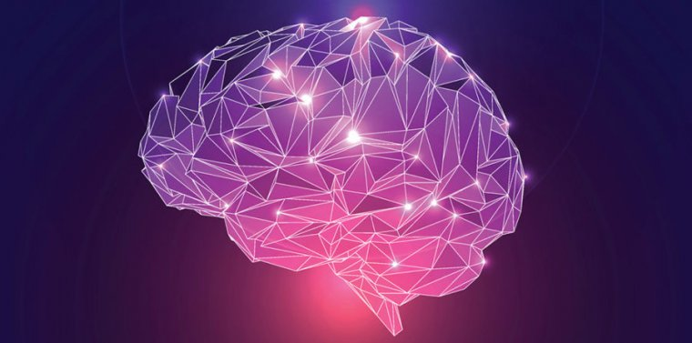

Deep Learning breakthrough made by Rice University scientists | Ars Technica

####  running hal 9000 on a beowulf cluster —

# Deep Learning breakthrough made by Rice University scientists

## Rice University's MACH training system scales further than previous approaches.

 [Jim Salter](https://arstechnica.com/author/jimsalter/) - 12/13/2019, 6:42 PM

 

[Enlarge](https://cdn.arstechnica.net/wp-content/uploads/2019/12/machine-learning-brain.jpg)

**[pitju / Adobe Stock](https://stock.adobe.com/contributor/204732544/pitju?load_type=author&prev_url=detail)

[(L)](https://arstechnica.com/gadgets/2019/12/so-you-want-to-build-a-neural-network-the-cloud-can-help-with-that/)

### Further Reading

[Cloudy with a chance of neurons: The tools that make neural networks work](https://arstechnica.com/gadgets/2019/12/so-you-want-to-build-a-neural-network-the-cloud-can-help-with-that/)

In an earlier deep learning [article](https://arstechnica.com/gadgets/2019/12/so-you-want-to-build-a-neural-network-the-cloud-can-help-with-that/), we talked about how inference workloads—the use of already-trained neural networks to analyze data—can run on fairly cheap hardware, but running the training workload that the neural network "learns" on is orders of magnitude more expensive.

Join Ars Technica and
Get Our Best Tech Stories
Delivered Straight to your Inbox.

Will be used in accordance with our
[Privacy Policy](http://www.condenast.com/privacy-policy/)

In particular, the more potential inputs you have to an algorithm, the more out of control your scaling problem gets when analyzing its problem space. This is where MACH, a research project authored by Rice University's Tharun Medini and Anshumali Shrivastava, comes in. MACH is an acronym for Merged Average Classifiers via Hashing, and according to lead researcher Shrivastava, "[its] training times are about 7-10 times faster, and... memory footprints are 2-4 times smaller" than those of previous large-scale deep learning techniques.

In describing the scale of extreme classification problems, Medini refers to online shopping search queries, noting that "there are easily more than 100 million products online." This is, if anything, conservative—one data company [claimed](https://www.scrapehero.com/how-many-products-does-amazon-sell-worldwide-october-2017/) Amazon US alone sold 606 million separate products, with the entire company offering more than three billion products worldwide. Another company [reckons](https://www.retailtouchpoints.com/resources/type/infographics/how-many-products-does-amazon-carry) the US product count at 353 million. Medini continues, "a neural network that takes search input and predicts from 100 million outputs, or products, will typically end up with about 2,000 parameters per product. So you multiply those, and the final layer of the neural network is 200 billion parameters ... [and] I'm talking about a very, very dead simple neural network model."

At this scale, a supercomputer would likely need terabytes of working memory just to store the model. The memory problem gets even worse when you bring GPUs into the picture. GPUs can process neural network workloads orders of magnitude faster than general purpose CPUs can, but each GPU has a relatively small amount of RAM—even the most expensive Nvidia Tesla GPUs only have 32GB of RAM. Medini says, "training such a model is prohibitive due to massive inter-GPU communication."

Instead of training on the entire 100 million outcomes—product purchases, in this example—Mach divides them into three "buckets," each containing 33.3 million randomly selected outcomes. Now, MACH creates another "world," and in that world, the 100 million outcomes are again randomly sorted into three buckets. Crucially, the random sorting is separate in World One and World Two—they each have the same 100 million outcomes, but their random distribution into buckets is different for each world.

With each world instantiated, a search is fed to both a "world one" classifier and a "world two" classifier, with only three possible outcomes apiece. "What is this person thinking about?" asks Shrivastava. "The most probable class is something that is common between these two buckets."

At this point, there are nine possible outcomes—three buckets in World One times three buckets in World Two. But MACH only needed to create six classes—World One's three buckets *plus* World Two's three buckets—to model that nine-outcome search space. This advantage improves as more "worlds" are created; a three-world approach produces 27 outcomes from only nine created classes, a four-world setup gives 81 outcomes from 12 classes, and so forth. "I am paying a cost linearly, and I am getting an exponential improvement," Shrivastava says.

Better yet, MACH lends itself better to distributed computing on smaller individual instances. The worlds "don't even have to talk to one another," Medini says. "In principle, you could train each [world] on a single GPU, which is something you could never do with a non-independent approach." In the real world, the researchers applied MACH to a 49 million product Amazon training database, randomly sorting it into 10,000 buckets in each of 32 separate worlds. That reduced the required parameters in the model more than an order of magnitude—and according to Medini, training the model required both less time and less memory than some of the best reported training times on models with comparable parameters.

Of course, this wouldn't be an Ars article on deep learning if we didn't close it out with a cynical reminder about unintended consequences. The unspoken reality is that the neural network isn't actually learning to show shoppers what they asked for. Instead, it's learning how to turn queries into *purchases.* The neural network doesn't know or care what the human was actually searching for; it just has an idea what that human is most likely to buy—and without sufficient oversight, systems trained to increase outcome probabilities this way can end up [suggesting](https://www.tommys.org/our-organisation/about-us/charity-news/how-stop-pregnancy-ads-following-you-after-loss) baby products to women who've suffered miscarriages, or [worse](https://www.nytimes.com/interactive/2019/06/08/technology/youtube-radical.html).

![](data:image/svg+xml,%3csvg cursor='pointer' width='90' height='24' viewBox='0 0 595 159' xmlns='http://www.w3.org/2000/svg' class='js-evernote-checked' data-evernote-id='109'%3e%3ctitle class='js-evernote-checked' data-evernote-id='110'%3eAction Button%3c/title%3e%3cg fill='none' fill-rule='evenodd' class='js-evernote-checked' data-evernote-id='111'%3e%3cg fill='%23FC2A61' class='js-evernote-checked' data-evernote-id='112'%3e%3cpath d='M57.64 155.413c6.827 1.932 14.04 2.95 21.484 2.95 43.703 0 79.13-35.426 79.13-79.123 0-29.382-16.01-55.023-39.783-68.67-4.166-2.394-8.933-1.2-10.65 4.213-1.718 5.41-15.547 52.088-15.547 52.088h32.693s-69.38 76.998-72.61 80.944c-2.944 3.595-7.205 3.46-7.205 3.46s9.58 3.312 12.49 4.14' class='js-evernote-checked' data-evernote-id='113'%3e%3c/path%3e%3cpath d='M.016 79.24c0 29.376 16.01 55.017 39.782 68.666 4.167 2.398 8.936 1.2 10.654-4.21 1.717-5.413 15.544-52.09 15.544-52.09h-32.71s67.31-74.794 70.458-78.616c4.583-5.566 7.764-5.376 7.764-5.376S106.74 4.78 100.615 3.06C93.78 1.15 86.575.11 79.13.11 35.425.108 0 35.536 0 79.24h.016' class='js-evernote-checked' data-evernote-id='114'%3e%3c/path%3e%3c/g%3e%3c/g%3e%3c/svg%3e)

Sponsored Content

## For Doctors Without Borders, the ability to respond quickly to medical humanitarian emergencies is crucial to saving more lives.

Unrestricted funds allow us to allocate our resources most efficiently and where the needs are greatest. And your donation is 100% tax-deductible.

$25
$50
MOST POPULAR
$100
Other
Share[T&Cs](https://actionbutton.org/terms)
Powered by Speakable

