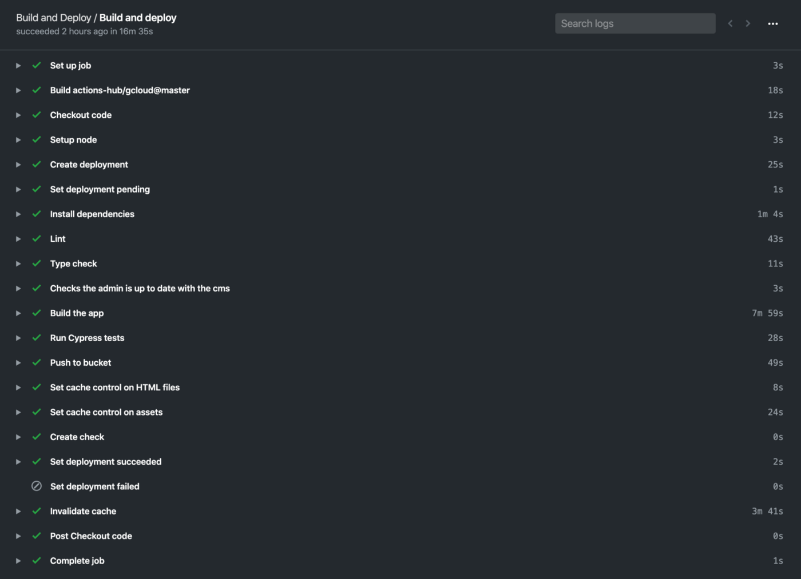

Deploy your Gatsby website on Google Cloud Storage using Terraform and Github Actions

Photo by [JJ Ying](https://unsplash.com/@jjying?utm_source=medium&utm_medium=referral) on [Unsplash](https://unsplash.com/?utm_source=medium&utm_medium=referral)

# Deploy your Gatsby website on Google Cloud Storage using Terraform and Github Actions

[Julien Fouilhé](https://medium.com/@julienfouilhe?source=post_page-----fcf4b8f516ff----------------------)

[Mar 18](https://medium.com/inato/deploy-your-gatsby-website-on-google-cloud-storage-using-terraform-and-github-actions-fcf4b8f516ff?source=post_page-----fcf4b8f516ff----------------------) · 6 min read

# Context

[https://inato.com](https://inato.com/) Before/after

At Inato, we decided to revamp our website two months ago and to do this, we decided to go with Gatsby for several reasons.

Firstly, because it **uses a stack we are familiar with** since GraphQL and React are tools we use on a regular basis.

Secondly, because it unbelievably **enhances the performance** of the website, by optimizing everything it can, from image sizes to lazy loading out of the box.

Thirdly, because it **allows for easy integration with various CMS**, and we needed the website to be fully customizable by our marketing team.

With that settled, we still needed to decide how we would deploy our website.

Gatsby builds static webpages, so we didn’t need anything too complex, and certainly didn’t need to deploy it inside our Kubernetes cluster. Our **requirements** were:

- Easy deployment of new versions.
- Our assets needed to be served via a CDN for speed.
- Browsing the website should not be interrupted when a new version is deployed.

That third one was actually decisive in how we chose our solution, because Gatsby, even though it builds static pages that can be loaded without any javascript, then hydrates those pages with javascript that enhances the whole user experience. That javascript is split in a lot of chunks of code, that are each loaded lazily when needed (for instance, when clicking a link to another page of the website).

Those chunk files are named with a hash of their content so that if you’ve visited the website and you return on it after a new version has been deployed, the cache control rules you’ve applied to the chunks of the former version do not apply and you get the new version.

That’s great! But what happens if a new version is deployed **while **you’re browsing the website? Well, if you use a tool such as Amplify or Firebase Hosting, chunks for the version you’re browsing are erased, and even though some nodes of your CDN may have cached it, they also may not have, and therefore you may get a blank page and have to reload, leading to bad user experience.

# Solution

The solution to this is not that complicated in theory: it requires you **not to erase the assets of the former versions**. Remember, your file names contain the hash of their content, so if they change, their filename changes also. That means that you can keep all the versions of your javascript available!

The problem is: most tools designed to deploy a static website do not allow that. When you deploy a new version, the old files are erased completely.

Hence why we decided to go with **Google Cloud Storage**.

The concept is simple: you store your files in a Google Cloud Storage bucket, then Cloud CDN serves those files. Nothing more complicated.

Now, it also has disadvantages compared to other solutions, so this may not be for everyone. Here are some of the disadvantages compared to, for instance, Amplify:

- **You have to set up your own CI/CD.** Where Amplify connects to your Git repository and launches automatically a CI/CD pipeline on every new commit, you will have to set this up yourself with Google Cloud Storage.
- **It only offers limited URL rewriting/forwarding. **

Want a 301 redirect from HTTP to HTTPS? Really hard to do, and you would have to use a Google Cloud Engine instance, [there are plans for this though](https://googlecloudplatform.uservoice.com/forums/302616-load-balancing/suggestions/31951531-allow-http-to-redirect-to-https-automatically).

Want a 301 redirect from [www.inato.com](http://www.inato.com/) to inato.com? Not possible, you’ll have to do it using your DNS records if your provider allows it. *You can only define a 404 page and an index page with GCS.*

# Let’s dig in!

Now that we know what we’re in for, let’s dig in and actually get it done.

## Terraform

At Inato, we already use Terraform to describe our infrastructure. Thus, it appeared natural to us that we would also use it for our website. **If you don’t already use Terraform** and are not familiar with it, you can just skip this and **setup everything using only the console or the CLI**. But if you do use this already, here’s what you’ll need.

First, set up your basic information:

Then, add your bucket. We set the project id in its name because it needs to be unique among all existing projects in GCP, not just yours. We set our main page suffix to be the `index.html`, and the not found page to be our `404.html` page.

Then we need to add public read rights:

We will want to add a load balancer on top and enable Cloud CDN. We will need an SSL certificate to handle HTTPS requests. *Note: *the certificate will only become active ~10 minutes after you have redirected your domain to the new load balancer IP.

Once you’ve run `terraform apply` , you’ll be able to manually upload a build to your newly created bucket, and once you’ve changed your DNS records to point to your load balancer, you’ll be able to access your website!

Now let’s add a `github-actions` service account, which will allow Github Actions to perform the required actions:

Run `terraform apply` again to apply those changes and you’re done!
**Github Actions**

Our Github Actions pipeline

Obviously, if you don’t use Github, you can just do the same thing with other CI solutions such as Gitlab CI or CircleCI.

Our CI/CD pipeline needs to:

- Build the gatsby website.
- Upload our build to our Google Cloud Storage bucket. During this step, we will need to gzip our text files and to set our cache control policy.

First let’s step up our workflow, stored under `.github/workflows/main.yml`

Now that we have our basic setup, let’s install dependencies, build the site and run our different tests. Note that since we use Cypress for our end-to-end tests, we used its Github Action to install our dependencies. If you don’t use it, you can just run `yarn install --frozen-lockfile` and use the `actions/cache` to cache your dependencies.

Now, we have our build directory ready, and we can upload our files to GCS.

For this you’ll need to go to your GCloud console, go to “IAM > Service Accounts”, select the `github-actions` service account that you previously created with Terraform, and create a JSON key that you can download. Encode it to Base 64 (for example by using `base64 -i /path/to/your/file.json` in your terminal).

Then go to your Github repository secrets and add the base64-encoded string as a new secret named `GOOGLE_APPLICATION_CREDENTIALS` . Then we can upload the files:

Let’s examine the above step of our workflow. It is just as if you were running `gsutil -m cp -z html,css,js,json,txt,xml,svg -r ./public/* gs://{bucket-id}/` in your terminal.

The option`-m` allows for concurrent requests and will make the whole command faster.

`cp` means we want to copy files.

`-z html,css,js,json,txt,xml,svg` is interesting because it means that you want to gzip those files. It will take less space in your bucket and, more interestingly, will send the files gzipped and set the correct HTTP headers whenever a request is made.

`-r ./public/* gs://{bucket-id}/` will recursively copy the files and directory in public (your gatsby build directory) to the root of your bucket.

That’s it, you can now access your website! But **we’re not finished**! We want to set our cache control rules! You can change them if they do not fit your needs.

Now that we have our assets cached for 1 year (only 1 day for HTML files and JSON files), we need to invalidate the CDN cache in the CI, so that our new version can be available directly to new users, without waiting for our files to be expired on CDN nodes.

And now we’re done!

# Conclusion

For now, Google Cloud Storage is perfect for deploying static assets to a CDN but still misses some functionalities if you want to deploy a whole website. Other solutions are also faster and easier. But it is stable, has blazing fast performances, and it feels safer.

*Drug discovery is a challenging, intellectually complex, and rewarding endeavor: we help develop effective and safe cures to diseases affecting millions of people. If you’re looking to have a massive impact, join us!*  [*https://inato.com/careers/*](https://inato.com/careers/)