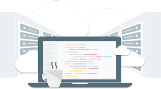
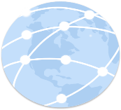
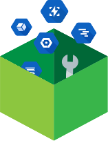

DevOps Solutions  |  Google Cloud Platform

# DevOps Solutions

## Manage your application lifecycle on Google Cloud Platform

 [Development Guides](https://cloud.google.com/solutions/devops/#development_guides)  [Contact Sales](https://cloud.google.com/contact/)

## Save Time, Innovate More

DevOps is where any application starts. In today’s increasingly competitive world, the agility to be able to try things out quickly and move on without incurring upfront costs or facing delays while procuring hardware and integrating into your on premises environment is key to being successful. Multiple, disposable, and recreatable environments that are accessible around the globe are a must have for application lifecycle management. Configuration management tools that suits your environment, containers, and choice of development and continuous integration tools are just a few of the things that the modern developer expects to be at their disposal. Cloud Platform provides a cost effective platform that addresses these requirements and more for any development and test environment.

 

## Pay for What You Use

DevOps requires numerous, disposable environments. Cloud Platform allows you to automatically create and tear down environments on demand with no upfront costs. With per minute billing you will only ever pay for what you use when you need them which is ideal for DevOps environments.

 

## Global Network

Both development teams and customers are often spread across continents. This means that not only your customer facing production applications, but also your DevOps infrastructure benefits from a robust global network. Google has one of the largest and most advanced computer networks. Google’s backbone network has thousands of miles of fiber optic cable, uses advanced software-defined networking and has edge caching services to deliver fast, consistent and scalable performance.

 

## Developer Tools

Focus on developing your application while we take care of the undifferentiated heavy lifting. You get access to the following tools to help you focus on building your application: Stackdriver Monitoring, Stackdriver debugger, Stackdriver Logging, and a security scanner service (App Engine today). Thus, you do not need to be concerned with managing these fundamental requirements but can start using them immediately as part of your application lifecycle pipeline.

 

.    

# DevOps GUIDES

## In-depth guides and resources to help you develop better with Cloud Platform

### Jenkins on Google Container Engine

Learn best practices for using Jenkins with Container Engine for your continuous delivery (CD) pipeline.

 [Read the guide](https://cloud.google.com/solutions/jenkins-on-container-engine)

### App Engine Flexible Environment

The App Engine flexible environment allows you to customize your runtime and even the operating system of your virtual machine.

 [Read the getting started docs](https://cloud.google.com/appengine/docs/flexible/)

### Deploying Microservices

Decompose your app into microservices that have strong, consistent contracts between them to help you scale your app and development processes on App Engine.

 [Read the overview](https://cloud.google.com/solutions/microservices-on-app-engine)

### Real-time Logs Analysis

Manage multiple logs distributed across a fleet of infrastructure with Fluentd and BigQuery.

 [Read the tutorial](https://cloud.google.com/solutions/real-time/fluentd-bigquery)

### Less Time Managing Resources

Common scenarios for managing compute resources and software services on Compute Engine using open-source software configuration management tools.

 [Read the article](https://cloud.google.com/developers/articles/google-compute-engine-management-puppet-chef-salt-ansible/)

### DevOps Tutorials

Need more information? View the available solutions, tutorials, and overviews about DevOps on GCP.

 [See All the DevOps Guides](https://cloud.google.com/docs/tutorials#devops)

 .

.

 [Development Guides](https://cloud.google.com/solutions/devops/#development_guides)  [Contact Sales](https://cloud.google.com/contact/)

.

 [ ### Development and Admin Tools    Documentation overview](https://cloud.google.com/docs/overview/developer-and-admin-tools)

 [ ### Using Travis CI    Travis CI with Cloud Storage](https://docs.travis-ci.com/user/deployment/gcs/)

 [ ### SnapChat's Bobby Murphy    Interview with Bobby Murphy](https://youtu.be/17PtS1Qx8kU)

 .