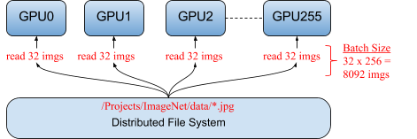
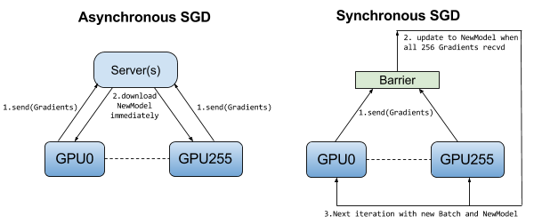
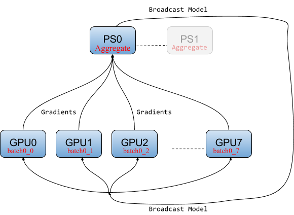
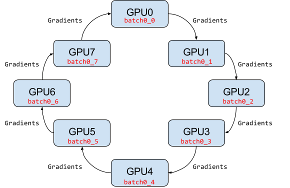
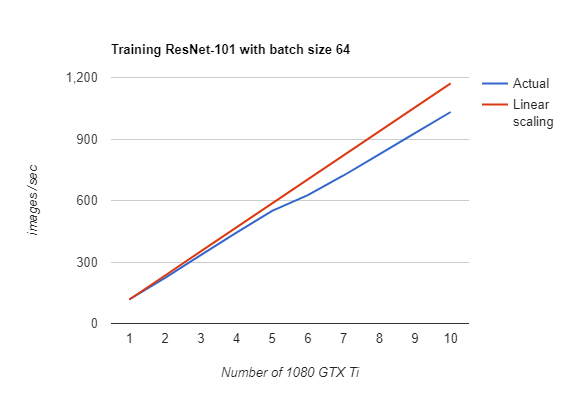
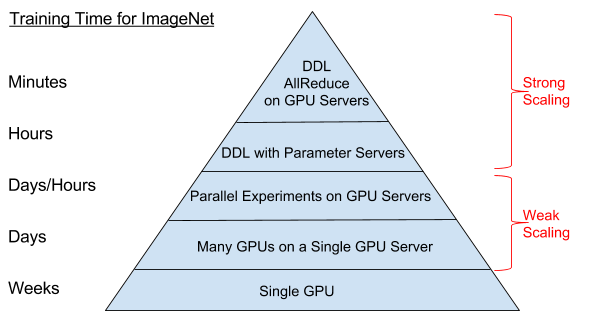

Distributed TensorFlow

# Distributed TensorFlow

Reduce both experimentation time and training time for neural networks by using many GPU servers.

By
 December 19, 2017

Distributed (source: [Pixabay](https://pixabay.com/en/pattern-design-texture-decoration-1893654/))

Note: [The full source code for the examples can be found here](http://github.com/hopshadoop/distributed-tf).

On June 8, 2017, the age of distributed deep learning began. On that day, [Facebook released a paper](https://research.fb.com/wp-content/uploads/2017/06/imagenet1kin1h5.pdf) showing the methods they used to reduce the training time for a convolutional neural network (RESNET-50 on ImageNet) from two weeks to one hour, using 256 GPUs spread over 32 servers. In software, they introduced a technique to train convolutional neural networks (ConvNets) with very large mini-batch sizes: make the learning rate proportional to the mini-batch size. This means anyone can now scale out distributed training to 100s of GPUs using TensorFlow. But that’s not the only advantage of distributed TensorFlow: you can also massively reduce your experimentation time by running many experiments in parallel on many GPUs. This reduces the time required to find good hyperparameters for your neural network.

> Methods that scale with computation are the future of AI.
> —Rich Sutton, father of reinforcement learning

In this tutorial, we will explore two different distributed methods for using TensorFlow:

1. Running parallel experiments over many GPUs (and servers) to search for good hyperparameters

2. Distributing the training of a single network over many GPUs (and servers), reducing training time

We will provide code examples of methods (1) and (2) in this post, but, first, we need to clarify the type of distributed deep learning we will be covering.

## Model parallelism versus data parallelism

Some neural networks models are so large they cannot fit in memory of a single device (GPU). Google’s Neural Machine Translation system is an example of such a network. Such models need to be split over many devices (workers in the TensorFlow documentation), carrying out the training in parallel on the devices. For example, different layers in a network may be trained in parallel on different GPUs. This training procedure is commonly known as "model parallelism" (or "in-graph replication" in the TensorFlow documentation). It is challenging to get good performance, and we will not cover this approach any further.

In "data parallelism" (or “between-graph replication” in the TensorFlow documentation), you use the same model for every device, but train the model in each device using different training samples. This contrasts with model parallelism, which uses the same data for every device but partitions the model among the devices. Each device will independently compute the errors between its predictions for its training samples and the labeled outputs (correct values for those training samples). Because each device trains on different samples, it computes different changes to the model (the "gradients"). However, the algorithm depends on using the combined results of all processing for each new iteration, just as if the algorithm ran on a single processor. Therefore, each device has to send all of its changes to all of the models at all the other devices.

In this article, we focus on data parallelism. Figure 1 illustrates typical data parallelism, distributing 32 different images to each of the 256 GPUs running a single model. Together, the total mini-batch size for an iteration is 8,092 images (32 x 256).

Figure 1. In data parallelism, devices train with different subsets of the training data. Image courtesy of Jim Dowling.

## Synchronous versus asynchronous distributed training

Stochastic gradient descent (SGD) is an iterative algorithm for finding optimal values, and is one of the most popular algorithms for training in AI. It involves multiple rounds of training, where the results of each round are incorporated into the model in preparation for the next round. The rounds can be run on multiple devices either synchronously or asynchronously.

Get O'Reilly's AI newsletter

 

Each SGD iteration runs on a mini-batch of training samples (Facebook had a large mini-batch size of 8,092 images). In synchronous training, all of the devices train their local model using different parts of data from a single (large) mini-batch. They then communicate their locally calculated gradients (directly or indirectly) to all devices. Only after all devices have successfully computed and sent their gradients is the model updated. The updated model is then sent to all nodes along with splits from the next mini-batch. That is, devices train on non-overlapping splits (subset) of the mini-batch.

Although parallelism has the potential for greatly speeding up training, it naturally introduces overhead. A large model and/or slow network will increase the training time. Training may stall if there is a straggler (a slow device or network connection). We also want to reduce the total number of iterations required to train a model because each iteration requires the updated model to be broadcast to all nodes. In effect, this means increasing the mini-batch size as much possible such that it does not degrade the accuracy of the trained model.

In their paper, Facebook introduced [a linear scaling rule for the learning rate](https://research.fb.com/wp-content/uploads/2017/06/imagenet1kin1h5.pdf) that enables training with large mini-batches. The rule states that “when the minibatch size is multiplied by k, multiply the learning rate by k,” with the proviso that the learning rate should be increased slowly over a few epochs before it reaches the target learning rate.

In asynchronous training, no device waits for updates to the model from any other device. The devices can run independently and share results as peers, or communicate through one or more central servers known as "parameter" servers. In the peer architecture, each device runs a loop that reads data, computes the gradients, sends them (directly or indirectly) to all devices, and updates the model to the latest version. In the more centralized architecture, the devices send their output in the form of gradients to the parameter servers. These servers collect and aggregate the gradients. In synchronous training, the parameter servers compute the latest up-to-date version of the model, and send it back to devices. In asynchronous training, parameter servers send gradients to devices that locally compute the new model. In both architectures, the loop repeats until training terminates. Figure 2 illustrates the difference between asynchronous and synchronous training.

Figure 2. Asynchronous and synchronous training with stochastic gradient descent (SGD). Image courtesy of Jim Dowling.

## Parameter server architecture

When parallel SGD uses parameter servers, the algorithm starts by broadcasting the model to the workers (devices). In each training iteration, each worker reads its own split from the mini-batch, computing its own gradients, and sending those gradients to one or more parameter servers. The parameter servers aggregate all the gradients from the workers and wait until all workers have completed before they calculate the new model for the next iteration, which is then broadcast to all workers. The data flow is shown in Figure 3.

#### Safari

 

## [Learn faster. Dig deeper. See farther.](https://www.safaribooksonline.com/home/?utm_source=newsite&utm_medium=content&utm_campaign=lgen&utm_content=ai-post-safari-right-rail-cta)

Join Safari. Get a free trial today and find answers on the fly, or master something new and useful.

 [Learn more](https://www.safaribooksonline.com/home/?utm_source=newsite&utm_medium=content&utm_campaign=lgen&utm_content=ai-post-safari-right-rail-cta)

Figure 3. Parameter server architecture for synchronous stochastic gradient descent. Image courtesy of Jim Dowling.

## Ring-allreduce architecture

In the ring-allreduce architecture, there is no central server that aggregates gradients from workers. Instead, in a training iteration, each worker reads its own split for a mini-batch, calculates its gradients, sends its gradients to its successor neighbor on the ring, and receives gradients from its predecessor neighbor on the ring. For a ring with N workers, all workers will have received the gradients necessary to calculate the updated model after N-1 gradient messages are sent and received by each worker.

Ring-allreduce is bandwidth optimal, as it ensures that the available upload and download network bandwidth at each host is fully utilized (in contrast to the parameter server model). Ring-allreduce can also overlap the computation of gradients at lower layers in a deep neural network with the transmission of gradients at higher layers, further reducing training time. The data flows are shown in Figure 4.

Figure 4. Ring-allreduce architecture for synchronous stochastic gradient descent. Image courtesy of Jim Dowling.

## Parallel experiments

So far, we have covered distributed training. However, many GPUs can also be used for parallelizing hyperparameter optimization. That is, when we want to establish an appropriate learning rate or mini-batch size, we can run many experiments in parallel using different combinations of the hyperparameters. After all experiments have completed, we can use the results to determine whether more experimentation is needed or whether the current hyperparameter values are good enough. If the hyperparameters are acceptable, you can use them when training your model on many GPUs.

## Two uses for distributed GPUs in TensorFlow

The following sections illustrate how to use TensorFlow for parallel experiments and distributed training.

### Parallel experiments

It’s easy to parallelize parameter sweeps over many GPUs, as we need a central point only to schedule the experiments. TensorFlow does not provide built-in support for starting and stopping TensorFlow servers, so we will use Apache Spark to run each TensorFlow Python program in a PySpark mapper function. Below, we define a launch function that takes as parameters (1) the Spark session object, (2) a `map_fun` that names the TensorFlow function to be executed at each Spark executor, and (3) an `args_dict` dictionary containing the hyperparameters. Spark can run many Tensorflow servers in parallel by running them inside a Spark executor. A Spark executor is a distributed service that executes tasks. In this example, each executor will calculate the hyperparameters it should use from the `args_dict` using its `executor_num` to index into the correct `param_val`, and then run the supplied training function with those hyperparameters.

`def`  `launch``(``spark_session``,`  `map_fun``,`  `args_dict``):`  `""" Execute a ‘map_fun’ for each hyperparameter combination from the dictionary ‘args_dict’``    Args:``      :spark_session: SparkSession object``      :map_fun: The TensorFlow function to run (wrapped inside a Spark mapper function)``      :args_dict: hyperparameters to insert as arguments for each TensorFlow function``    """`  `sc`  `=`  `spark_session``.``sparkContext`  `# Length of the list of the first list of arguments represents the number of Spark tasks`  `num_tasks`  `=`  `len``(``args_dict``.``values``()[``0``])`  `# Create a number of partitions (tasks)`  `nodeRDD`  `=`  `sc``.``parallelize``(``range``(``num_tasks``),`  `num_tasks``)`  `# Execute each of the hyperparameter arguments as a task`  `nodeRDD``.``foreachPartition``(``_do_search``(``map_fun``,`  `args_dict``))``def`  `_do_search``(``map_fun``,`  `args_dict``):`  `def`  `_wrapper_fun``(``iter``):`  `for`  `i`  `in`  `iter``:`  `executor_num`  `=`  `i`  `arg_count`  `=`  `map_fun``.``func_code``.``co_argcount`  `names`  `=`  `map_fun``.``func_code``.``co_varnames`  `args`  `=`  `[]`  `arg_index`  `=`  `0`  `while`  `arg_count`  `>`  `0``:`  `# Get arguments for hyperparameter combination`  `param_name`  `=`  `names``[``arg_index``]`  `param_val`  `=`  `args_dict``[``param_name``][``executor_num``]`  `args``.``append``(``param_val``)`  `arg_count`  `-=`  `1`  `arg_index`  `+=`  `1`  `map_fun``(``*``args``)`  `return`  `_wrapper_fun`

The `mnist` TensorFlow training function can now be called from within Spark. Note that we only call launch once, but for each hyperparameter combination, a task is executed on a different executor (four in total):

`args_dict`  `=`  `{``'learning_rate'``:`  `[``0.001``,`  `0.0001``],`  `'dropout'``:`  `[``0.45``,`  `0.7``]}``def`  `mnist``(``learning_rate``,`  `dropout``):`  `"""``     An implementation of FashionMNIST should go here``  """``launch``(``spark``,`  `mnist``,`  `args_dict``):`

### Distributed training

We will briefly cover three frameworks for distributed training on TensorFlow: native Distributed TensorFlow, TensorFlowOnSpark, and Horovod.

#### Distributed TensorFlow

Distributed TensorFlow applications consist of a cluster containing one or more parameter servers and workers. Because workers calculate gradients during training, they are typically placed on a GPU. Parameter servers only need to aggregate gradients and broadcast updates, so they are typically placed on CPUs, not GPUs. One of the workers, the chief worker, coordinates model training, initializes the model, counts the number of training steps completed, monitors the session, saves logs for TensorBoard, and saves and restores model checkpoints to recover from failures. The chief worker also manages failures, ensuring fault tolerance if a worker or parameter server fails. If the chief worker itself dies, training will need to be restarted from the most recent checkpoint.

One disadvantage of Distributed TensorFlow, part of core TensorFlow, is that you have to manage the starting and stopping of servers explicitly. This means keeping track of the IP addresses and ports of all your TensorFlow servers in your program, and starting and stopping those servers manually. Generally, this leads to a lot of switch statements in your code to determine which statements should be executed on the current server. Therefore, we will make life easier by using a cluster manager and Spark. Hopefully, you will never have to write code like this, defining a ClusterSpec manually:

`tf``.``train``.``ClusterSpec``({``"local"``:`  `[``"localhost:2222"``,`  `"localhost:2223"``]})``tf``.``train``.``ClusterSpec``({`  `"worker"``:`  `[`  `"worker0.example.com:2222"``,`  `"worker1.example.com:2222"``,`  `"worker2.example.com:2222"`  `],`  `"ps"``:`  `[`  `"ps0.example.com:2222"``,`  `"ps1.example.com:2222"`  `]})``…``if`  `FLAGS``.``job_name`  `==`  `"ps"``:`  `server``.``join``()``elif`  `FLAGS``.``job_name`  `==`  `"worker"``:`  `…``.`

It is error-prone and impractical to create a ClusterSpec using host endpoints (IP address and port number). Instead, you should use a cluster manager such as YARN, Kubernetes, or Mesos to reduce the complexity of configuring and launching TensorFlow applications. The main options are either a cloud managed solution (like Google Cloud ML or Databrick’s Deep Learning Pipelines), or a general-purpose resource manager like Mesos or YARN.

#### TensorFlowOnSpark

TensorFlowOnSpark is a framework that allows distributed TensorFlow applications to be launched from within Spark programs. It can be run on a standalone Spark cluster or a YARN cluster. The TensorFlowOnSpark program below performs distributed training of Inception using the ImageNet data set.

The new concepts it introduces are a TFCluster object to start your cluster, as well as to perform training and inference. The cluster can be started in either SPARK mode or TENSORFLOW mode. SPARK mode uses RDDs to feed data to TensorFlow workers. This is useful for building integrated pipelines from Spark to TensorFlow, but it is a performance bottleneck because there is only one Python thread to serialize the RDD to a the `feed_dict` for a TensorFlow worker. TENSORFLOW input mode is generally preferred, as data can be read using a more efficient multi-threaded input queue from a distributed filesystem, such as HDFS. When a cluster is started, it launches the TensorFlow workers and parameter servers (potentially on different hosts). The parameter servers only execute the `server.join()` command, while workers read the ImageNet data and perform the distributed training. The chief worker has `task_id ‘0’`.

The following program collects the information needed to use Spark to start and manage the parameter servers and workers on Spark.

`from`  `__future__`  `import`  `absolute_import``from`  `__future__`  `import`  `division``from`  `__future__`  `import`  `print_function``from`  `pyspark.context`  `import`  `SparkContext``from`  `pyspark.conf`  `import`  `SparkConf``from`  `tensorflowonspark`  `import`  `TFCluster``,`  `TFNode``from`  `datetime`  `import`  `datetime``import`  `os``import`  `sys``import`  `tensorflow`  `as`  `tf``import`  `time``def`  `main_fun``(``argv``,`  `ctx``):`  `# extract node metadata from ctx`  `worker_num`  `=`  `ctx``.``worker_num`  `job_name`  `=`  `ctx``.``job_name`  `task_index`  `=`  `ctx``.``task_index`  `assert`  `job_name`  `in`  `[``'ps'``,`  `'worker'``],`  `'job_name must be ps or worker'`  `from`  `inception`  `import`  `inception_distributed_train`  `from`  `inception.imagenet_data`  `import`  `ImagenetData`  `import`  `tensorflow`  `as`  `tf`  `# instantiate FLAGS on workers using argv from driver and add job_name and task_id`  `print``(``"argv:"``,`  `argv``)`  `sys``.``argv`  `=`  `argv`  `FLAGS`  `=`  `tf``.``app``.``flags``.``FLAGS`  `FLAGS``.``job_name`  `=`  `job_name`  `FLAGS``.``task_id`  `=`  `task_index`  `print``(``"FLAGS:"``,`  `FLAGS``.``__dict__``[``'__flags'``])`  `# Get TF cluster and server instances`  `cluster_spec``,`  `server`  `=`  `TFNode``.``start_cluster_server``(``ctx``,`  `4``,`  `FLAGS``.``rdma``)`  `if`  `FLAGS``.``job_name`  `==`  `'ps'``:`  `# `ps` jobs wait for incoming connections from the workers.`  `server``.``join``()`  `else``:`  `# `worker` jobs will actually do the work.`  `dataset`  `=`  `ImagenetData``(``subset``=``FLAGS``.``subset``)`  `assert`  `dataset``.``data_files``()`  `# Only the chief checks for or creates train_dir.`  `if`  `FLAGS``.``task_id`  `==`  `0``:`  `if`  `not`  `tf``.``gfile``.``Exists``(``FLAGS``.``train_dir``):`  `tf``.``gfile``.``MakeDirs``(``FLAGS``.``train_dir``)`  `inception_distributed_train``.``train``(``server``.``target``,`  `dataset``,`  `cluster_spec``,`  `ctx``)``# parse arguments needed by the Spark driver``import`  `argparse``parser`  `=`  `argparse``.``ArgumentParser``()``parser``.``add_argument``(``"--epochs"``,`  `help``=``"number of epochs"``,`  `type``=``int``,`  `default``=``5``)``parser``.``add_argument``(``"--steps"``,`  `help``=``"number of steps"``,`  `type``=``int``,`  `default``=``500000``)``parser``.``add_argument``(``"--input_mode"``,`  `help``=``"method to ingest data: (spark|tf)"``,`  `choices``=``[``"spark"``,``"tf"``],`  `default``=``"tf"``)``parser``.``add_argument``(``"--tensorboard"``,`  `help``=``"launch tensorboard process"``,`  `action``=``"store_true"``)``(``args``,``rem``)`  `=`  `parser``.``parse_known_args``()``input_mode`  `=`  `TFCluster``.``InputMode``.``SPARK`  `if`  `args``.``input_mode`  `==`  `'spark'`  `else`  `TFCluster``.``InputMode``.``TENSORFLOW``print``(``"{0} ===== Start"``.``format``(``datetime``.``now``()``.``isoformat``()))``sc`  `=`  `spark``.``sparkContext``num_executors`  `=`  `int``(``sc``.``_conf``.``get``(``"spark.executor.instances"``))``num_ps`  `=`  `int``(``sc``.``_conf``.``get``(``"spark.tensorflow.num.ps"``))``cluster`  `=`  `TFCluster``.``run``(``sc``,`  `main_fun``,`  `sys``.``argv``,`  `num_executors``,`  `num_ps``,`  `args``.``tensorboard``,`  `input_mode``)``if`  `input_mode`  `==`  `TFCluster``.``InputMode``.``SPARK``:`  `dataRDD`  `=`  `sc``.``newAPIHadoopFile``(``args``.``input_data``,`  `"org.tensorflow.hadoop.io.TFRecordFileInputFormat"``,`  `keyClass``=``"org.apache.hadoop.io.BytesWritable"``,`  `valueClass``=``"org.apache.hadoop.io.NullWritable"``)`  `cluster``.``train``(``dataRDD``,`  `args``.``epochs``)``cluster``.``shutdown``()`

Note that Apache YARN does not yet support GPUs as a resource, and TensorFlowOnSpark uses YARN node labels to schedule TensorFlow workers on hosts with GPUs. The previous example can also be run on Hops YARN that does support GPUs as a resource, enabling more fine-grained sharing of CPU and GPU resources.

##### Fault tolerance

A `MonitoredTrainingSession` object can be created to automatically recover a session’s training state from the latest checkpoint in the event of a failure.

`saver`  `=`  `tf``.``train``.``Saver``(``sharded``=``True``)``is_chief`  `=`  `True`  `if`  `FLAGS``.``task_id`  `==`  `0`  `else`  `False``with`  `tf``.``Session``(``server``.``target``)`  `as`  `sess`  `:`  `# sess.run(init_op) `  `# re-initialze from checkpoint, if there is one.`  `saver``.``restore``(``sess``,`  `...``)`  `while`  `True``:`  `if`  `is_chief`  `and`  `step`  `%`  `1000`  `==`  `0`  `:`  `saver``.``save``(``sess``,`  `"hdfs://...."``)``with`  `tf``.``train``.``MonitoredTrainingSession``(``server``.``target``,`  `is_chief``)`  `as`  `sess``:`  `while`  `not`  `sess``.``should_stop``():`  `sess``.``run``(``train_op``)`

Spark will restart a failed executor. If the executor is not the chief worker, it will contact the parameter servers and continue as before because a worker is effectively stateless. If a parameter server dies, the chief worker can recover from the last checkpoint after a new parameter server joins the system. The chief worker also saves a copy of the model every 1,000 steps to serve as the checkpoint. If the chief worker itself fails, training fails, and a new training job has to be started, but it can recover training from the latest complete checkpoint.

### Horovod

There are two ring-allreduce frameworks available for TensorFlow: `tensorflow.contrib.mpi_collectives` (contributed by Baidu) and Uber’s Horovod, built on Nvidia’s NCCL 2 library. We will examine Horovod, as it has a simpler API and good performance on Nvidia GPUs, as shown in Figure 5. Horovod is installed using pip, and it requires the prior installation of Open MPI and NCCL-2 libraries. Horovod requires fewer changes to TensorFlow programs than either Distributed TensorFlow or TensorFlowOnSpark. It introduces an hvd object that has to be initialized, and has to wrap the optimizer (hvd averages the gradients using allreduce or allgather). A GPU is bound to this process using its local rank, and we broadcast variables from rank 0 to all other processes during initialization.

A Horovod Python program is launched using the `mpirun` command. It takes as parameters the hostname of each server as well as the number of GPUs to be used on each server. An alternative to `mpirun` is to run Horovod from within a Spark application using the Hops Hadoop platform, which automatically manages the allocation of GPUs to Horovod processes using HopsYARN. Currently, Horovod has no support for fault-tolerant operation, and the model should be checkpointed periodically so that after a failure, training can recover from the latest checkpoint.

`import`  `horovod.tensorflow`  `as`  `hvd`  `;`  `import`  `tensorflow`  `as`  `tf``def`  `main``(``_``):`  `hvd``.``init``()`  `loss`  `=`  `...`  `tf``.``ConfigProto``()``.``gpu_options``.``visible_device_list`  `=`  `str``(``hvd``.``local_rank``())`  `opt`  `=`  `tf``.``train``.``AdagradOptimizer``(``0.01``)`  `opt`  `=`  `hvd``.``DistributedOptimizer``(``opt``)`  `hooks`  `=`  `[``hvd``.``BroadcastGlobalVariablesHook``(``0``)]`  `train_op`  `=`  `opt``.``minimize``(``loss``)`

Figure 5. Horovod/TensorFlow scales near linearly up to 10 GPUs on a [DeepLearning11](https://www.servethehome.com/deeplearning11-10x-nvidia-gtx-1080-ti-single-root-deep-learning-server-part-1/) server (cost: $15,000 U.S. dollars) when training with ResNet-101 on the ImageNet data set. Image courtesy of Jim Dowling.

## Deep learning hierarchy of scale

Having seen many of the distributed training architectures for TensorFlow and large mini-batch stochastic gradient descent (SGD), we can now define the following hierarchy of scale. The top of the pyramid is currently the most scalable approach on TensorFlow, the allreduce family of algorithms (including ring-allreduce), and the bottom is the least scalable (and hence the slowest way to train networks). Although parallel experiments are complementary to distributed training, they are, as we have shown, trivially parallelized (with weak scaling), and thus are found lower on the pyramid.

Figure 6. Deep learning hierarchy of scale for synchronous SGD. Image courtesy of Jim Dowling.

## Conclusion

Well done! You know now what distributed TensorFlow is capable of and how you can modify your TensorFlow programs for either distributed training or running parallel experiments. [The full source code for the examples can be found here](http://github.com/hopshadoop/distributed-tf).

*This post is part of a collaboration between O'Reilly and TensorFlow. *[*See our statement of editorial independence*](http://www.oreilly.com/about/editorial_independence.html)*.*

Article image: Distributed (source: [Pixabay](https://pixabay.com/en/pattern-design-texture-decoration-1893654/)).