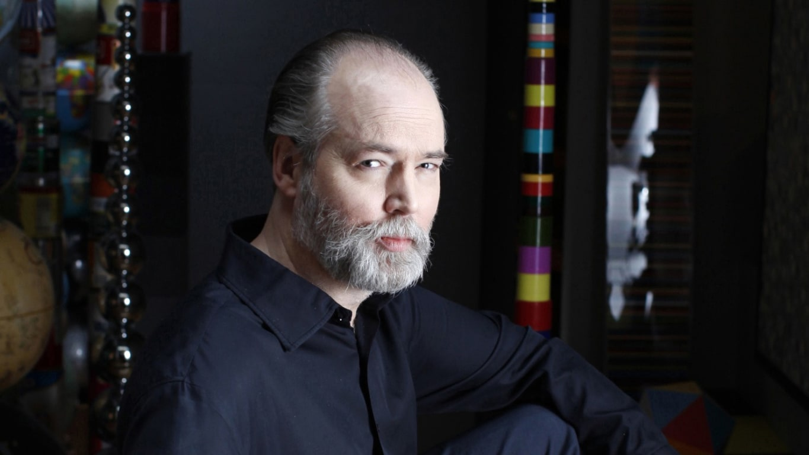
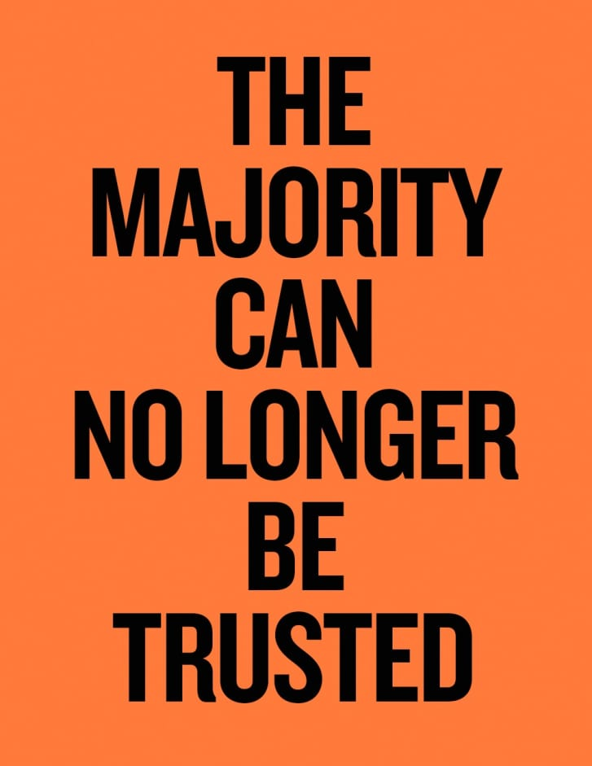
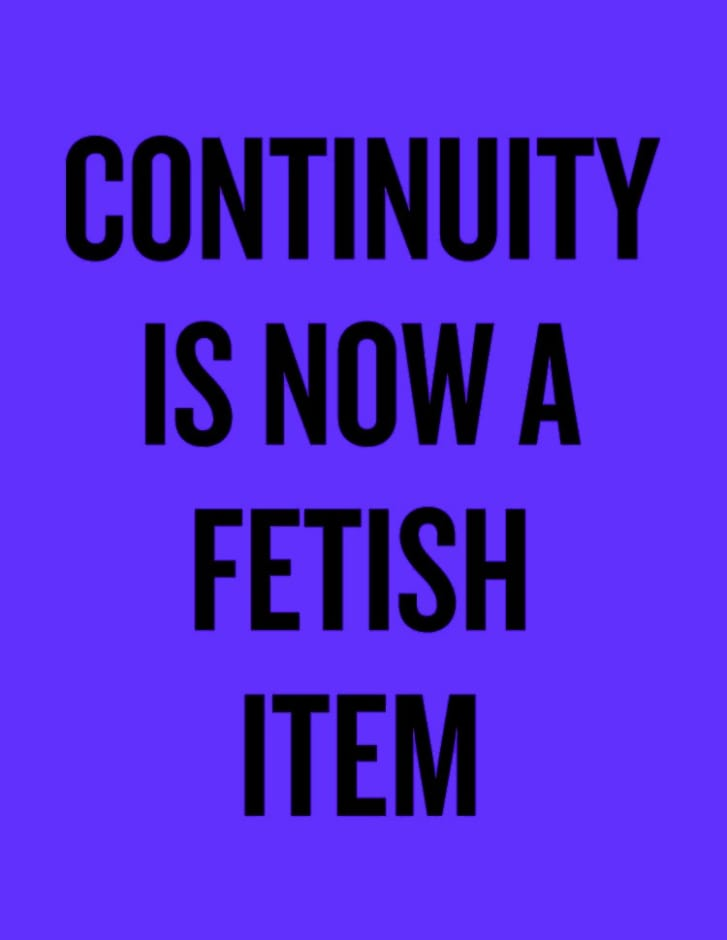
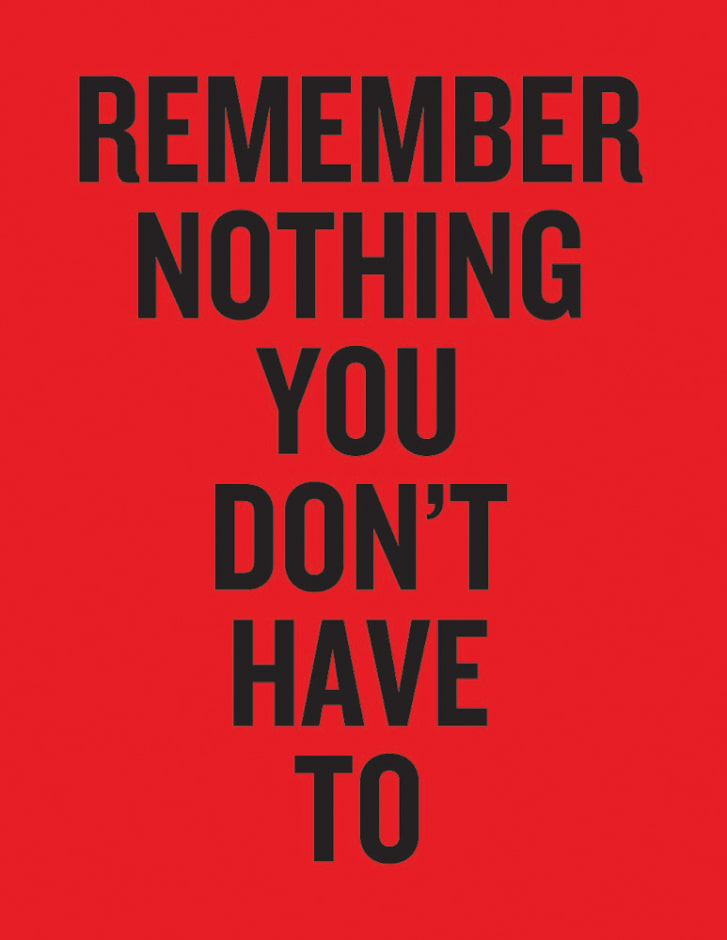

Douglas Coupland: I don't remember my pre-internet brain

# Douglas Coupland: 'I no longer remember my pre-internet brain'

Published 19th January 2018

Douglas Coupland: 'I no longer remember my pre-internet brain'
Share
Written by Douglas Coupland

Douglas Coupland is an internationally acclaimed artist, author and columnist. He is a speaker at the 2018 [Verbier Art Summit](https://www.verbierartsummit.org/) in Switzerland, an annual international event that connects thought leaders to key figures in the art world and creates a platform for discourse, innovation and change in a non-transactional context.

Six years ago, I hosted an evening YouTube event at a Vancouver nightclub. My idea was for the audience and I to view a huge screen linked to my laptop and, collectively, plummet into the internet rabbit hole, with participants calling out unexpected links and destinations along the way, and it was a lot of fun.

A week before the event, the club's owner asked if I'd do posters to promote it. This was the first time in my life where I'd done my own posters, so I gave it some deep thought and, eventually, I assigned myself the task of generating statements that would make sense to someone in 2012, but not in 1992.

Related:

[Virtual anxiety: The disturbing new reality of life online](https://edition.cnn.com/style/article/olivia-sudjic-disturbing-new-reality-of-life-online/index.html)

This wasn't an arbitrary assignment: It was around then that I noticed that inside my head was feeling a great deal different than it did even a few years previous.

My inspiration for this project was the American artist Jenny Holzer who, in the late 1970s, started her ["Truisms"](https://www.moma.org/collection/works/63755) series, playing on popular aphorisms and maxims. ("LACK OF CHARISMA CAN BE FATAL.") In my own variation, I tried to speak from the center of our collective culture: "What is it everyone on Earth is collectively going through right now?"

My first poster slogan read: "I MISS MY PRE-INTERNET BRAIN."

### Signs of the times

Over the last six years, I've developed a sort of unified theory of everything detailing our ever-escalating, almost invariably out-of-synch relationship with the technologies we create, and how their largely unintended side effects have molded our societies and our era. I can boil it down to three dominant trends that demarcate our current existence.

The first is that the online world has vastly outpaced our ability to create political stability. Until we figure out how to counterbalance the epistemic closure of the echo chamber, the majority can no longer be trusted. Democracy needs the morning after pill.

Consider the Brexit debacle. The whole problem could go away tomorrow if the English would simply have another vote -- and it's sheer stupidity on a grand level that they don't. To not hold this vote is simply stupid. Democracy has changed; we need to acknowledge this.

Courtesy Douglas Coupland

The second: We have a new relationship with time. Time now moves far too quickly, and everything feels like it happened either 10 minutes ago or 10 years ago. We've hollowed out medium-range memory. I postulate that this is because we no longer experience time in terms of real, everyday experiences. Time now registers in our brain with online data intake and the microscopic dopamine hits it generates. Data is the new time. The cloud is the new infinity.

Related:

[How digital technology is influencing the world of design](https://edition.cnn.com/style/article/front-design-digital-furniture/index.html)

Imagine visiting 1992 for a few days, back to a world with (comparatively) little content -- or access to content -- compared to today. You'd die of time sickness and data depravation inside a 1992 infoscape where you'd have an iPhone with no battery, and, if you did have one, nothing to connect it to. Pity the poor soul who must time travel to pre-Google America.

Third: We're an ungrateful species. Imagine if you were to tell people in 1992 that in 20 years they could have the answer to pretty much any question they could have -- anywhere on Earth, free, instantaneously and without any form of judgment -- they'd assume a) you were lying or b) if you weren't lying then, why, you must surely be from the golden age of humanity! And yet here we are, bored, bored, bored. Next!

Courtesy Douglas Coupland

### This is your art on tech

TV and film are the art forms most radically altered in our new reality. Continuity has become a fetish item. Look at "Birdman" and "Boyhood," the two top Oscar contenders in 2015. The former was notionally filmed in one take; the latter was filmed continually over twelve years. As my good friend Richard Linklater, the director of "Boyhood" noted, time is the true star of his film.

Related:

[From selfies to virtual reality, how technology is changing the art world](https://edition.cnn.com/style/article/marc-spiegler-cnn-style-guest-editor/index.html)

Furthermore, audiences seem tired of the ruthless, necessary efficiency of the two-hour film experience. Aside from sequels and franchises, the collective filmic experience has migrated to long-form TV-streaming. The sense of discontinuity experienced in our click-junkie online daily life is healed by long-running series like "Breaking Bad" or "The Leftovers" that go on for season after bingeable season. We miss endings, but we don't want them.

"Just one more. You can be late for work tomorrow..."

And then, as a bonus, there are books. I don't know who you are, reader, but I am going to guess you didn't read nearly as many books last year as you did, say, 10 years ago. You may be buying them (thanks Amazon), but I'm guessing they collect dust beside the bed, right beside where your laptop charger lives. This is a really charged assessment and people go nuts when you bring it up. We're so enculturated to people loving books -- yay books! -- but if you get people really, really drunk, the truth will emerge. People simply [aren't reading as much literature](https://www.washingtonpost.com/news/wonk/wp/2016/09/07/the-long-steady-decline-of-literary-reading/?utm_term=.c2d50a8a4982) as they did a decade ago.

Courtesy Douglas Coupland

But why should any of this be depressing? All of this is healthy. So what if our tastes in mediums change? People get what they want, and you can't stop them.

We all want stories. We want to experience shifts in time that remove us from ourselves, and the now-universal, unending cycle of dopamine hits, spread across our conscious hours, does just that.

Related:

[Japan's crystal universe: A magical installation from another planet](https://edition.cnn.com/style/article/teamlab-art-installation-tokyo/index.html)

Just six years ago, most people still believed that our brains were unchangeable and the brain you had in 1992 was the one you're stuck with forever, an idea that now seems pretty silly.

In Switzerland this week, my presentation in Verbier ends with a statement I never would have expected back in 2012, but to be honest, the truth now is: "I NO LONGER REMEMBER MY PRE-INTERNET BRAIN."

What of it?

*The [2018 Verbier Art Summit](https://www.verbierartsummit.org/)** in Switzerland is on until Jan. 20, 2018. The public program, which features talks from the likes of Douglas Coupland, Olafur Eliasson, Ed Atkins, Douglas Coupland, Pamela Rosenkranz and Anicka Yi, is free of charge and open to all. For more information, visit [www.verbierartsummit.org](http://www.artverbier.ch/)**. *