Eight things that were bigger killers in the 1970s

# Eight things more likely to kill you in 1970s Britain than today

 BBC News

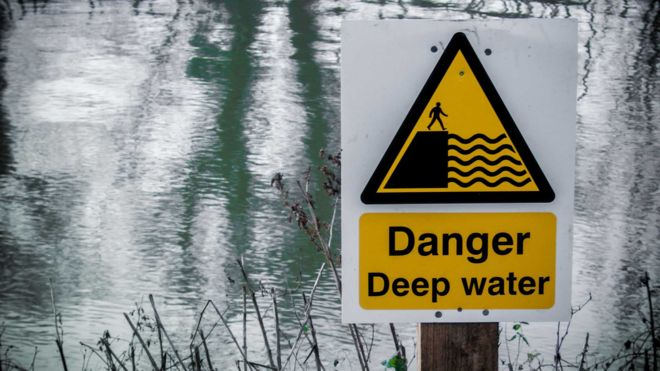

Image copyright Alamy

Humans tend towards pessimism when it comes to observing the world around them, research indicates.

A recent Ipsos Mori survey suggests [we frequently think things are worse than they are](http://www.bbc.co.uk/news/uk-42329014), from murder rates to the prevalence of diabetes. But very often our perceptions don't align with reality.

Here are eight things Britons are less likely to die of today than only a few decades ago - although in many cases improvements have slowed in recent years, and modern life has brought new problems too.

## 1. Winter

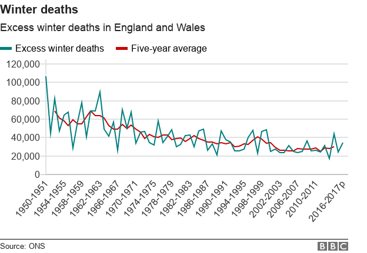

More people die in winter than in summer because of cold weather and higher rates of infectious illnesses such as flu.

But the difference between the number of people dying in winter compared with summer has fallen since the 1970s, when it averaged more than 40,000 extra deaths.

By 2015-16, there were fewer than 25,000 excess deaths a year in winter compared with in summer.

Much of this is because of general improvements in health, but our homes are also better heated and insulated now.

These days almost all homes have some form of double glazing but in the early 1970s fewer than 8% did, according to The Ministry of Housing, Communities and Local Government.

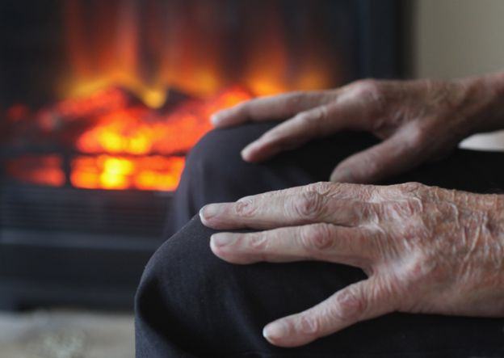
Image copyright Getty Images

Despite an overall downward trend in winter deaths, there are significant fluctuations year-on-year. That can be because of a particularly cold winter or bad flu strain.

The highest number of excess winter deaths in recent times was in 1999-2000.

"The main strain of flu that year affected older people more than the young, which likely contributed to the high number of winter deaths," says Dr Annie Campbell, from the Office for National Statistics (ONS).

Similarly, in 2014-15 [the flu jab turned out to be less effective than usual](http://www.bbc.co.uk/news/health-31145604) in protecting people against the strain in circulation that winter.

To allow for some of these natural variations, the ONS also produces a five-year average each year.

It's too soon to say how [this winter's flu season](http://www.bbc.co.uk/news/health-42737326) and reported pressures on the NHS will affect the picture - the ONS does publish figures on [how many deaths have been registered each week,](https://www.ons.gov.uk/peoplepopulationandcommunity/birthsdeathsandmarriages/deaths/datasets/weeklyprovisionalfiguresondeathsregisteredinenglandandwales) showing there were more death registrations in the week beginning 12 January 2018 than any single week since January 2015.

But if you look at the whole winter period so far, figures from Public Health England suggest that there have been [fewer excess deaths among the over-65s than the year before](https://www.gov.uk/government/uploads/system/uploads/attachment_data/file/676612/Weekly_report_mortality_25_January_2018.pdf), or in 2014-15 when the strain of flu used in vaccines turned out not to be as good a match as usual to the main strain circulating that winter.

## 2. The workplace

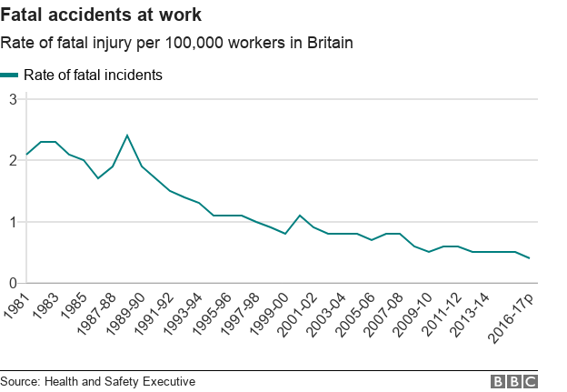

There has been a big drop in fatal injuries at work since 1981.

Before then, not all industries were required to report workplace injuries, so the [data is patchy.](http://www.hse.gov.uk/statistics/tables/index.htm#riddor) But in the industries that did have to report, deaths fell sharply in the 1970s too.

In the year 1986-87 there were 407 fatal accidents in workplaces around Britain. Three decades later the figure had fallen by two-thirds.

The size of the workforce has increased a lot in that time, so if we look at the death rate per 100,000 workers, the improvement is even greater.

This is largely because of Britain's transformation from an industrial economy to a service-based one. Clearly people working in factories and heavy industry are more at risk of fatal accidents than office workers.

Coal mining and steel used to be big killers but [now employ very few people in the UK.](http://www.bbc.co.uk/news/magazine-33959137) On 2 February it was announced that [Eggborough power station in Yorkshire is to close](http://www.bbc.co.uk/news/uk-england-york-north-yorkshire-42902240), leaving only a handful of coal-fired stations in the UK.

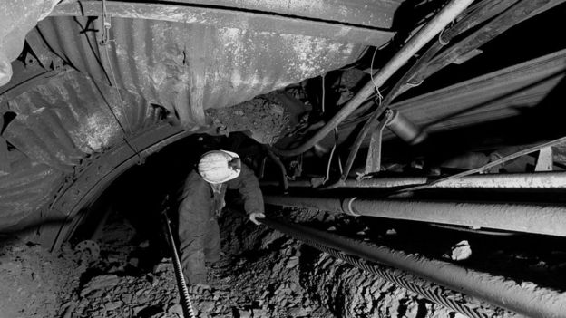

Image copyright PA
Image caption 1972: A pit official at Sutton Colliery in Nottinghamshire

But these days the figures may be underreported, says Noel Whiteside, a public policy expert at the University of Warwick.

The number of self-employed people is rising rapidly, making incidents harder to track. If a contractor is killed in a car crash on the way to a job, or has a heart attack while working from home, that would not count as a death in the workplace, she points out.

There are other reasons to temper optimism with caution.

Although workplaces are safer now, people generally work longer hours, and it is hard to measure the effects of health problems brought about by overwork. "I don't think white-collar work was nearly as stressful 40 years ago," Whiteside says.

Improvements in general health levels are one reason for a decline in workplace deaths, but "there are some signs in the last two years that life expectancy has started to fall," says Whiteside.

## 3. Infancy

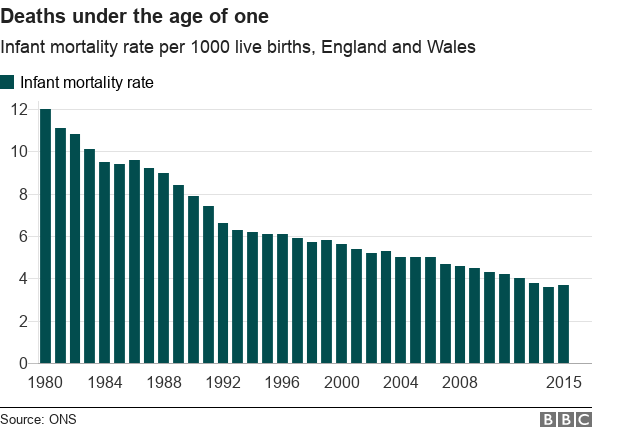

The death of a baby is far rarer than it used to be. In 1900, one in every six babies died before their first birthday. In 2015, it was one in 270.

In 1964 [the mode age of death was zero,](http://www.bbc.co.uk/news/blogs-magazine-monitor-29618190) meaning more people died at age zero than at any other age. The most common age at death is now 85 for men and 88 for women.

In more recent decades, infant mortality has continued to fall sharply. The prevalence of stillbirth has also plummeted.

One key reason is that levels of smoking and drinking alcohol during pregnancy and early motherhood - big risk factors - have fallen sharply.

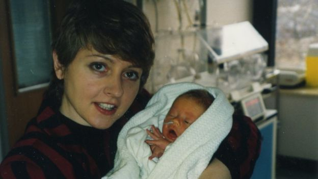

Image copyright Anne Diamond

Image caption After losing her son to cot death, TV presenter Anne Diamond fronted the Back to Sleep campaign, credited with drastically reducing sudden infant deaths in the UK

Sudden infant death syndrome, or "cot death", has become much rarer since the 1980s.

This is largely attributed to the Back to Sleep campaign, which launched in 1991 and recommended that parents didn't share a bed with their babies, and put them on their backs.

[In 2016, twins were born in Glasgow after only 23 weeks](http://www.bbc.co.uk/news/uk-scotland-glasgow-west-38795977) - the average pregnancy is 38 weeks. Nine months later, the babies were in good health.

"If the girls had been born just two years ago, they wouldn't have survived - that's how fast medical technology is advancing," a doctor told the mother.

But progress has slowed since the Millennium, and the UK has worse rates of infant mortality than France, Ireland and Germany.

There are also big inequalities - [babies born to low-income mothers are much more at risk.](http://www.bbc.co.uk/news/health-38743765)

## 4. Britain's roads

A third as many people died on Britain's roads in 2016 as did in the early 1980s. We drive more now, so the improvement in road safety is even more dramatic than the graph suggests.

Although all new cars have had to be fitted with seat belts since 1966, wearing them became compulsory in the front seat only in 1983, and in the back in 1991. These legal changes were accompanied by hard-hitting advertising campaigns, which helped change cultural attitudes.

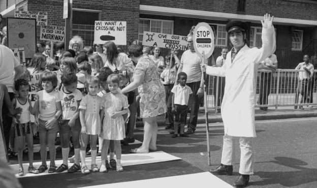

Image copyright PA

Image caption 1973: Drummer Keith Moon takes part in a road safety campaign in south London

Drink-driving has become easier to measure and more harshly punished, and as with seat belts, social attitudes have changed. Four-fifths of British adults [agree that "if someone has drunk any alcohol they should not drive".](https://www.gov.uk/government/statistical-data-sets/att03-attitudes-and-behaviour-towards-roads-and-road-travel#table-att0346)

Cars themselves are also safer, with crumple zones and air bags. Road engineering is constantly evolving and improving: dangerous junctions get redesigned, speed bumps and cameras slow drivers down. People drive more slowly now, with limits robustly enforced.

- [Driving home? 10 things to know about Britain's roads](http://www.bbc.co.uk/news/uk-42182497)

Over the past few years [improvements in the death rate have slowed,](http://www.bbc.co.uk/news/uk-35494136) and even reversed slightly in some years. But the long-term picture is clear: Britain's roads are far safer than they were.

## 5. Drowning

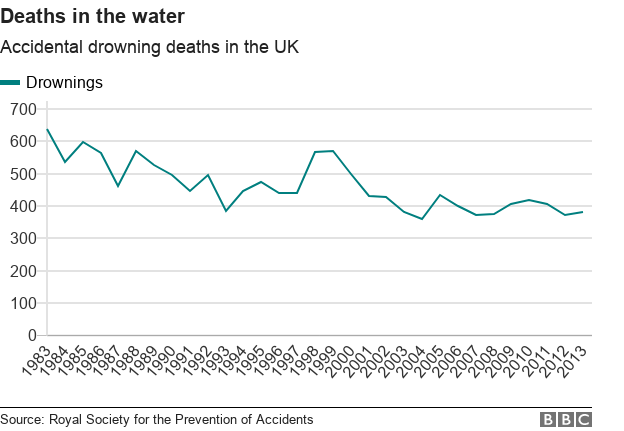

Since the early 1980s, there has been a sizeable reduction in deaths from accidental drowning.

This is largely down to general improvements in safety around inland waters such as lakes and rivers, and better search-and-rescue responses at sea.

Disasters such as [the 1989 Marchioness boat collision on the Thames,](http://www.bbc.co.uk/news/uk-england-london-28864128) which killed 51 people, and [the 1993 Lyme Bay canoeing tragedy](http://news.bbc.co.uk/1/hi/education/4438520.stm) helped strengthen regulation.

More recently, [big floods in 2007](http://www.bbc.co.uk/news/uk-england-40548635) led to search-and-rescue systems being reviewed.

Better safety measures in public swimming pools have also led to a reduction in deaths, from about 50 a year in the late 1970s.

These days incidences of drowning in local swimming pools are vanishingly rare, despite the fact that more people use them.

However, the way data is collected has changed over time, making it difficult to make direct comparisons.

## 6. Cardiovascular disease

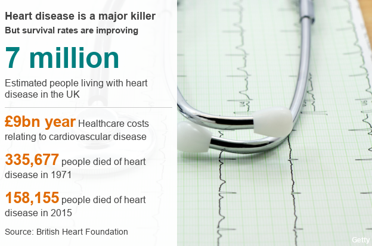

Cardiovascular disease- both heart disease and strokes - is still one of the biggest killers in the UK. But fewer people are dying from it than they were 50 years ago, partly because of better diagnosis and treatment.

The introduction of a technique known as percutaneous coronary intervention to treat heart attacks - by widening the arteries using a small tube called a stent - has also improved survival rates.

The growing use of cholesterol-lowering statins from the mid-1990s onwards led to gradual improvements in mortality.

However, big improvements were seen before many of these medical interventions were introduced, mainly driven by a better understanding of the impact of lifestyle factors such as diet and exercise on our health.

In particular, people began smoking less and eating less saturated fat - though some of these gains have begun to be offset by a rise in obesity.

- [10 charts that show why the NHS is in trouble](http://www.bbc.co.uk/news/health-38887694)

In 1971, heart disease caused most deaths in the UK, killing about 330,000 people. By 2015, this had fallen to just under 160,000, about a quarter of all deaths.

Despite improvements, heart disease still kills more men and women in England and Wales than [any other disease except dementia](http://www.bbc.co.uk/news/health-37972141) and - while treatment has improved the chance of survival - more people are now living with heart failure and its effects.

Life expectancy has increased by 13 years since the foundation of the NHS, which is something to celebrate - but an ageing population is bringing new pressures.

## 7. Smogs

The big killer smogs that plague cities such as Delhi and Beijing are a thing of the past in Britain.

In previous decades, though, it was not uncommon for smogs to kill several hundred people in only a few days.

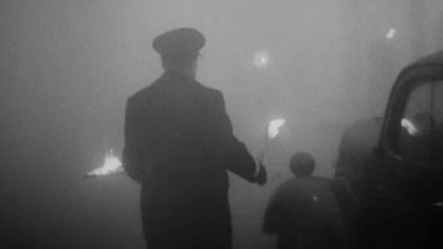

Image copyright Getty Images

Image caption London's December 1952 "pea-souper" smog contributed to thousands of deaths

Households and factories used to burn a lot more coal - and in certain atmospheric conditions, the dirty air would not disperse, says Peter Brimblecombe, whose book The Big Smoke looks at London smogs between the 1870s and 1970s.

The worst in recent memory was London's "pea-souper" of December 1952, [which contributed to the deaths of an estimated 4,000 people.](http://www.bbc.co.uk/news/av/stories-42357608/death-by-smog-london-s-fatal-four-day-pea-souper)

"The smoke-like pollution was so toxic, it was even reported to have choked cows to death in the fields," according to the Met Office.

"In the Isle of Dogs area, the fog there was so thick people could not see their feet."

In response, the government passed the Clean Air Act in 1956, which reduced the use of smoky fuels, and other laws followed.

We burn far less coal these days. (The unusually low 1984 figure was because of that year's miners' strike.)

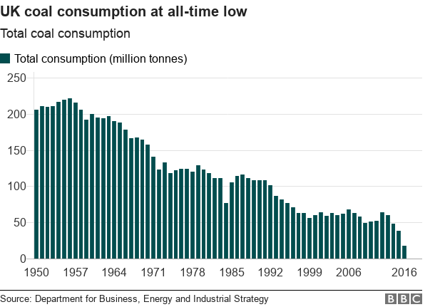

Coal's role in generating electricity [has been replaced by cleaner forms of energy](http://www.bbc.co.uk/news/uk-39675418) - natural gas, nuclear power, and more recently, renewable sources.

In June 2017, for the first time, [wind, nuclear and solar power generated more UK power](http://www.bbc.co.uk/news/uk-42495883) than gas and coal combined.

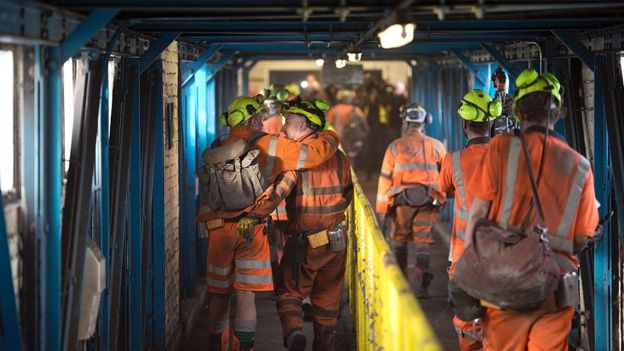

Image copyright OLI SCARFF/AFP/Getty Images
Image caption The Kellingley Colliery in Yorkshire shut down in December 2015

There were smaller deadly smogs in 1991, 2003 and 2014, points out Gary Fuller, an academic at King's College London.

However, long-term exposure to everyday air pollution term has greater impact than short smogs - and the death rate for this might not be falling, says Anna Hansell, of Imperial College London.

She says that while the overall levels of air pollutants have decreased, the pollutants are more toxic.

## 8. Lung cancer

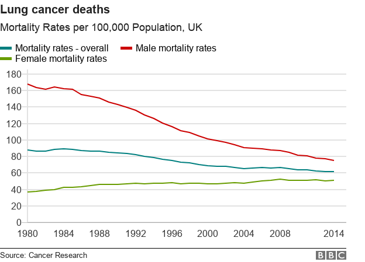

Lung cancer deaths have fallen by more than 20% since the early 1970s, almost entirely because fewer people smoke.

Unlike most cancers, five and 10-year survival rates for lung cancer have barely improved since the early 1970s.

Instead, falling deaths rates are down to fewer people getting the disease in the first place.

- [Smoking ban: 10 charts that show the impact](http://www.bbc.co.uk/news/health-40444460)

However, there are significant gender differences.

Between the early 1970s and the 1980s, smoking prevalence fell among men and increased among women, and this trend is now reflected in today's mortality rates.

While the death rate among men has fallen by more than half since 1980, it has actually increased among women, as more in their 60s and older are dying of lung cancer.

Recent NHS figures suggest that 80% of deaths from trachea, lung and bronchus cancer were attributed to smoking.

And the dramatic fall in the number of smokers is chiefly because of fewer people starting in the first place, rather than existing smokers quitting.

Smoking rates really started falling only with the deaths of those in the generation who became adults before public campaigning around the dangers of smoking gathered pace.

You can see this reflected in deaths from lung cancer now, as rates have significantly decreased overall but have increased in the over-80s, who are more likely to have smoked.