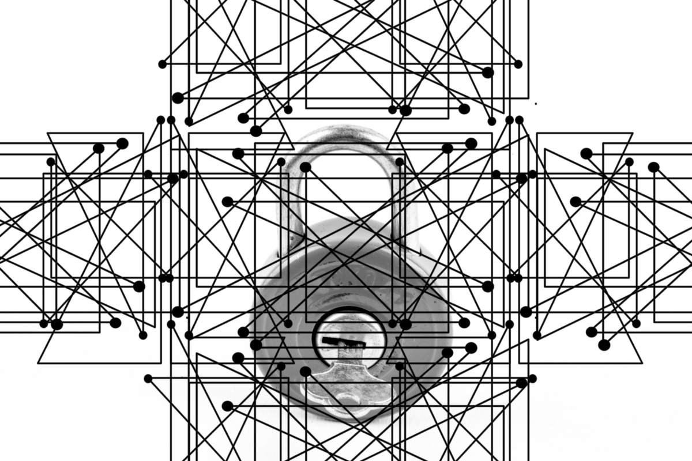

Encrypt your Machine Learning – corti.ai – Medium

# Encrypt your Machine Learning

##

We have a pretty good understanding of the application of machine learning and cryptography as a security concept, but when it comes to combining the two, things become a bit nebulous and we enter fairly untraveled wilderness. While Fully Homomorphic Encryption is nothing new, we have not seen any practical and efficient applications so far. Recently, we spent time looking into homomorphic encryption to evaluate if it is suitable for tackling some of our privacy and security related concerns.

In this article we will introduce Homomorphic and Fully Homomorphic Encryption and discuss its impact on model encryption and training.

### What is Homomorphic Encryption?

> A > [> homomorphism](https://en.wikipedia.org/wiki/Homomorphism)>  is a map between two algebraic structures of the same type, that preserves the operations of the structures.¹

This means for our case, an operation (here addition and multiplication) on the encrypted data (ciphertext) preserves the result on the plaintext. Let me explain this in a bit more detailwith another quote:

> [> Homomorphic encryption](https://en.wikipedia.org/wiki/Homomorphic_encryption)>  is a form of encryption that allows computations to be carried out on ciphertext, thus generating an encrypted result which, when decrypted, matches the result of operations performed on the plaintext.²

Let’s define out notation for message, ciphertext, encryption, and decryption:

Assuming homomorphism, we then get:

It might have been obvious to some of you, but it’s important here to mention another feature: Operations between clear texts and cipher texts are homomorphic as well:

The operation of the structures was preserved, despite the value being encrypted.

It is important to point out that c1 is as cryptographically secure as c2. This means even though we can do operations on the encrypted data, the resulting encrypted values are as secure as they were before.

A more realistic example: If the [RSA](https://en.wikipedia.org/wiki/RSA_cryptosystem) public key is **mod**  ***r ***and exponent ***e***, then the encryption of a message ***x ***is given by:

[Modular exponentiation](https://en.wikipedia.org/wiki/Modular_exponentiation)
The homomorphic property is then:

### Then there was noise…

When implementing a cryptographic algorithm, you have to consider various ways to attack the cipher. If you take a [deterministic encryption algorithm](https://en.wikipedia.org/wiki/Deterministic_algorithm) like RSA, you don’t have [semantic security](https://en.wikipedia.org/wiki/Semantic_security). Without semantic security, the algorithm is vulnerable to chosen-plaintext attacks:

> A > [> chosen-plaintext attack](https://en.wikipedia.org/wiki/Chosen-plaintext_attack)>  (CPA) is an attack model for cryptanalysis which presumes that the attacker can obtain the ciphertexts for arbitrary plaintexts.³

One way to protect against CPA is the introduction of a random component so that encrypting a message twice results in two different ciphers. RSA solves this by using complex padding mechanisms that additionally entail a random component. The problem is, this random component is also affected by the homomorphic nature of our algorithm. So if we add two ciphers together, we also add up the introduced random component. While we build algorithms to remove the random component in the decryption step, there is an upper limit of randomness after which we are unable to recover the message. We call the introduced randomness “noise” in homomorphic encryption.

If you consider the amount of operations involved in training a model or inferring data with an encrypted model, we quickly end up unable to decrypt the noise-polluted cypertext.

### Bootstrapping to the Rescue

The concept of bootstrapping describes a recrypt step in the algorithm during which we decrypt a previous encryption inside a new encryption. While you would think one needs to remove the outer encryption before decrypting the inside, bootstrapping allows for the more elegant decryption-inside-encryption. The benefit of doing a decryption is quite obvious: we are removing all existing noise in the cipher!

Recrypt encrypts the ciphertext with the new private key (pk2) and then removes the first encryption (pk1) in the evaluation step using the encrypted secret key (sk).

### Fully Homomorphic Encryption

> An encryption scheme is fully homomorphic when it is possible to perform implicit addition and multiplication of plaintexts while manipulating only ciphertexts.⁴

The algorithms available in the 80s and 90s were all limited in their homomorphic features. If they were homomorphic, they either did not support addition and multiplication, or the cryptographic restrictions made them unusable for fully homomorphic encryption.

> The holy grail of fully homomorphic encryption was finding a bootstrappable algorithm capable of simultaneous addition and multiplication.

Image from [Unsplash](https://unsplash.com/photos/BcjdbyKWquw) by [Kristina Flour](https://unsplash.com/@tinaflour)

Why is this enough you might ask? Imagine you want to encrypt binary plain text. Given two ciphers A,B, and addition and multiplication, we could compute the simple function 1+A*B. Keeping in mind that all arithmetic is binary (i.e., modulo 2), such a function produces the following truth table:

A B : 1+A*B
0 0 1+0*0 = 1
0 1 1+0*1 = 1
1 0 1+1*0 = 1
1 1 1+1*1 = 2 mod(2) = 0

If you haven’t guessed already, this is a big deal. What you see above is a [NAND](https://en.wikipedia.org/wiki/NAND_gate) gate, which is all we need to implement any Boolean function. With Boolean functions, we can do arbitrary computations. Such a system was proposed in 2009 by [Craig Gentry using lattice-based cryptography](https://www.cs.cmu.edu/~odonnell/hits09/gentry-homomorphic-encryption.pdf), and described the first plausible construction for a fully homomorphic encryption scheme.

### Why do you want to encrypt your model?

Image from [Unsplash](https://unsplash.com/photos/qlv-W7RVr2Y) by [Kristina Flour](https://unsplash.com/@tinaflour)

Assume your customers are unable to give you their data for privacy or security reasons. Which means, if you want to apply your models on their data, you have to bring the model to them. But if sharing your valuable model is impossible or you are limited by privacy concerns, encrypting your model might be an option. You can train your model, encrypt it, and send it to your customers. In order for the customer to actually use the prediction, you have to provide them with a decryption service.

### Homomorphic Encryption of a model

Encrypting a model is straightforward. In the following example I use the [Paillier](https://en.wikipedia.org/wiki/Paillier_cryptosystem) crypto system. The system is probabilistic, so it introduces some noise which we need to be aware of.

> The [Paillier] scheme is an additive homomorphic cryptosystem; this means that, given only the public-key and the encryption of x and y, one can compute the encryption of x+y.⁵

The scheme lacks the ability to compute the product of two ciphers without the private key and is thus not fully homomorphic, but is enough for us if we want to apply the model on data.

func (m *model) encrypt() {
for _, weight := range m.weights {
p := new(big.Int).SetInt64(weight)
c, err := **paillier.Encrypt**(&m.enc.PublicKey, p.Bytes())
m.encryptedWeights = append(m.encryptedWeights, c)
}
}

While the noise is not causing any issues in the encryption step, when we use the encrypted model to get a prediction, summing up the weights means summing up noise. Depending on the parameters we use in the key generation, we could end up with unusable values as a prediction. But for demonstration purposes, it is well suitable.

### Training with homomorphic encrypted data

With the amount of operations required to train a model, you need an algorithm that is bootstrappable. The introduced noise would overwhelm you in no time and render your model completely useless. Being bootstrappable means being able to remove noise using a recrypt step before it gets out of control. While we don’t have to do the whole recrypt process on every operation, a fully homomorphic system comes with huge computational overhead. Although the literature tends to be a bit vague or hard to compare,here are a couple of quotes in rough chronological order:

> The first fully homomorphic algorithm was incredibly slow, taking 100 trillion times as long to perform calculations of encrypted data than plaintext analysis.⁶

100 trillion? Okay, this isn’t even feasible for a calculator…

> IBM has sped things up considerably, making calculations on a 16-core server over two million times faster than past systems.⁷

While IBM’s numbers are a significant improvement over the initial implementation, their solution is still at least 50 million times slower than working with plain text.

> For the smallest parameter set, the time required for a homomorphic multiplication of ciphertexts was measured to be 3.461 milliseconds.

> For slightly larger parameters (~2x), homomorphic multiplication takes 8.509 milliseconds.⁸

Now we are getting somewhere. Or are we? 3.5 ms sounds pretty fast. Actually, it’s not. The average human reaction time is 215 ms. Addition on plaintext is a fraction of a nanosecond. A nanosecond is a millionth of a millisecond. And you might have noticed that the computational time is not linear with the parameter selection for the private key generation.

> Microsoft claims that its CryptoNet-based optical recognition system is capable of making 51,000 predictions per hour.⁹

This is an impressive number for an encrypted model, but we are only talking predictions, not training an encrypted model. And while an encrypted model is a possible solution to protect it, you still need to train it on raw data.

Computational requirements are not the only concern — we also have to consider the size of the encrypted data or model.

> In conclusion, the encrypted data is one to three orders of magnitude larger than the unencrypted data. The exact factor depends on what is considered a natural representation of the data in its raw form.⁹

While the increased size of an encrypted model might not have a considerable impact, an industry who’s value is based on large amounts of data might struggle if their training data needs to be homomorphically encrypted.

### Conclusion

If the last section left you with a bitter taste, don’t get me wrong, this is still an exciting topic. The advantages of encrypted models and training are also obvious enough to expect improvements. While practical application is still a bit of a question mark, there are some very good starting points. The basic concept works, we have decent [implementations](https://github.com/shaih/HElib), and even some [community efforts](https://github.com/OpenMined).

So did it solve our problems? We are not there yet, but homomorphic encryption is something we definitely keep on a sticky note.

#### Epilogue

If you don’t have a mathematical background, we recommend Green’s “Very casual introduction” to [Fully Homomorphic Encryption](https://blog.cryptographyengineering.com/2012/01/02/very-casual-introduction-to-fully/). If you are familiar with most concepts in this article, Gentry’s original paper “[Computing Arbitrary Functions of Encrypted Data](https://crypto.stanford.edu/craig/easy-fhe.pdf)” will serve you with plenty details.

If you happen to be interested in using [HELib](https://github.com/shaih/HElib) in Golang, you will find some help to get started with [helib-go](https://github.com/nikofil/helib-go).