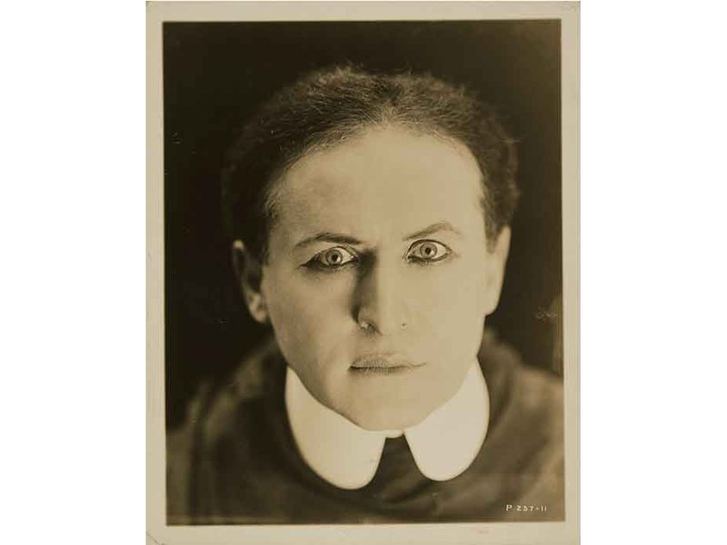
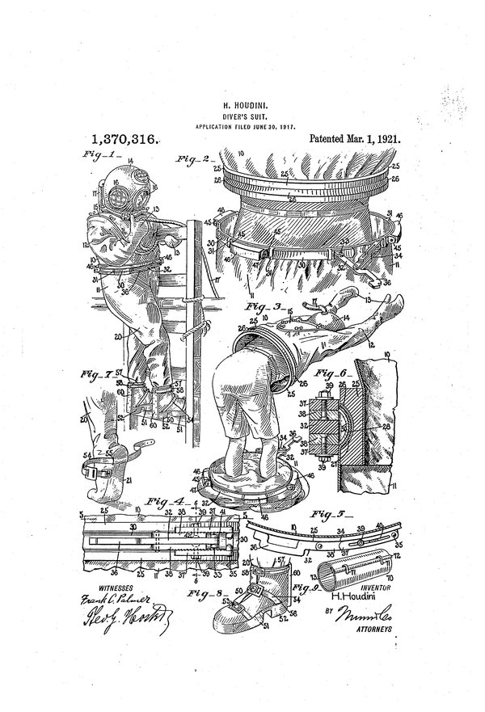
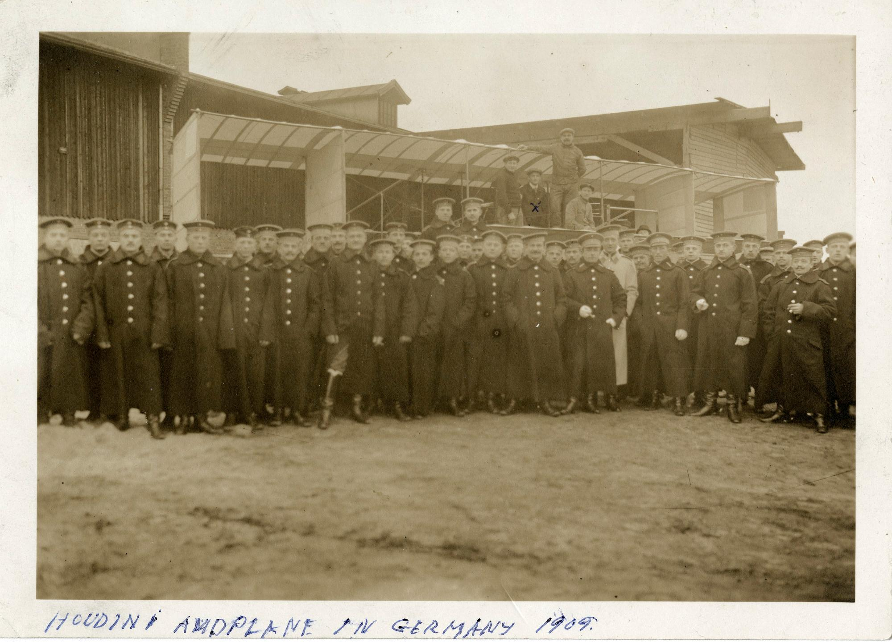
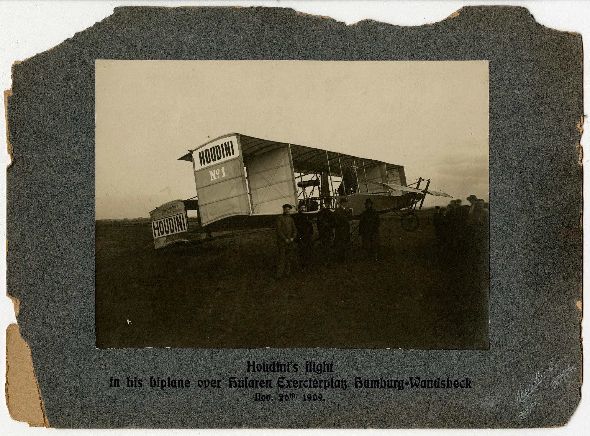
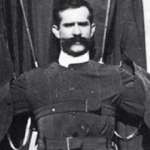
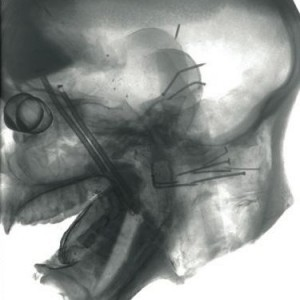
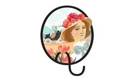
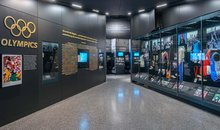

Escape Artist Harry Houdini Was an Ingenious Inventor, He Just Didn't Want Anybody to Know

# Escape Artist Harry Houdini Was an Ingenious Inventor, He Just Didn’t Want Anybody to Know

## More than just a magician, Houdini was also an actor, aviator, amateur historian and businessman

Harry Houdini by unknown artist, 1920 (National Portrait Gallery)

By [Jackson Landers](http://www.smithsonianmag.com/author/jackson-landers2/)

  smithsonian.com
   January 9, 2017

[**2.2K]()[**76]()[**9]()[**27]()[**45]()[**29]()[**3.4K]()
[**2.2K]()[**76]()[**27]()[**45]()[**9]()[**3.4K]()

It was January 27, 1908, at the Columbia Theater in St. Louis and Harry Houdini was about to [debut](http://www.wildabouthoudini.com/p/the-milk-can.html) his first theatrical performance. The great master of illusion stepped inside of an over-size milk can, sloshing gallons of water on to the stage. Houdini was about to do something that looked like a really bad idea.

The can had already been poked, prodded and turned upside down to prove to the audience that there was no hole beneath the stage. Houdini was handcuffed with his hands in front of him. His hair was parted down the middle and he wore a grave expression on his face. His blue [bathing suit](http://books.google.com/books?id=3r7-Ju4Cy30C&pg=PT163&lpg=PT163&dq=houdini+blue+bathing+suit+milkcan&source=bl&ots=VOGJaRyqX5&sig=4TMZKJ9BJOfIJ7FDOrC320LzXXE&hl=en&sa=X&ved=0ahUKEwj-3bma56vRAhVBRCYKHS5jAWIQ6AEINTAI#v=onepage&q=houdini%20blue%20bathing%20suit%20milkcan&f=false) revealed an exceptional physique. Holding his breath, he squeezed his entire body into the water-filled can as the lid was attached and locked from the outside with six padlocks. A cabinet was wheeled around the can to hide it from view.

Time ticked away as the audience waited for Harry Houdini to drown.

Two minutes later, a panting and dripping Houdini emerged from behind the cabinet. The can was still padlocked. During his lifetime, nobody ever managed to figure out how he had escaped.

Advertisement

Advertisement

[Secret Harry Houdini footage](https://www.youtube.com/watch?v=suirIT9F_MY)

Harry Houdini is most often remembered as an escape artist and a magician. He was also an actor, a pioneering aviator, an amateur historian and a businessman. Within each of these roles he was an innovator, and sometimes an inventor. But to protect his illusions, he largely avoided the patent process, kept secrets, copyrighted his tricks and otherwise concealed his inventive nature. A 1920 gelatin silver print by an unidentified artist[ resides](http://npg.si.edu/object/npg_NPG.2000.15?destination=portraits/search%3Fedan_q%3Dhoudini%26edan_local%3D1%26edan_fq%5B0%5D%3Dp.edanmdm.descriptivenonrepeating.unit_code%253A%2522NPG%2522%26incCAP%3Dfalse%26op%3DSearch) in collections of the Smithsonian's National Portrait Gallery. It depicts Houdini at his most theatrical, wearing makeup and facing the camera with a calculated mysterious gaze.

The great magician [Teller](https://en.wikipedia.org/wiki/Teller_(magician)), one half of the famous duo Penn and Teller, recently recalled how he discovered one of Houdini's inventions at a Los Angeles auction held by the late [Sid Radner](http://www.nytimes.com/2011/06/27/us/27radner.html), who amassed one of the largest collections of Houdini materials in the world.

“I got a big black wooden cross, which I thought wouldn't go for much at auction. . . I bought the thing thinking this was a good souvenir,” Teller told me in a telephone interview.

“After I had bought it, Sid came up and said, 'be careful you don't have kids around this thing.' I said, 'why not?' He said, 'you don't want them sticking their fingers in here.' It has holes where you lash a person to it and they try to escape. What I didn't realize is that it is an elaborate mechanism. With a simple movement of your foot, you could sever all of the ropes simultaneously.”

Houdini was born [Ehrich Weiss](http://www.biography.com/people/harry-houdini-40056) in 1874 in Budapest to Jewish parents, but raised in the United States from the age of four. He began performing magic tricks and escapes from handcuffs and locked trunks in vaudeville shows beginning in the 1890's.

“His name constantly comes up in popular culture any time someone does something sneaky or miraculous,” says John Cox, author of the well-regarded website *[Wild About Harry](http://www.wildabouthoudini.com/). *“His tricks are still amazing. Escaping from jail while stripped naked, that is still an incredible feat. His stories feel electric and contemporary. Even though he has been dead for 90 years.”

[Discovery Channel - Houdini (RARE)](https://www.youtube.com/watch?v=ItDbVyT85kw)

Escape acts derive from spiritualist history, says Teller. In the mid 19th-century, performers claimed to have connections with unseen spirits that could commune with the dead or work miracles. “In seances, mediums were typically restrained in some way. At least tied and sometimes chained or handcuffed,” he says. Houdini made no such supernatural claims.

“[The spiritualist performer] would escape to do their manifestations and get locked up again,” says Teller. “Houdini said, 'I'm just a clever guy getting out of stuff.' It was a major transformation.”

Harry Houdini was part of a generation admiring new types of heroes—inventors and daredevils. As America moved into the 20th century, automobiles, airplanes, wax cylinder rolls and moving pictures would capture the public's imagination. Technology and Yankee ingenuity were admired and inventors sought patents to protect their ideas.

But Houdini realized early in his career that filing for a patent required that a piece of technology be clearly illustrated and described for public record. The technology of a patent needs to be clearly explained so that other people can avoid infringing on it. As a magician, secrecy was part of his stock in trade. Houdini, the inventor, filed for only a handful of his inventions in the United States and abroad. His U. S. patents include [a toy Houdini](http://www.wildabouthoudini.com/2012/04/harry-houdini-toymaker.html) that escapes from a straitjacket and [a special diving suit](http://patentpending.blogs.com/patent_pending_blog/2006/04/harry_houdinis_.html), designed to allow the occupant to escape quickly in the event of danger.

According to Kenneth Silverman's book, *[Houdini!: The Career of Ehrich Weiss,](http://amzn.to/2i0gGYi)* in 1900 Houdini filed for a British patent on the handcuff act he was performing at the time. His application is listed as “abandoned.” Other creations were patented but never actually used. In 1912, he applied for German patents on a watertight chest that would be locked and placed inside of a larger water-filled chest that was also locked. His design was intended to allow him to remove himself from the nested boxes without getting wet or breaking the locks. This was never performed on stage. Nor was another German patent for a system of props that would allow him to be frozen inside of a giant block of ice.

Some of his most famous stunts were adaptations of other magicians' ideas. A British magician, [Charles Morritt](https://en.wikipedia.org/wiki/Charles_Morritt), had invented a trick for making a live donkey disappear on stage. Houdini paid Morritt for the global rights to the trick and found a way to make it bigger and better. He introduced it using an elephant.

 [**]()  [**]()

 

 

 

H. Houdini, diver's suit, June 30 1917 ([U.S. Pat. No. 1,370,316](http://bit.ly/2i0Kswh))

“We still don't know how he did the elephant trick,” says Cox. “That is magic. You take some old reliables and find a way to make it special. He would Houdini-ize these more common feats of magic. His mind was always innovating, always inventing.”

While hidden detaching panels and rope-slicing blades have been found in some of Houdini's surviving inventions, most of his secrets have remained just that—secrets. Even 90 years after his death on October 31, 1926 from complications of appendicitis, much is still unknown, says Teller.

“Although people have strong suspicions,” Teller says. “In a lot of cases Houdini would do whatever was necessary to make something happen. And what was necessary included some of the uglier things in magic. Like collusion or bribery. None of those were very heroic, but he would resort to those.”

“Basically there's the magicians code,” says Cox. “Which is not to ever reveal secrets. . .You talk around it. It's just honoring the magician's code. . . . Some people think that you shouldn't even say that there was a secret, even saying that it was tricked in some way is giving away a secret. . . I only learned the secret of the water torture cell probably in the last ten years or so.”

“It might be that when someone owns a piece of apparatus, they know how it works because they have the apparatus,” says Cox. “But Sidney Radler, who owned the water torture cell says that he lied about it throughout his life. It is nice to keep some of Houdini's secrets. Keeps it baffling.”

Eventually, Houdini found a backdoor way of protecting an act as intellectual property without patenting them. He copyrighted it.

[Houdini: The Master Mystery (1920) (Part 1 of 20)](https://www.youtube.com/watch?v=zipdW_YOM3g)

One of his best-known escapes is his “Chinese water torture cell.” Houdini had his ankles [locked](https://en.wikipedia.org/wiki/Chinese_Water_Torture_Cell#/media/File:Houdini_performing_Water_Torture_Cell.jpg) into a frame, from which he was dangled upside down over a tank of water. He was [lowered](https://www.youtube.com/watch?v=_Y2i3Z6mlXE) head first into the water and locked in place. To prevent anyone from copying the act, Silverman tells of how Houdini gave a single performance of the trick as a one-act play in England before an audience of one. This allowed him to [file](https://books.google.com/books?id=M6UiAQAAMAAJ&pg=PA672&lpg=PA672&dq=%22Houdini+Upside+Down%22+PLAY&source=bl&ots=WLWwtVm6fh&sig=Cj7OJKfDaww8BMmS6Whv-ZRUGVw&hl=en&sa=X&ved=0ahUKEwjDssaV76vRAhXJ5iYKHfiQCtcQ6AEIhwEwGQ#v=onepage&q=%22Houdini%20Upside%20Down%22%20PLAY&f=false) for a copyright on the act in August of 1911, which legally prevented imitations without explaining how the trick worked.

“I have in fact had a very close look at the water torture cell, which is shockingly small,” says Teller. “You picture it as this towering thing. But it was a compact, efficient thing. . . . It's a brilliant piece of mechanics.”

The number of people who actually saw Houdini, in person, escaping from the water torture cell was far smaller than the number of people around the world who revered him for it. Houdini was a master at drawing media coverage to his exploits.

“As an innovator, he's the guy who kind of figured out how to use the press,” says Teller. “When you think back, he's the first prominent person that you see doing co-promotions with corporations. If he's coming to your town and you are centered around the beer industry, he would talk to the brewery and arrange to escape from a giant beer keg or something.”

“He was obsessed with being at the cutting edge of everything,” says Teller. "While Houdini had emerged from the world of vaudeville, he was good at using new technology to maintain his celebrity status. . . . He knew that the cinema was the next big thing and tried to become a movie star. And he kind of did. There's a great deal of charm. He's acting quite naturalistically. . .”

In 1918, Houdini began work on his first major film project, [“The Master Mystery.”](https://www.youtube.com/watch?v=zipdW_YOM3g) The 15-part series has a complicated plot. An evil corporation entices inventors to sign contracts granting exclusive rights to market their inventions; but the company is secretly stifling those inventions in order to benefit the holders of existing patents. The film features what may be the first robotic villain ever to appear on camera. “Automaton,” a metallic robot with a human brain.

Harry Houdini's 1909 Voisin pusher biplane; man marked with a small "X" is presumably Houdini. (National Air and Space Museum Archives)

According to [Silverman](http://amzn.to/2hRD3fl), Houdini tried to take credit for building a real robot for the film, describing it as “a figure controlled by the Solinoid system, which is similar to the aerial torpedoes.” To modern eyes, this claim is absurd. The “robot” is obviously a human actor marching around in a costume.

Houdini himself was often an unreliable source about his own work. He unintentionally confused dates and places. Deliberately, he tended to exaggerate his exploits and inventions. Teller agreed that Houdini was “not terribly” reliable as a source for his own history.

“Although he had hopes of becoming an author and historian, his job was to be a show man and that's what he was,” says Teller. “He was very interested in the history of magic. . . He collected a lot of information but I wouldn't look to him as a historian because historians have standards.”

“No illusion is good in a film, as we simply resort to camera trix, and the deed is did,” Houdini [once said](https://books.google.com/books?id=3r7-Ju4Cy30C&pg=PT201&lpg=PT201&dq=%E2%80%9CNo+illusion+is+good+in+a+film,+as+we+simply+resort+to+camera+trix,+and+the+deed+is+did,%E2%80%9D&source=bl&ots=VOGJ9Tyi-_&sig=L5AtTN3EXFjDjpMkMWLcSMPI6iA&hl=en&sa=X&ved=0ahUKEwjOn-SpuqnRAhVKeyYKHSzfB5oQ6AEIHDAA#v=onepage&q=%E2%80%9CNo%20illusion%20is%20good%20in%20a%20film%2C%20as%20we%20simply%20resort%20to%20camera%20trix%2C%20and%20the%20deed%20is%20did%2C%E2%80%9D&f=false). While the new technology of cinematography helped Houdini to reach a wider audience, it may have ultimately helped to end the phenomenon of professional escape artists. On camera, anyone can be made to look like an escape artist. Special effects can make anything seem real.

At the same time that moving pictures were capturing the public's imagination, aviation was doing the same thing. The Wright Brothers had proven that flight was possible. A collection of daring, clever and wealthy people throughout the world began buying or building airplanes of their own and racing to set new aviation records. The highest flight, the longest flight, the first along a particular route. Houdini decided to join in. He bought a [Voisin biplane](https://www.google.com/url?sa=t&rct=j&q=&esrc=s&source=web&cd=1&cad=rja&uact=8&ved=0ahUKEwjGtPWjw6HQAhXM54MKHQofDNUQFggdMAA&url=https%3A%2F%2Fen.wikipedia.org%2Fwiki%2FVoisin_1907_biplane&usg=AFQjCNFi2uYejp9ierIefKKoVtPDSHdGCQ&sig2=imw5OzV29PAN2W42zlf0ew) in Europe for $5,000, equipped with bicycle wheels and a rear-mounted propeller. He also took out what he claimed to be the world's first life insurance policy for an airplane accident. With his dismantled plane, spare parts and insurance, Houdini departed for a tour to perform in Australia where he [became](http://www.airspacemag.com/history-of-flight/the-hunt-for-houdinis-airplane-8082655/?webSyncID=45a232e9-867b-c68e-9724-0182c7944788&sessionGUID=dc142467-3c98-1e69-5591-3d63886c98c2) the first person to fly an airplane on the Australian continent.

Within a few years, Houdini lost his interest in flight and sold the plane. Airplanes had become common. He had stopped performing simple handcuff escapes because there were too many imitators. Houdini couldn't stand to do anything that everyone else was doing.

Houdini's flight in his biplane, Hufaren Exercierplatz, Hamburg-Wandsbeck, November 26th 1909 (National Air and Space Museum Archives)

Perhaps part of Houdini's appeal came from the fact that he lived in an age when America was full of recent immigrants who were all trying to escape from something. Literally throwing off a set of shackles was a powerful statement in the early 20th century.

“I think there's the big-picture psychological reason, which is that everybody was an immigrant and everyone was fleeing from the chains of oppression in another country,” says Teller. “The idea was you could be a tough little immigrant and no matter how hard the big guys came down on you, like the police or the big company in your town, he would take the symbol of authority and defy it in the act of self-liberation. . . and the idea of self liberation has more appeal to people than mere escape.”

In addition to literal shackles, Houdini wanted his audiences to throw off the shackles of superstition and belief in 'real' magic. He was an important philosophical influence on [the skeptical movement](https://en.wikipedia.org/wiki/Skeptical_movement), which is best known through modern scientists such as Richard Dawkins and Bill Nye. Penn and Teller are also among today's most prominent rational skeptics.

“Houdini was the outstanding exponent of the idea that magicians are uniquely qualified to detect fraud and uniquely qualified to be skeptics,” says Teller. “We're not the first ones to do this. The [Amazing Randi](http://web.randi.org/about-james-randi.html) is someone of considerable powers who focused on the skeptical angle. When you are a professional magician, you want to see your art respected for what it is, not misused to mislead people about the universe.”

Advertisement

Like this article? SIGN UP for our newsletter

###### About Jackson Landers

 

Jackson Landers is an author, science writer and adventurer based out of Charlottesville, Virginia, specializing in wildlife out of place. His most recent book, *[Eating Aliens](http://www.amazon.com/dp/161212027X/ref=cm_sw_su_dp),* chronicles a year and a half spent hunting and fishing for invasive species and finding out whether we can eat our way out of some ecological disasters.

[Read more from this author](http://www.smithsonianmag.com/author/jackson-landers2/)| [Follow @JacksonJLanders](https://twitter.com/JacksonJLanders)

##### Tags

 [Inventions](http://www.smithsonianmag.com/tag/inventions/)  [Patents](http://www.smithsonianmag.com/tag/patents/)

[**2.2K]()[**76]()[**9]()[**27]()[**45]()[**29]()[**3.4K]()
[**2.2K]()[**76]()[**27]()[**45]()[**9]()[**3.4K]()

Advertisement

Around The WebSponsored By ZergNet

[20 Inventors That Were Killed By Their Own Inventions](http://www.zergnet.com/i/1493906/49076/0/0/137470027)

[25 Hidden Features You Didn't Know Your iPhone Had](http://www.zergnet.com/i/866208/49076/0/0/137470027)

[The Real Reason Why Cats Purr](http://www.zergnet.com/i/1503563/49076/0/0/137470027)

[10 Pieces of Technology That Just Won't Die](http://www.zergnet.com/i/1541852/49076/0/0/137470027)

[Mannequin Head In A Museum Turns Out To Be Real](http://www.zergnet.com/i/1474829/49076/0/0/137470027)

[7 Reasons You Should Quit Facebook in 2017](http://www.zergnet.com/i/1426441/49076/0/0/137470027)

 [          ###### Previous Article](http://www.smithsonianmag.com/smithsonian-institution/why-electric-cars-once-advertised-ladies-cars-180961440/)  [          ###### Next Article](http://www.smithsonianmag.com/smithsonian-institution/new-african-american-history-museum-new-african-american-history-museum-goal-posts-prove-higher-sports-champions-180961735/)

## Comment on this Story