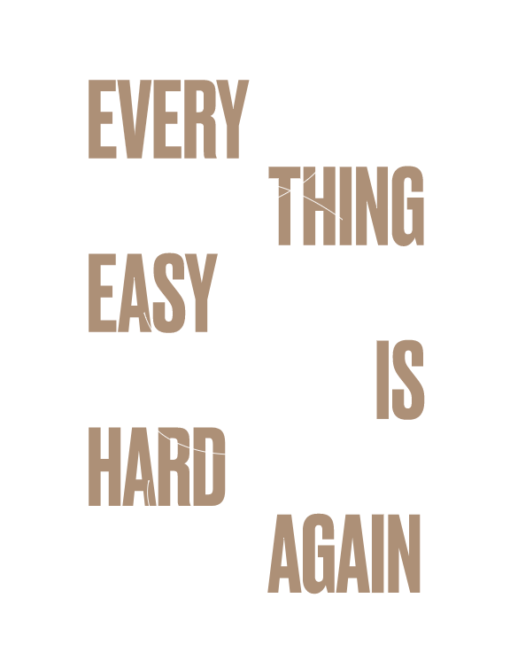
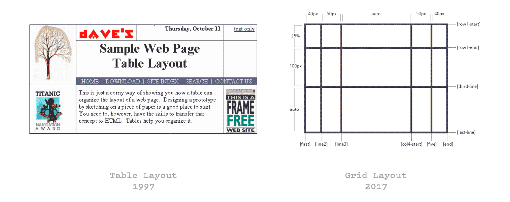
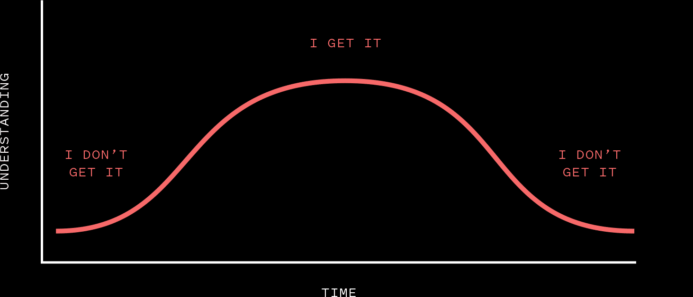

Everything Easy is Hard Again

# Everything Easy is Hard Again

This talk was given on October 12, 2017 at [Mirror Conf](https://mirrorconf.com/) in Braga, Portugal, and again on February 9, 2018 at the [Awwwards Conference](https://conference.awwwards.com/berlin/) in Berlin.

This past summer, I gave a lecture at a web conference and afterward got into a fascinating conversation with a young digital design student. It was fun to compare where we were in our careers. I had fifteen years of experience designing for web clients, she had one year, and yet some how, we were in the same situation: we enjoyed the work, but were utterly confused and overwhelmed by the rapidly increasing complexity of it all. What the hell happened? (That’s a rhetorical question, of course.)

It was a relief for both of us to mutually confess our frustration and confusion, and I began to wonder if this situation was something to laugh off or take seriously. Neither of us had an answer, but a bit of time and distance has shown me that we must do both. I’d like to extend that conversation today and attempt to capture my perspective on that confusion and what it costs us.

Absence was the primary source of my confusion. Three years ago, I stopped making websites for clients to focus on [Abstract](http://goabstract.com/), a software company I co-founded. My work there finished at the beginning of last year, and after a little time off, I decided to reopen the design studio I was running beforehand.

And wouldn’t you know it? The first few jobs through the door were websites. A lot can change in three years, so I decided to brush up on the latest developments in how to best make websites… and oh my…

Things have gotten messy, haven’t they?

* * *

The complexity was off-putting at first. I was unsure if I even wanted tackle a website after seeing the current working methods. Eventually, I agreed to the projects. My gut told me that a lot of the new complexities in workflows, toolchains, and development methods are completely optional for many projects. That belief is the second thread of this talk: I’d like to make a modest defense of simple design and implementation as a better option for the web and the people who work there.

But, I am getting ahead of myself. First, I should tell you a bit more about who I am and where I come from.

I run a boutique design studio, which is a pretentious way of saying that it’s tiny with a capital-T. The studio does all kinds of work: books, magazines, branding, and yes, of course, websites. This year is an anniversary. The studio is celebrating 15 years in business, and I’m personally celebrating 20 years of making websites. As with any big anniversary, you get sentimental about how things started.

The studio began in 2002 as a man (that’s me) with a laptop and a stack of paper at a desk in the corner of his apartment.

Fifteen years later, the studio is still a man with a laptop and a stack of paper at a desk in the corner of his apartment.

It’s difficult to fathom how much has changed around the studio in the last 15 years. Back then, there were no social media as we know of them today—no Facebook, no Instagram, no snaps; most of the sites you visit today did not exist back then, and most of the sites we visited then do not exist now. There were no iPhones. You would go online to fetch directions and print out the map like a neanderthal. We were hitting rocks together trying to make graphic design.

Everything is different now, but I am still at my desk.

* * *

At first I was bummed about my studio’s lack of visible progress, but then it hit me: what if I nailed it? Why change if it’s working? I’ve been able to approach a lot of different projects from many different angles, and I’m happy to report that I’ve gotten pretty good at a lot of it! Time and practice really do help.

Except with the websites. They separate themselves from the others, because I don’t feel much better at making them after 20 years. My knowledge and skills develop a bit, then things change, and half of what I know becomes dead weight. This hardly happens with any of the other work I do.

I wonder if I have twenty years of experience making websites, or if it is really five years of experience, repeated four times. If you’ve been working in the technology industry a while, please tell me this sounds familiar to you.

Let me give you an example of these five year cycles.

As I said, I made my first website 20 years ago. I know this because I was a teenager doing the Lord’s work: transcribing the lyrics to Radiohead’s *OK Computer*. It was 1997, I was learning HTML, and there was one problem with the design that was confusing me:

# How do I put two things next to each other?

Twenty years later, we’re still working out the answer to that very basic question.

<table>
  <tr>
    <td>Hi</td>
    <td>Mom</td>
  </tr>
</table>

Back in 1997, we used tables and spacer gifs. It was like designing a website in a spreadsheet from hell. I found this process fun for some reason. Perhaps I was fascinated by the potential of bashing together something in my room, hitting a button, then having it be “out there.”

{ float: left; }

About five years later, websites moved to using floats in CSS because tables were not semantic. Fair enough! Since then, I’ve spent about 200 hours reading about how to get floats to clear. I’m still not sure I understand it; I type `clear: both` and say a prayer to the box model.

{ display: flex; }

I was saved by Flexbox after five years of guess work. It is my baby. I was trained as a print designer, and with flexbox, I can type 3 or 4 lines of CSS, and have two blocks of text line up at the baseline. Hallelujah. I only needed to wait a decade to get this.

{ display: grid; }

And now, after flexing with flexbox, along comes CSS Grid: a powerful new feature that promises to make responsive web design even more confusing. Of course, I am joking about this, because Grid is a big improvement in controlling layout on the web. But it is a bit spooky to sit down and learn more about it, because every time I see a diagram explaining how CSS Grid works...

I’m reminded of the table layouts I was doing in 1997. There’s a voice in the back of my head saying we’re stuck in a loop and it’s repeating. We’ve completed a lap on a cycle which will go around forever. Another approach for layout will come along five years from now, it will probably resemble floats, and not knowing how to clear a float will bite me in the ass for the second time in my career.

There are similar examples of the cycle in other parts of how websites get designed and made. Nothing stays settled, so of course a person with one year of experience and one with fifteen years of experience can both be confused. Things are so often only understood by those who are well-positioned in the middle of the current wave of thought. If you’re before the sweet spot in the wave, your inexperience means you know nothing. If you are after, you will know lots of things that aren’t applicable to that particular way of doing things. I don’t bring this up to imply that the young are dumb or that the inexperienced are inept—of course they’re not. But remember: if you stick around in the industry long enough, you’ll get to feel all three situations.

One argument says that continual change in methodology is rigorous and healthy. I agree. Keeping things in play helps us to more easily fix what’s wrong. It’d be terrible if nothing could ever change. But I also agree with the other argument: people only have so much patience. How many laps around the cycle can a person run? I’m on lap five now, and I can tell you that it is exhausting to engage with rehashed ideas from the past without feeling a tiny amount of prejudice against them.

Methods that were once taboo are back on the table. For instance, last week I was reading a post about the benefits of not using stylesheets and instead having inline styles for everything. The post made a few compelling points, but this approach would have been crazy talk a few years ago.

So much of how we build websites and software comes down to how we think. The churn of tools, methods, and abstractions also signify the replacement of ideology. A person must usually think in a way similar to the people who created the tools to successfully use them. It’s not as simple as putting down a screwdriver and picking up a wrench. A person needs to revise their whole frame of thinking; they must change their mind.

In one way, it is easier to be inexperienced: you don’t have to learn what is no longer relevant. Experience, on the other hand, creates two distinct struggles: the first is to identify and unlearn what is no longer necessary (that’s work, too). The second is to remain open-minded, patient, and willing to engage with what’s new, even if it resembles a new take on something you decided against a long time ago.

That spirit of willingness was in me when I was investigating everything that had changed in the last 3 years. I started with the best of intentions, but the more I learned, the grumpier I got. It seemed that most of the new methods involved setting up elaborate systems to automate parts of the work. This is fine for particularly complicated and large projects, but setting up the system and maintaining it seemed to be more effort for an experienced person on a small project than doing the work without it.

The new methods were invented to manage a level of complexity that is completely foreign to me and my work. It was easy to back away from most of this new stuff when I realized I have alternate ways of managing complexity. Instead of changing my tools or workflow, I change my design. It’s like designing a house so it’s easy to build, instead of setting up cranes typically used for skyscrapers.

* * *

Directness is best in my experience, so a great photo, memorable illustration, or pitch-perfect sentence does most of the work. Beyond that, fancy implementation has never moved the needle much for my clients.

My web design philosophy is no razzle-dazzle. My job is to help my clients identify and express the one or two uniquely true things about their project or company, then enhance it through a memorable design with a light touch. If complexity comes along, we focus in on it, look for patterns, and change the blueprint for what we’re building. We don’t necessarily go looking for better tools or fancier processes. In the past, I’ve called this following the [grain of the web](https://frankchimero.com/writing/the-webs-grain/), which is to use design choices that swing with what HTML, CSS, and screens make easy, flexible, and resilient.

It seems there are fewer and fewer notable websites built with this approach each year. So, I thought it would be useful remind everyone that the easiest and cheapest strategy for dealing with complexity is not to invent something to manage it, but to avoid the complexity altogether with a more clever plan.

To test how much complexity comes along with my limited needs, I wrote down the technical requirements of my web design practice. It’s not a long list:

## simple, responsive layout

web fonts and nicely set text
performant, scalable images

All of these have been more than met for at least five years, but the complexity of even these very fundamental needs has ballooned in the last few years.

For instance, I just showed you four different methods to put two things next to each other. Each new method mostly replaces the last, so hopefully we’re reaching a stabilization point with flexbox and CSS Grid. But who knows what will come out five years from now?

Webfonts? I thought we could jot down a few lines with `@font-face`, but [A Book Apart](https://abookapart.com/products/webfont-handbook) just published a 90 page e-book on how to load those fonts. This is totally surprising to me: I thought implementing webfonts was a relatively easy procedure, but I guess not!

Even images are now complicated. Vector images get served as SVGs, but digging deep into this can make you go cross-eyed, because an SVG is essentially another web page to embed in your webpage. And with raster, the need to send along the best-sized image for the right device is complicated enough that [paid services](https://imgix.com/) have come along to manage this for you. Serving an image is now as complicated as serving a video.

* * *

My point is that the foundations are now sufficiently complicated enough on their own that it seems foolish to go add more optional complexity on top of it. I’ve kept my examples to the most basic of web implementations, and I haven’t touched on Javascript, animation, libraries, frameworks, pre-processors, package managers, automation, testing, or deployment. Whew.

# simply npm your webpack via grunt with vue babel or bower to react asdfjkl;lkdhgxdlciuhw

All of that bundled together is the popular way to work in 2018. But other people’s toolchains are absolutely inscrutable from the outside. Even getting started is touchy. Last month, I had to install a package manager to install a package manager. That’s when I closed my laptop and slowly backed away from it. We’re a long way from the CSS Zen Garden where I started.

If you go talk to a senior software developer, you’ll probably hear them complain about spaghetti code. This is when code is overwrought, unorganized, opaque, and snarled with dependencies. I perked up when I heard the term used for the first time, because, while I can’t identify spaghetti code as a designer, I sure as hell know about spaghetti workflows and spaghetti toolchains. It feels like we’re there now on the web.

That breaks my heart, because so much of my start on the web came from being able to see and easily make sense of any site I’d visit. I had view source, but each year that goes by, it becomes less and less helpful as a way to investigate other people’s work. Markup balloons in size and becomes illegible because computers are generating it without an eye for context. Styles become overly verbose and redundant to the point of confusion. Functionality gets obfuscated behind compressed Javascript.

This situation is annoying to me, because my thoughts turn to that young designer I mentioned at the start of my talk. How many opportunities did I have to reproduce what I saw by having legible examples in front of me? And how detrimental is it to have that kind of information obfuscated for her? Before, the websites could explain themselves; now, someone needs to walk you through it.

Illegibility comes from complexity without clarity. I believe that the legibility of the source is one of the most important properties of the web. It’s the main thing that keeps the door open to independent, unmediated contributions to the network. If you can write markup, you don’t need Medium or Twitter or Instagram (though they’re nice to have). And the best way to help someone *write* markup is to make sure they can *read* markup.

I wonder what young designers think of this situation and how they are educating themselves in a complicated field. How do they learn if the code is illegible? Does it seem like more experienced people are pulling up the ladder of opportunity by doing this? Twenty years ago, I decided to make my own website, because I saw an example of HTML and I could read it. Many of my design peers are the same. We possess skills to make websites, but we stopped there. We stuck with markup and never progressed into full-on programming, because we were only willing to go as far as things were legible.

If knowledge about the web deteriorates quickly, it’s worthwhile to develop a solid personal philosophy toward change and learning.

Silicon Valley has tried to provide a few of these. All are about speed. The most famous comes from Facebook, with their “Move fast and break things” mantra. This phrase has been thrown under the bus enough times by now, but it is interesting that so few are willing to commit to its opposite: “Go slow and fix things.”

Let me show you a video about speed.

This has been my favorite internet discovery of the last few months. I’ve watched it enough times to overthink it. See, the rabbit doesn’t lose because he gets tired. He loses because he gets confused about which direction to go. Did you notice how it stops in the middle and stares blankly as everyone around it yells loudly about things it doesn’t understand? That’s me on Twitter.

As someone who has decades of experience on the web, I hate to compare myself to the tortoise, but hey, if it fits, it fits. Let’s be more like that tortoise: diligent, direct, and purposeful. The web needs pockets of slowness and thoughtfulness as its reach and power continues to increase. What we depend upon must be properly built and intelligently formed. We need to create space for complexity’s important sibling: nuance. Spaces without nuance tend to gravitate towards stupidity. And as an American, I can tell you, there are no limits to the amount of damage that can be inflicted by that dangerous cocktail of fast-moving-stupid.

The web also needs diligent people so that the idea of what the web is and what it does remains legible to everyone. This applies to being able to read the systems and social environments the web creates so we know what’s real and what’s not, but the call for legibility should also humbly apply to writing legible code and designs systems that are easy for nearly anyone to interpret thanks to their elegance. That important work has a place, too.

It’s by keeping our work legible that we keep the door open to the next generation of our co-workers. What works for them also works for us, because whether you are just out of school or have twenty years of experience, you’ll eventually end up in the same spot: your first year of making websites.