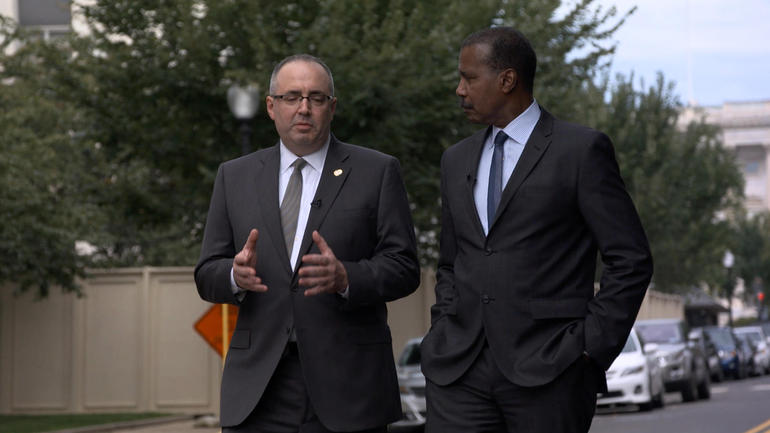
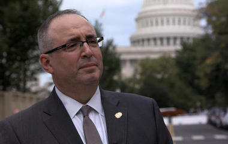
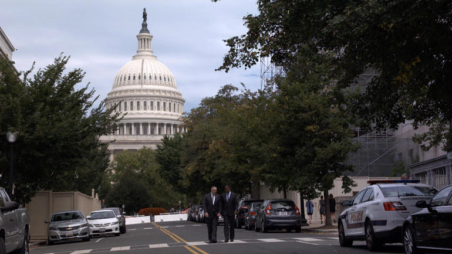
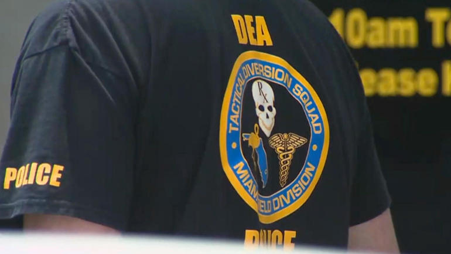
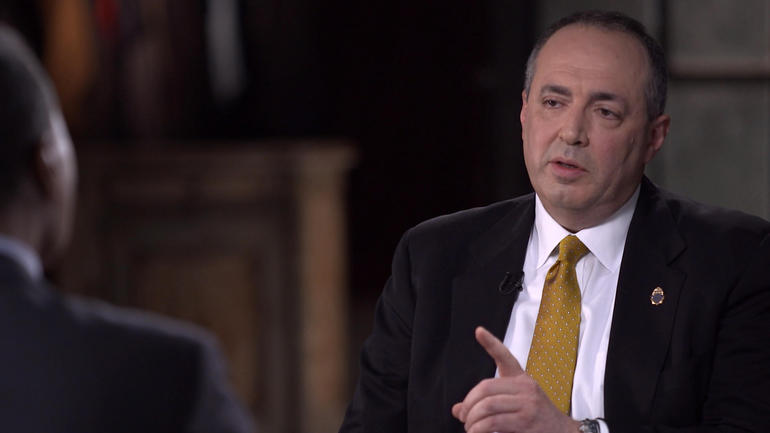

Ex-DEA agent: Opioid crisis fueled by drug industry and Congress

# Ex-DEA agent: Opioid crisis fueled by drug industry and Congress

Whistleblower Joe Rannazzisi says drug distributors pumped opioids into U.S. communities -- knowing that people were dying -- and says industry lobbyists and Congress derailed the DEA's efforts to stop it

- 2017  Oct 15

- Correspondent  Bill Whitaker

- Comments  [  744](https://www.cbsnews.com/news/ex-dea-agent-opioid-crisis-fueled-by-drug-industry-and-congress/#comments)

- Facebook  [(L)](https://www.cbsnews.com/news/ex-dea-agent-opioid-crisis-fueled-by-drug-industry-and-congress/#)

- Twitter  [(L)](https://www.cbsnews.com/news/ex-dea-agent-opioid-crisis-fueled-by-drug-industry-and-congress/#)

- Stumble  [(L)](https://www.cbsnews.com/news/ex-dea-agent-opioid-crisis-fueled-by-drug-industry-and-congress/#)

.

Last Updated Oct 17, 2017 10:12 AM EDT

*Update: President Trump *[*announced Tuesday*](https://www.cbsnews.com/news/tom-marino-out-trump-drug-czar-nominee-60-minutes-report-live-updates/)* that his nominee for drug czar, Rep. Tom Marino, has withdrawn his name from consideration for the position.*

In the midst of the worst drug epidemic in American history, the U.S. Drug Enforcement Administration's ability to keep addictive opioids off U.S. streets was derailed -- that according to Joe Rannazzisi, one of the most important whistleblowers ever interviewed by 60 Minutes. Rannazzisi ran the DEA's Office of Diversion Control, the division that regulates and investigates the pharmaceutical industry. Now in a joint investigation by 60 Minutes and [The Washington Post](https://www.washingtonpost.com/graphics/2017/investigations/dea-drug-industry-congress/?hpid=hp_hp-banner-main_deanarrative-hed%3Ahomepage%2Fstory&utm_term=.e1b07e33df0e), Rannazzisi tells the inside story of how, he says, the opioid crisis was allowed to spread -- aided by Congress, lobbyists, and a drug distribution industry that shipped, almost unchecked, hundreds of millions of pills to rogue pharmacies and pain clinics providing the rocket fuel for a crisis that, over the last two decades, has claimed 200,000 lives.

Ex-DEA agent Joe Rannazzisi and 60 Minutes correspondent Bill Whitaker
/ CBS News

JOE RANNAZZISI: This is an industry that's out of control. What they wanna do, is do what they wanna do, and not worry about what the law is. And if they don't follow the law in drug supply, people die. That's just it. People die.

#### **"This is an industry that allowed millions and millions of drugs to go into bad pharmacies and doctors' offices, that distributed them out to people who had no legitimate need for those drugs."**

Joe Rannazzisi is a tough, blunt former DEA deputy assistant administrator with a law degree, a pharmacy degree and a smoldering rage at the unrelenting death toll from opioids.  His greatest ire is reserved for the distributors -- some of them multibillion dollar, Fortune 500 companies. They are the middlemen that ship the pain pills from manufacturers, like Purdue Pharma and Johnson & Johnson to drug stores all over the country. Rannazzisi accuses the distributors of fueling the opioid epidemic by turning a blind eye to pain pills being diverted to illicit use.

 [      60 Minutes Overtime   ### Meet 60 Minutes' DEA whistleblower](https://www.cbsnews.com/videos/meet-60-minutes-dea-whistleblower)

JOE RANNAZZISI: This is an industry that allowed millions and millions of drugs to go into bad pharmacies and doctors' offices, that distributed them out to people who had no legitimate need for those drugs.

BILL WHITAKER: Who are these distributors?

JOE RANNAZZISI: The three largest distributors are Cardinal Health, McKesson, and AmerisourceBergen. They control probably 85 or 90 percent of the drugs going downstream.

Rannazzisi accuses distributors of fueling the opioid epidemic by turning a blind eye to pain pills being diverted to illicit use.

/ CBS News

BILL WHITAKER: You know the implication of what you're saying, that these big companies knew that they were pumping drugs into American communities that were killing people.

JOE RANNAZZISI: That's not an implication, that's a fact. That's exactly what they did.

In the late 1990s, opioids like oxycodone and hydrocodone became a routine medical treatment for chronic pain. Drug companies assured doctors and congressional investigators -- as in this 2001 hearing -- that the pain medications were effective and safe.

*Purdue Executive to Congress in 2001: Addiction is not common, addiction is rare in the pain patient who is properly managed.*

With many doctors convinced the drugs posed few risks, prescriptions skyrocketed and so did addiction.

Ex-DEA agent Joe Rannazzisi and 60 Minutes correspondent Bill Whitaker
/ CBS News

Many people who'd become addicted to painkillers turned to shady pill mills -- pain clinics with rogue doctors to write fraudulent prescriptions and complicit pharmacists to fill them -- one-stop shopping for controlled narcotics.

JOE RANNAZZISI: Pain clinics overnight popping-up – off an entrance ramp, or an exit ramp on an interstate. And all of a sudden there's a pain clinic there.

BILL WHITAKER: Had you ever seen anything like that before?

JOE RANNAZZISI: Never. In fact-- it was my opinion that this made the whole crack epidemic look like nothing.

JOE RANNAZZISI These weren't kids slinging crack on the corner. These were professionals who were doing it. They were just drug dealers in lab coats.

BILL WHITAKER: You know what a chilling picture that paints?

JOE RANNAZZISI: I do, 'cause I watched them get arrested, and I was the one who approved the cases.

Despite arrests of unscrupulous purveyors, opioids kept flooding the black market.  The death toll kept rising. This map shows the U.S. death rate from drug overdose in 1999. By 2015, the map looked like this. Most of these deaths were opioid related. Joe Rannazzisi told us prosecuting crooked doctors and pharmacists wasn't stemming the epidemic, so he decided to move up the food chain.

JOE RANNAZZISI: There had to be a choke point. And the choke point was the distributors.

BILL WHITAKER: What took you so long to go to that choke point of the distributors?

JOE RANNAZZISI: This was all new to us. We weren't seeing just some security violations, and a few bad orders. We were seeing hundreds of bad orders that involved millions and millions of tablets. That's when we started going after the distributors.

Ex-DEA agent Joe Rannazzisi
/ CBS News

A distributor's representative told us the problem is not distributors but doctors who overprescribe pain medication, but the distributors know exactly how many pills go to every drug store they supply.  And they are required under the Controlled Substances Act to report and stop what the DEA calls "suspicious orders" -- such as unusually large or frequent shipments of opioids. But DEA investigators say many distributors ignored that requirement.

JIM GELDHOF: They had a business plan. Their plan was to sell a lotta pills and make a lot of money. And they did both of those very well.

#### **"All we were looking for is a good-faith effort by these companies to do the right thing. And there was no good-faith effort. Greed always trumped compliance. It did every time."**

Jim Geldhof, a 40-year DEA veteran, ran pharmaceutical investigations from dea's detroit field office. Frank Younker supervised the agency's operations in Cincinnati.  Joe Rannazzisi was their supervisor. They saw distributors shipping thousands of suspicious orders. One example: a pharmacy in Kermit, West Virginia, a town of just 392 people, ordered nine million hydrocodone pills over two years.

JIM GELDHOF: All we were looking for is a good-faith effort by these companies to do the right thing. And there was no good-faith effort. Greed always trumped compliance. It did every time. But don't sit here and tell me that, "Well, we're not sure what a suspicious order is." Really? I mean this-- this co-- this pharmacy just bought 50 times an amount that a normal pharmacy purchases and they are in a town of 5,000 people.  You don't know that that's suspicious? I mean at some point you're just turning a blind eye to it.

BILL WHITAKER: These companies are a big reason for this epidemic?
JIM GELDHOF: Yeah, absolutely they are.

JIM GELDHOF: And I can tell you with 100 percent accuracy that we were in there on multiple occasions trying to get them to change their behavior. And they just flat out ignored us.

In 2008, the DEA slapped McKesson, the country's largest drug distributor, with a $13.2 million dollar fine. That same year, Cardinal Health paid a $34 million fine. Both companies were penalized by the DEA for filling hundreds of suspicious orders -- millions of pills.

Over the last seven years, distributors' fines have totaled more than $341 million. The companies cried foul and complained to Congress that DEA regulations were vague and the agency was treating them like a foreign drug cartel.  In a letter, the healthcare distribution alliance, which represents distributors, told us they wanted to work with the DEA. Effective enforcement, they wrote, "must be a two-way street."

BILL WHITAKER: Frank, you said you were tough but fair. The industry says you guys were unfair. That you were taking unfair hits at them.

FRANK YOUNKER: Tell that to the people who lost their sons and daughters. See how fair they** **think it is.

In 2011, more than 17,000 Americans died from opioid prescription overdoses.  That same year Cardinal Health, the second largest distributor, started pushing back at Joe Rannazzisi.  The companies' attorneys went over his head and called his bosses at the Justice Department, who called in Rannazzisi to have him explain his tactics. ** **

JOE RANNAZZISI: And it in-- infuriated me that I was over there, trying to explain what my motives were or why I was going after these corporations? And when I went back to the office, and I sat down with my staff, I basically said, "You know, I just got questioned on why we're doing-- why we're doing what we're doing. This is-- this-- this is-- now this is war. We're going after these people and we're not going to stop.

BILL WHITAKER: Do you really think you were getting this pushback because you were going after big companies, Fortune 500 companies?

JOE RANNAZZISI: I have no doubt in my mind.  So the question is, why would it be any different for these companies as compared to the small mom-and-pops that we had done hundreds of times before.

BILL WHITAKER: What's the difference?

JOE RANNAZZISI: The difference is, is they have a lot of money, and a lot of influence. And that's the difference.

Rannazzisi says the drug industry used that money and influence to pressure top lawyers at the DEA to take a softer approach.  Former DEA attorney Jonathan Novak said it divided the litigation office. He said in 2013, he noticed a sea change in the way prosecutions of big distributors were handled. Cases his supervisors once would have easily approved, now weren't good enough.

JONATHAN NOVAK: We had been achieving incredible success in an almost unstoppable wave, and then suddenly it stopped.

Novak prosecuted cases brought to him by Joe Rannazzisi's investigators. He said his caseload started to slow down dramatically.

JONATHAN NOVAK: These were not cases where it was black -- where it was grey... These were cases where the evidence was crystal clear that there was wrongdoing going on.

He said his bosses started to bog down the system, demanding ever more evidence.

JONATHAN NOVAK: But now, three undercovers by four officers over three months, that wouldn't be enough. Maybe we need an expert to explain how recording equipment works. Maybe we need an expert to explain-- the system for prescribing. What's a prescription? It felt honestly confusing and almost insane. Where was this coming from?

Jim Geldhof says his investigations were getting bogged down too. He was looking into one mid-sized distributor that had shipped more than 28 million pain pills to pharmacies in West Virginia over five years.  About 11 million of those pills wound up in Mingo County, population 25,000. Suddenly, he said, he ran into roadblocks from one of attorney Jonathan Novak's bosses.

JIM GELDHOF: "I spent  a year working on this case. I sent it down there and it's never good enough. Every time I talked to this guy he wants something else. And I get it for 'em and that's still not good enough." You know? And this goes on and on and on.  When this-- these roadblocks keep-- get thrown up in your face, at that point you know they just don't want the case.

BILL WHITAKER: But this is the DEA. That's what you're supposed to do.
FRANK YOUNKER: Yeah.
JIM GELDHOF: You would think.

The DEA's toughest sanction is to freeze distributors shipments of narcotics -- a step they haven't taken in almost two years.

JONATHAN NOVAK: I mean there's no denying the numbers. At the height of the opioid epidemic, inexplicably, they slowed down.

He said one big reason for the slowdown: DC's notorious revolving door. Novak said he saw a parade of DEA lawyers switch sides and jump to high-paying jobs defending the drug industry. Once they'd made the leap, they lobbied their former colleagues, novak's bosses, and argued the dea's cases were weak and ultimately would lose in court. It had a chilling effect on dea litigators.

JONATHAN NOVAK: Some of the best and the brightest former DEA attorneys are now on the other side and know all of the -- the -- the weak points. Their fingerprints are on, memos and policy and -- and -- and emails going out where you see this concoction of what they might argue in the future.

BILL WHITAKER: You and the other attorneys had been winning these cases.
JONATHAN NOVAK: All of the time.

The Justice Department is the agency that oversees the DEA. A senior attorney at the department at the time, told us in a statement, ''Department of Justice leadership was not advised that DEA had changed enforcement strategies...Any significant policy shift should have been brought to [our] attention.''

FRANK YOUNKER: There was a lotta pills, a lotta people dyin', and-- and we had tools in our toolbox to try to use and stem that flow. But it seemed down in headquarters that that toolbox was shut off.

BILL WHITAKER: You're watching an out of control epidemic and yet you both feel that at the height of this epidemic your-- your-- your hands were being tied?

FRANK YOUNKER: Yeah, if it's a war on drugs then treat it like a war.

JOE RANNAZZISI: Addiction rate was still increasing. The amount of people seeking treatment was still increasing. It was all increasing. Still, the amount of prescriptions were increasing. And we started slowing down.

As cases nearly ground to a halt at DEA, the drug industry began lobbying Congress for legislation that would destroy DEA's enforcement powers. That part of the story when we return.

In 2013, Joe Rannazzisi and his DEA investigators were trying to crack down on big drug distributors that ship drugs to pharmacies across the country.  He accused them of turning a blind eye as millions of prescription pain pills ended up on the black market.  Then, a new threat surfaced on Capitol Hill. With the help of members of Congress, the drug industry began to quietly pave the way for legislation that essentially would strip the DEA of its most potent tool in fighting the spread of dangerous narcotics.

JOE RANNAZZISI: If I was gonna write a book about how to harm the United States with pharmaceuticals, the only thing I could think of that would immediately harm is to take the authority away from the investigative agency that is trying to enforce the Controlled Substances Act and the regulations implemented under the act. And that's what this bill did.

The bill, introduced in the House by Pennsylvania Congressman Tom Marino and Congresswoman Marsha Blackburn of Tennessee, was promoted as a way to ensure that patients had access to the pain medication they needed.

Jonathan Novak, who worked in the DEA's legal office, says what the bill really did was strip the agency of its ability to immediately freeze suspicious shipments of prescription narcotics to keep drugs off U.S. streets -- what the DEA calls diversion.

JONATHAN NOVAK: You're not gonna be able to hold anyone higher up the food chain accountable.

BILL WHITAKER: Because of this law?
JONATHAN NOVAK: Because of this law

BILL WHITAKER: How hard does it make your job in going after the wholesale distributors?

JONATHAN NOVAK: I would say it makes it nearly impossible.

This 2015, Justice Department memo we obtained supports that. It states the bill "could actually result in increased diversion, abuse, and public health and safety consequences."

JONATHAN NOVAK: They are toothless. I don't know how they stop this now. It's a very sad state of affairs.

Who drafted the legislation that would have such a dire effect? The answer came in another internal Justice Department email released to 60 Minutes and The Washington Post under the Freedom of Information Act: "Linden Barber used to work for the DEA. He wrote the Marino bill."

*Ad: Hi, My name is Linden Barber. I'm the director of the DEA litigation and compliance practice at Quarles and Brady's Health Law Group. *

Barber went through the revolving door. He left his job as associate chief counsel of the DEA and within a month joined a law firm where he lobbied Congress on behalf of drug companies and wrote legislation. He advertised what he could offer a client facing DEA scrutiny.

*Ad continued: If you have a DEA compliance issue, or you're facing a government investigation, or you're having administrative or civil litigation involving the Controlled Substances Act, I'd be happy to hear from you. *

JONATHAN NOVAK: It's not surprising that this bill, that has intimate knowledge of the way that DEA, you know, regulations are enforced, the way that those laws work, was written by someone who spent a lot of time there, charged a lot of cases there.

BILL WHITAKER: Knew the workings?
JONATHAN NOVAK: Very much so.

Eric Holder was the attorney general at the time, he warned the new law would undermine law enforcement efforts to ''prevent communities and families from falling prey to dangerous drugs.''  The major drug companies -- distributors, chain drug stores and pharmaceutical manufacturers -- mobilized too. According to federal filings, during the two years the legislation was considered and amended, they spent $102 million lobbying Congress on the bill and other legislation, claiming the DEA was out of control, making it harder for patients to get needed medication.

A particular thorn for the drug industry and the bill's sponsors was Joe Rannazzisi. He had been a witness before Congress more than 30 times and was called on again to testify about this bill.

JOE RANNAZZISI: 16,651 people in 2010 died of opiate overdose. OK. Opiate-associated overdose. This is not a game. We are not playing a game.

MARSHA BLACKBURN: Nobody is saying it is a game, sir. We're just trying to craft some legislation. Let me ask you...* *

Rannazzisi, who admits to having a temper, felt so strongly about the damage the bill could do, he lashed out at Marino's committee staffers.

TOM MARINO: It is my understanding that Joe Rannazzisi, a senior DEA official, has publicly accused we sponsors of the bill of --quote supporting criminals --unquote. This offends me immensely.

BILL WHITAKER: Congressman Marino from Pennsylvania said that you accused him of helping criminals.

JOE RANNAZZISI: I've never accused Congressman Marino of helping criminals. I said that this bill is going to protect defendants that we have under investigation. And if Congressman Marino thinks I accused him of something, I don't know what to tell you.

But a week after the hearing on legislation that would hobble the DEA's enforcement authority, Marino and Blackburn wrote the inspector general for the Justice Department, demanding that Rannazzisi be investigated for trying to quote "intimidate the United States Congress."

MATT MURPHY: There were people in industry that didn't care much for Joe Ranazzisi, wanted him silenced, or wanted him outta the way. Basically unceremoniously kick him to the curb.

After almost 30 years with the DEA, Matt Murphy, Rannazzisi's lieutenant, became a consultant for the drug industry -- an industry with which he's now disillusioned. He said he was shocked at the animosity he witnessed toward his friend and former boss.

MATT MURPHY: My theory is that the industry through lobbying groups donated -- a certain amount of money to politicians to get a law passed that favored the industry. And also maybe using those political ties to have Joe removed.

BILL WHITAKER: Congress launched an investigation of him?
MATT MURPHY: Right.
BILL WHITAKER: And he was out?

MATT MURPHY: Yeah, pressure was put on for him to be moved out. I'm pretty confident of that. There was no reason to take the guy who was the most qualified person in DEA to run the Office of Diversion Control out of the Office of Diversion Control.

The investigation requested by Congressman Marino against Rannazzisi went nowhere, but soon after, Rannazzisi was stripped of his responsibilities. He says he went from supervising 600 people to supervising none -- so he resigned.

JOE RANNAZZISI: We were totally focused on all these people dying and all these drugs being diverted. And we were not really looking at our flanks, waiting for somebody to come after us. So maybe that was my fault. And I just never realized that that was something that would have occurred.

In the end, the DEA signed off on the final version of the "Marino bill." A senior DEA representative told us the agency fought hard to stop it, but in the face of growing pressure from Congress and industry lobbyists, was forced to accept a deal it did not want.  The bill was presented to the Senate in March of 2016.

Majority Leader Mitch McConnell brought the legislation to the floor and it passed the Senate through unanimous consent with no objections and no recorded votes.

It passed the House the same way, with members of Congress chatting away on the floor.

A week later, with no objections from Congress or the DEA, President Barack Obama signed it into law without ceremony or the usual bill signing photo-op. Marino issued a press release the next day claiming credit for the legislation.

The drug distributors declared victory and told us the new law would in no way limit DEA's enforcement abilities. But DEA chief administrative law judge, John J. Mulrooney, who must adjudicate the law, wrote in a soon-to-be-published Marquette Law Review article we obtained, that the new legislation "would make it all but...impossible" to prosecute unscrupulous distributors.

JOE RANNAZZISI: I just don't understand why Congress would pass a bill that strips us of our authority in the height of an opioid epidemic in places like Congressman Marino's district and Congressman Blackburn's district. Why are these people sponsoring bills, when people in their backyards are dying from drugs that are coming from the same people that these bills are protecting?

BILL WHITAKER: Why do you think that is?

JOE RANNAZZISI: Because I think that the drug industry -- the manufacturers, wholesalers, distributors and chain drugstores -- have an influence over Congress that has never been seen before. And these people came in with their influence and their money and got a whole statute changed because they didn't like it.

Seven months after the bill became law, Congressman Marino's point man on the legislation, his Chief of Staff Bill Tighe, became a lobbyist for the National Association of Chain Drug Stores.

Since the crackdown on the distributors began, the pharmaceutical industry and law firms that represent them have hired at least 46 investigators, attorneys and supervisors from the DEA, including 32 directly from the division that regulates the drug industry.

Mike Gill, chief of staff for the DEA administrator, was hired by HDJN, one of the country's largest healthcare law firms.

And most recently, Jason Hadges, a senior DEA attorney overseeing enforcement cases during the slowdown, joined the pharmaceutical and regulatory division of DC-based law firm Hogan Lovells. He declined to speak with us.

AmerisourceBergen and McKesson declined our requests to appear on camera.

So did Cardinal Health, which three months ago hired the author of the bill, Linden Barber, as senior vice president. With Scott Higham and Lenny Bernstein of the Washington Post, we called the head of public relations of Cardinal and asked to speak with Barber.

BILL WHITAKER: This is Bill Whitaker I'm a correspondent with 60 Minutes, I was calling to see if, um, we could speak with Linden Barber.

We were told the company would not make him available.

We also tried for several months to speak to Congressman Marino. Finally, we went to his DC office.

BILL WHITAKER: Hello. I'm Bill Whitaker with, uh, 60 Minutes.
MARINO STAFFER: Yes.
BILL WHITAKER: And we'd like to speak with Congressman Marino if we could.
MARINO STAFFER: I'm going to have to refer you to our Chief of Staff.
We were told he was not available...

MARINO CHIEF OF STAFF: Can you please turn the camera off and we have to ask the camera to leave the office.

His staff then called the Capitol Hill Police on us.
CAPITOL POLICE: Just accept the uninvite and leave the area.
When Joe Rannazzisi looks back he has one regret.

Joe Rannazzisi:  You know all these people that died happened under my watch. The one thing I wanted to do, the one thing that I just thought would have the most impact, is to lock up, arrest one of these corporate officers. You arrest a corporate officer. You arrest somebody that's involved in the decision process, knowing what the law is. If you make that arrest, then everybody sits up and takes notice because three-piece-suit guys just don't do well in prison. They don't.

Joe Rannazzissi now consults with state attorneys general who have filed suit against distributors for their role in the opioid crisis. Tennessee Congresswoman Marsha Blackburn is running for the Senate. As for Congressman Marino, he was just nominated to be President Donald Trump's new drug czar.

* * *

***Correction: **Majority Leader Mitch McConnell brought the Marino bill to the Senate floor where it passed. A previous version of this article incorrectly stated that Sen. McConnell introduced the bill.*

***Correction: **According to federal filings, $102 million was spent by major drug companies -- distributors, chain drug stores and pharmaceutical manufacturers -- lobbying Congress on the Marino bill and other legislation. A previous version of this article incorrectly said that amount was $106 million.*

* * *

*Produced by Sam Hornblower and Ira Rosen. Alex J. Diamond and LaCrai Mitchell, associate producers.*

 .

© 2017 CBS Interactive Inc. All Rights Reserved.